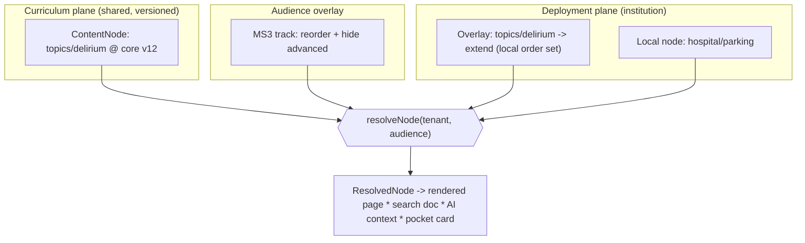
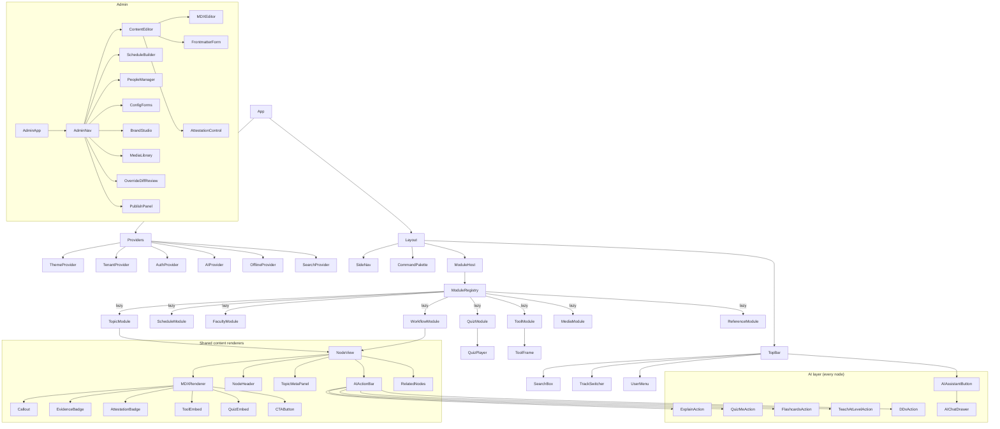
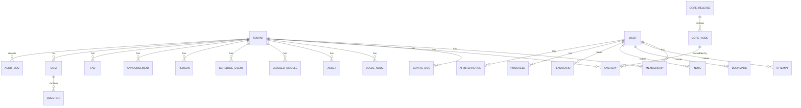
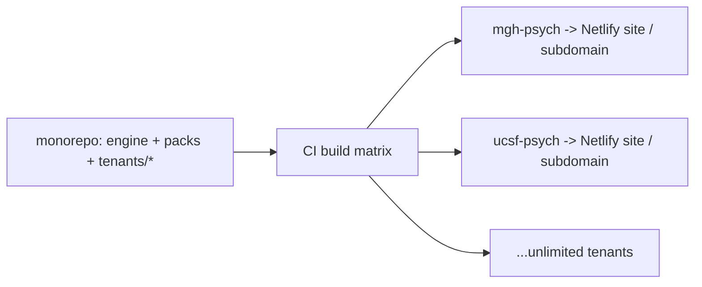
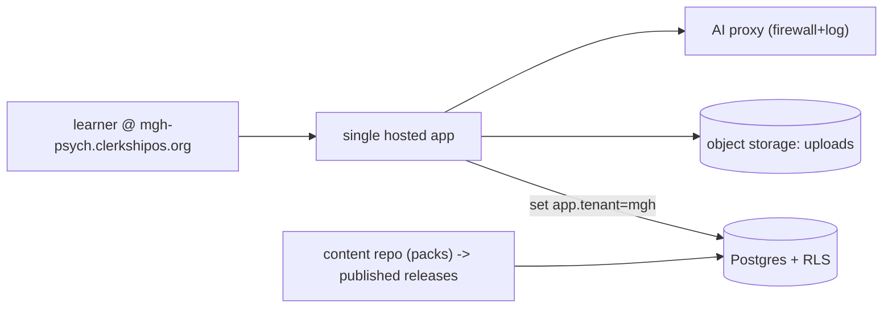
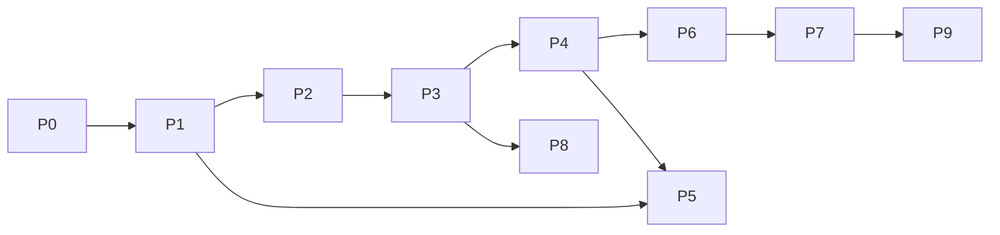

# Root Strategy Audit QA And OpenEvidence Memos

Generated: 2026-07-01

Prepared for: Joshua Moss, MD | Psychiatrist

Core meta documents and decision memos that explain architecture, QA, attestation, and OpenEvidence incorporation.

PHI rule: this source intentionally excludes known patient-identifying files, audit artifacts with MRN-like paths, source pointer files, and case-specific filenames. Use synthetic or de-identified examples only.

---


---

## Source: `README.md`

# Psychiatry Clerkship Library
**Single source of truth for the six-week adult inpatient psychiatry clerkship.**
Joshua Moss, MD | Psychiatrist * scaffolded 2026-06-26

This is a **navigation layer / card catalog**, not a second copy of your work. Each folder's README points to the
canonical asset wherever it actually lives (local repo, iCloud, Notion, Google Drive). Edit source once; the library
references it. Internal RSS/RSSM naming is retained here; a public mirror would strip it.

## Start here
- `00_START_HERE/COMPREHENSIVE_NOTEBOOKLM_RESOURCE.md` - uploadable NotebookLM master resource for the full clerkship library.
- `_AUDIT_AND_ROADMAP.md` - the full audit, gap analysis, curriculum, and roadmap (Phases 1-9).
- `_MASTER_INDEX.xlsx` - searchable index of catalogued assets (filter by status/priority/category).
- `_CODEX_AUDIT_INTEGRATION.md` - verdict + merge log for the parallel Codex audit (exhaustive 11,700-file census + MS3 student pack now folded in).
- `00_START_HERE/` - orientation, syllabus, "A Day on the Unit"; `_audit-census-codex/` holds the exhaustive census + parallel reports.

## Built so far (live content)
- **Interactive teaching tools** (6, single-file HTML, Clinical Warm): MSE builder (`02_Clinical_Skills/Mental_Status_Exam/`, now with a Language & Interview tab) * Decisional Capacity (`04_Acute_and_Safety/Decisional_Capacity/`) * Oral Presentation + timer (`02_Clinical_Skills/Oral_Presentations/`) * Violence Risk + Brset (`04_Acute_and_Safety/Violence_Risk/`) * Withdrawal scales CIWA-Ar/COWS (`03_Core_Topics/SUD_Withdrawal/`) * Reflection + PIF set (`02_Clinical_Skills/Reflection_PIF/`).
- **MS3 Student Pack** (15 markdown files: orientation, pocket guides, OSCE set, shelf guide, synthetic cases, weekly reading map, expansion modules) -> `14_Tracks/MS3/Student_Ready_Pack/`.
- **Exhaustive census + duplicate log** (11,700 files / 2,785 dup groups) -> `00_START_HERE/_audit-census-codex/`.

## How it's organized
| # | Folder | Holds |
|---|---|---|
| 00 | START_HERE | Orientation, syllabus, week-0 checklist, glossary |
| 01 | Six_Week_Curriculum | Week 1-6 modules (objectives, readings, skills, cases, reflection) |
| 02 | Clinical_Skills | Interviewing * MSE * Formulation * Documentation * Presentations * DDx * Reflection |
| 03 | Core_Topics | Mood * Psychosis * Anxiety * SUD/Withdrawal * Personality * Geriatric * Perinatal |
| 04 | Acute_and_Safety | Suicide/safety * Violence * Agitation/restraint * Capacity * Delirium * Catatonia |
| 05 | Psychopharmacology | Student Top-10 primer * Protocol library (taper, clozapine, order sets) |
| 06 | Family_and_Relational | RSS frame * family meeting playbook * EE * canonical FT deck |
| 07 | Evidence_and_Reading | Landmark library * 6-wk reading pathway * Journal Club * guidelines |
| 08 | Cases_and_Simulation | Composite cases * population case studies * decision labs |
| 09 | Exam_Prep | Shelf high-yield * OSCE stations |
| 10 | Patient_and_Family_Education | References into psychoed-library & post-discharge-kit |
| 11 | AI_and_Prompts | Student-safe prompt set * Teaching-Prep agent |
| 12 | Media | Videos (QR) * podcasts * audiobooks * NotebookLM audio |
| 13 | Faculty_Resources | Teaching scripts * eval/supervision templates * elective application |
| 14 | Tracks | MS3 * Sub-I/MS4 * Resident * CAP * SW * Nursing * Patients/Families overlays |
| 99 | Archive | Retired versions (FT deck dups, RSSM v10, manual v1, raw exports) |

## Multi-track model
Content never forks. `14_Tracks/<audience>/` holds only a short ordered list of links into the shared body.
MS3 is the default build; later tracks are overlays.

**Status tags:** [yes] Exists *  Revise *  Expand *  Create *  Merge *  Archive


---

## Source: `_AUDIT_AND_ROADMAP.md`

# Psychiatry Clerkship Library - Master Audit, Architecture & Curriculum

**Prepared for:** Joshua Moss, MD | Psychiatrist
**Date:** June 26, 2026
**Scope:** Single source of truth for a six-week adult inpatient psychiatry clerkship library - built from a comprehensive audit of existing work, designed for multi-track scalability (MS3 -> Sub-I -> Resident -> CAP fellow -> SW/Nursing -> Patients & Families).
**Companion file:** `Psychiatry_Clerkship_Library_Master_Index.xlsx` (Phase 8 searchable index)

> **Design law:** This plan *reuses* existing assets before recommending anything new. Every gap recommendation is tagged **Exists / Revise / Expand / Create**. No content was created during the audit. No PHI appears anywhere in this corpus - all cases are fictional composites.

---

## Executive summary

You are not starting from zero. You are sitting on **one of the most complete inpatient-psychiatry teaching corpora a single clinician is likely to own** - it is simply scattered across four systems (local repo, iCloud Drive, Notion, Google Drive) and three naming generations. The audit found a mature **Landmark Article Library (100 papers + 15-paper rotation pathway + 6 Journal-Club-in-a-Box packets)**, a **Relational Psychiatry Teaching Manual**, a full **BHU2 inpatient protocol suite** (suicide/CSSRS, delirium, catatonia-adjacent, benzo taper, clozapine, restraint), a **family-therapy didactic franchise**, a **published patient/family psychoeducation library** (1,500+ files), and an **active MaineHealth advanced-clerkship elective application**.

The work is therefore **85% curation/consolidation, 15% net-new authoring**. The three highest-leverage moves:

1. **Consolidate four copies of the Landmark library and ~12 versions of the family-therapy deck into one canonical each** (kills the largest source of drift and confusion).
2. **Stand up the directory architecture in 5 and physically file existing assets into it** (the "librarian" pass).
3. **Author the ~10 genuinely missing student-facing modules** in 4 - almost all are short, high-yield, and shelf/OSCE-aligned (MSE, capacity how-to, presentation/rounds etiquette, shelf prep, OSCE station bank).

| Dimension | Finding |
|---|---|
| Total distinct educational assets catalogued | ~140 (excluding raw exports & build artifacts) |
| Sources spanned | Local repo * iCloud Drive * Notion * Google Drive (Apple Notes & NotebookLM audio partially covered) |
| Strongest domains | Family/relational psychiatry * landmark evidence * suicide & safety * catatonia/delirium * psychopharm protocols * patient/family psychoed |
| Weakest domains (gaps) | MSE module * capacity how-to * shelf prep * OSCE bank * presentations/rounds * student-level psychopharm primer |
| Duplicate clusters needing merge | 6 major (Landmark 4, FT decks 12, RSSM v10/v11, Teaching Manual v1/v2, video-scripts 2 dirs, Raw_Records export) |
| Net-new authoring required | ~10 modules, most <=1 build session each |

---

## 1. Phase 1 - Search coverage (where I looked)

| Source | Coverage | Key yield |
|---|---|---|
| **Local repo** `~/Code/reconnect-psychiatry-system/` | Deep | `teaching/`, `clinical-materials/`, `psychoed-library/` (1,541 files), `rssm-manual/`, `family-meeting-science/`, `post-discharge-kit/`, `population-adaptations/`, `manuscript/` |
| **Home directory** `~/` (loose files) | Deep | BHU2 protocol suite, APA guideline plans, inpatient guideline surveillance, psychoed modules, **`Library_Plan_and_Audit_Roadmap.md`**, **`Education_Hub_Blueprint.md`** |
| **iCloud Drive** | Targeted (psychiatry-scoped) | `Work & Career  Psychiatry Projects` (00-14 numbered ecosystem), `Medical Resources` (Didactics, Gen Psych Resources, Clinical Tools, Reference Materials, Transcripts), train-the-trainer program |
| **Notion** | Scoped query | **Teaching Curriculum** page + database, **Landmark Psychiatry Article Library**, Teaching-Prep & Task-Triager automation agents, ReConnect/Recovery Companion project hubs |
| **Google Drive** | Scoped query | **Landmark Psychiatry Teaching Library** folder, **Resident_Handout_2page**, **Facilitator_Teaching_Script_and_Answer_Keys**, FT case-teaching decks + video, legacy student talks (2016 Integrative Psychiatry, Class-of-2020 Clerkship Advice) |
| **NotebookLM** | Indirect | 13 audio/AI study projects + transcripts found in `teaching/notebooklm-projects/` (audio overviews) |
| **Apple Notes** | Deferred | Not crawled this pass (personal/PHI-risk); flagged for a scoped follow-up query |

**Assumptions stated:** (1) The `Psychiatry-Unit-Education/` and `Psychiatry_Preceptor_Curriculum/` directories described in `Education_Hub_Blueprint.md` are a *planning synthesis*, not on-disk folders - the concrete equivalents are the teaching manual, landmark guide, and the Notion Teaching Curriculum DB. (2) "Internal" RSS/RSSM/ReConnect naming is retained for trainee/faculty materials and stripped for any public/patient-facing layer, per your global preference.

---

## 2. Phase 2 - Inventory (catalogued by category)

Condensed catalog below; the **full row-level inventory with all requested columns** (Title, Location, Type, Topic, Level, Audience, Completeness, Last-updated, Quality, Keep/Revise/Archive) lives in `Psychiatry_Clerkship_Library_Master_Index.xlsx`.

### 2.1 Trainee & teaching spine
| Asset | Location | Type | Level | Completeness | Keep? |
|---|---|---|---|---|---|
| Landmark Psychiatry Teaching Guide (100 papers, 15-paper pathway, 6 JC packets, teaching-script template) | `teaching/landmark-psychiatry-teaching-guide.md` | MD | MS3->Attending | High | **Keep (canonical)** |
| Landmark library - Google Drive folder + Resident Handout + Facilitator Script/Answer Keys | Google Drive | Folder/PDF/DOCX | All | High | Merge -> keep as export |
| Landmark Article Library | Notion page | Page/DB | All | Med | Merge -> keep as live DB |
| Relational Psychiatry Teaching Manual v2 | `teaching/Relational_Psychiatry_Teaching_Manual_v2.docx` (+ v1, + source MD) | DOCX/MD | MS3->Resident | High | **Keep v2; archive v1** |
| Composite teaching cases v1 | `teaching/archive/composite_cases_v1.md` | MD | MS3->Resident | Med | Revise -> promote out of archive |
| RSS video scripts (10) | `teaching/video-scripts/` **and** `teaching/video-content/Scripts/` | MD | All | High | **Merge two dirs -> one** |
| 13 NotebookLM projects + audio overviews/transcripts | `teaching/notebooklm-projects/` | MD/TXT/audio | All | Med | Keep -> index |
| ED->Inpatient Psych Capstone (patient materials, condition inserts, eval tools) | `teaching/ed-psych-capstone/` | Mixed | Patient/Staff | High | Keep |
| Video QR system | `teaching/video-qr-system/` | PDF/MD | All | High | Keep |
| Gen Psych didactic decks (Intern Bootcamp, Barkley ADHD, CPT, Exposure, cultural & biopsychosocial formulation samples) | iCloud `Medical Resources/Gen Psych Resources/` | PPTX/PDF/DOCX | MS3->Resident | High | Keep -> harvest |
| ASCP Psychopharmacology Curriculum (11th ed) | iCloud `Gen Psych Resources/` | Folder | Resident/Faculty | High (external) | Keep as reference |
| Notion **Teaching Curriculum** DB + Teaching-Prep agent | Notion | DB/automation | Faculty | Med | Keep -> wire to library |
| A Day on the Unit - Walkthrough | iCloud `Work & Career/` + repo | DOCX | MS3 | Med | Revise -> orientation |

### 2.2 Inpatient clinical workflow / protocols (BHU2 - directly clerkship-relevant)
| Asset | Location | Type | Use | Keep? |
|---|---|---|---|---|
| BHU2 Top-20 Pocket Card 2026 | `~/BHU2_Top20_Pocket_Card_2026.html` | HTML | Student pocket reference | **Keep (flagship)** |
| Suicide Safer-Discharge Checklist + C-SSRS/Safety-Plan EHR field spec | `~/BHU2_Suicide_Safer_Discharge_Checklist.html`, `~/CSSRS_SafetyPlan_EHR_Field_Spec.docx` | HTML/DOCX | Risk & disposition | Keep |
| Delirium Prevention Checklist + Order-Set Spec | `~/BHU2_Delirium_Prevention_Checklist.html`, `~/Delirium_OrderSet_Spec.docx` | HTML/DOCX | Delirium | Keep |
| Benzodiazepine Taper Checklist + Order-Set Spec | `~/BHU2_Benzodiazepine_Taper_Checklist.html`, `~/Benzodiazepine_Taper_OrderSet_Spec.docx` | HTML/DOCX | Withdrawal/taper | Keep |
| Clozapine Post-REMS Workflow + Order-Set Spec | `~/BHU2_Clozapine_PostREMS_Workflow.html`, `~/Clozapine_PostREMS_OrderSet_Spec.docx` | HTML/DOCX | Psychopharm | Keep |
| Restraint/Physical-Holding Checklist + Order-Set Spec | `~/BHU2_Restraint_PhysicalHolding_Checklist.html`, `~/Restraint_PhysicalHolding_OrderSet_Spec.docx` | HTML/DOCX | Agitation/safety | Keep |
| BHU2 Implementation Packet + Committee Deck + Protocol/Order-Set Drafts | `~/BHU2_Implementation_*.{docx,pptx}` | DOCX/PPTX | Faculty/systems | Keep (faculty track) |
| Inpatient Psychiatry Guideline Surveillance 2023-2026 | `~/Inpatient_Psychiatry_Guideline_Surveillance_2023-2026.docx` | DOCX | Guideline library | **Keep (guidelines hub)** |
| APA Guideline Highlights Plan + Build Plan v2 | `~/APA_Guideline_Highlights_Plan.md`, `~/Guideline_Highlights_Build_Plan_v2.md` | MD | Guideline highlights | Revise -> execute |
| Catatonia discharge instructions | `~/Documents/.../catatonia dc instruct.pdf` | PDF | Catatonia | Keep |
| Psychiatric documentation template; PQ-B; SIPS cheat sheets | iCloud `Medical Resources/Clinical Tools/` | MD/PDF/DOCX | Documentation/screening | Keep -> harvest |

### 2.3 Family / relational psychiatry (signature differentiator)
| Asset | Location | Type | Keep? |
|---|---|---|---|
| Family Meeting Science suite (ward protocol, 12-cases paper, systematic review, intervention taxonomy, LEFI fidelity instrument + scoring workbook) | `family-meeting-science/` | MD/XLSX | **Keep (research+teaching core)** |
| Family-therapy inpatient didactic decks - **~12 versions** (REVAMP, REVAMP2, FINAL Animated, Psychiatrist-Edited, WITH_VIDEO_EMAIL, Clinical/Inpatient Family Blueprint, .key, .pptx, .pdf, Google Slides + video) | Downloads / iCloud / Google Drive | PPTX/PDF/KEY/Slides | **Merge -> 1 canonical + 1 archive** |
| "The Family is the Milieu" FINAL (+ with-video) | Downloads / iCloud | DOCX/PPTX | Keep (canonical narrative) |
| FTM papers & briefs; FTM audio (by-topic + quarantine) | `_assets/ftm-papers/`, `_assets/ftm-audio/` | PDF/audio | Keep -> index |
| Family Integrated Inpatient Recovery; FT inpatient systematic review | Downloads | PDF/MD | Keep |
| Clinical Implementation Spine (Family Meeting Playbook 90-min, First Three Sessions, MVP Milieu, Family-Supported Adherence, Risk-Stratified Discharge) | `clinical-materials/Clinical_Implementation_Spine/` | MD | **Keep (faculty/resident)** |

### 2.4 RSSM framework manual
| Asset | Location | Keep? |
|---|---|---|
| RSSM Master **v11** (newest) + v10 | `rssm-manual/RSSM_Master_v11.docx`, `...v10.docx` | **Keep v11; archive v10** |
| RSSM publication set (journal article v2, glossary, index, appendices I/J/K) | `rssm-manual/publication/` | Keep |
| RSSM v10 stray copies | `~/Downloads/RSSM_Master_v10.docx`, `...Primer...md` | **Archive (stale dups)** |
| RSSM audiobook plan; cross-reference audit | `manuscript/` | Keep |

### 2.5 Patient & family psychoeducation (published library - links into clerkship, not core)
| Asset | Location | Notes |
|---|---|---|
| Psychoed library - patient-materials (20), family (77), infographics (54), patient-journey (44) | `psychoed-library/` | **Keep (processed)** |
| Psychoed library - **Raw_Records (1,339)** | `psychoed-library/Raw_Records/` | Raw Notion export -> **archive once processed content verified** |
| Post-discharge kit (bundles by dx, perinatal, caregiver, crisis de-escalation, admission packet) | `post-discharge-kit/` | Keep |
| Population adaptations (Forensic, Refugee, IDD, Perinatal - case studies + clinician notes) | `population-adaptations/` | Keep (multi-track seed) |
| Depression First Steps; SSRI First 6 Weeks (patient) | `~/Depression_First_Steps_PAT.html`, `~/Medication_First_6_Weeks_SSRI_PAT.html` | Keep |
| Book + Podcast Library plan (verified seed catalog) | `~/Library_Plan_and_Audit_Roadmap.md` | Keep -> build |

### 2.6 Planning / meta / infrastructure
| Asset | Location | Notes |
|---|---|---|
| Education Hub Blueprint (3-path architecture) | `~/Education_Hub_Blueprint.md` | Foundational - partially superseded by this plan |
| Library Plan & Audit Roadmap (Book/Podcast) | `~/Library_Plan_and_Audit_Roadmap.md` | Foundational |
| Clinical Warm design system | `~/clinical-warm-design-system.html` | Keep (styling) |
| Control Tower / Action Plan / dashboards / curriculum-site.html | `~/`, iCloud | Keep (PM layer) |
| **MH Advanced Clerkship - New Elective Application AY26-27** | `~/Downloads/MH Advanced Clerkship New Elective Application AY26-27.pdf` | **Keep (drives requirements)** |

---

## 3. Phase 3 - Duplicate & version analysis

| # | Cluster | Instances | Recommendation |
|---|---|---|---|
| 1 | **Landmark library** | repo MD * Google Drive folder (+handout+facilitator keys) * Notion page/DB * (implied iCloud) | **Keep repo MD as canonical source of truth.** Notion DB = live editable view; Google Drive = distribution export (handout + facilitator keys). Reconcile the "100 papers / 50-paper / 15-paper pathway" naming so counts agree. Fix internal mislabel: the "15-paper" pathway lists **16** numbered entries. |
| 2 | **Family-therapy didactic deck** | ~12 versions across Downloads, iCloud, Google Drive | **Pick ONE canonical** (recommend the most recent *Psychiatrist-Edited* / *FINAL with video* lineage), move the rest to `99_Archive/`. This is the single biggest hygiene win. |
| 3 | **RSSM Master** | v11 + v10 (repo) + v10 (Downloads) + Primer.md | **Keep v11.** Archive all v10 copies. |
| 4 | **Relational Psychiatry Teaching Manual** | v1 docx * v2 docx * source MD (repo) * iCloud .md | **Keep v2 + source MD.** Archive v1; reconcile iCloud copy to the repo source. |
| 5 | **RSS video scripts** | `teaching/video-scripts/` *and* `teaching/video-content/Scripts/` (same 10) | **Merge to one directory**; delete the duplicate tree. |
| 6 | **psychoed-library/Raw_Records (1,339)** | Raw Notion export overlapping processed `patient-materials/`, `family/`, `infographics/` | **Archive the raw export** once processed equivalents are confirmed complete; keep a single MANIFEST mapping raw->processed. |

**Net effect of executing dedupe:** ~30+ redundant files retired, four "single source of truth" anchors established (Landmark MD, FT canonical deck, RSSM v11, Teaching Manual v2).

---

## 4. Phase 4 - Gap analysis vs. an ideal inpatient clerkship

Each domain tagged **Exists / Revise / Expand / Create**. "Exists" = usable today; "Create" = genuine net-new (most are short).

| # | Domain | Status | Anchor asset (reuse) | Action |
|---|---|---|---|---|
| 1 | Clerkship **orientation** (logistics, expectations, "a day on the unit") | **Revise** | `A_Day_on_the_Unit_Walkthrough.docx` | Wrap into `00_START_HERE` syllabus + week-0 checklist |
| 2 | **Psychiatric interviewing** (incl. agitated/guarded patient, trauma-informed) | **Expand** | RSS video scripts; Gen Psych decks | Author a 1-page interviewing module + 2 demo clips |
| 3 | **Mental Status Exam** teaching module | **Create** | `Appearance Behavior.pdf` (fragment only) | Author MSE module + pocket card + annotated exemplar |
| 4 | **DSM-5-TR diagnosis overview / differential** | **Create/Expand** | Landmark guide; composite cases | Author DDx scaffolds for top 8 unit presentations |
| 5 | **Psychopharmacology - student primer** (vs. faculty protocols) | **Expand** | BHU2 protocol suite; ASCP curriculum | Author "Top-10 inpatient drugs" student tier above the protocols |
| 6 | **Emergency psychiatry / agitation management** | **Expand** | Restraint checklist; order-set drafts | Author agitation-ladder teaching module (verbal->PRN->restraint) |
| 7 | **Decisional capacity** how-to | **Create** | Appelbaum paper in Landmark guide | Author capacity bedside module (4 abilities + sample note) |
| 8 | **Delirium** | **Exists** | Delirium checklist + order-set | Link into Week-5 acute block |
| 9 | **Catatonia** | **Exists** | Bush-Francis JC packet; catatonia dc pdf | Link; add BFCRS screening card |
| 10 | **Suicide & violence risk** | **Exists** | C-SSRS/Safety-Plan spec; Safer-Discharge; Stanley-Brown JC packet | Link; add violence-risk one-pager |
| 11 | **Substance use & withdrawal** (CIWA/COWS) | **Expand** | Benzo taper; Volkow JC | Add CIWA/COWS quick-use card |
| 12 | **Personality disorders / DBT** | **Exists** | Linehan JC packet; book/podcast catalog | Link |
| 13 | **Psychotherapy basics** (common factors, CBT/DBT/MI, exposure, CPT) | **Exists** | Gen Psych decks (CPT, exposure, Beck); Wampold JC | Curate into Week-3 reading + skills |
| 14 | **Family meetings / EE** | **Exists (strong)** | Family Meeting Science; FT decks; Brown EE + Pharoah JC | Flagship - link prominently |
| 15 | **Documentation** (H&P, progress, presentation note) | **Expand** | `psychiatric-documentation-template.md`; Epic note makeovers | Author student note exemplars + checklist |
| 16 | **Oral presentation / rounds etiquette** | **Create** | - | Author "present a psych patient in 3 min" + rounds-prep card |
| 17 | **Clinical reasoning / case formulation** | **Expand** | Biopsychosocial formulation samples; FTM relational formulation figure | Author formulation worksheet (BPS + relational) |
| 18 | **Evidence-based medicine / journal club** | **Exists (strong)** | 6 Journal-Club-in-a-Box packets; teaching-script template | Link; schedule across 6 weeks |
| 19 | **Reading assignments** | **Exists** | 15-paper pathway (extend 4->6 wk) | Re-sequence to 6 weeks (see 6) |
| 20 | **Pocket references** | **Exists** | BHU2 Top-20 Pocket Card | Add MSE + CIWA/COWS cards to the set |
| 21 | **Shelf / NBME exam prep** | **Create** | - | Author shelf high-yield map + 50-item self-check |
| 22 | **OSCE / standardized-patient stations** | **Create** | Composite cases; capacity/safety modules | Author 4-6 OSCE stations w/ checklists |
| 23 | **Professional identity / ethics / boundaries** | **Create** | Rosenhan JC (labeling) | Author short ethics/PIF reflection set |
| 24 | **Disposition & discharge planning** | **Exists (strong)** | Risk-Stratified Discharge Pathway; Maine aftercare; post-discharge kit | Link |
| 25 | **Daily reflection exercises** | **Create** | Video content prompts | Author 6 weekly reflection prompts |
| 26 | **Cases & simulation** | **Exists** | `composite_cases_v1.md`; population case studies | Promote from archive; map to weeks |
| 27 | **Consult-psychiatry etiquette** (if C-L exposure) | **Create (optional)** | - | Optional one-pager |
| 28 | **Multimedia** (video/podcast/audiobook) | **Exists/Expand** | RSS videos; NotebookLM audio; Book+Podcast plan | Index into `12_Media` |
| 29 | **AI-assisted learning / prompts** | **Exists** | Notion Teaching-Prep agent; prompt-stack | Surface a student-safe prompt set |

**Gap verdict:** Of 29 domains, **15 already Exist**, **8 need Expand/Revise**, **~10 need Create** - and the Creates are mostly 1-2 page high-yield assets directly tied to shelf/OSCE performance. This is a finishing job, not a build-from-scratch.

---

## 5. Phase 5 - Ideal library architecture (scalable, multi-track)

A single numbered tree, audience-tagged, designed so new tracks and topics slot in without reorganizing. Internal RSS/RSSM naming retained; a public mirror would strip it.

```
Psychiatry-Clerkship-Library/
 00_START_HERE/                 # syllabus, how-to-use, "A Day on the Unit", week-0 checklist, glossary
 01_Six_Week_Curriculum/        # Week_1 ... Week_6 (each: objectives, readings, skills, cases, reflection)
 02_Clinical_Skills/
    Interviewing/              # incl. agitated/guarded, trauma-informed
    Mental_Status_Exam/        #  CREATE: module + pocket card + exemplar
    Case_Formulation/          # BPS + relational worksheet
    Documentation/             # H&P, progress, note exemplars + checklist
    Oral_Presentations/        #  CREATE: 3-min present + rounds-prep card
    Differential_Diagnosis/    # DDx scaffolds, top 8 presentations
 03_Core_Topics/                # Mood * Psychosis * Anxiety * SUD/Withdrawal * Personality * Geri * Perinatal
 04_Acute_and_Safety/
    Suicide_Risk_and_Safety_Planning/   # C-SSRS, Stanley-Brown, Safer-Discharge
    Violence_Risk/             #  CREATE one-pager
    Agitation_and_Restraint/   # agitation ladder + restraint checklist
    Decisional_Capacity/       #  CREATE: 4-abilities module + sample note
    Delirium/                  # checklist + order set
    Catatonia/                 # BFCRS card + JC packet + dc instructions
 05_Psychopharmacology/
    Student_Primer_Top10/      #  EXPAND: student tier
    Protocol_Library/          # benzo taper, clozapine post-REMS, order-set specs
 06_Family_and_Relational/      # RSS frame * Family Meeting Playbook * EE * canonical FT deck
 07_Evidence_and_Reading/
    Landmark_Library/          # canonical 100-paper MD + spreadsheet
    Reading_Pathway_6wk/       # re-sequenced (see 6)
    Journal_Club_in_a_Box/     # 6 packets
    Guidelines/                # APA highlights + surveillance doc
 08_Cases_and_Simulation/       # composite cases + population case studies + decision labs
 09_Exam_Prep/
    Shelf_High_Yield/          #  CREATE
    OSCE_Stations/             #  CREATE: 4-6 stations + checklists
 10_Patient_and_Family_Education/  # links -> psychoed-library, post-discharge-kit (read-only refs)
 11_AI_and_Prompts/             # student-safe prompt set; Teaching-Prep agent
 12_Media/                      # videos (QR), podcasts, audiobooks, NotebookLM audio
 13_Faculty_Resources/          # teaching-script template, eval/supervision templates, elective application, guideline build plans
 14_Tracks/                     # MS3 * Sub-I_MS4 * Resident_PGY2 * CAP_Fellow * SW * Nursing * Patients_Families
 99_Archive/                    # retired versions (FT deck dups, RSSM v10, manual v1, raw exports)
 _MASTER_INDEX.xlsx
 _AUDIT_AND_ROADMAP.md          # this document
```

**Multi-track mechanism:** `14_Tracks/<audience>/` holds only a short **track map** (objectives + an ordered list of links into the shared body) - content never forks. MS3 is the default build; each later track is an overlay (Sub-I adds leadership/sign-out + deeper psychopharm; Resident adds ACGME milestones + supervision; CAP adds developmental lens; SW/Nursing emphasize milieu/safety/family; Patients-Families points to `10_`).

---

## 6. Phase 6 - Six-week inpatient curriculum (reuse-first)

Extends your existing **4-week, 16-paper** Landmark pathway to a **6-week** arc, mapped onto RSS Layers 1->4 and the inpatient workflow. Each week: ~3-4 hrs of structured learning outside clinical time. **R** = required, **O** = optional. Every line tagged with reuse status.

### Week 1 - Foundations & Orientation *(RSS L1: Biological Stabilization)*
- **Objectives:** Orient to the unit; conduct a basic psychiatric interview; structure an MSE; write an admission note.
- **Readings (R):** Engel 1977 (BPS) * Rosenhan 1973 (labeling) * Appelbaum-Grisso 1988 (capacity). *(Exists - Landmark pathway #1-3)*
- **Skills:** Interview observation -> first solo interview; **MSE module** *(Create)*; admission-note exemplar *(Expand)*.
- **Pocket refs:** BHU2 Top-20 Pocket Card *(Exists)*; MSE card *(Create)*.
- **Case:** Composite case #1 *(Exists - promote from archive)*.
- **Reflection:** "What did the label do?" (Rosenhan) *(Create)*.
- **Workflow tie-in:** shadow admissions; capacity question on rounds.
- **Time:** ~3.5 hr.

### Week 2 - Mood, Psychosis & Pharmacology *(RSS L1->L2)*
- **Objectives:** Differential for depression/mania/psychosis; measurement-based care; antipsychotic selection logic.
- **Readings (R):** CATIE 2005 * STAR*D 2006 * Bush 1996 (Catatonia rating). **JC#1 CATIE** + **JC#5 Catatonia**. *(Exists)*
- **Skills:** Student psychopharm primer - Top-10 inpatient drugs *(Expand)*; BFCRS screening on any mute/immobile patient *(Exists)*.
- **Case:** Psychosis/mania composite *(Exists)*.
- **Reflection:** "Pick by profile, not class" - apply CATIE to a unit patient *(Create prompt)*.
- **Time:** ~4 hr.

### Week 3 - Psychotherapy, Personality & the Relationship *(RSS L3: Relational Connection)*
- **Objectives:** Common factors; DBT logic for BPD; basic CBT/MI/exposure literacy.
- **Readings (R):** Wampold 1997 * Linehan 1991 * (O) Ramsay ADHD-CBT. **JC#3 Safety Planning.** *(Exists)*
- **Skills:** Common-factors micro-skills; safety-plan with a real patient (supervised) *(Exists - Stanley-Brown)*; formulation worksheet BPS+relational *(Expand)*.
- **Media (O):** Exposure-therapy & CPT didactic decks *(Exists - harvest)*.
- **Case:** BPD/safety composite *(Exists)*.
- **Reflection:** rupture-and-repair moment journal *(Create)*.
- **Time:** ~3.5 hr.

### Week 4 - Family, Systems & Expressed Emotion *(RSS L3->L4; signature week)*
- **Objectives:** Run/observe a family meeting; recognize high-EE; cite the family-intervention evidence.
- **Readings (R):** Brown 1972 (EE) * Pharoah 2010 (Cochrane family intervention). **JC#2 EE** + **JC#6 Family Intervention.** *(Exists)*
- **Skills:** Family Meeting Playbook 90-min *(Exists)*; observe -> co-facilitate a meeting; EE-spotting checklist.
- **Media:** canonical Family-Therapy deck + "Family is the Milieu" *(Exists - after dedupe)*; FTM audio overview *(Exists)*.
- **Case:** family-collateral composite *(Exists)*.
- **Reflection:** "What would I change in that family meeting?" *(Create)*.
- **Time:** ~4 hr.

### Week 5 - Acute & Emergency Psychiatry *(RSS L1 under stress)*
- **Objectives:** Manage agitation safely; recognize delirium & catatonia; assess violence risk; reduce means.
- **Readings (R):** Franklin 2017 (suicide prediction limits) * Volkow 2016 (addiction). **(O)** Bush catatonia review. *(Exists)*
- **Skills:** Agitation ladder verbal->PRN->restraint *(Expand)*; Delirium prevention checklist *(Exists)*; CIWA/COWS quick-card *(Create)*; violence-risk one-pager *(Create)*.
- **Pocket refs:** Restraint checklist; Benzo taper; Clozapine post-REMS *(Exists)*.
- **Case:** substance + psychosis + risk composite *(Exists)*.
- **Reflection:** "Document reasoning, not certainty" (Franklin) *(Create)*.
- **Time:** ~4 hr.

### Week 6 - Integration, Disposition & Exam Readiness *(RSS L4: Functional Engagement)*
- **Objectives:** Build a discharge/disposition plan; integrate a full case; demonstrate shelf/OSCE readiness.
- **Readings (R):** ACE 1998 (Felitti) * Deegan 1996 (recovery). *(Exists)*
- **Skills:** Risk-Stratified Discharge Pathway *(Exists)*; Maine aftercare disposition case *(Exists)*; **shelf high-yield review + 50-item self-check** *(Create)*; **OSCE stations** (capacity, safety plan, family meeting, MSE) *(Create)*.
- **Capstone:** full oral case presentation *(Create rubric)* + relational formulation.
- **Reflection:** end-of-rotation professional-identity reflection *(Create)*.
- **Time:** ~4.5 hr.

> **Resident overlay (PGY-2, 4-wk compression):** same spine, add ACGME-milestone mapping, the teaching-script template (teach one landmark paper at rounds), and supervision/eval templates. **Sub-I overlay:** add sign-out/leadership + deeper psychopharm. Both reuse the same modules.

---

## 7. Phase 7 - Prioritized reuse ledger

Single view of what to reuse vs. build, ordered by leverage.

| Priority | Item | Status | Effort |
|---|---|---|---|
| P0 | Canonicalize Landmark library (repo MD  Notion DB  GDrive export); fix 15-vs-16 count | **Revise** | Low |
| P0 | Merge ~12 FT decks -> 1 canonical + archive | **Revise** | Low |
| P0 | Stand up 5 directory tree; file existing assets | **Exists->file** | Med |
| P1 | MSE module + pocket card + exemplar | **Create** | Low |
| P1 | Decisional-capacity bedside module + sample note | **Create** | Low |
| P1 | Oral-presentation / rounds-etiquette card + 3-min rubric | **Create** | Low |
| P1 | Student psychopharm primer (Top-10 inpatient) | **Expand** | Low |
| P1 | Documentation exemplars + checklist | **Expand** | Low |
| P2 | Shelf high-yield map + 50-item self-check | **Create** | Med |
| P2 | OSCE station bank (4-6) + checklists | **Create** | Med |
| P2 | Agitation ladder; CIWA/COWS card; violence-risk one-pager | **Create/Expand** | Low |
| P2 | 6 weekly reflection prompts + ethics/PIF set | **Create** | Low |
| P3 | Book + Podcast library build (already specced) | **Exists->build** | Med |
| P3 | Media index (videos/podcasts/audiobooks/NotebookLM) | **Expand** | Low |
| P3 | Archive Raw_Records after processed-content verification | **Archive** | Low |

---

## 8. Phase 8 - Master index

Delivered as the companion spreadsheet `Psychiatry_Clerkship_Library_Master_Index.xlsx` with columns: **Title * Category * Subcategory * Format * Topic * Educational Level * Difficulty * Est. Reading/Use Time * Clinical Relevance * Current Status * Priority * Location * Recommended Action.** Filterable/sortable; one row per distinct asset (duplicates collapsed to their canonical with variants noted).

---

## 9. Phase 9 - Phased implementation roadmap

| Phase | Goal | Concrete deliverables | Depends on |
|---|---|---|---|
| **R1 - Organize** | One home, one copy | Build 5 tree; execute 3 dedupe; file assets; publish this doc + index as the tree's README | Audit (done) |
| **R2 - Revise** | Fix drift | Canonical Landmark (counts reconciled); canonical FT deck; RSSM v11 only; Teaching Manual v2 only; APA guideline highlights executed | R1 |
| **R3 - Create gaps** | Finish MS3 spine | P1+P2 modules (MSE, capacity, presentations, psychopharm primer, documentation, shelf, OSCE, agitation/CIWA/violence, reflections) | R1 |
| **R4 - Multimedia** | Add modalities | Media index; Book+Podcast library v1; QR/video wiring; NotebookLM audio surfaced | R2 |
| **R5 - AI-assisted** | Smart layer | Student-safe prompt set; wire Notion Teaching-Prep agent to the curriculum DB; weekly auto-reading nudge | R3 |
| **R6 - Polish & open tracks** | Scale | Public-facing mirror (RSS naming stripped); activate `14_Tracks/` overlays (Sub-I, Resident, CAP, SW/Nursing, Patients-Families); align to MH elective application | R1-R5 |

---

## 10. Guiding principles (locked)

Reuse before create * preserve high-quality assets * one canonical per concept * scalable numbered architecture * internal RSS naming for trainees, stripped for public * **fictional composites only, zero PHI** * this document + the index are the single source of truth and the tree's front door.

## 11. Immediate next actions (your call)

1. **Approve the 5 directory structure** - then I can scaffold it (empty tree + README stubs) and file existing assets into it as a non-destructive first pass.
2. **Greenlight the P0 dedupe** - I'll move redundant FT decks and stale RSSM/manual copies into `99_Archive/` (reversible).
3. **Pick the first 3 modules to author** from the P1 list (recommend MSE, capacity, oral-presentation - highest shelf/OSCE yield, lowest effort).

*Single source of truth. Reuse-first. Built to grow without disorganizing.*
*Joshua Moss, MD | Psychiatrist*


---

## Source: `_CODEX_AUDIT_INTEGRATION.md`

# Codex Audit - Integration Verdict & Merge Log

**Date:** June 26, 2026 * **Reviewer:** this session
**Source reviewed:** `~/psychiatry-clerkship-library-audit-2026-06-27/` (a parallel clerkship-library audit + student pack built with Codex)
**Bottom line:** **Highly useful and complementary - adopt most of it.** It is not redundant with this library; it is the exhaustive data layer and the first batch of student content that the architecture was built to hold. Nothing conflicts in a way that requires choosing one over the other.

---

## How the two efforts relate

| Layer | This session's deliverable | Codex's deliverable | Verdict |
|---|---|---|---|
| **Strategy / architecture** | `_AUDIT_AND_ROADMAP.md` + scaffolded tree | `reports/proposed_library_structure.md` (week-numbered variant) | **Keep this tree canonical** (already on disk); treat Codex's structure as a validating cross-check. ~90% identical, both multi-track. |
| **Curated index** | `_MASTER_INDEX.xlsx` (63 canonical assets, prioritized) | `data/master_index.csv` (11,700 files) | **Both** - Codex CSV = exhaustive backing census; the xlsx = curated front layer over it. Now co-located. |
| **Raw census** | (not attempted - curated only) | `data/master_inventory_full.json/csv` (11,700), `duplicate_candidates.csv` (2,785 groups) | **Adopt** as the authoritative file-level census. Reached `~/Documents` (6,041), `~/Clinical` (699), `~/Family-Therapy-Inpatient-Evidence-Repository` (104) that the curated pass did not enumerate. |
| **Gap analysis** | 4 (29 domains, tagged) | `reports/gap_analysis.md` | **Merge** - same conclusions; Codex adds consult-etiquette + measurement-based care emphasis. |
| **6-week curriculum** | 6 (RSS-layer-mapped) | `reports/six_week_curriculum.md` + `03_weekly_map/` | **Merge** - RSS-layer spine (mine) + week-by-week reading map (Codex) are complementary. |
| **Student content** | 3 interactive HTML tools (MSE, capacity, oral pres) | 14-file markdown `student_ready_pack/` | **Adopt both** - my tools = interactive practice; Codex md = reference text + the gaps I didn't build (OSCE, shelf, orientation, synthetic cases). Tool + reference, side by side. |

---

## What was integrated (this pass, non-destructive copies)

- **MS3 Student Pack** -> `14_Tracks/MS3/Student_Ready_Pack/` (15 files). This is the natural home - it *is* the MS3 track content. Cross-referenced from the domain folders below.
- **Exhaustive census + parallel reports** -> `00_START_HERE/_audit-census-codex/` (`data/` 6 CSVs + JSON; `reports/` 8 markdown reports).
- Codex source folder `~/psychiatry-clerkship-library-audit-2026-06-27/` left **untouched** as the origin.

### Where each student-pack file maps (for the card catalog)
| Pack file | Library home it serves | Gap it closes (was) |
|---|---|---|
| `01_orientation/MS3_orientation_packet.md` | `00_START_HERE` |  Create -> [yes] |
| `02_pocket_guides/interview_mse_pocket_guide.md` | `02_Clinical_Skills/Mental_Status_Exam` + `Interviewing` | pairs with the interactive **MSE module** |
| `02_pocket_guides/formulation_differential_pocket_guide.md` | `02_Clinical_Skills/Case_Formulation` + `Differential_Diagnosis` | / -> [yes] |
| `02_pocket_guides/suicide_risk_and_safety_pocket_card.md` | `04_Acute_and_Safety/Suicide_Risk_and_Safety_Planning` | reinforces [yes] |
| `03_weekly_map/week_by_week_reading_map.md` | `01_Six_Week_Curriculum` |  -> [yes] |
| `04_expansion_modules/consult_capacity_delirium_catatonia_withdrawal.md` | `04_Acute_and_Safety/{Decisional_Capacity,Delirium,Catatonia}` + `03_Core_Topics/SUD_Withdrawal` | pairs with the interactive **capacity module**; closes withdrawal/consult |
| `04_expansion_modules/family_discharge_student_module.md` | `06_Family_and_Relational` |  -> [yes] |
| `04_expansion_modules/treatment_basics_digest.md` | `05_Psychopharmacology/Student_Primer_Top10` |  -> [yes] |
| `05_documentation_oral_presentation/student_documentation_and_oral_presentations.md` | `02_Clinical_Skills/{Oral_Presentations,Documentation}` | pairs with the interactive **oral-presentation module** |
| `06_osce_cases/osce_station_set.md` (6 stations) | `09_Exam_Prep/OSCE_Stations` |  Create -> [yes] |
| `07_shelf_guide/shelf_review_guide.md` | `09_Exam_Prep/Shelf_High_Yield` |  Create -> [yes] |
| `08_synthetic_cases/synthetic_practice_cases.md` | `08_Cases_and_Simulation` |  -> [yes] |
| `09_revision_maps/revision_plan.md` | `13_Faculty_Resources` | reference |

**Quality note:** spot-read of the interview/MSE pocket guide and the OSCE set - both are strong, exam-relevant, and safety-forward (explicit anti-stigma language guidance, entrustment anchors, all-synthetic cases). MSE domain taxonomy matches the interactive module exactly, so the tool and the pocket card reinforce rather than contradict.

---

## Gap status after integration

The three interactive tools + the Codex pack together close **most of the 4 "Create/Expand" gaps**. Remaining genuine to-build items shrink to:
- Violence-risk one-pager (still  - Codex covers it only inside agitation context).
- CIWA/COWS quick *card* (Codex covers withdrawal narratively; a pocket card is still nice).
- 6 weekly reflection prompts + ethics/PIF set (Codex `revision_plan` is faculty-facing, not student reflections).
- MSE/capacity/oral-pres **content cross-check**: fold Codex's anti-stigma language list + interview sequence into the interactive MSE tool in a later pass.

---

## Expanded dedupe findings (Codex confirmed + extended mine)

Codex's `duplicate_candidates.csv` (2,785 groups) **confirms all 6 of my merge clusters** and adds precision:
- **Video scripts are TRIPLICATED**, not duplicated - exact-hash matches across `teaching/video-scripts/`, `teaching/video-content/Scripts/`, **and** `~/Clinical/reconnect-video-content/Scripts/`. Keep one; archive two.
- **Psychodynamic reading-list PDFs** duplicated: `~/Gen Psych Resources/Psychodynamic Therapy Reading List/` vs `~/Gen Psych Resources/PGY3 Psychotherapy Seminar/Psychodynamic Therapy Reading List/`.
- **Patient-education guides** duplicated: repo `psychoed-library/` vs `~/Clinical/Patient-Resources/New Education Library/` (a second local mirror).
- Implication: there is a **local mirror** (`~/Clinical/`, `~/Gen Psych Resources/`, `~/Documents/Work & Career/`) running parallel to iCloud and the repo - the single largest dedupe opportunity, bigger than first estimated.

---

## Structure reconciliation

Codex proposes a **week-numbered** top level (00 Index, 01 Orientation, 02-07 Week 1-6, then Clinical_Skills / Reference / Media / AI / Faculty / Archive). This library uses a **domain-numbered** top level with a dedicated `01_Six_Week_Curriculum`. Both are single-source-of-truth, multi-track designs and agree on every component. **Decision: keep this on-disk tree canonical** (it's built and populated); Codex's `proposed_library_structure.md` is retained in `_audit-census-codex/reports/` as an alternate navigational view. No second tree.

---

## Recommended next steps
1. **Adopt the Codex census as the inventory of record**; keep `_MASTER_INDEX.xlsx` as the curated 63-asset front (now reflects pack + census).
2. **Run the dedupe** using `duplicate_candidates.csv` as the worklist - start with the triplicated video scripts and the `~/Clinical`  repo  iCloud mirror.
3. **Cross-pollinate the 3 interactive tools** with the Codex pocket-guide content (interview sequence, anti-stigma language) in a later polish pass.
4. **Build the 3 residual gaps** (violence one-pager, CIWA/COWS card, student reflection/PIF set).

*Verdict: integrate. The Codex effort and this one are complementary halves - exhaustive data + first content (Codex) over curated architecture + interactive tools (this session).*


---

## Source: `_DEDUPE_REPORT.md`

# Dedupe Report - June 26, 2026

**Scope:** byte-identical (exact-hash) duplicates in the loose, unversioned file mirrors.
**Method:** every file re-verified identical to a surviving twin immediately before moving, then **moved (never deleted)** to a reversible quarantine with a full restore manifest.
**Result:** **420 files quarantined * ~993 MB reclaimed * 0 skipped * 0 data loss** (an identical copy of every quarantined file remains in place).

---

## What was done

- Quarantine: **`~/_Dedupe_Quarantine_2026-06-26/`** (original relative paths preserved inside).
- Restore manifest: `~/_Dedupe_Quarantine_2026-06-26/RESTORE_MANIFEST.csv` (420 rows: original path * quarantine path * kept canonical * sha256). A copy lives in `99_Archive/RESTORE_MANIFEST_dedupe-2026-06-26.csv`.
- One-command undo: `bash ~/_Dedupe_Quarantine_2026-06-26/RESTORE_ALL.sh` (moves every file back to its original path).
- Reversibility spot-checked on a random sample - all passed (quarantined copy present, original cleared, canonical twin intact, sha256 matches).

### Where the duplicates were (top buckets)
| Count | Location | Nature |
|---|---|---|
| 222 | `~/Clinical/Presentations:Meeting/...` | Recursive "Archived versions/.../Archived versions/" backup trees + duplicate MEDSTAFF DINNER folders |
| 63 | `~/Gen Psych Resources/PGY3 Psychotherapy Seminar/...` | Psychodynamic reading-list PDFs mirrored from the main reading list |
| 48 | `~/Clinical/BHU Annual Fund Brainstorm/...` | Duplicated brainstorm assets |
| 29 | `~/Clinical/ED-Psych-Capstone/...` | Mirror of the repo capstone package |
| 17 | `~/Clinical/reconnect-video-content/...` | Third copy of the RSS video scripts |
| 14 | `~/Clinical/Patient-Resources/New Education Library/...` | Mirror of repo `psychoed-library/` |
| 7 | `~/Gen Psych Resources/Psychodynamic Therapy Reading List/...` | Internal reading-list dups |
| 5 | `~/Media/NotebookLM-Audio/...` | Duplicate audio renders |
| ~15 | FT evidence repo * `~/Clinical/Teaching` * `~/Clinical/Manuals` | Misc mirrors |

**The headline:** the bulk of the clutter is a **`~/Clinical/` mirror** running parallel to the repo and iCloud, much of it recursive backup-of-backup folders. The repo and the curated library are unaffected.

---

## What was deliberately NOT touched

### Tier 1 - repo-internal exact duplicates (127 groups) -> defer to a git-based pass
The git repo (`reconnect-psychiatry-system`) had 127 exact-dup groups. **[yes] DONE via PR #1134** (Claude Code, 2026-06-26): the entire legacy `teaching/video-content/` directory (13 files - Scripts + QR + INDEX) was removed after re-verifying sha256 on the `origin/main` base; canonical homes are `teaching/video-scripts/` (scripts) and `teaching/video-qr-system/` (QR). Zero functional references remained (`media-mappings.json` already targeted `video-scripts/`); build unaffected. Reversible on the branch until merge.

**Correctly NOT collapsed** (directional test - referenced and/or intentionally distributed): `_site/**` build output * `**/slices/**` data distribution * `staging/**` + `*.SUPERSEDED.*` * `Raw_Records/*_all.csv` exports * `send-to-*/` external deliverables * per-package `tsconfig.json` * generated test artifacts.

**Flagged for decision (left in place):** `manuscript/book-chapters/`  `psychoed-library/patient-journey/book-chapters-{1-5,6-10,16-20}.md` - byte-identical but **both locations are legitimately referenced** (manuscript = authoring source per Revision Tracker/Appendix J-K; patient-journey = the published patient-book reading path). Verdict: **keep both as intentional distribution**; the durable fix is to *generate* the patient-journey copies from the manuscript source (a build step), not delete them.

### Tier 2 - version supersessions (different bytes -> your judgment, not auto-moved)
These are *not* byte-identical, so they were not in this pass. Recommendations only:
- **RSSM_Master_v10.docx** (in `~/Downloads` + `rssm-manual/`) -> archive once **v11** confirmed canonical.
- **Relational Psychiatry Teaching Manual v1** -> archive; keep **v2** + source MD.
- **~12 Family-Therapy deck versions** (Downloads / iCloud / Google Drive: REVAMP, REVAMP2, FINAL Animated, Psychiatrist-Edited, WITH_VIDEO_EMAIL, Blueprint, .key) -> **pick one canonical** and I'll quarantine the rest. *Recommend the most recent Psychiatrist-Edited / FINAL-with-video lineage.*

---

## Net effect & next steps
- The loose-mirror clutter is collapsed; ~1 GB reclaimed; nothing lost or unrecoverable.
- **Your call on three things:** (1) green-light the repo-internal git cleanup (Tier 1), (2) name the canonical Family-Therapy deck so I can finish Tier 2, (3) once you've confirmed nothing's missing, delete `~/_Dedupe_Quarantine_2026-06-26/` to actually free the space (until then it's fully reversible).

---

## Tier 2 update - Family-Therapy decks (decision: keep all 4 lineages)

Inventory found the FT "12 versions" are actually **four distinct deliverables** - *Inpatient/Clinical Family Blueprint*, *Didactic REVAMP* lineage, *The Family is the Milieu* talk, and *Case-Teaching REVAMP2* - plus intermediate saves. Per your call, all four lineages are kept; only **byte-identical** copies were quarantined.

- Hashed 26 deck files -> **1** true byte-identical twin found.
- Quarantined: `~/Downloads/Family_Therapy_Inpatient_Didactic_FINAL_Animated_Notes (1).pptx` (86 MB) - identical to the iCloud-filed copy, which was kept.
- All other deck versions are genuinely different and were retained. Appended to the same `RESTORE_MANIFEST.csv`.

**Running total quarantined: 421 files (~1.08 GB), fully reversible.**

*Reversible by design. Repo and curated library untouched. Joshua Moss, MD | Psychiatrist*


---

## Source: `_DESIGN_HANDOFF_PROMPT.md`

# Handoff Prompt - Redesign the Psychiatry Clerkship Library for MS3 Engagement

> Paste everything below the line into Claude (design/artifact mode). It is self-contained.
> Swap the bracketed `[...]` notes if your priorities differ. A trimmed "facelift-only" variant is at the very bottom.

---

You are a senior product designer + front-end engineer with deep experience in medical education UX. You're helping me redesign a psychiatry clerkship library so it is **genuinely engaging for third-year medical students (MS3s)** on a 6-week adult inpatient psychiatry rotation - without losing clinical credibility. I'm a psychiatrist and clerkship director; treat me as a domain expert and design partner.

## 1. The brief (one sentence)
Transform a content-complete but visually flat, link-list library into a fast, mobile-first, retrieval-driven learning experience that an anxious, time-poor MS3 actually opens between patients - and keeps coming back to across all six weeks.

## 2. Who this is for (design to this person)
A third-year medical student, often on their **first real psychiatry exposure**. They are:
- **Anxious about specifics**: interviewing patients, presenting on rounds, suicide/violence/agitation safety, and passing the shelf exam.
- **Time-poor and phone-first**: reading in 2-5 minute gaps, standing on the unit, phone in a white-coat pocket.
- **Motivated by**: not looking unprepared on rounds, passing the shelf, and doing right by real patients.
- **Learns best from**: concrete scripts ("what do I actually say"), worked examples, active recall (self-test), and just-in-time references - not walls of prose.

Secondary audiences exist (Sub-I/MS4, PGY-2 residents, faculty), but **MS3 is the default**. Design MS3-first; let other tracks be lightweight overlays.

## 3. What exists today

**Format.** A static, file-based library (~170 Markdown teaching files + PDFs/PPTs as source assets) with a single hand-built `index.html` "front door" and **6 interactive single-file HTML/React tools** (Mental Status Exam builder, Decisional Capacity note generator, Oral Presentation + timer, Violence Risk one-pager, CIWA-Ar/COWS withdrawal scales, Columbia C-SSRS screener, Reflection/PIF set). No build step, no backend - files are opened directly.

**The problem.** The front door is a flat grid of links. The 6 tools are clean but utilitarian. The ~170 Markdown files are the real substance but render as **raw, unstyled text** - so the content and the tools don't feel like one product, there's no wayfinding, no sense of progress through the 6 weeks, and nothing that prompts active recall. It's a well-stocked shelf, not a learning experience.

**Existing design system - "Clinical Warm" (keep and extend this; do not start a new palette):**
```
Background    #f6f3ee   alt #faf6f0   surface #ffffff   border #ddd3c6
Primary       #c25a3c (terracotta)   dark #a84830
Accent        #2a6b5e (teal)         dark #1e5248
Text          #3b332c   mid #64574b   light #87786a
Semantic      success #357160 * warning #7a6234 * danger #a34132 * info #41618a
Headings font "Source Serif 4" (serif)      Body font "Source Sans 3" (sans)
Radii         6 / 10 / 14 / 999px          Shadows: soft, low-opacity
Existing UI patterns: cards, pills, chips, collapsible accordions, tabs,
  "pearl" callouts (warning-tinted), "danger" callouts, monospace output boxes.
```

**Information architecture (numbered folders):**
`00 Start Here * 01 Six-Week Curriculum (Wk1 Foundations -> Wk6 Integration/Exam) * 02 Clinical Skills (Interview, MSE, Formulation, Documentation, Presentations, DDx, Reflection) * 03 Core Topics (Mood, Psychosis, Anxiety/Trauma/OCD, Personality, SUD, Geriatric, Perinatal) * 04 Acute & Safety (Suicide, Violence, Agitation/Restraint, Capacity, Delirium, Catatonia) * 05 Psychopharmacology * 06 Family & Relational * 07 Evidence & Reading (Landmark library, Journal Club) * 08 Cases & Simulation * 09 Exam Prep (Shelf, OSCE) * 10 Patient/Family Education * 11 AI & Prompts * 12 Media * 13 Faculty * 14 Tracks`

## 4. Engagement goals (the design problems to solve - outcomes, not features)
Solve for these. You choose the mechanisms; I've noted candidate moves.
1. **"What do I do today?" wayfinding.** A home that orients by *week of rotation* and *role*, surfaces today's high-yield, and answers "where am I and what's next." (Candidate: week-aware home, "you are here" 6-week tracker, a daily/point-of-care quick-access row.)
2. **Active recall, not passive reading.** Turn high-yield + shelf content into retrieval practice. (Candidate: flashcard decks, self-test quizzes with rationale, OSCE-station player, "test yourself" prompts embedded in topic pages.)
3. **Point-of-care speed.** Mobile-first, instantly scannable, searchable; pocket-card ergonomics. (Candidate: global search/command palette, sticky topic nav, "key points in 30 seconds" blocks, print-to-pocket-card.)
4. **Visible momentum.** A light, *professional* progress layer - checklists and completion the student can see filling in. **No childish gamification**; it must read as credible to a future attending. (Candidate: per-week checklists, completion rings, streaks kept subtle.)
5. **Clinical confidence through concreteness.** Foreground scripts, worked examples, and decision aids over prose. (Candidate: "what to say" script cards, annotated exemplars, decision trees.)
6. **One coherent product.** A unified reading template so any Markdown teaching file renders in the Clinical Warm system with real typography, a table of contents, collapsibles, callouts, estimated read time, and links to the relevant interactive tool.

## 5. What to design and build (phased; deliver Phase 1 fully, then iterate)
- **Phase 0 - Component kit.** Formalize Clinical Warm into a reusable component library: top nav + global search, week-progress tracker, checklist, callout set (pearl/danger/info/key-point), flashcard, quiz card, OSCE-station player, case viewer, "key points" summary block. Single-file, dependency-light, documented tokens.
- **Phase 1 - Redesigned home / front door (the flagship).** Week-aware and role-aware; "today on the unit" quick access; search; the 6-week arc as a visible path with progress; clear routes to tools, topics, acute/safety, and exam prep. Build this one out fully and polished.
- **Phase 2 - Topic/reading template.** One template that makes any teaching Markdown file feel native: TOC, read-time, collapsible sections, callouts, embedded "test yourself," and a "use the tool" CTA.
- **Phase 3 - Active-recall layer.** Flashcard + quiz components and an OSCE-station player, populated from a small sample of high-yield/shelf content to demonstrate the pattern.
- **Phase 4 - Tool polish.** Restyle the 6 existing tools to the refreshed kit and add tasteful micro-interactions (states, transitions, mobile layouts).

## 6. Constraints & guardrails (non-negotiable)
- **Clinical safety / scope.** This is **educational only**; all cases are **fictional composites with no PHI**. You are doing **design, not clinical authoring** - do not invent, alter, or "improve" clinical content, dosing, scores, or algorithms. Preserve existing educational disclaimers and any "pending physician review/attestation" notices. Flag (don't fix) anything that reads like an unverified clinical claim for SME review.
- **Brand.** Stay within Clinical Warm. The target feeling is **"engaging but clinically credible"** - energetic, modern, confident; never gimmicky, neon, or cartoonish. The bar: a skeptical attending should find it serious; a nervous MS3 should find it inviting.
- **Technical.** Keep the **single-file, no-build, portable** pattern (opens from disk; CDN libraries fine). Don't make core functionality depend on browser storage that may be unavailable - if you use progress/streaks, degrade gracefully and tell me where state lives. Keep file sizes reasonable and performance snappy on a mid-range phone.
- **Accessibility.** WCAG 2.1 AA: contrast, full keyboard navigation, semantic HTML, visible focus, `prefers-reduced-motion` support. Touch targets sized for thumbs.
- **Responsive.** Mobile-first; verify the phone layout before the desktop one.

## 7. How to respond (process)
1. **Before building**, return: (a) a short design rationale (how your choices map to the 6 engagement goals), (b) **2-3 directional concepts for the home page** with tradeoffs, and (c) a one-screen component inventory. Ask me to pick a direction.
2. Then **build the chosen home page as a complete, working single-file artifact**, plus the documented component kit it draws from.
3. Then iterate with me page by page. Keep each artifact self-contained and copy-pasteable.
4. Call out every assumption you make in a short list at the end of each turn.

Start with step 1.
```
```
---

## Trimmed variant - "facelift only" (if you just want the front door refreshed)
> Paste this instead if scope is limited to the home page.

You are a senior product designer. Redesign ONE file - the front-door `index.html` of my psychiatry clerkship library - to be more engaging for third-year medical students on a 6-week inpatient rotation, while staying clinically credible. Keep the existing "Clinical Warm" design system (bg `#f6f3ee`, terracotta `#c25a3c`, teal `#2a6b5e`, Source Serif 4 headings / Source Sans 3 body). Today it's a flat grid of links. Make it **week-aware** (show the 6-week arc with a sense of "you are here"), **fast and mobile-first**, **searchable**, and oriented around "what do I do today" - with clear routes to the 6 interactive tools, core topics, acute/safety references, and shelf/OSCE prep. Keep it a single, no-build HTML file that opens from disk. Educational only, no PHI; preserve disclaimers. First give me 2-3 directional concepts with tradeoffs, then build the one I pick.
```


---

## Source: `_PLATFORM_ARCHITECTURE_ClerkshipOS.md`

# ClerkshipOS - Platform Architecture & Product Blueprint
**The configurable platform for medical clerkships. Shared evidence-based curriculum, fully local customization, no code.**

Joshua Moss, MD | Psychiatrist * Architecture spec v1.0 * 2026-06-30

> **Working name:** *ClerkshipOS* (engine) - placeholder; branding alternatives in 12. Specialty-agnostic by design (15); psychiatry is the first *curriculum pack*, not the product.

---

## How to read this document

This is the full architecture package - all 15 requested deliverables - grounded in an inventory of your existing Psychiatry Clerkship Library. The crown jewel is **3 (the universallocal data model and override-resolution engine)**; everything else serves it. If you read three sections, read 1 (vision), 3 (data model), and 14 (roadmap).

### Table of contents
0. [North Star & operating assumptions](#0-north-star--operating-assumptions)
1. [Product vision](#1-product-vision)
2. [Information architecture](#2-information-architecture)
3. [Data model - universal  local](#3-data-model--how-universal-and-local-content-interact)
4. [Component hierarchy](#4-component-hierarchy)
5. [Database schema](#5-database-schema)
6. [Folder architecture](#6-folder-architecture)
7. [Admin dashboard design](#7-admin-dashboard-design)
8. [Configuration system](#8-configuration-system)
9. [Plugin / module architecture](#9-plugin--module-architecture)
10. [Technology stack](#10-technology-stack)
11. [Multi-institution deployment](#11-multi-institution-deployment-strategy)
12. [Branding & theming](#12-branding--theming-strategy)
13. [Migration plan](#13-migration-plan-your-site--the-platform)
14. [Phased roadmap](#14-phased-implementation-roadmap)
15. [Beyond psychiatry](#15-beyond-psychiatry--specialty-agnostic-expansion)
16. [Risk register](#16-risk-register)
17. [Open decisions & immediate next steps](#17-open-decisions--immediate-next-steps)

---

## 0. North Star & operating assumptions

**North Star:** *One evidence-based curriculum, maintained once, deployed to unlimited clerkships - each of which feels like it was built for that hospital, edited entirely by faculty who can't code.*

### What the inventory tells us (grounding, not theory)
Your current site is a **static file-based "card catalog"**: a numbered `00-14` taxonomy of ~924 assets (503 PDFs, 209 markdown READMEs, 24 single-file HTML tools, 50 podcast `.m4a`, decks), a hand-maintained `index.html` shell, and a `topic_meta.json` structured-metadata layer rendered by an SPA. Three patterns you already invented map *directly* onto the platform's core mechanics:

| You already built... | Which becomes the platform's... |
|---|---|
| `topic_meta.json` (`tldr`, `points[]`, `cant`, `ruleOut[]`, `quiz{}`, `cta{}`) | **Universal content-node schema** (3, 8) |
| `14_Tracks/<audience>/` - "links only, no forked content" | **Overlay/override model** - generalized from *audience* to *institution* (3) |
| APA cards "linked, not copied," with explicit `License:` field | **Reference-not-copy licensing model** (3, 16) |
| `_note`: "AI-drafted... pending faculty attestation... no PHI" | **Review/attestation workflow + PHI firewall** (7, 9-AI) |
| 24 single-file HTML tools (React 18 UMD, "Clinical Warm") | **First-class `Tool` content type / module** (9) |

The platform is therefore not a rewrite of your thinking - it's a **generalization of patterns you've already validated**, given a config layer, an admin UI, and multi-tenancy.

### Assumptions (stated so you can correct them)
1. **Adoption profile:** clerkship directors with little/no technical skill; one or two technical maintainers (you, initially) for the shared core. Admin must be *no-code*.
2. **Two overlay dimensions, not one.** Content varies by **institution** *and* by **audience track** (MS3, Sub-I, resident, nursing, SW, family). The engine treats both as overlays composed over a single canonical core (3). This is the single most important architectural decision and it falls straight out of your existing `14_Tracks` model.
3. **Phased hosting.** Phase 1 ships as **git-based static multi-tenant** (matches your current Netlify static deploy, near-zero ops). Phase 2 introduces a **hosted DB-backed control plane** (Supabase) once >=2 external institutions and per-user features (progress, SSO) are needed. The data model is designed so the *same content contracts* survive that transition - you don't re-model, you add a persistence backend.
4. **Content stays reference-first.** Copyrighted third-party assets (APA PDFs, textbooks, paywalled videos) are **linked with license metadata, never redistributed** - exactly your current discipline. The platform stores *pointers + license*, not bytes, for those.
5. **AI is a curriculum tool, not a charting tool.** AI features operate over **de-identified curriculum content only**. A hard PHI firewall (9-AI, 16) is a product requirement, not a setting.
6. **Effort estimates** assume **one developer + AI pair-programming** (your working mode), not a team. They're compressed accordingly and flagged as ranges.

---

## 1. Product vision

### 1.1 One-paragraph pitch
ClerkshipOS is the "Squarespace for clerkships." A shared, faculty-attested, evidence-based core curriculum (interviewing, DSM disorders, psychopharmacology, emergencies, landmark papers, board review) is maintained centrally and inherited by every deployment. Each institution overlays its own identity, people, schedules, workflows, and local resources through a no-code admin console - without ever forking or editing the core. AI teaching actions ("explain this," "quiz me," "teach at intern vs. attending level") are available on every content node. The whole thing deploys to Netlify/Vercel in minutes and works offline on the wards.

### 1.2 Who it's for (and the job each hires it to do)
| Persona | Primary job-to-be-done | Key surfaces |
|---|---|---|
| **MS3 / learner** | "Tell me what to do on the unit today and help me pass the shelf." | Pocket guide, daily schedule, topic pages, quizzes, AI tutor |
| **Clerkship director** | "Stand up a great rotation site for *my* hospital without IT." | Admin console, config, branding, schedule builder |
| **Faculty / attending** | "Surface my resources; attest content is accurate." | Faculty module, attestation workflow, upload |
| **Resident / chief** | "Run teaching and onboard students fast." | Teaching scripts, call module, tracks |
| **Core curriculum maintainer (you)** | "Improve the shared body once; everyone benefits." | Content repo, editorial board, versioned releases |
| **Coordinator** | "Keep schedules, contacts, FAQs current." | Lightweight admin (schedules, announcements, FAQ) |

### 1.3 Product principles
1. **Inherit, don't fork.** Local customization is *overlay*, never a copy. Core upgrades flow downstream automatically unless explicitly overridden.
2. **No-code by default; pro-code by escape hatch.** 95% editable in the admin UI; power users can still drop in a single-file HTML tool or raw MDX.
3. **Content is data, not pages.** Every teaching unit is a typed node with frontmatter, tags, objectives, and AI context - renderable in many surfaces (topic page, pocket card, quiz seed, AI context).
4. **Config over code.** Institutions differ only by data (config + content + assets). The codebase is identical across all deployments.
5. **Evidence-anchored & attested.** Clinical claims cite sources; faculty attestation status is first-class metadata (you already track this).
6. **PHI-free, FERPA-aware.** Never a system of record for patient data; cautious with student data (16).
7. **Offline-first on the wards.** Hospital Wi-Fi is hostile; the learner experience is a PWA that works without signal.
8. **Accessible (WCAG 2.1 AA).** Medical schools are Section 508 / ADA environments; accessibility is a gate, not a polish step.

### 1.4 What success looks like (measurable)
- A second institution stands up a branded, populated deployment in **< 1 day** with no developer involvement.
- A core-curriculum update (e.g., revised suicide-screening guidance) propagates to **all** deployments on next publish, with institutions able to see a diff and re-attest.
- Learner: **zero dead links**, full content reachable offline, AI tutor on every node.
- Maintainer effort to add a *new specialty* is "author a curriculum pack," not "fork the app" (15).

---

## 2. Information architecture

### 2.1 The two-plane model
Everything in the system belongs to one of two planes, which compose at render time:

- **Curriculum plane (universal):** specialty knowledge, shared across all deployments, versioned centrally. Your `00_START_HERE`, `02-09`, `11`, `12` largely live here.
- **Deployment plane (local):** institution identity, people, schedules, workflows, local resources. Your `13_Faculty_Resources` + the local half of `00`/`10` live here.
- **Overlays** (audience tracks, 3.4) sit *on top of* the curriculum plane and are themselves shareable or local.

### 2.2 Canonical navigation taxonomy
A specialty-agnostic top level (psychiatry labels in parentheses show the mapping from your current folders):

```
ClerkshipOS deployment
 Start Here                 [plane: mixed]   (00_START_HERE)
    Orientation & "A Day on the Unit"
    Syllabus / objectives (core + local)
    Week-0 checklist, badging, EMR access       local
 Curriculum                 [plane: universal](01_Six_Week_Curriculum)
    Schedule of weeks/blocks (core arc; local dates)
    Per-week: objectives * readings * skills * cases * reflection
 Clinical Skills            [universal]       (02_Clinical_Skills)
    Interviewing * MSE * Formulation * Documentation
    Oral Presentation * Differential * Reflection/PIF
 Core Topics                [universal]       (03_Core_Topics)
    Mood * Psychosis * Anxiety * SUD * Personality * Geri * Perinatal * Neurodev
 Acute & Safety             [universal]       (04_Acute_and_Safety)
    Suicide * Violence * Agitation/Restraint * Capacity * Delirium * Catatonia
 Pharmacology               [universal]       (05_Psychopharmacology)
 Family & Relational        [universal]       (06_Family_and_Relational)
 Evidence & Reading         [universal]       (07_Evidence_and_Reading)
    Landmark library * Journal club * Guidelines * Book summaries
 Cases & Simulation         [universal]       (08_Cases_and_Simulation)
 Exam Prep                  [universal]       (09_Exam_Prep)
    Shelf high-yield * OSCE stations
 Patient & Family Education [universal]       (10)  references, license-tagged
 Hospital & Rotation        [plane: LOCAL]    (subsumes local 00 + 13)
    Faculty * Residents * Treatment team
    Daily schedule * Call * Rounds
    Workflows: Admit * Round * Family mtg * Discharge * Consult * Cross-cover
    EMR/Epic tips * SmartPhrases * Haiku * pagers * phone numbers
    Policies * Security * After-hours
    Survival guide: maps * parking * dining * housing * transit * coffee
 Media                      [universal+local] (12_Media)
    Videos * Podcasts * Audiobooks   (local lectures = local)
 AI & Prompts               [universal]       (11_AI_and_Prompts)
 Assessment                 [universal+local] (quizzes, flashcards, practice exams)
 Reference                  [universal]       (quick guides * drug cards * labs * scales)
 Faculty (admin-gated)      [LOCAL]           (13_Faculty_Resources)
```

### 2.3 Three cross-cutting access patterns
Navigation isn't only the tree. Three orthogonal entry points (you already have all three in embryo):

1. **By track/audience** - `Tracks` overlay reorders/filters the tree for MS3 vs. resident vs. nursing (your `14_Tracks`).
2. **By time** - "Today on the unit" / Week N view assembles the relevant slice (schedule  topics  tasks).
3. **By search & tags** - full-text + tag facets (`hy` high-yield, body-system, week, skill, audience, attestation-status).

### 2.4 URL & routing scheme
```
/                                  Home (track-aware dashboard)
/start                             Orientation
/curriculum/week-3                 Time view
/topics/delirium                   Content node (universal, locally overlayable)
/skills/mse                        Content node + embedded Tool
/hospital/workflows/admission      Local content node
/hospital/faculty                  Local directory
/reference/drug-cards/clozapine    Reference node
/assess/quizzes/landmark-trials    Assessment
/admin/...                         Admin console (auth-gated)
```
Tenancy is resolved *before* routing (subdomain or build-time), so URLs are tenant-relative and identical across deployments - important for shareable deep links and for the offline cache.

---

## 3. Data model - how universal and local content interact

This is the heart of the platform. The model has three ideas: **content nodes**, **layered sources**, and a **resolution engine**.

### 3.1 The content node (universal unit)
Every teaching unit - a topic, skill, reading, drug card, quiz, tool, workflow - is a **ContentNode**: structured frontmatter + body (MDX) + typed metadata. Your `topic_meta.json` entry for `delirium.md` is already 80% of this schema.

```ts
// The universal contract every renderer, search index, and AI action speaks.
interface ContentNode {
  id: string;                    // stable slug, e.g. "topics/delirium"
  type: NodeType;                // 'topic'|'skill'|'reading'|'drugCard'|'quiz'|'tool'|'workflow'|'page'|'media'
  title: string;
  plane: 'universal' | 'local';  // where it's authored/owned
  taxonomy: string[];            // path(s) in the tree, e.g. ["acute-safety/delirium"]
  tags: string[];                // facets: 'high-yield','week-5','mood','osce'...
  audiences: AudienceId[];       // which tracks this is relevant to (empty = all)
  objectives?: LearningObjective[]; // mapped to competencies (ACGME/EPA/Shelf)
  evidence?: Citation[];         // anchored claims (your evidence discipline)
  attestation: {                 // first-class, from your `_note` pattern
    status: 'unreviewed'|'ai-drafted'|'faculty-attested'|'needs-review';
    reviewer?: string; date?: string;
  };
  body: MDXSource;               // prose; may embed <Tool/>, <Quiz/>, <Callout/>
  meta: TopicMeta | DrugMeta | QuizMeta | ToolMeta; // type-specific (your topic_meta shape)
  license?: LicenseRef;          // for reference-not-copy assets
  source: SourceRef;             // file path or DB row + content version
}
```

`TopicMeta` is **your existing schema, typed**:
```ts
interface TopicMeta {
  readMinutes: number;           // your `read`
  highYield: boolean;            // your `hy`
  tldr: string;
  points: string[];
  cantMiss: string;              // your `cant`
  ruleOut: string[];
  firstMove: string;
  quiz?: InlineQuiz;             // your `quiz{q,o[],why}`
  cta?: { label: string; href: string };
}
```

### 3.2 Layered sources (base + overlays)
The model borrows from **Kustomize/CSS-cascade/Docker-overlay** thinking. A rendered node is the composition of ordered layers:

```
RESOLVED NODE  =  CORE (universal base)
                 CORE-AUDIENCE overlay      (e.g., resident emphasis)   [optional]
                 INSTITUTION overlay        (local override/extend)     [optional]
                 INSTITUTION-AUDIENCE overlay(rarely needed)             [optional]
```
Each overlay declares a **policy** per node (this is the generalization of "links only, no forked content"):

| Policy | Effect | Example |
|---|---|---|
| `inherit` (default) | Use the layer below unchanged | Most topics, untouched locally |
| `extend` | Append local blocks/sections to core | Add "MGH clozapine order set" under the core clozapine card |
| `override` | Replace specific fields, keep the rest inheriting | Swap the `cta.href` to a local protocol; keep core prose |
| `prepend` / `append` | Insert local content before/after core body | Local attending note above a topic |
| `hide` | Suppress a core node locally | Hospital doesn't teach ECT module |
| `pin` | Freeze to a core version (don't auto-upgrade) | Lock guidance pending local re-attestation |
| `local` | Node exists only in this deployment | Parking, badging, call schedule |

Crucially, `override`/`extend` are **field-level and block-level**, not file-level - so when core improves the prose of `delirium`, an institution that only overrode `cta.href` still gets the improved prose. This is what makes "inherit, don't fork" actually hold over time.

### 3.3 The resolution engine
A pure function, identical in static (build-time) and hosted (request-time) deployments:

```ts
function resolveNode(id: NodeId, ctx: { tenant: TenantId; audience: AudienceId }): ResolvedNode {
  const layers = [
    core.get(id, ctx.audience?.coreOverlay),     // universal (+ optional audience emphasis)
    tenant.overlay.get(id),                        // institution layer
    tenant.audienceOverlay.get(id, ctx.audience),  // institution  audience (rare)
  ].filter(Boolean);
  return layers.reduce(applyPolicy, EMPTY);        // fold overlays per their policy
}
```



**Why this matters operationally:** the core team ships `core v13` with new suicide-screening guidance. Every deployment that left that node on `inherit` shows v13 immediately. Deployments that had `override`/`pin` get a **diff + re-attest** prompt in admin (7) - they see exactly what changed and choose to adopt or keep their override. No merges, no forks, no broken sites.

### 3.4 The audience-track overlay (your `14_Tracks`, generalized)
A track is an overlay that mostly carries **ordering, filtering, and objective-emphasis**, not new prose:
```ts
interface Track {
  id: AudienceId;                 // 'ms3'|'subi'|'resident'|'cap'|'nursing'|'sw'|'family'
  label: string;
  nav: NavOverride;               // reorder/curate the tree (your "ordered list of links")
  visibility: Record<NodeId, 'show'|'hide'>;
  objectives: LearningObjective[];// track-specific (ACGME milestones for residents, EPAs for MS3)
  emphasis?: Record<NodeId, 'primary'|'optional'>;
}
```
Tracks are **shareable** (the MS3 track ships in core) or **local** (a hospital's bespoke "night-float" track). Same overlay machinery, different scope.

### 3.5 Asset & license model (reference-not-copy)
Binary/third-party assets are nodes too, but store **pointers + license**, not bytes (your APA pattern):
```ts
interface AssetRef {
  id: string; kind: 'pdf'|'video'|'audio'|'slide'|'link';
  storage: 'object-store' | 'external-url';   // own uploads vs. licensed externals
  url: string; license: 'public'|'cc-by'|'institution-owned'|'licensed-link-only'|'fair-use-link';
  attribution?: string; sourceUrl?: string;    // your "APA source:" + "License:" fields
}
```
The engine refuses to bundle/redistribute anything not `public`/`cc-*`/`institution-owned` - it links instead. This keeps copyright clean across unlimited deployments (16).

### 3.6 Per-user data (Phase 2)
Learner-generated data lives **only** in the deployment plane, keyed by tenant + user: `bookmarks`, `notes`, `flashcards` (SRS state), `quizAttempts`, `progress`, `aiInteractions` (audit). None of it ever touches the curriculum plane, and none of it is PHI by policy. In Phase 1 these are `localStorage`/IndexedDB only (no backend); Phase 2 syncs them to Postgres with row-level security (5, 11).

---

## 4. Component hierarchy

### 4.1 Layered architecture (concentric, not just a tree)
```
 App Shell 
  ThemeProvider * TenantProvider * AuthProvider * AIProvider
  Router * OfflineProvider(PWA) * SearchProvider           
   Layout    
    TopBar(logo,search,track-switch,AI) * SideNav        
     Route Outlet      
      <ModuleHost> renders the active module           
         
     

```

### 4.2 React component tree


### 4.3 Component design rules
- **Three reuse tiers:** `primitives/` (Button, Card, Tabs - themable via tokens) -> `content/` (NodeView, MDXRenderer, EvidenceBadge - speak the ContentNode contract) -> `modules/` (feature bundles, lazy-loaded, registered via the plugin API 9).
- **`NodeView` is the universal renderer.** Topic, skill, workflow, reference all render through one component driven by `ResolvedNode`. New node *types* add a `meta` panel + MDX components, not a new page.
- **`ToolFrame`** wraps your existing single-file HTML tools (sandboxed `<iframe>` or, where ported, a mounted React UMD component). Your 24 tools become content, not exceptions (9.4).
- **`AIActionBar`** is rendered by `NodeView` for *every* node and receives that node's resolved context - so "Explain / Quiz me / Flashcards / Teach at level" exist everywhere by construction.
- **Everything themable** reads CSS variables (12); no hard-coded colors in components.

---

## 5. Database schema

Two physical realizations of one logical model. **Phase 1 = files** (schema-as-frontmatter, no DB). **Phase 2 = Postgres/Supabase** with row-level security. The logical model is identical, so migration is additive.

### 5.1 Logical ERD (Phase 2)


### 5.2 Key tables (abridged DDL)
```sql
--  Control plane 
create table tenant (
  id uuid primary key default gen_random_uuid(),
  slug text unique not null,              -- 'mgh-psych'  -> mgh-psych.clerkshipos.org
  display_name text not null,
  curriculum_pack text not null,          -- 'psychiatry-core'  (-> 15 multi-specialty)
  core_channel text not null default 'stable', -- pin to a release channel
  theme jsonb not null default '{}',      -- brand tokens (12)
  config jsonb not null default '{}',     -- institution config (8)
  status text not null default 'active'
);

create table app_user (
  id uuid primary key default gen_random_uuid(),
  email citext unique not null,
  name text, sso_subject text             -- institutional SSO (OIDC/SAML)
);

create table membership (                 -- user  tenant  role
  tenant_id uuid references tenant(id),
  user_id uuid references app_user(id),
  role text not null,                     -- 'learner'|'faculty'|'coordinator'|'admin'|'owner'
  track text,                             -- default audience overlay for this user
  primary key (tenant_id, user_id)
);

--  Curriculum plane (read-mostly; mirrors the content repo) 
create table core_release (
  id text primary key,                    -- 'psychiatry-core@13.2.0'
  pack text not null, semver text not null, channel text, published_at timestamptz
);
create table core_node (
  release_id text references core_release(id),
  node_id text not null,                  -- 'topics/delirium'
  type text not null, title text, taxonomy text[], tags text[],
  frontmatter jsonb not null,             -- TopicMeta etc.
  body_mdx text not null,
  attestation jsonb, evidence jsonb,
  primary key (release_id, node_id)
);

--  Deployment plane (per-tenant overlays & local content) 
create table overlay (
  tenant_id uuid references tenant(id),
  node_id text not null,                  -- targets a core_node
  policy text not null,                   -- inherit|extend|override|hide|pin|prepend|append
  patch jsonb,                            -- field/block-level changes
  pinned_release text,                    -- for policy='pin'
  attestation jsonb,
  primary key (tenant_id, node_id)
);
create table local_node (                 -- institution-only content (parking, call, etc.)
  tenant_id uuid references tenant(id),
  node_id text not null, type text, title text, taxonomy text[], tags text[],
  frontmatter jsonb, body_mdx text, attestation jsonb,
  primary key (tenant_id, node_id)
);
create table asset (
  id uuid primary key, tenant_id uuid references tenant(id),
  kind text, storage text, url text, license text, attribution text, source_url text
);
create table enabled_module (
  tenant_id uuid references tenant(id), module_id text, config jsonb,
  primary key (tenant_id, module_id)
);

--  Structured local domains (could be modules over local_node, but
--    first-class tables make admin CRUD + validation easier) 
create table person (tenant_id uuid, id uuid, role text, name text, title text,
  contact jsonb, photo_url text, bio text, primary key (tenant_id,id)); -- faculty/residents/team
create table schedule_event (tenant_id uuid, id uuid, kind text, title text,
  starts_at timestamptz, ends_at timestamptz, rrule text, location text, audience text[]);
create table announcement (tenant_id uuid, id uuid, body_md text, starts_at timestamptz, ends_at timestamptz);
create table faq (tenant_id uuid, id uuid, q text, a_md text, tags text[], order_idx int);
create table quiz (tenant_id uuid, id uuid, scope text, title text, node_id text); -- scope: core|local
create table question (quiz_id uuid, id uuid, stem text, options jsonb, answer int, rationale text, objective text);

--  Per-user learning data (Phase 2; localStorage in Phase 1) 
create table attempt (tenant_id uuid, user_id uuid, quiz_id uuid, score numeric, detail jsonb, at timestamptz);
create table bookmark (tenant_id uuid, user_id uuid, node_id text, at timestamptz);
create table note (tenant_id uuid, user_id uuid, node_id text, body_md text, updated_at timestamptz);
create table flashcard (tenant_id uuid, user_id uuid, node_id text, front text, back text, srs jsonb); -- SM-2 state
create table progress (tenant_id uuid, user_id uuid, node_id text, status text, pct numeric, updated_at timestamptz);
create table ai_interaction (tenant_id uuid, user_id uuid, node_id text, action text, prompt_hash text, at timestamptz); -- audit, no PHI
create table audit_log (tenant_id uuid, actor uuid, action text, target text, diff jsonb, at timestamptz);
```

### 5.3 Tenant isolation (security)
Every tenant-scoped table carries `tenant_id`, and **Postgres row-level security** enforces it: `using (tenant_id = current_setting('app.tenant')::uuid)`. The app sets `app.tenant` from the resolved subdomain per request. The curriculum plane (`core_*`) is global-read, write-restricted to the editorial pipeline. This gives hard multi-tenant isolation without per-tenant databases (11).

### 5.4 Phase-1 file equivalent
The same logical entities as files in the content/config repo (no DB):
```
core_node      -> /packs/psychiatry-core/content/**/*.mdx (+ frontmatter)
overlay        -> /tenants/<slug>/overlays/<node_id>.yml   (policy + patch)
local_node     -> /tenants/<slug>/local/**/*.mdx
config_doc     -> /tenants/<slug>/config/*.json            (8)
person/...     -> /tenants/<slug>/data/{faculty,schedule,faq}.json
assets         -> object storage / external URLs (refs in front matter)
per-user data  -> browser IndexedDB only
```
Search index, AI context, and rendering all consume the *resolved* node regardless of backend - so swapping files->Postgres changes the loader, not the app.

---

## 6. Folder architecture

A **monorepo** cleanly separates the engine (shared code), curriculum packs (shared content), and tenants (local data). This mirrors the universal/local split physically.

```
clerkshipos/
 apps/
    web/                     # the learner SPA/PWA (Vite + React + TS)
       src/{app,layout,providers,routes}
       vite.config.ts  pwa.config.ts
    admin/                   # no-code admin console (can be routes in web/ early on)
 packages/
    core-engine/            # resolveNode(), policy folding, tenancy, types
    content-kit/            # MDX components, NodeView, EvidenceBadge, AttestationBadge
    ui/                     # themable primitives (Button, Card, Tabs) - token-driven
    module-sdk/             # plugin contracts: defineModule(), slots, registry (9)
    ai-actions/             # Explain/QuizMe/Flashcards/TeachAtLevel + PHI firewall
    schema/                 # Zod schemas -> JSON Schema (config + frontmatter) (8)
    search/                 # Pagefind (static) / Postgres-FTS adapter
    config/                 # tenant config loader + validation
 modules/                    # first-party feature modules (each self-contained, 9)
    topic/  schedule/  faculty/  quiz/  flashcards/  tool/
    workflow/  media/  podcast/  reference/  journal-club/
    glossary/  faq/  survival-guide/  board-review/  progress/
 packs/                      # CURRICULUM PLANE (shared, versioned, PR-reviewed)
    psychiatry-core/
       pack.json           # id, semver, channel, taxonomy, modules, objectives map
       content/{topics,skills,acute,pharm,evidence,exam,...}/*.mdx
       tracks/{ms3,subi,resident,cap,nursing,sw,family}.yml
       assessment/*.json   # your quizzes.json, LM_master_index.json
       tools/*.html        # ported single-file tools (content, not app code)
    _template-pack/         # scaffold for a new specialty (15)
 tenants/                    # DEPLOYMENT PLANE (one folder per institution)
    _template-tenant/       # scaffold a new clerkship in minutes
    mgh-psych/
        config/{institution,rotation,workflows}.json   (8)
        theme/tokens.json + logo.svg + favicon         (12)
        overlays/*.yml      # policy + patches over core nodes
        local/**/*.mdx      # parking, call, EMR tips, local lectures
        data/{faculty,schedule,faq,announcements}.json
 content-tooling/            # validators, link-checker, migration scripts (13)
 netlify.toml / vercel.json  # per-tenant build matrix (11)
 turbo.json / pnpm-workspace.yaml
```

**Why this shape:** a clerkship director only ever touches **one `tenants/<slug>/` folder** (and in Phase 2, never sees files at all - the admin writes here for them). Core maintainers only touch `packs/`. Engine devs only touch `packages/` + `modules/`. The three concerns never collide - which is exactly the CoworkClaude-Code worktree discipline in your CLAUDE.md, applied at repo scale.

---

## 7. Admin dashboard design

**Design goal:** a clerkship director or coordinator edits everything important in a forms-and-preview UI; they never see MDX, JSON, or git. The admin is generated *from schemas* (8), so new config/modules get admin UI for free.

### 7.1 Admin IA
```
/admin
 Dashboard          health: broken links, stale content, unattested nodes, pending core diffs
 Brand Studio       logo, colors, font, density -> live preview + WCAG contrast check (12)
 Setup              Institution * Rotation * Workflows config (form-driven, 8)
 People             Faculty * Residents * Treatment team (CRUD, photos, contacts)
 Schedule           Daily * Call * Rounds builder (calendar UI, recurrence)
 Content
    Local pages    MDX-lite editor (rich text) for parking/EMR/workflows
    Overrides      browse core nodes -> Inherit/Extend/Override/Hide + diff
    Core updates   review incoming core changes -> adopt or keep override (3.3)
 Media Library      upload PDFs/PPT/video/audio OR link external + license tag
 Assessment         quizzes, question bank, flashcard decks
 Announcements      time-boxed banners
 FAQ                Q/A list with tags
 Modules            enable/disable modules; per-module settings (9)
 Users & Roles      invite faculty/coordinators; set permissions
 Publish            validate -> preview -> publish (build & deploy or DB commit)
```

### 7.2 Signature admin interactions
- **Override with diff.** Director opens a core topic, clicks *Customize* -> chooses Extend (add a local block) or Override (edit a field). A side-by-side shows core vs. local. On the next core release, *Core updates* shows what changed beneath their override and offers one-click adopt/keep. This is the feature that makes "inherit, don't fork" usable by non-engineers.
- **Schedule builder.** Drag blocks onto a week grid; set recurrence (call every 4th night); assign to tracks. Writes `schedule_event` rows / `schedule.json`.
- **Media intake with license gate.** Upload prompts for a license; `licensed-link-only` forces "link, don't host," enforcing 3.5 in the UI so directors can't accidentally redistribute copyrighted PDFs.
- **Attestation queue.** Every AI-drafted or edited node lands in a "needs faculty attestation" list; an attending clicks *Attest* (records reviewer + date), flipping the `AttestationBadge` learners see. Directly productizes your `topic_meta` `_note`.
- **One-button publish.** Phase 1: triggers a Netlify build of that tenant. Phase 2: writes to Postgres, live immediately. Either way the director sees "Preview" before "Publish."

### 7.3 Roles & permissions
| Role | Can |
|---|---|
| **Owner** (clerkship director) | everything incl. branding, modules, users, publish |
| **Admin** (co-director) | content, schedule, people, publish |
| **Faculty** | attest content, upload own resources, add local notes |
| **Coordinator** | schedule, announcements, FAQ, people |
| **Learner** | read; own bookmarks/notes/flashcards/progress |
| **Core editor** (cross-tenant) | edit curriculum packs via the editorial pipeline only |

---

## 8. Configuration system

Config is **typed, validated, and self-describing**: one Zod schema per config domain is the single source of truth that (a) validates the data, (b) generates the admin form, and (c) types the app. No hand-written admin forms; no drift between schema and UI.

### 8.1 The three config documents (your requested shape, typed)
```ts
// tenants/<slug>/config/institution.json
const InstitutionConfig = z.object({
  name: z.string(),
  shortName: z.string().optional(),
  logo: assetRef, favicon: assetRef.optional(),
  theme: ThemeTokens,                       // 12
  description: z.string(),
  programDirector: personRef, clerkshipDirector: personRef,
  coordinator: personRef.optional(),
  rotationLengthWeeks: z.number().int(),
  emr: z.enum(['epic','cerner','meditech','other']).optional(),
  callExpectations: z.string().optional(),
  emergencyNumbers: z.array(z.object({ label:z.string(), number:z.string() })),
  domains: z.object({ subdomain: z.string(), customDomain: z.string().optional() }),
});

// tenants/<slug>/config/rotation.json  - per-week curriculum config
const RotationConfig = z.object({
  weeks: z.array(z.object({
    n: z.number(), title: z.string(), dates: dateRange.optional(),
    objectives: z.array(objectiveRef),
    readings: z.array(nodeRef), videos: z.array(nodeRef), podcasts: z.array(nodeRef),
    quizzes: z.array(nodeRef), assignments: z.array(z.string()),
  })),
  tracksEnabled: z.array(audienceId),
  defaultTrack: audienceId.default('ms3'),
});

// tenants/<slug>/config/workflows.json - local clinical workflows
const WorkflowConfig = z.object({
  admissions: workflowDoc, rounds: workflowDoc, familyMeetings: workflowDoc,
  discharges: workflowDoc, consults: workflowDoc, crossCover: workflowDoc,
  weekend: workflowDoc, afterHours: workflowDoc,
}); // workflowDoc = { summary, steps[], contacts[], smartPhrases[], localPdfs[] }
```

### 8.2 Schema -> admin form (one mechanism)
```ts
const jsonSchema = zodToJsonSchema(InstitutionConfig);
// -> <AutoForm schema={jsonSchema}/> renders labeled inputs, validation, help text.
```
A new field added to a Zod schema appears in the admin automatically. This is how the platform stays no-code *as it grows*: features ship schemas, admin UI is generated.

### 8.3 Resolution & precedence
At load: `defaults (pack) -> institution config -> rotation config -> runtime (track, user prefs)`. Missing values fall back to pack defaults, so a half-configured tenant still renders a complete site (graceful degradation - important for fast onboarding).

### 8.4 Frontmatter is config too
Content frontmatter uses the same Zod->validate pipeline (`TopicMeta`, `DrugMeta`...), so authoring errors are caught at build/commit (`content-tooling/validate`), exactly like your current QA reports but enforced.

---

## 9. Plugin / module architecture

Everything that adds a feature is a **module** - a typed, self-contained package (think VS Code extension or WordPress plugin, but schema-validated). Core ships first-party modules; institutions enable/disable them; future authors (you, or third parties) add new ones without touching the engine.

### 9.1 The module contract
```ts
interface ClerkshipModule {
  id: string;                       // 'schedule', 'flashcards', 'journal-club'
  version: string;
  title: string; icon: IconRef;
  // Capabilities the module declares (engine validates & wires these):
  routes?: RouteDef[];              // pages it adds
  nav?: NavEntry[];                 // sidebar/menu entries (slot-based, 9.3)
  nodeTypes?: NodeTypeDef[];        // new ContentNode types + their meta schema + renderer
  configSchema?: ZodSchema;         // its settings -> admin form auto-generated (8.2)
  adminPanels?: AdminPanelDef[];    // custom admin UI if forms aren't enough
  aiActions?: AIActionDef[];        // register node-level AI actions (9.5)
  slots?: SlotContribution[];       // inject into dashboard cards, node action bars, search
  search?: SearchProvider;          // contribute documents to global search
  permissions?: PermissionDef[];    // roles/capabilities it introduces
  migrations?: Migration[];         // DB/content migrations (Phase 2)
  dependsOn?: string[];             // other module ids
}
export function defineModule(m: ClerkshipModule): ClerkshipModule { return m; }
```

### 9.2 Registration & lifecycle
```ts
// modules are discovered, validated against the contract, topologically sorted by dependsOn,
// then lazy-mounted. Tenants toggle them via enabled_module / config.
const registry = createRegistry([topicModule, scheduleModule, quizModule, toolModule, /*...*/]);
registry.validate();                 // schema + dependency check at build
<ModuleHost registry={registry} enabled={tenant.modules} />
```
Modules are **lazy-loaded** by route, so disabling a module (or simply not enabling it) removes its weight from the bundle for that tenant.

### 9.3 Extension via slots (open/closed principle)
The shell exposes named **slots**; modules contribute without the shell knowing about them:
- `slot:home.cards` - dashboard widgets (e.g., "Today on the unit," "Due flashcards")
- `slot:node.actions` - buttons on every NodeView (AI actions register here)
- `slot:nav.primary` / `slot:nav.utility` - navigation entries
- `slot:search.providers` - search sources
- `slot:admin.sections` - admin console sections

Adding a feature = shipping a module that fills slots. The engine never changes.

### 9.4 Your single-file HTML tools as a module
Your 24 "Clinical Warm" tools (MSE builder, CIWA/COWS, C-SSRS, capacity, violence risk...) become **content of type `tool`**, served by the first-party `tool` module:
```ts
// pack frontmatter for a tool node
{ type:'tool', id:'tools/mse-builder', title:'MSE Builder',
  meta:{ embed:'iframe', src:'tools/mse-builder.html', height:'auto',
         theme:'inherit'/* receive token CSS vars */, aiContext:'mental status exam' } }
```
- Zero rewrite to ship: `ToolFrame` sandboxes the existing HTML in an `<iframe>`, passes theme tokens via CSS custom properties, and exposes a tiny `postMessage` bridge so a tool can request an AI action or report completion to `progress`.
- Optional later: port a tool to a React UMD component for tighter theming/state - but it's never required. This respects your global preference (single-file HTML, React 18 UMD, no Babel) by making it a *first-class content path*, not a workaround.

### 9.5 AI as a module-extensible capability (with PHI firewall)
AI actions are **registered capabilities**, not hard-coded buttons. Each receives the **resolved node context** + a teaching level:
```ts
interface AIActionDef {
  id: 'explain'|'summarize'|'quiz'|'flashcards'|'ddx'|'practice-case'|'teach-at-level';
  label: string;
  appliesTo: (n: ResolvedNode) => boolean;     // e.g., ddx only on topic/skill nodes
  buildPrompt: (n: ResolvedNode, opts: { level: 'student'|'intern'|'attending'|'shelf' }) => Prompt;
}
```
- **Context source = resolved curriculum content for this tenant** (RAG over the deployment's own resolved nodes), so "Explain this diagnosis" reflects *that hospital's* overlays.
- **PHI firewall (product requirement, from your CLAUDE.md gate):** AI inputs are curriculum nodes and user-typed questions; the UI carries a persistent "Don't paste patient information" guardrail, client-side PII pattern detection warns before send, and `ai_interaction` logs **hashes/metadata only - never raw content or PHI**. The platform is never a system of record for patient data.
- **Provenance:** AI output is labeled "AI-generated - not yet faculty-attested," routing to the attestation queue (7.2) if an editor promotes it into content. Evidence-anchored answers cite the node's `evidence[]`.
- **Pluggable provider:** an `AIProvider` abstraction (Anthropic by default) so institutions can bring their own key/endpoint or disable AI entirely for policy reasons.

### 9.6 Module catalog (v1 first-party)
`topic` * `schedule` * `faculty/people` * `workflow` * `quiz` * `flashcards` * `tool` * `media` * `podcast` * `reference/drug-cards` * `journal-club` * `glossary` * `faq` * `survival-guide` * `board-review` * `progress` * `bookmarks` * `notes` * `search` * `ai-tutor`. Each maps to a node type and/or a local-data domain you already have content for.

---

## 10. Technology stack

Chosen for: non-expert maintainability, static-first -> SaaS continuity, offline, accessibility, and cheap deploys. **The platform is a proper Vite/TS build**; your single-file HTML tools remain a supported *content* path (9.4) - the two coexist.

| Layer | Choice | Why (vs. alternatives) |
|---|---|---|
| **Language** | TypeScript (strict) | Types are the contract between core/local/modules; catches authoring + config errors |
| **UI** | React 18 | Your existing skill; huge ecosystem; UMD tools embed cleanly |
| **Build/dev** | Vite | Fast, simple, first-class PWA + MDX plugins (vs. Next.js: avoid SSR server cost in Phase 1; can adopt later for SEO) |
| **Routing** | React Router (data routers) | SPA + nested layouts; static-export friendly |
| **Styling** | Tailwind + CSS custom properties | Tokens drive theming per tenant (12); utility speed; small CSS |
| **Content** | MDX + frontmatter | Prose + embedded `<Tool/>`, `<Quiz/>`, `<Callout/>`; git-reviewable; matches your markdown corpus |
| **Validation** | Zod -> JSON Schema | One schema = validation + admin form + types (8) |
| **Server state** | TanStack Query | Caching, offline, background refresh (Phase 2 APIs) |
| **Client state** | Zustand | Light; track switch, UI prefs |
| **Search** | Pagefind (static, Phase 1) -> Postgres FTS / Typesense (Phase 2) | Pagefind indexes at build, runs fully client-side & offline - perfect for static multi-tenant |
| **Offline/PWA** | vite-plugin-pwa + Workbox; IndexedDB (Dexie) | Ward Wi-Fi is hostile; precache resolved content + assets; user data offline |
| **Backend (Phase 2)** | Supabase (Postgres + Auth + Storage + RLS) | Multi-tenant via RLS without per-tenant DBs; auth incl. SSO; storage for uploads; minimal ops |
| **Auth** | Supabase Auth -> SAML/OIDC (institutional SSO) | Phase 1 can be public or password; SSO when institutions require it |
| **AI** | Anthropic API via server proxy (`ai-actions`) | Keys server-side; provider-pluggable; firewall + logging in one place |
| **Editor (admin)** | TipTap/MDX-lite + AutoForm (rjsf) | Rich-text for non-coders; schema-driven forms |
| **Hosting** | Netlify (primary) / Vercel | Your current host; per-tenant builds; instant rollbacks; preview deploys |
| **CI/content QA** | GitHub Actions: validate frontmatter, link-check, a11y (axe), Lighthouse, build matrix | Automates your existing manual QA/dedupe reports |
| **Monorepo** | pnpm workspaces + Turborepo | Engine/packs/tenants separation (6); cached builds |

**Deliberately deferred:** Next.js/SSR (add only if public SEO matters), a heavyweight CMS (the schema-driven admin replaces it), native mobile (PWA covers ward use; wrap later with Capacitor if needed).

---

## 11. Multi-institution deployment strategy

Three maturity stages. The data contracts (3, 8) are identical across all three, so moving up a stage is additive, never a rewrite.

### 11.1 Stage A - Static multi-tenant (Phase 1, ship first)
One repo; each tenant is a folder; a **build matrix** produces one static site per tenant.

- **Tenant = subdomain** (`mgh-psych.clerkshipos.org`) or a fully custom domain (`psychclerkship.mgh.edu`) via CNAME.
- **Resolution at build time:** each build injects its `tenant` + resolves nodes -> static HTML + Pagefind index + PWA cache. No server, no per-request tenant logic, near-zero cost, trivially scalable, offline by default.
- **Updates:** push to `packs/` -> CI rebuilds all tenants (or only changed ones via Turbo). A tenant editing `tenants/<slug>/` rebuilds just that site. Git-based admin (Decap/TinaCMS) lets non-coders edit via a UI that commits for them.
- **Limit:** no per-user accounts/SSO/cross-device sync (user data is local-only). Fine for an open teaching site; insufficient when institutions want rosters, progress, or gated content -> Stage B.

### 11.2 Stage B - Hosted control plane (Phase 2)
One deployed app (Vercel/Netlify functions or a small Node service) + Supabase. **Tenant resolved at request time** from the subdomain; RLS isolates data.

- **Onboarding becomes self-serve:** create tenant row -> pick curriculum pack -> brand -> invite faculty. No build needed; live immediately.
- **Adds:** accounts, institutional SSO, progress/flashcards sync, gated content, analytics, in-app override-diff review against new core releases.
- **Core content** still authored as packs in git, *published* as immutable `core_release` rows; tenants subscribe to a channel (`stable`/`beta`) and adopt releases on their schedule (3.3).

### 11.3 Stage C - Self-serve SaaS (later)
Marketing site + signup + billing + tenant provisioning automation + status page. Same app; adds a thin provisioning/billing layer. Only pursue if you productize externally (15, 17).

### 11.4 Release & versioning model
- **Curriculum packs are semver'd** (`psychiatry-core@13.2.0`) on channels (`stable`/`beta`). Tenants pin a channel; breaking taxonomy changes are major versions with a migration note.
- **Engine** is versioned independently; modules declare a compatible engine range.
- **Tenants** never pin engine; they always run latest engine + their chosen pack channel. This separation means you can improve the app for everyone without touching content, and improve content without redeploying the app (Stage B).

---

## 12. Branding & theming strategy

**Goal:** each hospital looks like itself with zero code - and can't produce an inaccessible result.

### 12.1 Design tokens over CSS variables
All visual decisions are **tokens** exposed as CSS custom properties on `:root`, consumed by Tailwind and every component. A tenant ships a `theme/tokens.json`; the `ThemeProvider` injects them at runtime (Stage B) or at build (Stage A).
```jsonc
// tenants/mgh-psych/theme/tokens.json
{
  "brand":   { "primary": "#1a3a6b", "accent": "#c8102e" },
  "neutral": "slate",                       // ramp preset -> generates 50-950
  "logo": "logo.svg", "favicon": "favicon.svg", "wordmark": "MGH Psychiatry",
  "font":   { "sans": "Inter", "display": "Inter" },
  "radius": "md", "density": "comfortable", // 'compact' for data-dense
  "mode":   "system"                        // light | dark | system (your dark-mode.css generalizes here)
}
```
```css
:root{
  --color-primary: #1a3a6b; --color-accent:#c8102e;
  --color-bg: #fff; --color-fg:#0f172a; --radius:.5rem; /* ...derived ramp... */
}
/* tailwind.config: colors.primary = 'var(--color-primary)' etc. */
```
Your existing **"Clinical Warm"** palette ships as the **default pack theme**, so an unconfigured tenant already looks like your current site.

### 12.2 Brand Studio (no-code, in admin 7)
- Pick primary/accent (or paste hex / brand guide), choose a neutral ramp, font, density, radius, logo upload, favicon, optional custom domain.
- **Live preview** of real pages as you edit.
- **WCAG contrast gate:** the picker computes contrast and **blocks** save (or warns + auto-suggests an accessible shade) if text/background fails AA - accessibility enforced at the source, not audited later. (This is your `design:accessibility-review` discipline, productized.)
- **Theme presets** (e.g., "Academic Navy," "Warm Clinical," "High-Contrast") for one-click starts.

### 12.3 What's themable vs. fixed
Themable: colors, logo/wordmark, fonts, radius, density, light/dark, hero copy, nav labels. **Not** themable: layout structure, component behavior, accessibility floors (focus rings, min target size, motion-reduction). This keeps every deployment usable and on-brand without letting a non-expert break UX.

### 12.4 Brandable product names (pick later, 17)
Working name *ClerkshipOS*. Alternatives that stay specialty-agnostic for 15: **Rotation**, **Preceptor**, **Clerk**, **Rounds**, **Lumen Clerkship**, **WardLink**. (Keep "RSS/ReConnect" internal-only per your external-naming convention.)

---

## 13. Migration plan: your site -> the platform

Your library is unusually migration-ready because it's already a structured card-catalog with a metadata layer, an overlay (tracks) pattern, and reference-not-copy licensing. The migration is mostly **classification + frontmatter normalization**, not rewriting. Your site becomes **the first tenant** (`tenants/mosshealth-psych/`) over **the first pack** (`packs/psychiatry-core/`), which proves the model before any second institution.

### 13.1 Step 0 - Classify every asset (universal vs. local)
Run a classification pass over the 924 assets. Rubric:

| Signal -> | **Universal (-> pack)** | **Local (-> tenant)** |
|---|---|---|
| Folder | `02-09`, `11`, `12` (shared), `00` orientation theory | `13_Faculty_Resources`, local half of `00` (badging, EMR, parking), local lectures in `12` |
| Nature | DSM, pharmacology, landmark papers, OSCE, skills | people, schedules, call, workflows, policies, maps |
| Reusability | true at any hospital | true only here |
| Licensing | author-owned or `cc` | n/a |

Deliverable: a `migration/classification.csv` (your `_FILL_MANIFEST.csv` is the seed) with `path, proposed_node_id, type, plane, policy, license, attestation` - reviewable in a spreadsheet before anything moves. **This is the one step worth doing carefully**; everything downstream is mechanical.

### 13.2 Step 1 - Stand up the skeleton
Scaffold the monorepo (6), `core-engine`, `content-kit`, `topic` + `tool` + `schedule` + `faculty` modules, and the `_template-pack` / `_template-tenant`. Ship the "Clinical Warm" default theme. Wire Pagefind + PWA. Outcome: an empty but deployable shell.

### 13.3 Step 2 - Port universal content -> `psychiatry-core`
- **Markdown topics -> MDX nodes.** Your 209 `.md` READMEs/topics get normalized frontmatter. `topic_meta.json` is **mechanically transformed** into per-node frontmatter (`read->readMinutes`, `hy->highYield`, `cant->cantMiss`, `quiz->meta.quiz`, `cta->meta.cta`). A script does this in one pass - the schema already matches (3.1).
- **Tools -> `tool` nodes.** The 24 HTML tools copy into `packs/psychiatry-core/tools/`; each gets a one-line `tool` frontmatter node (9.4). No rewrite.
- **Assessment JSON** (`quizzes.json`, `LM_master_index.json`, landmark trials) -> `quiz`/`reading` nodes via adapters.
- **Tracks -> `tracks/*.yml`.** Your `14_Tracks` link-lists convert to Track overlays (3.4) - MS3 default, others as emphasis/visibility overlays.
- **Licensed references** (APA cards) -> `AssetRef` with `license:'licensed-link-only'` + `sourceUrl` - preserving "linked, not copied" exactly.

### 13.4 Step 3 - Build the first tenant
- Extract local content (badging, EMR/Epic tips, parking, call, faculty, workflows) into `tenants/mosshealth-psych/` config + local nodes.
- Author `institution.json`, `rotation.json` (your six-week arc), `workflows.json`.
- Apply your real branding tokens.

### 13.5 Step 4 - Validate, attest, deploy
- Run `content-tooling`: frontmatter validation, link-checker (kills your dead-link risk), a11y + Lighthouse in CI. This automates your manual `_QA_REPORT.md` / `_DEDUPE_REPORT.md`.
- Faculty attestation pass on AI-drafted nodes (flips badges).
- Deploy the first tenant to Netlify. **Now your existing site is running on the platform** with no feature loss.

### 13.6 Step 5 - Prove reusability (the real test)
Stand up a **second, synthetic tenant** (`tenants/_demo-university/`) from the same pack: new brand, fake faculty/schedule, a couple of overrides and a `hide`. If it takes < 1 day and touches no engine code, the platform thesis is proven. Then onboard a real pilot partner.

### 13.7 Migration risks & mitigations
| Risk | Mitigation |
|---|---|
| Mis-classification (local content leaks into core) | Spreadsheet review gate (13.1); `plane` is explicit per node; CI lint flags local-only terms in pack |
| Frontmatter drift across 200+ files | Zod validation in CI fails the build on bad frontmatter |
| Tool theming/iframe quirks | Ship `ToolFrame` token bridge in Step 1; tools stay functional even un-themed |
| Licensed PDFs accidentally bundled | License gate refuses to host non-owned assets (3.5, 7.2) |
| Scope creep (rebuild everything) | Migration = port + classify; *no* content rewriting in this phase |

---

## 14. Phased implementation roadmap

Effort assumes **one developer + AI pair-programming** (your mode), in **build-weeks** (focused effort, not calendar). Treat as ranges; the dependencies matter more than the absolute numbers.

| Phase | Milestone (exit criteria) | Key work | Depends on | Effort |
|---|---|---|---|---|
| **0 * Foundations** | Monorepo builds; types + Zod schemas compile; CI green | pnpm/Turbo, `schema`, `core-engine` (`resolveNode`), CI skeleton | - | 1-2 wk |
| **1 * Render core** | A core topic renders via `NodeView` from MDX+frontmatter; theme tokens live | `content-kit`, `ui` primitives, `topic` module, ThemeProvider, MDX pipeline | 0 | 2-3 wk |
| **2 * Tools + tracks** | 24 tools embedded; MS3 track switches nav | `tool` module + ToolFrame bridge; Track overlay engine | 1 | 1-2 wk |
| **3 * Migrate your site** | Your library runs as tenant #1, no feature loss; dead-link-free | classification (13.1), `topic_meta`->frontmatter script, local extraction, Pagefind, PWA | 1,2 | 2-3 wk |
| **4 * No-code admin (git-based)** | Director edits content/schedule/people/brand via UI; publish = build | Decap/Tina or AutoForm admin, Brand Studio + WCAG gate, override-diff UI | 3 | 3-4 wk |
| **5 * AI layer** | Explain/Quiz/Flashcards/Teach-at-level on every node; PHI firewall + attestation routing | `ai-actions`, AI proxy, RAG over resolved nodes, guardrails | 1 (3 for content) | 2-3 wk |
| **6 * Prove reusability** | 2nd synthetic tenant stood up < 1 day; pilot partner onboarded | `_template-tenant`, onboarding checklist, docs | 3,4 | 1-2 wk |
| **7 * Hosted control plane** | Accounts, SSO, progress sync, in-app core-update review | Supabase + RLS, Auth/SSO, TanStack Query sync, migrate file->DB loader | 4,6 | 4-6 wk |
| **8 * 2nd specialty pack** | A non-psych pack renders on the same engine (15) | `_template-pack`, specialty node types, editorial governance | 3 | 3-5 wk/pack |
| **9 * SaaS (optional)** | Self-serve signup + billing + provisioning | marketing site, billing, provisioning automation | 7 | 4-6 wk |

**Critical path to value:** Phases 0->1->2->3 deliver *your site, better, on the platform* (~6-10 build-weeks). Phases 4-5 make it **adoptable by non-coders with AI** - the actual product. Phase 7 is the gate to true SaaS; don't start it until a real second institution wants accounts.

**Dependency graph (compressed):**


**Suggested first three issues (do this week):** (1) scaffold monorepo + `core-engine.resolveNode` with unit tests for every overlay policy; (2) write the `topic_meta.json -> frontmatter` transformer against your real file; (3) render `delirium` end-to-end through `NodeView`. Each is a self-contained, demoable win.

---

## 15. Beyond psychiatry - specialty-agnostic expansion

The architecture is **already specialty-agnostic**; psychiatry is just the first pack. Going multi-specialty requires *no engine changes* - it requires **separating the engine from curriculum packs** (done in 6) and standing up per-specialty content + governance.

### 15.1 What's shared vs. specialty-specific
| Universally shared (engine + cross-specialty modules) | Per-specialty (a pack) |
|---|---|
| Resolution engine, overlays, tracks, admin, branding, AI layer, PWA, search | The curriculum content nodes |
| `schedule`, `faculty`, `workflow`, `survival-guide`, `faq`, `media`, `announcements` modules (every clerkship has these) | Specialty taxonomy + objectives map (Shelf/EPA/ACGME) |
| Node types: `topic`, `skill`, `reading`, `quiz`, `tool`, `drugCard` | Specialty node-type *extensions* (e.g., `procedure` for Surgery, `OMM` for FM, `ECG` for IM/EM) |

**Insight:** the entire **Hospital & Rotation** plane (schedules, people, workflows, survival guide, EMR tips) is *identical across specialties* - a surgery clerkship needs parking and Epic tips just like psychiatry. That whole plane is built once and reused, so each new specialty only authors its *Curriculum plane*.

### 15.2 The curriculum pack as the unit of expansion
```
packs/
 psychiatry-core/      (shipped)
 internal-medicine-core/
 family-medicine-core/
 pediatrics-core/
 surgery-core/         (+ adds 'procedure' node type via a pack module)
 emergency-medicine-core/
```
A pack declares its taxonomy, objective framework, tracks, modules, and node-type extensions in `pack.json`. A tenant selects a pack (`tenant.curriculum_pack`) - or **multiple**, for combined clerkships or a med-school-wide deployment hosting every rotation under one brand.

### 15.3 Specialization without forking the engine
New specialty needs a new node type? Ship it **as a pack-scoped module** (9): `surgery-core` includes a `procedure` module that registers the `procedure` node type, its meta schema (indications, steps, complications, CPT), its renderer, and its AI actions ("quiz me on the steps"). The engine stays untouched; the capability travels with the pack.

### 15.4 Governance (the real bottleneck, not the tech)
The hard part of multi-specialty isn't code - it's **medical accuracy at scale**. Recommendation: a per-specialty **editorial board** owning its pack's `stable` channel, with the attestation workflow (7.2) as the quality gate, and a shared cross-specialty board owning the engine + shared modules. This is the same "edit source once; everyone inherits" discipline, applied to clinical governance.

### 15.5 Positioning
This is the platform play: **"the operating system for clinical clerkships."** Psychiatry proves it; Hospital & Rotation reuse makes each new specialty cheap; governance (not engineering) sets the pace. Per your external-naming convention, market it as clerkship infrastructure - specialty packs are the catalog.

---

## 16. Risk register

| # | Risk | Likelihood  Impact | Mitigation |
|---|---|---|---|
| R1 | **Students paste PHI into AI / notes** | Med  High | Hard PHI firewall (9.5): persistent guardrail copy, client PII detection + block, log hashes only, no patient system-of-record; reinforce your CLAUDE.md gate in product |
| R2 | **Copyright on third-party media** (APA, textbooks, paywalled video) | High  High | Reference-not-copy enforced in schema + admin license gate (3.5, 7.2); never bundle non-owned assets |
| R3 | **Medical-accuracy liability across institutions** | Med  High | Attestation status first-class + per-tenant; "educational, not clinical guidance" disclaimer; per-specialty editorial boards (15.4); evidence anchoring |
| R4 | **Core update breaks/contradicts a local override** | High  Med | Field/block-level overrides (not file forks) + diff-and-re-attest flow (3.3, 7.2); `pin` policy for safety-critical content |
| R5 | **FERPA / student-data privacy** (Phase 2 accounts) | Med  Med | Minimize stored student data; RLS isolation; SSO; data-retention policy; keep Phase 1 account-free where possible |
| R6 | **Accessibility/Section 508 non-compliance** (legal exposure for schools) | Med  High | WCAG AA gate in Brand Studio + axe/Lighthouse in CI (12.2); accessibility floors non-themable |
| R7 | **Multi-tenant data leakage** | Low  High | Postgres RLS on every tenant table; tenant resolved server-side; isolation tests in CI |
| R8 | **Maintainer bus-factor / sustainability** (solo author) | High  High | Schema-driven admin reduces ongoing dev; editorial boards spread content load; open-core licensing could invite contributors (17) |
| R9 | **Over-engineering / never shipping** | Med  High | Critical path P0-P3 ships your site first; defer Supabase/SaaS until a real 2nd institution needs it |
| R10 | **Adoption friction** (directors won't self-serve) | Med  Med | `_template-tenant` + onboarding checklist; presets; "looks complete when half-configured" (8.3); white-glove the first 2 partners |
| R11 | **AI hallucination in teaching content** | Med  Med | Output labeled AI-generated -> attestation queue before it becomes content; cite `evidence[]`; level-appropriate prompts |

---

## 17. Open decisions & immediate next steps

### 17.1 Decisions that change scope (your call - defaults proposed)
1. **Hosting ambition:** internal/regional teaching tool, or commercial SaaS? *Default:* build Phases 0-6 (git-based, your site + a pilot) before committing to Phase 7+. Decide at the Phase 6 gate.
2. **Content licensing of the core:** keep psychiatry-core private, or open-source it (CC-BY) to invite contribution and adoption? *Default:* private through pilot; revisit as a growth lever (mitigates R8).
3. **SSO timing:** needed only when an institution demands rosters/gated content. *Default:* defer to Phase 7.
4. **AI on by default?** Some programs may want it off for policy reasons. *Default:* on, provider-pluggable, per-tenant toggle.

> Per your follow-up rule, the single highest-leverage question if you want to narrow my next deliverable: **"Should I scaffold the actual Phase 0-1 codebase now (monorepo + `resolveNode` + render `delirium` end-to-end), or produce the editorial/governance spec for `psychiatry-core` first?"** Either is a clean next step; I've assumed you want this architecture doc first and can do either on your word.

### 17.2 Recommended next steps (proactive)
1. **Approve the universal/local classification rubric (13.1)** and let me generate `migration/classification.csv` from your `_FILL_MANIFEST.csv` - the one high-judgment input.
2. **Greenlight the monorepo scaffold (Phase 0)** - I can stand up `core-engine.resolveNode` with full overlay-policy unit tests and the `topic_meta -> frontmatter` transformer against your real `delirium.md`, rendering it end-to-end. That's a concrete, demoable proof in days.
3. **Lock a working name + default theme** (12.4) so branding tokens are real from day one.
4. **Decide the Phase-6 gate metric** ("2nd tenant < 1 day, zero engine edits") as the go/no-go for SaaS investment.

### 17.3 What I can produce on request (reusable artifacts, ready to generate)
- The monorepo scaffold + `resolveNode` engine with tests.
- The `topic_meta.json -> MDX frontmatter` migration script.
- `migration/classification.csv` from your existing manifest.
- A `pack.json` + `_template-pack` and `_template-tenant` scaffold.
- The Zod schema package (`InstitutionConfig`/`RotationConfig`/`WorkflowConfig`/`TopicMeta`) as real code.
- An onboarding runbook for a new clerkship director (no-code, step-by-step).

---

### Appendix A - Glossary
**Pack** = a shared, versioned curriculum (the universal plane for a specialty). **Tenant/Deployment** = one institution's instance (the local plane). **Overlay** = policy-driven local modification of a core node. **Track** = an audience overlay (MS3/resident/nursing...). **Node** = one typed content unit. **Resolution** = folding core + overlays into the rendered node. **Module** = a feature plugin. **Attestation** = faculty sign-off status on a node.

### Appendix B - Mapping your folders to the platform
`00->Start Here (mixed)` * `01->Curriculum (universal)` * `02-09,11,12->universal modules` * `10->universal, license-tagged` * `13->Hospital&Rotation/Faculty (local)` * `14_Tracks->Track overlays` * `99_Archive->pack version history`. `topic_meta.json->node frontmatter` * `index.html->generated home` * 24 HTML tools->`tool` nodes.

*End of architecture spec v1.0.*


---

## Source: `_QA_REPORT.md`

# QA & Attestation Report - AI-Drafted Clinical Content

**Date:** June 26, 2026 * **Reviewer (this pass):** automated checks + full clinical read by the assistant. **Attestation:** *pending - requires Joshua Moss, MD sign-off before any learner use.*

**Scope:** the content created with AI assistance in this build - 8 Markdown teaching files (7 Core-Topic one-pagers + the Differential Diagnosis scaffolds) and 6 interactive HTML tools (MSE, Decisional Capacity, Oral Presentation, Violence Risk/Brset, Withdrawal CIWA-Ar/COWS, Reflection/PIF). Your existing repo materials and the Codex student pack are out of scope here.

## Method
Full read of every AI-drafted file against standard inpatient teaching; plus automated checks: signature + educational disclaimer present ([yes] all 14), PHI/identifier scan ([yes] clean), stigma-term scan ([yes] clean in authored content), internal cross-reference resolution ([yes] all "Pair with" targets exist), and JavaScript syntax + React-UMD load for the 6 tools ([yes] verified at build).

## Overall verdict
**No safety-critical errors found.** The content is clinically accurate, evidence-anchored to the named sources, appropriately hedged (defers dosing/thresholds to institutional protocol), and notably non-stigmatizing. It reads at an MS3/MS4 level and is internally consistent with the tools it references. **It is nonetheless AI-drafted and must carry your attestation before students use it** - each file now shows a "Review status: pending Dr. Moss's review" banner until you sign off below.

## Per-file assessment
| File | Assessment | Confirm reflects your/unit practice |
|---|---|---|
| Mood | Accurate; STAR*D, lithium anti-suicidality, BALANCE, ECT, bipolarity screen, delirium trap | ECT positioned as first-line for psychotic/catatonic/life-threatening depression; "lithium = strongest maintenance evidence" framing |
| Psychosis | Accurate; CATIE/Huhn/Leucht, RAISE, LEAP, clozapine, anti-NMDA | Clozapine after "two adequate trials" wording; metabolic monitoring cadence |
| Anxiety/Trauma/OCD | Accurate; SSRIs first-line, benzo-avoidance, akathisia caution, ERP/PE/CPT | Benzodiazepine-avoidance stance phrased strongly - confirm it matches your unit's nuance |
| Personality | Accurate, non-stigmatizing; DBT, brief admissions, splitting-as-symptom, countertransference | "Brief admissions / avoid long stays for chronic BPD" framing |
| Substance Use/Withdrawal | Accurate; CIWA-Ar, COWS, thiamine-before-glucose, naloxone+MOUD | **Buprenorphine induction at "COWS ~ >= 8-12"** - confirm against your protocol's exact threshold |
| Geriatric | Accurate; delirium/dementia/depression, Beers, boxed warning, ECT | ECT "early, not last resort" in late-life depression |
| Perinatal | Accurate; postpartum psychosis = emergency, EPDS limits, zuranolone, infant safety | Lithium/valproate-in-lactation phrasing; zuranolone access/role locally |
| DDx scaffolds | Accurate; medical-mimic-first, 8 syndromes, catatonia/lorazepam, thiamine | General - confirm syndrome list matches your teaching |
| 6 interactive tools | Function + disclaimers verified; scale items correct (CIWA-Ar 10, COWS 11, Brset 6, Appelbaum 4 abilities); CIWA/COWS explicitly "not a dosing calculator" | Confirm the tools' framing matches institutional policy (capacity, restraint, withdrawal) |

## Recommended edits before sign-off
Minor and optional - the content is usable as-is pending your attestation. Where a threshold or positioning above reflects a judgment call (ECT timing, buprenorphine COWS cutoff, benzodiazepine stance), either confirm or tweak one sentence so it matches how you teach it. Every file already defers specifics to institutional protocol.

## Sign-off (complete before learner release)
| File / tool | Reviewed (Y/N) | Edits needed | Attested by / date |
|---|---|---|---|
| Mood one-pager |  |  |  |
| Psychosis one-pager |  |  |  |
| Anxiety/Trauma/OCD one-pager |  |  |  |
| Personality one-pager |  |  |  |
| Substance Use/Withdrawal one-pager |  |  |  |
| Geriatric one-pager |  |  |  |
| Perinatal one-pager |  |  |  |
| Differential Diagnosis scaffolds |  |  |  |
| MSE module |  |  |  |
| Decisional Capacity module |  |  |  |
| Oral Presentation module |  |  |  |
| Violence Risk + Brset |  |  |  |
| Withdrawal CIWA-Ar/COWS card |  |  |  |
| Reflection + PIF set |  |  |  |

*Once you've reviewed each, I can strip the "pending review" banners and stamp "Reviewed by Joshua Moss, MD - [date]" on the approved files in one pass.*


---

## Source: `_REMEDIATION_LOG_2026-06-27.md`

# Remediation Log - Committee Review Response (2026-06-27)

Site: **une-ms3-psychiatry.netlify.app** * Acting on the external committee review. This pass covered the two non-negotiables + the MSE bug + audience-bleed; larger items are staged for your decision.

## (a) Framework-terminology removal - CONFIRMED
All "RSS / RSSM / ReConnect / RSS Layer / Layer 1-4 / Biological Stabilization / Relational Connection / Functional Engagement" strings removed from student-facing content.
- 6 week headers: `*(RSS Layer ...)*` parentheticals stripped -> plain titles ("Week 1 - Foundations & Orientation").
- Curriculum index, folder READMEs, and the deployed pack file (`family_discharge...`) reworded ("internal manuals," "relational-psychiatry frame," "video scripts").
- **Verification:** `grep -i 'RSS|RSSM|ReConnect|Layer [1-4]|Biological Stabilization|Relational Connection|Functional Engagement'` over the deployed bundle -> **0 hits.** (Only residual "reconnect-psychiatry-system" instances are literal git-repo paths in two *faculty-library* READMEs that are NOT on the student site.)

## (b) Internal-reference audit - ZERO dead path strings
Every `NN_Folder/...` backtick path string in deployed content was rewritten to a plain-language phrase (the SPA's sidebar is the navigation). No raw folder paths, no 404 links remain.

| Referenced target | Resolution on the student site |
|---|---|
| `02_Clinical_Skills/Mental_Status_Exam` | -> "the Mental Status Exam tool" (tool exists) |
| `02_Clinical_Skills/Oral_Presentations` | -> "the Oral Presentation tool" (exists) |
| `04_Acute_and_Safety/Decisional_Capacity` | -> "the Decisional Capacity tool" (exists) |
| `04_Acute_and_Safety/Suicide_Risk_and_Safety_Planning` | -> "the suicide-risk & safety tools (C-SSRS)" (exists) |
| `03_Core_Topics/SUD_Withdrawal` | -> "the Withdrawal (CIWA-Ar/COWS) card" (exists) |
| `02_Clinical_Skills/Differential_Diagnosis` | -> "the Differential Diagnosis scaffolds" (exists) |
| `06_Family_and_Relational` | -> "the Family & Relational material (Family Meeting Playbook)" (page exists) |
| `04_Acute_and_Safety/Catatonia`, `.../Delirium`, `.../Agitation_and_Restraint` | -> plain prose ("the catatonia / delirium / agitation guidance") - **dedicated pages not yet built (see Outstanding)** |
| `05_Psychopharmacology/Protocol_Library`, `05_Psychopharmacology` | -> "the protocol library (benzo taper, clozapine)" / "the Psychopharmacology section" - **not yet built** |
| `_QA_REPORT.md` (in review banners) | reference removed from student pages |

**Verification:** `grep` for backtick `NN_...` path tokens in the deployed bundle -> **0 hits.**
*Note:* references are now plain text, not clickable cross-links. Turning them into working in-app links is part of the IA rebuild below.

## MSE builder bug - FIXED
Rewrote the sentence generator: each MSE domain now emits its own clean, capitalized sentence (no more run-ons like "...disheveled. with guarded."); the fragile string-replace hacks are gone and **Mood now renders** ("Mood is "depressed"."). JS re-verified (`node --check`).

## Audience-bleed - FIXED
The faculty-facing Primary-Source download list (addressed to "Dr. Moss," with MaineHealth-library instructions) was **removed from the student bundle.** It remains in the library/faculty area.

## (c) New pages created this pass
None (the missing clinical pages are staged for your go - see Outstanding). *Prior passes already added the Columbia C-SSRS tool, the FRST violence tool, and the Family Therapy Modalities page.*

## (d) Outstanding faculty-attestation checklist (the #1 gate)
Still carrying "pending Dr. Moss's review" banners - review, then I strip the banner + stamp "Reviewed by Joshua Moss, MD - [date]":
- [ ] 7 topic pages (Mood, Psychosis, Anxiety/Trauma/OCD, Personality, Substance Use, Geriatric, Perinatal)
- [ ] Differential Diagnosis scaffolds
- [ ] Tools: MSE, Decisional Capacity, Oral Presentation, Violence/FRST, CIWA-Ar/COWS, C-SSRS, Reflection
- [ ] Family Therapy Modalities page

## Outstanding (need your decision - larger lifts)
1. **Build the 5 referenced-but-missing clinical pages** (Catatonia, Delirium, Agitation ladder/Restraint, Psychopharmacology primer, Protocol Library) - net-new clinical content; needs your attestation. *Recommend yes.*
2. **IA rebuild** - clickable in-app cross-links, a Faculty Annex split, search bar, mobile-collapse fix, family-systems thread in every week, documentation-template library.
3. **New tools** the review proposed (catatonia screener, delirium workup, agitation simulator, bipolar-vs-unipolar tool, flashcards/self-test).


---

## Source: `_SESSION_HANDOFF_2026-06-26.md`

# Session Handoff - Psychiatry Clerkship Library

**Date:** 2026-06-26 * **Owner:** Joshua Moss, MD * **Status:** Consolidation complete; library live and populated.
**Purpose:** let a future session (Cowork or Claude Code) resume cold without re-deriving anything.

---

## What this is
A single-source-of-truth **Psychiatry Clerkship Library** at `~/Psychiatry-Clerkship-Library/` for a 6-week adult inpatient rotation, built multi-track (MS3 -> Sub-I -> Resident -> CAP -> SW/Nursing -> Patients/Families). It is a **navigation layer + new content**, not a fork: card-catalog READMEs point to source-of-truth assets across the repo, iCloud, Notion, and Google Drive.

## What was done this session
1. **9-phase audit** across local repo, iCloud, Notion, Google Drive -> `_AUDIT_AND_ROADMAP.md` (the master plan: inventory, dedupe, gap analysis, architecture, 6-week curriculum, roadmap) + `_MASTER_INDEX.xlsx` (67 assets; 50 Exists, 0 Create gaps left).
2. **Scaffolded the tree** (57 folders, 17 card-catalog READMEs).
3. **Integrated the parallel Codex audit** (`~/psychiatry-clerkship-library-audit-2026-06-27/`): adopted its 15-file **MS3 Student Pack** -> `14_Tracks/MS3/Student_Ready_Pack/` and its 11,700-file **census** -> `00_START_HERE/_audit-census-codex/`. Verdict + merge log in `_CODEX_AUDIT_INTEGRATION.md`.
4. **Built 6 interactive teaching tools** (single-file HTML, React 18 UMD, Clinical Warm, signed, disclaimers, fictional composites only): MSE builder (+Language/Interview tab), Decisional Capacity, Oral Presentation (+timer), Violence Risk (+Brset), Withdrawal CIWA-Ar/COWS, Reflection+PIF.
5. **Dedupe** - `_DEDUPE_REPORT.md`:
   - Loose mirrors: **420 byte-identical files quarantined (~993 MB)** -> `~/_Dedupe_Quarantine_2026-06-26/` (reversible; `RESTORE_MANIFEST.csv` + `RESTORE_ALL.sh`).
   - Tier 2 FT decks: kept all 4 lineages; quarantined **1** identical 86 MB twin. Running total **421 files (~1.08 GB)**.
   - Tier 1 repo-internal: **done via PR #1134** (Claude Code) - removed legacy `teaching/video-content/` (13 files); canonical = `teaching/video-scripts/` + `teaching/video-qr-system/`.
6. **Primary-source download list** -> `07_Evidence_and_Reading/Landmark_Library/Primary_Source_Download_List.md` (tiered, MaineHealth access notes).

## Canonical decisions (locked)
- Landmark library: repo MD canonical; Notion DB = live view; Google Drive = export.
- RSSM **v11** (archive v10) * Teaching Manual **v2** (archive v1) * video scripts -> `teaching/video-scripts/`.
- Family-Therapy decks: **4 distinct deliverables kept** (Blueprint, Didactic-REVAMP, Milieu, Case-Teaching); only exact twins removed.
- `book-chapters` (manuscript  patient-journey): **keep both** (intentional distribution); durable fix = generate patient-journey copies from manuscript (build step, not delete).
- Internal RSS/RSSM naming retained for trainees; strip for any public mirror.
- **PHI:** all cases fictional composites; nothing patient-identifiable anywhere.

## Open items / next actions
1. **Merge PR #1134** (github.com/jmoss333/reconnect-psychiatry-system/pull/1134) to finalize Tier 1.
2. **Quarantine cleanup:** once nothing's missing, `rm -rf ~/_Dedupe_Quarantine_2026-06-26/` to reclaim ~1 GB (or `bash .../RESTORE_ALL.sh` to undo).
3. **Online psychoed site URL:** not in repo; the connected Netlify connector returns no projects. Get it with `netlify status` / `netlify open:site` run in the repo via Desktop Commander (real shell where Netlify CLI is authed), or the Netlify dashboard (siteId `3ebfb354-3ef4-4c59-81fb-dcc279cab40c`). Source builds via `tools-suite/` -> `build_netlify.py` -> `_site/` -> GitHub Actions (`main-tools-release.yml`).
4. **Download Tier-1 primary sources** via MaineHealth; offer to make a checklist spreadsheet + verified PMID/DOI appendix.
5. **Stale note:** `12_Media/README.md` still says "merge `video-content/Scripts/`" - flip to [yes] resolved (PR #1134).
6. **Optional book-chapters collapse** (if desired): one-line Claude Code prompt in chat history; recommend the generate-from-manuscript build instead.
7. **Roadmap remainder (R4-R6):** Book+Podcast Library v1 (spec in `~/Library_Plan_and_Audit_Roadmap.md`); media index; student-safe AI prompt set; public mirror (RSS naming stripped); activate Sub-I/Resident/CAP/SW/Nursing track overlays.

## Key file map
| Thing | Path |
|---|---|
| Front door | `~/Psychiatry-Clerkship-Library/README.md` |
| Master plan / audit | `.../_AUDIT_AND_ROADMAP.md` |
| Master index (67) | `.../_MASTER_INDEX.xlsx` |
| Codex integration verdict | `.../_CODEX_AUDIT_INTEGRATION.md` |
| Dedupe report | `.../_DEDUPE_REPORT.md` |
| Download list | `.../07_Evidence_and_Reading/Landmark_Library/Primary_Source_Download_List.md` |
| 6 interactive tools | `.../02_Clinical_Skills/...`, `.../03_Core_Topics/SUD_Withdrawal/`, `.../04_Acute_and_Safety/...` |
| MS3 student pack | `.../14_Tracks/MS3/Student_Ready_Pack/` |
| Census + parallel reports | `.../00_START_HERE/_audit-census-codex/` |
| Quarantine + restore | `~/_Dedupe_Quarantine_2026-06-26/` |
| Source repo | `~/Code/reconnect-psychiatry-system/` |

## Conventions to keep
Single-file HTML clinical tools (React 18 UMD, raw `React.createElement`, no Babel), Clinical Warm tokens, footer signature `Joshua Moss, MD | Psychiatrist`, educational disclaimers, fictional composites only. Heavy repo work -> Claude Code, not Cowork. Reuse before create; one canonical per concept.


---

## Source: `MS3-Psychiatry-Site_Multidisciplinary-Audit_2026-06-28.md`

# Multidisciplinary Review Panel - Audit of the MS3 Inpatient Psychiatry Clerkship Site

**Site:** https://une-ms3-psychiatry.netlify.app/ * **Owner:** Joshua Moss, MD * UNE COM MS3 clerkship, Maine Medical Center-Sanford (BHU2)
**Date of review:** June 28, 2026 * **Method:** Full walkthrough as an anxious, time-pressed MS3 - every nav group, all 9 interactive tools exercised, ~20 content pages read, Path + Library modes, search, responsive/accessibility inspection (DOM-level), and primary-source verification of a key citation.
**Panel lens:** Clerkship Director * Adult / C&A / C-L Psychiatry * Chief & Senior Residents * MS3 * Medical Educator * Learning Scientist * UX Designer * Information Architect * Accessibility Expert * Digital PM.

---

## 1. Bottom line up front

This is, candidly, one of the best single-author clerkship companion sites I have seen. It is not a textbook dump - it is a **clinically intelligent, workflow-integrated learning system** built by someone who clearly knows both inpatient psychiatry and medical education. The bedside tools, the dual-mode (guided Path / reference Library) architecture, the documentation-and-presentation scaffolds, and the reflection/professional-identity layer are genuinely better than what most national products offer for *real rotation work*. The clinical content I read is accurate, evidence-anchored, and pitched perfectly for an MS3 ("recognition and escalation, not titrating an antidote").

**One issue gates everything:** the site itself flags nearly all clinical pages as *"AI-drafted, evidence-anchored - pending Dr. Moss's review/attestation before learner use,"* and the faculty **Review & Attest** dashboard reads **0 / 44 reviewed**. The content is good; it is just not yet faculty-attested *on the record*. Until that pass is done, a director cannot in good conscience push it as required reading - not because it is wrong, but because the site says so itself.

**Verdict (expanded in 16):** Yes - I would recommend it as the primary companion site for every MS3 on this rotation, **conditional on** (a) completing the attestation pass and (b) bolting on a vignette-style shelf question bank. As-is, it is already a superb *adjunct* and the best bedside-skills resource in the field.

### Headline scores (full table in 15)

| Dimension | Score |
|---|---|
| Educational Quality | 9.0 |
| Clinical Accuracy (where reviewed) | 8.5 |
| Student Engagement | 8.0 |
| Ease of Navigation | 8.5 |
| Visual Design | 8.0 |
| Information Architecture | 9.0 |
| Shelf-Exam Utility | 7.0 |
| Clinical (bedside) Utility | 9.5 |
| Innovation | 9.0 |
| Likelihood students recommend it | 8.5 |
| **Overall** | **8.7** (-> 9+ once attested) |

---

## 2. What the site actually is (site map)

A static, fast, single-page app (Netlify) with a **left rail that toggles between two whole modes**:

- **Path** - a guided, gamified six-week arc: progress ring, **streak counter**, *"Daily review - 8 quick cards"* (spaced repetition), and each week exploded into a checklist tagged `read` / `optional tool` / `quiz` with completion tracking.
- **Library** - the same material as a browsable reference, grouped into 11 sections, plus instant full-text **search**.

**Content inventory (44 learner-facing pages/tools):**

- **Start Here:** Welcome to the Rotation * Orientation Packet
- **Interactive Tools (9):** Mental Status Exam builder * Decisional Capacity * Treatment-Team Rounding Prep (+ presentation timer) * Violence Risk (FRST) * Columbia C-SSRS Screener * **Screeners: PHQ-9 & GAD-7** (added during review) * Withdrawal CIWA-Ar/COWS * Reflection & Identity * Active Recall self-test * *(Faculty:* Review & Attest*)*
- **Six-Week Curriculum:** Weeks 1-6 (Foundations -> Mood/Psychosis/Pharm -> Psychotherapy/Personality -> Family/Systems/EE -> Acute/Emergency -> Integration/Exam)
- **Core Topics:** Differential Dx Scaffolds * Mood * Psychosis * Anxiety/Trauma/OCD * Personality * Substance Use * Geriatric * Perinatal
- **Acute & Safety:** Catatonia * Delirium * Agitation & Restraint
- **Psychopharmacology:** Primer * Protocol Library (unit order sets)
- **Pocket Guides:** Interview & MSE * Formulation & DDx * Suicide Risk & Safety
- **Skills, Cases & Exam:** Documentation & Oral Presentation * Capacity/Delirium/Catatonia/Withdrawal * Treatment Basics * Family & Discharge * Family Therapy Modalities * OSCE Stations * Practice Cases * Shelf Review Guide
- **Evidence & Reading:** Weekly Reading Map * Landmark Trials - Listen & Test (50 papers, ~2-min NotebookLM audio)
- **Books & Podcasts:** MS3 Book Library (curated from 345 titles) * Podcast Library (Puder, 255 episodes, categorized)

This is broad *and* deep. The taxonomy maps cleanly onto how an inpatient rotation is actually lived.

---

## 3. Information Architecture

**Strengths**

- **The Path/Library duality is the smartest IA decision on the site.** It resolves the central tension of every clerkship resource - *guided curriculum* vs. *just-in-time reference* - by giving each its own mode instead of forcing one navigation to do both. A nervous Week-1 student lives in Path; the same student between patients in Week 5 lives in Library + search. This is more thoughtful than the IA of most commercial products.
- **Logical grouping and a consistent mental model.** Tools, weeks, topics, acute/safety, pharm, pocket guides, skills/cases/exam, evidence, media. A student forms an accurate mental model within one screen.
- **Cross-linking is real, not decorative.** Pages end with "Pair with..." and inline "-> see the agitation ladder," and the weekly pages route to the exact tool, reading, and reflection prompt for that week. The differential scaffolds link straight into the FRST, C-SSRS, MSE, and withdrawal tools.
- **Search works** - instant, full-text, section-labeled, with snippet previews (9 hits for "lithium," spanning Primer, Shelf, Perinatal, Mood, Landmark, Podcasts, Treatment Basics, Documentation, Reading Map).
- **Discoverability is high:** the homepage tells you what exists and where to start; the Path's "pick up where you left off" removes the "where was I" friction.

**Gaps / fixes**

- **Content sections are not URL-addressable.** Every page renders at the same `/` URL (only the standalone `/tools/*.html` have real URLs). A student can't bookmark "Suicide Risk & Safety," a resident can't paste a deep link, and faculty can't say "read this URL before rounds." Add hash routing (`/#/suicide-safety`). **High-leverage, modest effort.**
- **No breadcrumbs** in the content panel and no "you are here" beyond the rail highlight. Minor.
- **The rail is long.** On desktop it's fine; on mobile the single 820px breakpoint collapses to a menu toggle, but the most-used bedside tools deserve a persistent quick-access (see 9).
- **Search indexes the "Review status: AI-drafted..." boilerplate,** so several previews open with that banner instead of content. Cosmetic but it dilutes the snippet.

**IA score: 9.0** - genuinely excellent; loses points only for non-addressable content URLs and breadcrumb/quick-access polish.

---

## 4. Educational Design - does the curriculum build knowledge?

Yes, deliberately. This is the work of someone who has thought about *instructional design*, not just content.

- **A coherent spiral.** The six-week arc moves interview/MSE -> diagnosis/differential -> treatment -> family/systems -> acute/emergency -> integration. Each week states **objectives**, a **skill of the week**, **suggested landmark readings**, a **case**, a **reflection prompt**, **on-the-unit tasks**, and a **time estimate** (~3.5-4 h/wk outside clinical time). That is a real curriculum, not a link farm.
- **Observable, entrustable skills.** The Orientation Packet maps each week to an *observable skill* and explicitly aligns to **AAMC Core EPAs 1, 2, 5, 6, 8, 10**. The OSCE set uses a 4-level **entrustment** rubric. This is competency-based education done properly - most clerkship sites never get near EPAs.
- **Coverage of the required domains is strong.** Mapping the brief's twelve teaching targets against what the site delivers:

| Domain | Coverage | Notes |
|---|---|---|
| Psychiatric interviewing | [yes] Strong | Interview & MSE guide, Week 1, podcast Ep.1 |
| Mental Status Exam | [yes] Exemplary | Interactive builder (learn -> build -> exemplar -> language) |
| Differential diagnosis | [yes] Exemplary | 8-syndrome scaffolds, "medical mimic first" rule |
| DSM diagnosis | [yes] Good | Embedded across topic pages + shelf guide; not a DSM-criteria drill |
| Risk assessment | [yes] Exemplary | C-SSRS tool, Suicide pocket card, FRST violence tool, chronic-vs-acute framing |
| Psychopharmacology | [yes] Strong | Primer + Protocol Library; correctly defers dosing to EHR |
| Psychotherapy | [yes] Good | Week 3, DBT/MBT/CBT landmark set, Puder library (psychotherapy-heavy) |
| Family systems | [yes] Signature strength | Week 4, EE, Family Meeting Playbook - rare and excellent |
| Consultation (C-L) | WARNING Adequate | Capacity, delirium, withdrawal, "medical mimic" thinking; no dedicated C-L workflow page |
| Emergency psychiatry | [yes] Strong | Agitation/restraint, catatonia, delirium, withdrawal, violence |
| Documentation | [yes] Exemplary | Note + presentation + handoff templates, rubric, pitfalls |
| Clinical reasoning | [yes] Exemplary | Formulation templates, "reasoning not checklist," 10-sec differential script |

- **The pedagogy is active, not passive.** Builders, self-tests, reflection, OSCE rehearsal, "what good sounds like" exemplars, strong-vs-weak documentation contrasts. Cognitive load is well-managed via chunking ("In one line," then sections, then "high-yield pearls").

**Where the design could go further:** there is **no visual learning** (see 6) - every algorithm, ladder, and decision tree is prose. And the curriculum is **time-uniform**, not adaptive to the student's week-of-rotation or quiz performance (see 12).

---

## 5. Clerkship Utility - would this become the student's most-used resource?

For *daily rotation work*, very plausibly **yes** - this is its strongest claim. Walking the inpatient day:

| Moment in the day | What the student opens | Verdict |
|---|---|---|
| Morning prep / pre-round | Rounding Prep pre-round sweep (overnight, sleep, meds, vitals, **safety**, disposition) | Best-in-class; nothing else does this |
| Patient interview | Interview & MSE guide; MSE builder for language | Excellent |
| Writing notes | Documentation guide + note template + MSE/Capacity note generators | Excellent, uniquely workflow-native |
| Presenting on rounds | 60-90-sec daily template **with a worked example** + practice timer | Excellent |
| Medication questions | Psychopharm Primer + Protocol Library | Good (framework, not dosing - correctly) |
| Risk assessment | C-SSRS tool, Suicide pocket card, FRST | Excellent |
| Family meetings | Week 4 Family Meeting Playbook, EE checklist | Signature strength |
| Capacity / delirium / catatonia / withdrawal | Dedicated tools + scales (CIWA/COWS) | Excellent |
| On-call / weekend | Differential scaffolds, agitation ladder, escalation rules | Strong |
| Discharge planning | Family & Discharge, barrier mapping, safer-discharge structure | Strong |
| Weekend studying / shelf | Shelf guide, traps table, 437-Q self-test, landmark audio | Good (reasoning) / see 6 (vignette gap) |
| OSCE prep | 6 timed stations + entrustment rubric + debrief | Excellent |

The differentiator vs. AMBOSS/UWorld/OnlineMedEd is precisely this: those teach you psychiatry; **this helps you *do the rotation*** - prep, interview, document, present, assess risk, talk to families - with tools tied to *this unit's* protocols (BHU2 order sets) and *this institution's* screen (FRST). That local tailoring is something no national product can match.

The honest caveat: a subset of students optimize almost entirely for the shelf, and for *that* narrow goal they will still open UWorld/AMBOSS for question volume. This site wins the rotation; it needs a Qbank to also win the shelf (6, 11).

---

## 6. Content Review - accuracy, evidence, depth, gaps

**Accuracy (where I read it): excellent and evidence-anchored.** Representative checks, all correct:

- **Mood:** screen for past mania before any antidepressant; STAR*D-style measurement-based, sequential care; lithium's anti-suicidal signal (Cipriani 2013) and maintenance primacy (BALANCE); ECT *not* last-resort for psychotic/catatonic/pregnancy; "sleep is treatment"; delirium-as-mimic. Attending-level.
- **Psychosis:** rule out secondary causes incl. **anti-NMDA encephalitis**; choose antipsychotic by side-effect profile per **CATIE** (Huhn 2019/Leucht 2013 for real differences); **RAISE** coordinated specialty care; **LEAP** (Amador) for anosognosia; **clozapine** for TRS with monitoring. Correct.
- **Psychopharm Primer:** class-based framing; medication **emergencies** (serotonin syndrome vs NMS distinction, lithium toxicity, QTc/torsades, anticholinergic, clozapine red flags) framed as *recognize-and-escalate*. Exactly right for an MS3.
- **Suicide pocket card:** ask-directly scripts, chronic-vs-acute separation, "protective factors are not magic," strong-vs-weak documentation examples, escalation cues including *sudden unexplained improvement*. Outstanding.
- **Differential scaffolds:** "a new psychiatric presentation is a medical workup until proven otherwise"; thiamine-before-glucose; Bush-Francis + lorazepam challenge for catatonia (avoid antipsychotics -> NMS risk). Correct.

**Citation integrity: verified against primary literature.** I independently confirmed the site's flagship *local* citation. According to PubMed, the FRST validation it cites is real and quoted **exactly**: Racine CW, Strout TD, Johnston DN, Quigley KM, Wolfrum LA, Guido BJ, *"Evaluating the Predictive Validity of the Fordham Risk Screening Tool (FRST)...,"* **Community Mental Health Journal 2025;62(4):705-712** ([DOI](https://doi.org/10.1007/s10597-025-01562-w)) - including the "33.0% vs 8.1%" figure and the Maine Medical Center affiliations. Citing hot-off-the-press *local* evidence with correct numbers is a strong accuracy signal.

**The central content caveat - provenance & attestation.** Nearly every clinical page carries: *"AI-drafted, evidence-anchored - pending Dr. Moss's review/attestation before learner use,"* and the **Review & Attest** dashboard shows **0/44 reviewed**. Read two ways:

- *As a strength:* this is **content-governance maturity** almost no educational site has - transparent provenance, a per-page sign-off workflow, exportable attestation records, and an honest homepage disclaimer. It models exactly the AI-in-medicine hygiene we want trainees to see.
- *As the gating risk:* until the pass is done, the site advertises its own clinical content as not-yet-verified. For learners, repeated "AI-drafted, pending review" banners quietly erode trust in otherwise excellent material, and a director cannot mandate unattested clinical content. **This is the #1 fix (10).**

**Specific QA flags (minor, found incidentally):**

1. **Citation-date inconsistency:** expressed-emotion is cited as *Brown 1962* (Landmark list, Active Recall) but *Brown 1972* (Week 4). Pick one (both Brown EE papers exist; standardize).
2. **Count mismatch:** Landmark page says *"50 landmark papers"* (audio) while Active Recall says *"79 decks * 437 questions."* Reconcile the messaging so students aren't confused about scope.
3. **FRST nuance:** the page leads with the "33% vs 8%" difference, but the cited paper's *overall* conclusion is mixed (sensitivity 33%, limited AUROC) and cautions against standalone use. The page's "structured judgment, not prediction" framing is consistent with that - but adding one line on the tool's limited predictive validity would make the evidence use airtight and model critical appraisal.
4. **Depth is intentionally MS3-level**, so this is *not* a criticism: it correctly is not a dosing reference (defers to PsychDB-class detail and EHR order sets). Just know that students wanting drug-level depth will leave the site for it.

**The biggest content gap - no visual learning.** The homepage has **zero images** and the site uses a **single** CSS breakpoint; every "scaffold," "ladder," and "decision tree" is rendered as text. Psychiatry shelf/OSCE reasoning is highly amenable to **flowcharts and decision trees** (delirium workup, agitation ladder, catatonia pathway, the 8 differentials, withdrawal trees). Adding real diagrams would raise retention, scannability, and "high-yield feel" substantially (12, Top-25 #12).

---

## 7. Learning Experience

The learning-science instrumentation here is unusually complete for a clerkship site - several "innovation opportunities" the brief lists are **already built**:

- **Progression & chunking:** [yes] six-week spiral; every page is "one line -> sections -> pearls."
- **Active recall / self-testing:** [yes] **437 questions across 79 landmark-paper decks**, immediate feedback + scoring (browser-saved).
- **Spaced repetition:** [yes] Path's *"Daily review - 8 quick cards"* surfaces retrieval daily. (Currently a fixed daily set rather than a true SM-2/Anki scheduler - see Top-25 #13.)
- **Gamification / progress:** [yes] streak counter, % progress rings, per-week completion (0/4, 0/5).
- **Multimodal:** [yes] ~2-min **audio** overviews of 50 landmark papers (NotebookLM), cross-linked to quizzes; [yes] curated **podcast** and **book** libraries.
- **Case-based learning:** [yes] 8 synthetic practice cases + 6 OSCE stations, each with tasks, teaching points, and debrief prompts.
- **Reflection / professional identity formation:** [yes] weekly + ethics/bias/boundaries/wellbeing prompts, with a built-in *wellbeing safety net* ("the hard weeks..."). Rare and mature.
- **Clinical pearls & high-yield summaries:** [yes] every topic page; the MSE "describe, don't interpret" pearl is exemplary.

**What's missing or light:** spaced repetition is not yet a true scheduler; there are **no clinical-vignette MCQs** (the landmark decks test paper knowledge, not NBME-style reasoning); gamification is light (streaks only - no goals, badges, or cohort view); and there is no **knowledge-gap feedback** (the system can't yet tell a student "you're weak on withdrawal - here are 5 cards").

---

## 8. User Experience, Visual Design & Accessibility

**UX / visual strengths**

- **Calm, professional, editorial aesthetic** - serif display titles + *Source Sans 3* body; warm-neutral palette (bg `#F6F3EE`, ink `#3B332C`); generous whitespace; card-based content; consistent design language across hub and all standalone tools.
- **Fast.** Static Netlify build, no heavy framework, no images to load - near-instant navigation, which matters for between-patient use.
- **Excellent body-text contrast:** ink-on-cream measures **~11:1** (WCAG AAA). All **53 interactive controls have accessible names** (0 unnamed). `lang="en"`, semantic `<main>`/`<nav>`, proper `viewport` meta.
- **Tool interactions are tactile and clear** - descriptor chips, live tallies, single-vs-multi-select logic, copy/reset, and "Remember/Always" callouts.

**Accessibility & responsive findings (DOM-verified)**

| Finding | Severity | Detail |
|---|---|---|
| **No dark mode** | Medium | Zero `prefers-color-scheme` rules on hub *and* tools. The brief explicitly asks; wards/night shifts/mobile make this a real ask. |
| **Weak heading hierarchy** | Medium | The hub content panel exposes essentially **one** semantic heading; dynamic page titles aren't `<h2>/<h3>`. Screen-reader users lose heading navigation. |
| **No skip-to-content link** | Low-Med | Keyboard users tab through the long rail every time. |
| **Accent contrast** | Low | Terracotta `#C25A3C` = **3.94:1** on cream - passes AA for *large* headings (>=3:1) but **fails AA for normal text** (needs 4.5:1). Keep it off small text/links; darken to ~`#A8431F` for any body-size use. |
| **Single 820px breakpoint** | Low-Med | Hub reflows to a menu toggle below 820px; tool pages are fluid single-column (no breakpoints - acceptable). Coarse but functional. **Recommend real-device QA** (I could not render a true mobile viewport in this environment). |
| **No reduced-motion handling** | Low | `prefers-reduced-motion` absent (little animation, so minor). |
| **No `<header>/<footer>` landmarks** | Low | Uses divs; add for completeness. |

**Visual Design score 8.0 / Navigation 8.5** - held back from 9s by the missing visual learning assets, no dark mode, and the heading/contrast/a11y polish.

---

## 9. Clinical Workflow Integration - usable during a real inpatient day?

Yes - more so than any national product, because the tools are shaped to the *workflow*, not the syllabus:

- **Admission:** differential scaffold -> MSE builder -> C-SSRS/Suicide card -> FRST -> Capacity tool -> admission-note template + admission-presentation template. A student can move from door to note to presentation entirely inside the site.
- **Daily rounds:** pre-round sweep -> progress-note template -> 60-90-sec presentation script (+ timer).
- **Treatment planning / med changes:** Primer + Protocol Library + metabolic-monitoring prompts; medication-emergency recognition.
- **Family meetings:** Playbook, EE checklist, agenda OSCE - a genuine rarity.
- **Emergencies:** agitation ladder, restraint checklist, catatonia (Bush-Francis + lorazepam), delirium workup, withdrawal scales.
- **Consults:** capacity, delirium, "medical mimic first" thinking (though no dedicated C-L *page/workflow* - see Top-25 #17).
- **Weekend call / discharge:** escalation rules, barrier mapping, safer-discharge structure, handoff template.

**The one missing primitive:** the bedside tools that *generate text* (MSE, Capacity) have copy-out, but the **admission/progress note and the suicide formulation** are still static templates. Turning those into builders (Top-25 #9, #14) would close the loop and make the site the literal place students draft from.

---

## 10. The single most important recommendation

**Run the attestation pass and re-label.** Use the existing Review & Attest tool to take **44/44** from "AI-drafted, pending review" to **"Reviewed - J. Moss, MD * [date]."** Nothing else moves the site's credibility - or a director's willingness to mandate it - as much. It is a focused weekend of work the infrastructure already supports, and it converts the provenance banners from a *liability* into a *trust signal* ("physician-reviewed, dated, versioned"). This is Quick Win #1 and the precondition for "primary companion."

---

## 11. Benchmark vs. the major psychiatry resources

| Resource | Where it beats this site | Where this site is **better / equivalent** |
|---|---|---|
| **OnlineMedEd** | Polished video frameworks; brand familiarity | **Better:** rotation/bedside utility, local protocols, reflection, documentation scaffolds. **Equiv:** high-yield framing. *Missing here:* video lectures. |
| **AMBOSS** | Vast cross-linked library + large shelf Qbank; constant updates | **Better:** bedside tools, narrative reasoning, EPA/observable-skill design, local tailoring. *Missing here:* encyclopedic breadth & question volume. |
| **UWorld** | Gold-standard NBME-style vignette MCQs + explanations | **Better:** everything *clinical-workflow*. *Missing here:* a comparable vignette Qbank - **the key shelf gap.** |
| **Osmosis** | Videos, animations, polished flashcards, SRS | **Better:** real-rotation usefulness, reflection, local protocols. **Equiv-ish:** spaced repetition (lighter here). *Missing here:* video/animation/visual. |
| **First Aid Psychiatry** | Dense high-yield shelf reference | **Better:** clinically usable, interactive, reasoning-first. **Equiv:** pearl density. *Missing here:* exhaustive DSM-criteria coverage. |
| **PsychDB** | Deep, free *clinician* reference (dosing, detail) | **Better:** MS3 pedagogy & workflow; smartly defers dosing to EHR. *Missing here:* PsychDB-level pharmacology depth (by design). |
| **Carlat** | Practical, continuously-updated, clinician pearls/CME | **Equiv:** pragmatic evidence-based voice for trainees. *Missing here:* breadth/update cadence; different audience. |
| **APA materials** | Authoritative practice guidelines | **Better:** daily usability for MS3s. *Opportunity:* cite APA guidelines explicitly where relevant. |

**Net:** **Better than all of them** at *bedside workflow integration, local tailoring, family/EE teaching, documentation/presentation coaching, reflection/PIF, and dual-mode IA.* **Inferior/missing** on *high-volume vignette Qbank (UWorld/AMBOSS), video/animation (OnlineMedEd/Osmosis), and encyclopedic/dosing depth (AMBOSS/PsychDB).* The strategic read: it occupies a lane none of the giants serve - *"how to be excellent on this specific rotation"* - and should not try to out-Qbank UWorld; it should **bolt on** enough vignette practice to be shelf-sufficient and keep widening its bedside-skills moat.

---

## 12. Innovation - what's already here, and what would make it best-in-class

**Already innovative (ship-and-tell-people):**

- **Bedside note/documentation generators** (MSE builder; Capacity note) - most products *describe* the MSE; this one *drafts* it.
- **Dual-mode Path/Library** with streaks, progress, and a daily spaced-review queue.
- **Content-governance layer** (per-page AI-drafted -> faculty-attested workflow with exportable records) - frontier-grade hygiene.
- **Locally-tailored clinical tooling** (FRST + BHU2 order sets + MMC specifics) tied to current local primary literature.
- **Reflection / professional-identity formation** with an integrated wellbeing safety net.
- **NotebookLM audio** + **437-question** landmark self-test.

**What would push it to "best psychiatry clerkship resource, period":**

1. **Interactive virtual patients / SP simulations** for the 6 OSCE stations (branching dialogue, elicit the MSE, run a risk assessment, get scored on the entrustment rubric).
2. **A PHI-free Socratic AI tutor** scoped to the site's own content - "quiz me on withdrawal," "critique my formulation," auto-generate vignettes from any page.
3. **Adaptive study plan** - personalize the Path by week-of-rotation *and* self-test performance (more retrieval where weak).
4. **A real vignette shelf Qbank** with rationale-rich explanations (closes the one competitive gap).
5. **Note/communication builders** (admission, progress, safety-plan, family-meeting agenda) parallel to the MSE builder.
6. **Visual decision trees** for the differentials/ladders/workups.

---

## 13. Top 25 Improvements (ranked)

Ranked by overall priority. **Impact / Edu / Clinical** = H/M/L. **Difficulty** = Easy/Med/Hard. **Priority** P0 = do first (credibility/safety), P1 = high value, P2 = valuable.

| # | Improvement | Impact | Difficulty | Est. effort | Edu | Clin | Priority |
|---|---|---|---|---|---|---|---|
| 1 | **Complete faculty attestation pass (0/44->44) and relabel** "AI-drafted, pending" -> "Reviewed, J. Moss MD, [date]" | H | Easy | ~1 weekend | H | H | **P0** |
| 2 | Add **dark mode** (`prefers-color-scheme`) across hub + tools | M | Easy | 0.5-1 day | M | M | P1 |
| 3 | A11y: **skip-link**, semantic **h2/h3** in content panel, `header`/`footer` landmarks | M | Easy | 1 day | M | L | P1 |
| 4 | Fix **accent contrast** for small text/links (darken `#C25A3C`->~`#A8431F`); color-use audit | M | Easy | 2-3 hrs | L | L | P1 |
| 5 | **URL-addressable content** (hash routing) so pages are bookmarkable/deep-linkable | H | Med | 2-4 days | M | M | P1 |
| 6 | Reconcile **QA inconsistencies** (Brown 1962/1972; "50" vs "79/437"; add FRST predictive-validity line) | M | Easy | 2-3 hrs | M | M | P1 |
| 7 | **Version / "last reviewed" stamp + changelog** on every page | M | Easy | 0.5 day | M | M | P1 |
| 8 | **Read-time + high-yield tags** on content pages | L | Easy | 0.5 day | M | L | P2 |
| 9 | **Copy-to-note / builder-ize** the Suicide formulation + note/handoff templates (like the MSE builder) | H | Med | 3-5 days | M | H | P1 |
| 10 | **Mobile quick-access bar** to top bedside tools + real-device QA | M | Med | 2-3 days | L | H | P1 |
| 11 | **Vignette shelf Qbank** (150-300 NBME-style MCQs + rationales) - closes the one competitive gap | H | Hard | 3-6 wks | H | M | **P0/P1** |
| 12 | **Visual decision trees / algorithms** for the 8 differentials, agitation ladder, delirium/catatonia/withdrawal | H | Med | 1-3 wks | H | H | P1 |
| 13 | **True spaced-repetition scheduler** (SM-2/Anki-style) across *all* content, not just landmark decks | H | Med | 1-2 wks | H | M | P1 |
| 14 | **Note builders**: admission note, progress note, safety plan, family-meeting agenda | H | Med | 2-3 wks | M | H | P1 |
| 15 | **Scored screener suite**: PHQ-9/GAD-7 trends, C-SSRS triage tiers, add MoCA/MMSE cognitive screen | M | Med | 1-2 wks | M | H | P1 |
| 16 | **Interactive OSCE mode** (timer + self-rating against the entrustment rubric) | M | Med | 1 wk | H | M | P2 |
| 17 | **Dedicated C-L page** + interactive **agitation/de-escalation** and **delirium-workup** tools | M | Med | 1-2 wks | M | H | P1 |
| 18 | **Preceptor / EPA dashboard**: students privately share Path progress, scores, reflections; entrustment tracking | H | Hard | 3-5 wks | H | M | P1 |
| 19 | Standardize **"Related" cross-link footers**; strip review-banner from search snippets | M | Easy | 1-2 days | M | L | P2 |
| 20 | **Depth-parity pass** so Anxiety/Trauma/OCD, Personality, Substance, Geriatric, Perinatal match Mood/Psychosis | M | Med | 1-2 wks | H | M | P2 |
| 21 | **PHI-free Socratic AI tutor** scoped to site content + auto-vignette generation | H | Hard | 1-3 mo | H | M | P1 |
| 22 | **Virtual-patient / SP simulations** for the 6 OSCE stations (branching, MSE elicitation, scored) | H | Hard | 2-3 mo | H | H | P1 |
| 23 | **Adaptive study plan** (week-of-rotation + self-test performance) | M | Hard | 1-2 mo | H | M | P2 |
| 24 | **Faculty CMS**: multi-reviewer attestation, versioning, scheduled re-review, audit trail | M | Hard | 1-2 mo | M | M | P2 |
| 25 | **Multi-site templatization** (separate local config from core) + usage analytics | M | Hard | 1-3 mo | M | M | P2 |

---

## 14. Roadmap by effort, and the true differentiators

**Quick Wins - one weekend (do now):** #1 attestation pass *(this is the one that unlocks "primary companion")*, #2 dark mode, #3 a11y basics, #4 contrast, #6 QA fixes, #7 version stamps, #8 tags. Collectively these convert "excellent but self-flagged as unverified" into "physician-reviewed, dated, accessible."

**Medium projects - 1-4 weeks:** #5 URL routing, #9 note copy-out, #10 mobile quick-access, #12 visual decision trees, #13 real SRS, #14 note builders, #15 scored screeners, #16 interactive OSCE, #17 C-L + acute tools, #18 preceptor dashboard. These deepen the moat (workflow + spaced learning) and start on shelf-sufficiency.

**Major features - 1-3 months:** #11 vignette Qbank (start sooner; it's the gating shelf gap), #21 AI tutor, #22 virtual-patient sims, #23 adaptive plan, #24 faculty CMS, #25 multi-site.

**Features that would differentiate this from *every other* psychiatry education site** (most don't exist anywhere): the **bedside note-generators** (already unique - extend them, #9/#14), **virtual-patient OSCE sims** (#22), a **content-scoped Socratic AI tutor** (#21), the **attestation/governance layer** (already unique - productize it, #24), and **adaptive, performance-driven spaced repetition** (#13/#23). Ship these and the honest claim becomes: *the most clinically integrated, best-governed psychiatry clerkship platform available - not just at UNE/MMC, but anywhere.*

---

## 15. Final Scorecard (1-10)

| Dimension | Score | One-line justification |
|---|---|---|
| **Educational Quality** | **9.0** | Coherent EPA-aligned spiral; observable skills; scaffolds, OSCEs, reflection, active recall. Loses points for no visual learning + unattested status. |
| **Clinical Accuracy** | **8.5** | Everything reviewed is correct and evidence-anchored; a flagship citation verified *exactly* against PubMed. Docked only for self-flagged non-attestation (0/44) + minor QA inconsistencies - **no actual errors found.** |
| **Student Engagement** | **8.0** | Path streaks, daily review, 437-Q self-test, audio, reflection. Gamification still light; no images. |
| **Ease of Navigation** | **8.5** | Dual-mode + search + real cross-links. Held back by non-addressable URLs, no breadcrumbs. |
| **Visual Design** | **8.0** | Clean, warm, professional, fast, AAA body contrast. No diagrams, no dark mode. |
| **Information Architecture** | **9.0** | Path/Library duality is genuinely best-in-class IA; logical taxonomy; searchable. |
| **Shelf-Exam Utility** | **7.0** | Excellent reasoning/traps/integration + landmark recall, but **no high-volume vignette Qbank** - the gap. |
| **Clinical (bedside) Utility** | **9.5** | The standout. Real tools for MSE, risk, capacity, withdrawal, rounding, documentation, presentation - locally tailored. |
| **Innovation** | **9.0** | Note-generators, attestation governance, dual-mode path, NotebookLM audio, local FRST/BHU2 integration. |
| **Likelihood students recommend it** | **8.5** | Genuinely useful daily, anxiety-reducing, concrete; ceiling set by shelf-Q depth + attestation. |
| **OVERALL** | **8.7** | An exceptional, field-leading rotation companion with one gating fix (attestation) and one strategic gap (vignette Qbank). **-> a clear 9+ once attested.** |

---

## 16. Director's verdict

> *"If you were directing this clerkship, would you recommend this as the primary companion website for every MS3? Why or why not?"*

**Yes - with two conditions, and enthusiastically once they're met.**

**Why yes.** I have reviewed national products for years, and none of them does what this site does for the part of the rotation that actually frightens and forms students: walking onto the unit and *being useful and safe*. The orientation packet alone - Single Safety Rule, PHI discipline, daily rhythm, observable weekly skills, presentation scripts, explicit "may / may not" boundaries - is better onboarding than most residencies write. The bedside tools (MSE builder, C-SSRS, FRST, capacity, CIWA/COWS, rounding prep) are real instruments, not flashcards. The documentation and presentation coaching teaches the thing attendings most wish students arrived knowing: *show your reasoning.* The family/EE focus is a genuine, rare strength. The content I read is accurate and evidence-anchored, and where I could verify a citation against the primary literature, it was exact. And the dual-mode Path/Library architecture, with streaks and daily retrieval, is smarter learning design than most commercial sites. As a *companion for doing this rotation well*, it is already the best I've seen.

**The two conditions.** (1) **Complete the attestation pass.** The site currently labels its own clinical content "AI-drafted, pending review" (0/44 attested). The material is good - but I cannot mandate, and students should not lean on, content the author has explicitly marked unverified. This is a weekend of work the built-in Review & Attest tool is designed for, and it flips the provenance banners from a doubt into a trust signal. (2) **Add vignette-style shelf questions.** The reasoning scaffolds, traps table, and 437-question landmark self-test are excellent for *thinking*, but shelf success also needs NBME-style vignette volume; right now students will still leave for UWorld/AMBOSS to get it. Bolt that on and the site is shelf-sufficient too.

**So:** as the **primary companion for the rotation itself** - prep, interviewing, risk, documentation, presenting, families, safety - I would adopt it for every MS3 today, the moment it's attested. As a **complete shelf solution**, pair it with a vignette Qbank until #11 lands. It is not a marginal site that needs rescuing; it is an excellent one that needs *finishing* - sign-off, a Qbank, some diagrams, and dark mode - to become, credibly, one of the best psychiatry clerkship resources in existence.

*- Multidisciplinary Review Panel, June 28, 2026. Clinical-accuracy spot-checks performed against the author's own content and, for the FRST validation, against PubMed (Racine et al., Community Ment Health J 2025; [DOI](https://doi.org/10.1007/s10597-025-01562-w)).*


---

## Source: `OPENEVIDENCE RAW FILES TO REVIEW/INCORPORATION_REVIEW.md`

# OpenEvidence Content - Incorporation Review

*Reviewed 2026-06-29 against the live MS3 inpatient psychiatry hub. Goal: capture the high-yield material, avoid duplication, and avoid overcomplexity (scope creep beyond an MS3 clerkship).*

## Bottom line

Four files. **Two are clear wins** (incorporate), **one should be merged** into an existing page rather than added as a new one, and **one is out of scope** for an MS3 site and should be deferred.

| # | File | What it is | Overlap with library | Decision | Target | Effort |
|---|------|-----------|----------------------|----------|--------|--------|
| 1 | **100 Questions** | 100 rounds Q&A (model answer + evidence + key paper + pearl), 10 topic blocks | **Low** (new format; also patches COMAT gaps) | **Incorporate** | New page: *High-Yield Rounds Questions* | Low-Med |
| 2 | **Reviews - Inpatient** | 13-domain evidence review (Strongest Evidence / Landmark / Controversies / Practical Rec) | Topic overlap high; **evidence layer is new** | **Incorporate (consolidated)** | New page: *Evidence-Based Inpatient Psychiatry* | Med |
| 3 | **Reviews - Meds (20)** | Ranked psychopharm landmark curriculum | **~50% already in the 50-paper spine** | **Merge, don't duplicate** | Section in `psychopharm_primer` + spine additions | Low-Med |
| 4 | **Top 200 Canon** | 200-paper residency/board canon | **Audience mismatch** (residency-level) | **Defer** | Optional labeled appendix at most | Hold |

---

## 1. 100 Questions -> INCORPORATE (new student page)

**What it is.** "100 High-Yield Psychiatry Rounds Questions," organized into Psychotic (1-15), Mood (16-35), Anxiety/OCD (36-45), SUD (46-60), Delirium/Dementia/Capacity (61-68), Personality/Psychotherapy (69-80), Neurodevelopmental (81-87), Sleep (88-90), Eating (91-93), Psychopharm principles (94-100). Each item = **Answer + Evidence + Key paper + Pearl** - i.e., rounds "pimping" prep, not multiple choice.

**Why it doesn't duplicate.** Active Recall is landmark-paper **MCQ**; Shelf Mode is **vignette MCQ**. This is **short-answer + pearl** - a different study mode (what to say when asked on rounds). It also **fills COMAT blueprint gaps** your Core Topics pages don't currently cover: **Neurodevelopmental (ADHD/autism), Sleep, Eating disorders**. And its "Key paper" citations reinforce the landmark spine.

**How to incorporate (minimal).** One new content page, *High-Yield Rounds Questions*, grouped by the site's existing topic order, in the house markdown style. Optional follow-on: also expose as a flip-card Active Recall deck (Q front / answer+pearl back). Place under "Skills, cases & exam" or "Evidence & reading."

**Cleanup required.** Strip the leading OpenEvidence meta lines ("Planning: ...", "Now I have comprehensive evidence..."). Decide whether to keep the bracketed `[n]` citation markers (recommend: convert to a short "Key paper" line per question, drop raw bracket numbers).

## 2. Reviews - Inpatient -> INCORPORATE as ONE consolidated evidence page

**What it is.** "Evidence-Based Adult Inpatient Psychiatry - Admission Through Discharge." 13 domains - Suicide assessment, Violence risk, Agitation, Rapid tranquilization, Seclusion/restraint, Delirium, Catatonia, Capacity, Involuntary treatment, Family meetings, Discharge planning, Readmission reduction, Follow-up/collaborative care - each with **Strongest Evidence / Landmark Studies / Current Controversies / Practical Recommendations**, plus an evidence-hierarchy summary table.

**Duplication risk + how to avoid it.** The *topics* overlap your teaching pages and tools (cssrs, violence, agitation.md, delirium.md, catatonia.md, capacity), but the *content* is a distinct **evidence/controversies layer** your "how-to" pages don't carry. **Do not** create 13 new per-topic pages (that duplicates and fragments). Instead create **one** consolidated reference page - *Evidence-Based Inpatient Psychiatry* - that students/faculty open when they want the "what does the evidence actually say" view. It pairs naturally with the new topic-template "In 30 seconds / Can't-miss" blocks and can later feed `topic_meta.json` evidence lines.

**Effort.** Medium - mostly clean conversion of the .docx to house-style markdown (preserve the 4-part structure + the summary table).

## 3. Reviews - Meds (20 ranked) -> MERGE (don't add a new list)

**What it is.** "The 20 Most Important Papers in Psychopharmacology," ranked, class-tagged, with a summary table, near-misses, and a reading order by training phase.

**Overlap (keyword dedup vs the 50-paper spine).**

- **Already in the spine (~10):** Cipriani (21 antidepressants), STAR*D, CATIE, Kane (clozapine), BALANCE, UK ECT Review, Sackeim, MTA, Leucht (maintenance), Hammad/Bridge (youth black-box).
- **Net-new candidates (~9-10):** **Saitz** (symptom-triggered benzodiazepines - ties to your CIWA tool), **Pillinger** (metabolic effects of 18 antipsychotics - ties to your Nutrition & Metabolic page), **Zarate** (ketamine TRD), **Tiihonen** (real-world LAIs), **Turner** (antidepressant publication bias), **Fudala** (buprenorphine/naloxone OUD), **Furukawa** (optimal SSRI dosing), **Kaul/xanomeline** (KarXT, non-dopaminergic - very current), **Lichtenstein** (ADHD meds and criminality).

**How to incorporate (minimal, no duplication).** Add a concise **"Key psychopharmacology papers (ranked)"** section to `psychopharm_primer.md` that lists the 20 with one-line takeaways, **cross-linking** the ones already in the landmark audio/quiz set rather than re-describing them. Separately, queue the ~9 net-new papers as **candidate spine additions** via the existing `LM_additions.csv` / `practice_changing_2020plus.csv` mechanism - several slot directly under pages you already have. Don't stand up a second standalone "20 papers" page.

## 4. Top 200 Canon -> DEFER (this is the overcomplexity line)

**What it is.** "The Psychiatry Canon: 200 Papers Every Graduating Psychiatrist Should Know" - Top 25 + 12 subdomains including **Neuroscience & Genetics** and **Neuromodulation**.

**Why defer.** Explicitly aimed at the **graduating psychiatrist** (residency completion / boards). 200 papers - including basic neuroscience and genetics - is **well beyond MS3 clerkship scope** and would dilute the right-sized 50-paper MS3 spine and overwhelm the audience. Incorporating it wholesale is the main overcomplexity risk in this batch.

**Options (in order of restraint).** (a) **Skip** from the student core (recommended default). (b) Keep as a single, clearly-labeled **optional "Going deeper - residency-level canon"** link, low prominence, so the breadth exists without cluttering the MS3 path. (c) **Mine** it only to validate/augment the 50-spine with a handful of MS3-appropriate additions, and otherwise leave aside. Recommend (a) or (c); avoid surfacing all 200 to students.

---

## Provenance & attestation (applies to all)

- These are **AI/OpenEvidence-generated** -> same rule as the rest of the site: **AI-drafted, pending faculty attestation**, routed through **Review & Attest** before student release; the bracketed `[n]` citations want a verification pass.
- **Strip OpenEvidence's "Planning:/Now I have..." preamble** lines on the way in.
- Keep external-facing framing free of internal project terminology (standard site rule).

## Recommended build order

1. **Rounds Questions page** (P1) - biggest net-new student value, lowest duplication, patches COMAT gaps (Sleep/Eating/Neurodevelopmental).
2. **Evidence-Based Inpatient Psychiatry** consolidated page (P1) - one page, distinct evidence layer.
3. **Merge the 20 meds papers** into `psychopharm_primer` + queue the ~9 net-new for the spine (P2).
4. **Top 200** - hold for your decision (skip vs. optional appendix).

*Reviewer: prepared for Joshua Moss, MD * educational; verify citations before student release.*


---

## Source: `13_Faculty_Resources/Handoffs/openevidence_library_accuracy_review_2026-06-30.md`

# OpenEvidence -> Clerkship Library: Accuracy & Completeness Review

**Date:** 2026-06-30 * **For:** Joshua Moss, MD * **Sources:** the OpenEvidence "CLERKSHIP LIBRARY" collection (Inpatient BPD Management, Alcohol Withdrawal, Brief Inpatient Psychotherapy, Rounds Teaching Questions, and the Landmark/Core-curriculum reviews) **plus** the `OPENEVIDENCE REVIEWS.docx` "50 Landmark Papers" file.

> **How to read this.** Every item is tagged **[MS3] / [Resident] / [both]** and **P1** (accuracy/safety - fix first) or **P2** (completeness/nuance). Each cites the paper. Nothing here has been edited into the library yet - this is the decision memo. All added clinical numbers should pass your attestation gate before learner release. Where I could not confirm the library's current wording, I wrote "verify."

> **Scope note (important).** OpenEvidence blocks programmatic text extraction and each review is long, so I did a **targeted deep pass** on the highest-yield material - the full BPD review, the discharge-quality metrics, and all 37 landmark papers - rather than transcribing every review screen-by-screen. The **Alcohol Withdrawal**, **Brief Inpatient Psychotherapy**, and **Rounds Teaching Questions** reviews are only partially mined; see "Next steps."

---

## Priority actions (do these first)

1. **[both][P1] Personality page - reframe the "hospitalization harms BPD" teaching.** The evidence that *admission itself* harms BPD is thin; the documented iatrogenic harm is **discharge polypharmacy**. (BPD review; Fowler 2018.)
2. **[both][P1] Suicide pocket card - name what actually works.** Add **means restriction** (Mann) and the **Stanley-Brown Safety Planning Intervention (~50% fewer suicidal behaviors)** - the card teaches assessment but not the two highest-evidence interventions.
3. **[both][P1] Psychopharm primer - add the concrete numbers behind claims it already makes:** clozapine response 30% vs 4% + agranulocytosis ~1%; the **ADA/APA metabolic monitoring schedule** (baseline -> weight 4/8/12 wks -> glucose+lipids 12 wks then annually).
4. **[both][P1] Psychosis page - add the maintenance-antipsychotic NNT=3** (relapse 64%->27%, Leucht 2012) and **fix the "Leucht 2013" citation** (the maintenance meta-analysis is Lancet **2012**).
5. **[both][P1] SUD page - fix the naltrexone/acamprosate framing:** COMBINE found **acamprosate ineffective**, naltrexone effective - don't present them as equivalent "or" options.
6. **[both][P1] Anxiety/PTSD - qualify "SSRIs first-line across... PTSD":** only sertraline/paroxetine are FDA-approved, PTSD SSRI effect size is small (~0.25), and trauma-focused therapy (PE/CPT) is generally preferred (Brady, Resick).

---

## A. Inpatient BPD management -> Personality page (`t_personality` / personality teaching)
*Source: the BPD review - this is the richest new material and partly corrects conventional teaching.*

- **[both][P1] The "admission causes regression" dogma is not well supported.** The belief is pervasive but "the empirical evidence directly testing this hypothesis is surprisingly thin." **Fowler et al. 2018** (245 BPD inpatients vs 220 matched): large improvements (depression, anxiety, SI, function; Cohen's d >= 1.0), clinical deterioration rare (<=1.1%), "no empirical support" for the claim that inpatient care worsens BPD. **Chen 2025**: BPD-positive patients improved *more* than BPD-negative on an acute unit. -> Reframe any library text that flatly says "avoid hospitalization / it's iatrogenic."
- **[both][P1] The real documented iatrogenic harm is medication escalation.** A 569-patient study: odds of being on antidepressants/antipsychotics/mood stabilizers/hypnotics/anxiolytics were all higher at discharge than admission (**IRR 1.9** for total psychotropics) - despite **no drug class being consistently effective for BPD core symptoms**. Teaching point: *the danger of an admission is leaving on more medications, not the admission itself.*
- **[both][P1] Admission indications are narrow and acute:** confirmed suicidal intent with plan + inability to keep safe outpatient; life-threatening self-injury/serious attempt; acute (stress-related) psychosis or severe dissociation; extreme agitation unmanageable outpatient; serious danger to others. **Differentiate suicide attempt vs NSSI vs high-risk behavior before deciding.**
- **[both][P1] When NOT to admit:** NSSI without suicidal intent; chronic suicidality without acute escalation; to break a pattern of serial hospitalizations (associated with more attempts/completed suicide); behavioral escalation aimed at obtaining admission. **Outpatient crisis management is the preferred default** (Lancet 2021 seminar).
- **[Resident][P2] "Structure of stay, not length, is the key variable."** Bartlett 2011 and Kujovic 2024 (8- vs 12-week inpatient DBT, both d~1.2, no difference) show unstructured open-ended admissions are the problem, not duration. Brief, **goal-directed** admissions are the consensus.
- **[both][P2] Splitting/staff conflict:** the evidence-based move is a **consistent, openly-communicated team approach** (JAMA review) - not individual heroics.
- **[both][P2] Pharmacotherapy is adjunctive only** - no medication treats BPD core symptoms; target specific comorbidities/symptoms and **actively de-prescribe before discharge** (ties to the IRR 1.9 point).

---

## B. Discharge quality & suicide safety -> Suicide pocket card + Family/Discharge pages
*Source: discharge-quality metrics table in the collection. High-yield, specific, evidence-anchored - currently mostly absent from the pocket card.*

- **[both][P1] Add the two highest-evidence suicide interventions to the pocket card:** **means restriction** works without method substitution (Mann; most crises are brief/impulsive) and the **Stanley-Brown Safety Planning Intervention (SPI+)** is associated with **~50% fewer suicidal behaviors**; higher safety-plan fidelity -> lower future attempts (**AHR 0.79**).
- **[both][P1] 7-day post-discharge follow-up is protective** - scheduling it **before** discharge is associated with **~56% suicide reduction** (HEDIS FUH). The card should make "appointment scheduled before discharge" a checklist item.
- **[both][P2] Post-discharge is the peak-risk window** and warrants specific process targets: **warm clinician-to-clinician handoff** (only ~37% of hospitals do this), **medications in hand / confirmed first-week fill** (75% higher rehospitalization without it), **family/support contact during admission** (doubles odds of 7-day follow-up, **OR 2.79**), and **caring contacts within 72 h** (VA/DoD; SPI+ component).
- **[MS3][P2] Name the tool:** the card's questions operationalize the **C-SSRS** (Posner); worst-point lifetime ideation and prior suicidal behavior are the strongest predictors of future attempts.

---

## C. Landmark & core papers -> clinical teaching pages
*Source: the 37-paper landmark review (docx = the collection's "Landmark/Core papers"). Full detail available; highest-value items below.*

**Psychopharmacology primer (`psychopharm_primer`)**
- **[both][P1] Clozapine numbers:** response **~30% vs ~4%** in TRS (failure of >=2 adequate trials); only agent proven superior; **agranulocytosis ~1%** (the reason for ANC monitoring). *(Kane 1988; Huhn 2019.)* - page currently asserts uniqueness without the numbers.
- **[both][P1] ADA/APA metabolic monitoring schedule** (currently "ongoing tracking," too vague): **baseline panel -> weight at 4/8/12 wks -> glucose + lipids at 12 wks, then annually.** *(ADA/APA 2004.)*
- **[both][P2] Metabolic risk hierarchy:** highest **clozapine/olanzapine**, lowest **aripiprazole/ziprasidone** - the basis for switching. *(ADA/APA; Huhn 2019.)*
- **[both][P2] Lithium anti-suicidal effect:** present as **OR ~0.13 for suicide, OR ~0.38 all-cause mortality** vs placebo (Cipriani 2013) - **avoid "87% reduction" phrasing**; the same meta-analysis did **not** show a significant self-harm benefit. *(Attestation flag.)*

**Psychosis page (`t_psychosis`)**
- **[both][P1] Fix citation + add the landmark number:** maintenance antipsychotics cut 1-yr relapse **64%->27% (NNT=3)**, depot > oral - this is **Leucht *Lancet* 2012**, not "Leucht 2013." Page currently cites Leucht only for "tolerability differences" and misses the relapse/NNT message.
- **[both][P2] Clozapine survival benefit:** **lowest all-cause mortality of any antipsychotic** (Tiihonen/FIN11) + unique anti-suicidal indication - reframes clozapine as life-prolonging despite metabolic cost.
- **[both][P1] RAISE-ETP / DUP:** coordinated specialty care (NAVIGATE) improved QoL and role functioning, sustained to 5 years; **shorter duration of untreated psychosis predicts better outcomes** - DUP is a high-yield COMAT concept currently missing.

**Mood + Advanced Psychopharmacology (resident)**
- **[both][P2] BALANCE specifics:** lithium (and lithium+valproate) **superior to valproate monotherapy** for maintenance - name the comparison, not just "lithium has good evidence."
- **[both][P2] STEP-BD:** adjunctive antidepressants gave **no benefit (and no excess switching)** in bipolar depression - optimize the mood stabilizer first.
- **[Resident][P2] STAR*D per-step remission** ~ **37/31/14/13%**; **ketamine** ~70% response at 24 h, onset ~2 h, **noninferior to ECT** for non-psychotic TRD (ELEKT-D 2023); **post-ECT relapse ~84% without continuation** vs 39% with nortriptyline+lithium (Sackeim) - "never discharge post-ECT without a continuation plan."
- **[Resident][P2] Measurement-based care:** state the raw remission figures **74% vs 29%** (Guo), not "up to 75%."

**Acute & Safety pages**
- **[both][P1] Catatonia page vs Evidence page disagree on the lorazepam dose** ("do not quote a dose" vs "2 mg IV; 8-24 mg/day"). Reconcile. Add response numbers: **lorazepam 66-100%**, ECT **60-100%** in non-responders; **BFCRS screen >=2 is positive** (Bush). *(Attestation flag.)*
- **[both][P2] Delirium:** the higher-yield claim is **antipsychotics don't treat delirium** (MIND-USA/AID-ICU), not just "not for prevention"; add HELP prevention effect (**15%->9.9%**, ~53% pooled); prevalence anchors (**10-30% ward, ~83% ventilated ICU**); mention **CAM-ICU** for nonverbal/intubated patients. *(Inouye; Ely.)*
- **[both][P2] Agitation page vs Evidence page disagree on naming agents** (teaching page withholds; Evidence page gives the 2026 network-meta hierarchy + TREC). Reconcile.

**Anxiety / PTSD / OCD**
- **[both][P1] PTSD:** qualify "SSRIs first-line" - only **sertraline/paroxetine** FDA-approved, effect size **~0.25**, **trauma-focused therapy (PE/CPT) generally preferred**; **benzodiazepines not recommended in PTSD** (Brady; Resick).
- **[both][P1] OCD:** SSRIs need **higher doses + longer trials (8-12 wks)** than in depression; combination SSRI+ERP optimal; OCD placebo response very low (~4%) (POTS).
- **[both][P2] Panic:** **CBT ~ medication acutely and more durable** after stopping; prefer SSRI over TCA (Barlow).

**Substance use**
- **[both][P1] Alcohol:** **naltrexone first-line (COMBINE); acamprosate not effective** in COMBINE - fix the "naltrexone or acamprosate" equivalence.
- **[both][P1] Opioids:** agonist treatment **saves lives** (Kakko: 0 vs 4 deaths); methadone needs **adequate dosing >=60 mg/day** + baseline **ECG (QTc)**; buprenorphine's **ceiling effect** makes it safer, **bup/naloxone preferred** to reduce diversion (Fudala; Dole/Nyswander).

---

## Cross-cutting attestation flags
1. **Lithium "87% suicide reduction"** phrasing overstates precision - use odds ratios; note the non-significant self-harm result. (Cipriani 2013.)
2. **Which "Leucht"** on the Psychosis page - the 2012 maintenance meta-analysis (NNT=3) vs the 2013 acute comparative one are different papers.
3. **Two internal inconsistencies to reconcile** (Catatonia and Agitation teaching pages withhold doses/agents while the Evidence page supplies them).
4. Every number above should pass your "pending attestation" gate before learner release.

---

## Next steps
- I can turn any subset of the above into **actual edits** (with the "pending attestation" banner) - say which pages.
- The **Alcohol Withdrawal**, **Brief Inpatient Psychotherapy**, and **Rounds Teaching Questions** reviews are only partially mined (OpenEvidence blocks bulk extraction). Fastest path to a complete pass on those: **export/copy them (or drop the equivalent docx)** and I'll produce the same targeted memo section for each.


---

## Source: `13_Faculty_Resources/Handoffs/openevidence_notebooklm_brief_audio_2026-06-30/README.md`

# OpenEvidence NotebookLM Brief Audio Handoff

Generated: 2026-06-30
Notebook: OpenEvidence Landmark Psychiatry Studies - MS3 - NotebookLM

This folder contains 50 NotebookLM brief audio summaries, one per OpenEvidence landmark psychiatry source. Each audio file is labeled as:

`OE-##_source-title__audio-card-title.m4a`

Use `MANIFEST.csv` as the source-of-truth mapping from source title to audio card title, duration, filename, byte size, and SHA-256 checksum.

Notes for Claude Cowork:
- These are the brief one-source audio summaries intended for third-year medical students.
- The accidental non-brief 20:07 family-focused audio artifact was intentionally excluded.
- Quiz and flashcard artifacts in NotebookLM were not downloaded here.
- Source numbering follows the 50-source OpenEvidence NotebookLM source list order used during creation.
