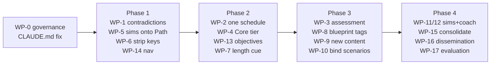

# Handoff: Curriculum Architecture Remediation

**To:** a Claude Code implementation session on the Mac (repo `jmoss333/psychiatry-clerkship`)
**From:** the Cowork curriculum-architecture review session, 2026-09-24
**Owner / attesting clinician:** Joshua Moss, MD
**Review this implements:** [Psychiatry Clerkship Library: Curriculum Architecture Review](https://claude.ai/code/artifact/d631e156-9edd-4f7d-8e8c-c01ba0c7782e)
(summary in the Claude project doc `claude/curriculum-architecture-review-2026-09-24.md`)
**Snapshot audited:** `origin/main` @ `2b18fd0` (2026-09-24 11:31 ET). **Every path, line number and
quoted string below was true at that commit.** Re-grep each string at your HEAD before editing,
because main moves daily.

---

## 0. What you are holding and how to use it

The review found the library strong on content integrity, safety governance and simulation
engineering. It is weak as a *curriculum*:

- There is no single spine: 8 week plans that disagree, and 0 required items.
- 0 of 20 core topic pages state learning objectives.
- There is no assessment of performance in the workplace. LCME 9.4 and 9.7 are unmet, and EPAs 5, 8, 9 and 13 are never assessed.
- Exam prep is inverted against the NBME/COMAT blueprint (ambulatory items 6% vs a 60–65% target; ages 0–12 0.7% vs 10–15%).
- There are three live clinical contradictions.

This handoff turns those findings into **18 work packages (WP-0 … WP-17)**, sequenced by
constraint rather than by preference. Each WP has these parts: goal, decision gate, files, steps,
tests, **machine-checkable acceptance criteria**, attestation impact, and out-of-scope. §7 is the
research appendix: canonical clinical values and new-content evidence, resolved against PubMed
with verbatim spans.

**Path shorthand used below:**
- `_automation/` = `13_Faculty_Resources/_automation/`
- `site_build/` = `13_Faculty_Resources/_automation/site_build/`
- `frontdoor/` = `site_build/frontdoor/`
- `Assessment/` = `13_Faculty_Resources/Assessment/` (new)

Any path marked *(new)*, and every file under `Assessment/`, is a file this handoff asks you to create.

**Read in this order:** §1 (ground rules) → §2 (decisions to ask Josh *first*) → §3 (PR plan) →
the WP you are executing → the §7 entries it cites.

**Operating principles for this session**

1. **Ask the §2 decisions in the first turn** with AskUserQuestion, batched at up to 4 questions per call.
   Work that no gate blocks (WP-0, WP-1 content fixes, WP-2 test, WP-14) may proceed meanwhile.
2. **One PR per concern.** Governance, content/registration and promotion never share a diff.
   `bin/check_governance_separation.py` enforces L1–L4, and it is the pre-push hook.
3. **Never mark anything attested.** You demote, register and draft. Josh promotes through the
   faculty console on `attest/pending`.
4. **Josh decides clinical content.** §7 gives researched canonical statements. Present them for
   approval; do not silently reword beyond what he approves.
5. **Before claiming a WP is done**, run its acceptance commands and paste their output in the PR
   body.

---

## 1. Ground rules

`CLAUDE.md` is canonical. These rules are the ones this work will trip over.

| # | Rule | Where it bites here |
|---|---|---|
| G1 | **Worktree off `origin/main`, always.** `git fetch origin && git worktree add .worktrees/<branch> -b <branch> origin/main`. Josh's checkout is usually a stale feature branch (at audit time `codex/on-the-go-learning-design`, 2 ahead / 26 behind). Never copy files from it. | every WP |
| G2 | **Governance vs content separation (L1–L4).** Governance includes: any `*.schema.json`; `CLAUDE.md`/`AGENTS.md`; `decisions.json`, `standards.json`, `vocabulary.json`, `instrument_rights.json`; the 5 named `_automation/` validators; `bin/`, `faculty-console/`, `.claude/`, `.github/`, `_automation/maintenance/`, `tests/maintenance/`. Content = shipped `source`/`extraSources` + `^(0\d\|1[0-4]\|99)_[^/]+/` outside `13_Faculty_Resources/`. **Neutral** (rides with either): root JSONs such as `topic_meta.json`, `question_bank.json`, `curriculum.json`, `pairings.json` and the case JSONs; `_automation/site_build/**`; `tests/` outside `tests/maintenance/`; `docs/`; non-shipped `13_Faculty_Resources/*`. | WP-2/4/5 (curriculum schema), WP-7 (`bin/` ratchet), WP-8 (QB schema), WP-17 (`standards.json`) need a governance PR *first* |
| G3 | **Promotions.** Any change to an attested `question_bank.json` item counts as a promotion. Demote the item to `draft` in the content PR, then Josh re-attests through the console. The same applies to `topic_meta` `facultyReview` → reviewed. | WP-1, 8, 9 |
| G4 | **Drift.** Editing the source or the `topic_meta` record of a reviewed page drifts its `contentHash`. The page then renders as pending on both sites until it is re-attested. That is expected; **list every drifted slug in the PR body** (`python3 bin/check_attestation_hashes.py`). `question_bank.json`, `curriculum.json`, `pairings.json` and the case JSONs are **outside** every hash (see WP-10), so edits there do not drift anything. | WP-1, 2, 6, 13 |
| G5 | **`topic_meta.json` edits go through the `topic-meta-author` skill**, however small. Serialization is `indent=1`, `ensure_ascii=False`, no trailing newline. Regenerate panels with `node bin/render_panels.mjs --write`. | WP-1, 9, 13 |
| G6 | **Evidence discipline.** Any sentence asserting what a paper found needs a verbatim `sourceSpan` in `evidence_annotations.json` in the same change. Read the results, not the title. New registry sources are added with `evidence_registry.json` (`indent=2`, `ensure_ascii=True`, trailing newline) **and** registered in a named id-set in `tools/evidence_registry/test_registry.py`. That file hard-locks the inventory, and CI runs it while `build_and_check.sh` does not. Resolve every PMID and watch for decoys (§7 lists known ones). | WP-1, 9, 12 |
| G7 | **No dose literals** in `rp-*` / `*-trainer` tools or `*.pack.json`. Topic pages defer dosing to local protocol. Thresholds that *are* the teaching point, such as lithium levels and COWS, are allowed. | WP-1, 9, 11 |
| G8 | **No instrument reproduction.** CIWA-Ar is retired, BFCRS restricted, C-SSRS retired, Stanley-Brown not programmed. Do not reproduce the ABIM mini-CEX form either; WP-3 instruments must be original. | WP-1(g), WP-3 |
| G9 | **Crisis block.** Any new surface where the learner does risk work gets `<!-- crisis-block -->` (markdown) or `<!-- crisis-block-html -->` (tool). Never hard-code 988. Adding the block to a markdown page disables `makeCollapsible` on that page. | WP-9 (child, well-being), WP-11 |
| G10 | **Every new shipped page is a new registration.** It needs: an entry in `site_manifest.json`; nav in `build_deploy.py` (and `resident_section.py` if it ships on res); `python3 …/site_build/shipped_pages.py --write`; a pending ledger row; `analytics_events.py --write`; and a topic_meta entry through the skill. Otherwise the orphan check or the freshness gate fails. | WP-3 (if shipped), WP-9 |
| G11 | **Front Door CSS contract.** `docs/superpowers/specs/front-door-handoff/CLASS-INVENTORY.md` must be updated in the same PR as any `fd_*.js` or `frontdoor.css` markup change. Front Door copy must be audience-neutral (`fd-library.test.mjs:193`). Essentials selection stays transient. | WP-2, 4, 14 |
| G12 | **Tests may not read live governance state** (#729). Use controlled fixtures. | all new tests |
| G13 | **Verification.** `bash bin/verify.sh` is a superset of CI and is the pre-push hook. Run it in the background and poll (about 90 s or more). If it fails locally while CI is green, check for bash 3.2 first (`${ARR[@]+"${ARR[@]}"}`). Never use `--no-verify`. | every PR |
| G14 | **LFS.** Never commit pointer stubs. Scope `git add` to explicit paths (`git add -A` once staged a stray `.worktrees/` gitlink). | every PR |
| G15 | **Attribution.** End commits and PR bodies with the attribution lines your session reminder specifies. | every PR |

---

## 2. Decisions Josh must make first (ask in the first turn)

The recommended default comes first in each row. Record each answer in `decisions.json` where marked
(governance PR), so the next agent doesn't re-litigate it.

| ID | Decision | Options (recommended first) | Blocks | Record in `decisions.json`? |
|---|---|---|---|---|
| **D1** ✅ **APPROVED as written — Joshua Moss, MD, 2026-09-24** | Canonical clinical values for refeeding, lithium levels and COWS/buprenorphine start | **Approve §7-A/B/C statements as written** · edit them · defer | WP-1 (a–c), WP-1b canonical claims | yes (`canonical-values-2026-09`) |
| **D2** | Reverse the "suggested, not required" house style (faculty decision D4a, `docs/superpowers/plans/2026-08-24-faculty-decisions.md`) to allow a **Required Core tier** of ≤ 2 h/week plus a Days 1–3 ward-survival set | **Yes, Core tier on `curriculum.json` path items** · Yes, but via per-rotation editions only · No, keep all suggested | WP-4 | yes (supersedes D4a) |
| **D3** | Re-sequence the six weeks to the clinical-necessity spine (§4 WP-2 table) | **Adopt the proposed spine** · keep current week themes and only reconcile the 8 plans to them · defer | WP-2 content phase, WP-5 | yes |
| **D4** | Facilitator material on learner sites: COTW answer keys/facilitator notes, **and** the OSCE scored checklists, withheld actor facts and examiner note | **Option A: strip at build via a marker; keep a faculty copy in the repo (non-shipped)** · Option B: relabel only · leave as is | WP-6 | yes (closes the plan open since 2026-09-15) |
| **D5** | Where faculty assessment instruments live (mid-clerkship form, direct-observation cards, preceptor guide) | **Non-shipped `13_Faculty_Resources/Assessment/` + printable PDF export** · ship a learner-visible "How you'll be observed" page as well · faculty-only Netlify surface later | WP-3 | no |
| **D6** | Question bank edits: demote the ~7 attested items touched by WP-1 and later the length-cue rewrites (WP-7), then re-attest in batches through the console | **Yes, batches of ≤ 24** · console-only editing (qbank-actions flow) · defer | WP-1, 7, 8 | no |
| **D7** | Hidden tools: `review.html`/`shelf-mode.html` are hidden from nav per the 2026-07-06 request, yet listed in Essentials, the Library and the Week 6 pairing | **Unhide both (the spacing engine is core to the pedagogy)** · keep hidden and remove every listing | WP-14 | yes |
| **D8** | License for dissemination | **CC BY-NC-SA 4.0 for content + MIT for code** · CC BY-NC-ND · all rights reserved (no dissemination) | WP-16 | yes |
| **D9** | Scope of new content, WP-9 | **All Tier-1 modules (child/adolescent, After-the-Unit ambulatory, OCD-related, SUD beyond withdrawal, C-L)** · child + ambulatory only · defer | WP-9 | no |
| **D10** | The stale COWS-waiver text in `CLAUDE.md` (it says 45 anchors ship under an interim waiver, but `decisions.json` superseded that with `cows-anchors-retired` on 2026-09-10) | **Governance-only PR to correct `CLAUDE.md`/`AGENTS.md` and `tests/ciwa-retirement.test.mjs` wording** · leave | WP-0 | no (already decided) |

Suggested AskUserQuestion batching: {D2, D3, D4} → {D5, D6, D7, D9} → {D8, D10}.

**Decision log** (append here as answers arrive; mirror each one into `decisions.json` in a governance PR)

| Date | ID | Decision | By | Recorded in `decisions.json`? |
|---|---|---|---|---|
| 2026-09-24 | D1 | §7-A refeeding, §7-B lithium, §7-C buprenorphine/COWS, §7-D RLS, §7-E malignant hyperthermia, §7-F cultural sentence: **approved as written** | Joshua Moss, MD (in Cowork) | Not yet. Add entry `canonical-values-2026-09` in the WP-0 governance PR, which is already governance-only, so L1 is not violated. |
| 2026-09-24 | Peer-review J1 | Canonical buprenorphine sentence = **§7-C** (the peer-review §4.2 wording is superseded) | Joshua Moss, MD (in Cowork) | Record it in the same `canonical-values-2026-09` entry |
| 2026-09-24 | D2 | **Yes — Required Core tier on `curriculum.json` path items** (`priority`, `window: days-1-3`; ≤ 120 required read-minutes per week). Supersedes faculty decision D4a. | Joshua Moss, MD (Claude Code session) | Pending — the WP-2/4/5 governance schema PR |
| 2026-09-24 | D3 | **Adopt the proposed spine** (§4 WP-2 table) | Joshua Moss, MD (Claude Code session) | Pending — same governance PR |
| 2026-09-24 | D4 | **Option B: relabel only.** Facilitator/examiner material stays on learner builds, labelled as such; no build-time strip. WP-6 is re-scoped accordingly (its Option-A implementation steps do not apply). | Joshua Moss, MD (Claude Code session) | Pending — governance PR |
| 2026-09-24 | D5 | **Non-shipped `13_Faculty_Resources/Assessment/` + printable PDF export** | Joshua Moss, MD (Claude Code session) | Not required |
| 2026-09-24 | D6 | **Superseded by peer-review J4:** ≤ 10 attested QB items per PR, safety items first | Joshua Moss, MD | Not required |
| 2026-09-24 | D7 | **Unhide both** `review.html` and `shelf-mode.html` | Joshua Moss, MD (Claude Code session) | Pending — governance PR |
| 2026-09-24 | D8 | **CC BY-NC-SA 4.0 for content + MIT for code** | Joshua Moss, MD (Claude Code session) | Pending — governance PR |
| 2026-09-24 | D9 | **All Tier-1 modules plus clinician well-being** (six new pages: child/adolescent, After-the-Unit, OCD-related, SUD beyond withdrawal, C-L presentations, well-being) | Joshua Moss, MD (Claude Code session) | Not required |
| 2026-09-24 | D10 | **Decided:** governance-only correction of the stale COWS-waiver text (WP-0) | Joshua Moss, MD | Not required |

**Session split, 2026-09-24 (Josh).** Two Claude Code sessions run in parallel. The **peer-review
session** owns WP-0, WP-1a, WP-1b, and *every* `question_bank.json` edit until peer-review WP-4
merges. The **architecture session** starts WP-3, WP-17, WP-2 phase 1, the WP-2/4/5 governance
schema PR then WP-4, the WP-7 and WP-8 ratchet tools (tools only), the WP-9 new pages, WP-16
steps 1–3 and 5, and WP-5 part 1. These wait for the matching peer-review PR to merge first:
WP-6 (after peer WP-8); WP-10 (after peer WP-5/6/9/10/11); WP-11 and WP-12 (after peer WP-5);
WP-13 (after peer WP-6/7/9/10/11); the WP-7/8 item batches (after peer WP-4); and the WP-9
patches to existing pages, WP-14's `resident_welcome`/COTW-index strings, WP-15, and WP-2
phase 3.

**Coordinating with the parallel peer review.** The peer review is `docs/curriculum-review/peer-review-2026-09-24/HANDOFF_CLAUDE_CODE.md`, whose §0A records decisions J0–J7 made on 2026-09-24. It is binding here as well.

- **J0: one joint PR for the shared strings.** This handoff's **WP-1a (a)–(h)** ships *together with* the peer review's WP-1, WP-2 and four shared WP-10 items. They go in one content PR on branch **`content/clinical-safety-shared`**, not in a separate `content/clinical-contradictions`. The PR body lists both handoffs' ids. The §3 PR table row 2 is superseded by this.
- **J1: the buprenorphine sentence is §7-C.** The peer handoff §4.2 already quotes it. With D1 now approved as written, the recorded D1 and J1 agree, so there is no conflict to resolve.
- **J4 supersedes D6:** ≤ **10** attested QB items per PR, safety items first. The joint PR demotes exactly 9:
  - `qb_cog_014`, `qb_sud_014`, `qb_mood_013`, `qb_sud_005`;
  - `qb_oth_001`, the day-3 phosphate refeeding item, `qb_mood_002`, `qb_sud_002`, `qb_eth_007`.

  WP-7 and WP-8 batches are therefore capped at 10, not 24. An item touched by both handoffs is demoted once and fixed once.
- **EXTRIP and lithium toxicity:** the peer review's R01-001/-002 *override* the §7-B note to "leave the EXTRIP/toxicity lines alone". Apply its EXTRIP 2015 wording in `cl_reference.md`.
- **Refeeding, lithium target, RLS, cultural sentence:** apply §7-A/B/D/F. The peer review's WP-10 refeeding items (M04-001/-002) are satisfied by §7-A.
- **WP-0:** may share one governance-only PR with the peer review's WP-0b (editorial-instruction lint). Never combine either with content.
- **WP-6 vs J3:** J3 puts a crisis marker on `osce.md`, which WP-6 also edits. The crisis marker stays in the learner-facing part, outside `<!-- faculty-only -->`. Whichever PR lands second rebases.
- **Checks to run together:** the peer review's `check_remediation.py` (SR-12/-14/-17/-19 cover the same values) and this handoff's WP-1a greps.

---

## 3. PR plan and sequencing

The ordering follows what depends on what. Phase 1 fixes things that are wrong today, Phase 2 builds the spine,
Phase 3 adds assessment and content, and Phase 4 packages the library for dissemination.



A governance PR must merge **before** the content PR that depends on it.

| Order | PR (branch) | Type | WPs | Depends on | Human gate |
|---|---|---|---|---|---|
| 1 | `gov/claude-md-cows-retired` | governance | WP-0 | — | Josh review |
| 2 | `content/clinical-safety-shared` (joint with the peer review, per J0) | content + ≤ 10 QB demotions (J4) | WP-1a + peer WP-1/WP-2 | D1 ✅, J4 | PR review; then console re-attest |
| 3 | `content/canonical-claims-v1` | neutral (`13_Faculty_Resources/canonical_claims.json`) | WP-1b | PR 2 merged | Josh authors/approves statements |
| 4 | `reg/sims-onto-path` | registration (`curriculum.json`, `pairings.json`) | WP-5 (no-schema part) | D3 (placement only) | PR review |
| 5 | `gov/facilitator-strip-decision` | governance (`decisions.json`) | WP-6 | D4 | Josh |
| 6 | `content/strip-examiner-material` | content + registration | WP-6 | PR 5 | PR review; osce.md & COTW drift → re-attest |
| 7 | `content/nav-fixes` | content + registration | WP-14 | D7 | PR review |
| 8 | `test/schedule-consistency` | neutral (`tests/`) | WP-2 phase 1 | — | none. **Lands the test in "report" mode first** (see WP-2) |
| 9 | `gov/curriculum-schema-priority-query` | governance (schema + `validate_curriculum.py` + `decisions.json`) | WP-2/4/5 schema parts | D2 | Josh |
| 10 | `content/schedule-spine` | content + registration | WP-2 phase 2, WP-4 | PRs 8, 9; D3 | PR review; many drifts → re-attest |
| 11 | `gov/qbank-length-cue-ratchet` | governance (`bin/`) | WP-7 tool | — | Josh |
| 12… | `content/qbank-cue-batch-N` | QB demotions | WP-7 items | PR 11; D6 | console re-attest per batch |
| … | remaining WPs as specified | — | — | — | — |

---

## 4. Work packages

Each WP gives: **Goal** · **Finding** (review §) · **Gate** · **Files** · **Steps** · **Tests** ·
**Acceptance (machine-checkable)** · **Attestation impact** · **Out of scope**.

---

### WP-0: Correct the stale COWS-waiver text in governance files

- **Goal:** Make the canonical agent instructions match the recorded decision.
- **Finding:** Recon discrepancy. The instrument bullet in `CLAUDE.md`, near its end, still says: "**COWS alone remains open**… its 45 verbatim anchors in `withdrawal.html` published under a recorded interim waiver… that waiver is the one thing still blocking Wave 4". But `decisions.json` supersedes `cows-interim-waiver` with `cows-anchors-retired` (2026-09-10: anchors withdrawn, items and score values kept). `tests/ciwa-retirement.test.mjs` carries the same stale wording.
- **Gate:** D10.
- **Files:**
  - `CLAUDE.md`, then `cp CLAUDE.md AGENTS.md` (CI fails if they diverge).
  - `tests/ciwa-retirement.test.mjs` comments/assertion names. This path is neutral, but keep it in the same governance PR for coherence.
- **Steps:**
  1. Read the `cows-anchors-retired` entry in `decisions.json` and quote it.
  2. Rewrite only that sentence of the instrument bullet to state the current disposition.
  3. Leave the rest of the rule untouched.
- **Acceptance:**
  - `grep -n "still blocking Wave 4" CLAUDE.md` returns 0. The phrase "interim waiver" wraps across lines 659–660 at `2b18fd0`; any remaining mention is explicitly dated as superseded.
  - `cmp CLAUDE.md AGENTS.md` exits 0.
  - `python3 bin/check_governance_separation.py` exits 0. The PR carries no content paths.
- **Attestation impact:** none.
- **Out of scope:** any change to `withdrawal.html`.

---

### WP-1: Resolve the clinical contradictions (highest priority)

- **Goal:** Stop the library from marking a student wrong for following its own page.
- **Finding:** Review §5 "Clinical contradictions".
- **Gate:** D1 (canonical values: **approved as written 2026-09-24**) and D6 (QB demotions).
- **Research:** §7-A through §7-F hold the canonical statements, sources and verbatim spans.

#### WP-1a: Content PR `content/clinical-safety-shared` (joint PR with the peer review, per J0)

Re-grep every string at HEAD. `path:line` values are as of `2b18fd0`.

**(a) Refeeding.** This is a *half-applied* prior finding: MS3V04-F002 fixed the page body only.

| Where | Current | Change to |
|---|---|---|
| `03_Core_Topics/Eating_Disorders/eating_disorders_inpatient_teaching.md:16` (body) | "…current guidance (SAHM 2022; MEED…) supports higher-calorie refeeding with electrolyte surveillance, reserving the most conservative starts for the most severely malnourished… supplement phosphate and give thiamine before or with carbohydrate…" | Keep the substance. Tighten to the §7-A canonical statement: higher-calorie start with daily electrolytes in mild–moderate malnutrition; cautious start for the highest risk (adults with BMI < 13 plus acute illness or abnormal electrolytes; < 60% median BMI in youth); give thiamine; **do not delay feeding to normalise electrolytes**. Replace "before or with carbohydrate" with "give thiamine (and other vitamins) when refeeding starts". §7-A explains that the "before" timing could not be verified. |
| same file `:31` (pearl) | "**Refeeding syndrome = watch the phosphate** — start low, go slow, replete phosphate, give thiamine; the most malnourished are the highest risk." | "**Refeeding syndrome = watch the phosphate** — risk tracks the degree of malnutrition, not the starting calories; most patients can start higher with daily phosphate/K/Mg checks, and the most malnourished or medically unstable start cautiously; give thiamine." |
| `topic_meta.json:1071` (`t_eating.md` `points[2]`) | "Refeeding syndrome — start low, go slow, watch phosphate, give thiamine." | "Refeeding syndrome — watch phosphate daily; start higher unless highest-risk; give thiamine." (via the **topic-meta-author** skill) |
| `question_bank.json` `qb_oth_001` (attested) | Keyed D: "Start caloric refeeding at a conservative initial target and advance slowly…"; `why` and `pearl` say "start low, go slow"; `evidence` misquotes the page | **Demote → draft**, then rewrite per the §7-A MCQ guidance. Stem: 16-year-old, ~75% median BMI, bradycardia, normal electrolytes. Key: higher-calorie start advanced daily with close phosphate/K/Mg monitoring. Make "≤ 1,000 kcal/day, advance slowly" a named trap ("Underfeeding as safety"). Fix `evidence` to quote the page as it will read. **Trim the key so it is not the sole longest option** (WP-7 rule). |
| `question_bank.json`, second refeeding item (~line 7609, the day-3 phosphate 2.1 vignette) | `pearl` at ~7642 includes "start low, go slow" | Demote → draft; replace the pearl clause with "risk tracks malnutrition; monitor phosphate daily". |
| Not shipped, but fix for coherence | `14_Tracks/MS3/Student_Ready_Pack/07_shelf_guide/exam_blueprint_gaps.md` ("Refeed slowly"); `09_Exam_Prep/shelf_comat_bank/04_pilot_batch_01.json` `qbx_oth_001` caveat | Align the wording. Both are draft and unshipped. |

**(b) Lithium target levels.** Adopt one set everywhere (§7-B):

- acute mania 0.8–1.2 mmol/L;
- maintenance standard 0.6–0.8, with 0.4–0.6 if the response is good but the drug is poorly tolerated, and 0.8–1.0 if the response is inadequate and the drug is well tolerated;
- older adults usually 0.4–0.6 (maximum ~0.7–0.8 at 65–79; ~0.7 at ≥ 80);
- trough 12 h after the dose, drawn ~5 days after a change.

mEq/L = mmol/L for lithium; use one unit per page and state it.

| Where | Current | Action |
|---|---|---|
| `03_Core_Topics/Mood/mood_disorders_inpatient_teaching.md:36` | "narrow therapeutic window (~0.6–1.2 mEq/L)" | Replace with "acute ~0.8–1.2; maintenance ~0.6–0.8 (lower in older adults)". |
| `05_Psychopharmacology/Monitoring_and_Labs/medication_monitoring_inpatient_teaching.md:13` | "target ≈ 0.6–1.0, up to ~1.2 acute mania" | Canonical set (full version lives here; other pages link to it). |
| `topic_meta.json:5433` (`med_monitoring.md` points) | "target ≈ 0.6–1.0 (up to ~1.2 in acute mania)" | Canonical short form (skill). |
| `07_Evidence_and_Reading/Rounds_Questions/rounds_questions.md:241` | "Acute mania: 0.8–1.2 mEq/L; maintenance: 0.6–0.8 mEq/L. Toxic at ≥1.5 mEq/L." | Already consistent. Add the older-adult clause. |
| `14_Tracks/Resident/cl_reference.md:30` (res only) | "Therapeutic 0.6–1.2 mEq/L" | Replace with the canonical set. Keep the toxicity/EXTRIP lines, which the 09-01 review already verified. |
| `question_bank.json` `qb_mood_002` `evidence` | quotes "~0.6–1.2 mEq/L" | Update the quote to the new page text. Demote → draft (G3). |
| Lithium COTW `08_…/case-of-the-week/2026-08-03_lithium…_MS3.md:116-118,134` and `_Resident.md:102-111,200` | older adults "0.4–0.8 for 60–79… 0.4–0.7 for 80+" | Align to Nolen 2019: usually 0.4–0.6, max 0.7–0.8 at 65–79, max 0.7 at ≥ 80. Label it a **majority view**, not consensus. |

**(c) COWS threshold for starting buprenorphine.** Teach the principle, not one number (§7-C). Canonical MS3 wording:

> "Start buprenorphine once objective withdrawal is present — roughly COWS ≥ 8–12 depending on the guideline (ASAM's 2023 fentanyl guidance: ≥ 8 with at least one objective sign). With fentanyl, precipitated withdrawal is uncommon; the first treatment is more buprenorphine. Low-dose and high-dose initiation are recognised alternatives your team may use."

| Where | Current | Action |
|---|---|---|
| `03_Core_Topics/SUD_Withdrawal/substance_use_inpatient_teaching.md:13, :43` | "roughly COWS ≥ 8 to 12" | Keep. Add the fentanyl-era sentence at `:43`. |
| `topic_meta.json:790` (`t_sud`) | "typically COWS 8-12" | Keep (consistent). |
| `07_…/rounds_questions.md:507, :521` | "COWS should ideally be ≥10–12", "(COWS ≥10–12)" | Change to the canonical wording. |
| `04_Acute_and_Safety/…/withdrawal-ciwa-cows-card.html:147` | The Mild band action (totals 5–12) says "for buprenorphine, generally wait for COWS ≥8–12". It fires inside the band it references. | Reword: "objective withdrawal is emerging — confirm with your team whether it is enough to start (commonly ≥ 8–12)". **Do not touch the anchor text** (G8). |
| `question_bank.json` `qb_sud_001`, `qb_sud_005` | "≥ 8 to 12" | Consistent. No change unless WP-7 trims them. |

**(d) Restless legs** (§7-D). `03_Core_Topics/Sleep/sleep_wake_disorders_inpatient_teaching.md:20` reads "iron repletion and dopaminergic/alpha-2-delta agents for restless legs". Change it to: "check ferritin/transferrin saturation and replete iron when low; alpha-2-delta ligands (gabapentin, gabapentin enacarbil, pregabalin) are first-line; dopamine agonists are no longer standard because of augmentation; remove aggravators (antihistamines, serotonergic and dopamine-blocking drugs, alcohol)." Keep it dose-free.

**(e) Malignant hyperthermia and ECT anesthesia** (§7-E).

- `04_Acute_and_Safety/Toxidromes/hyperthermia_toxidromes_inpatient_teaching.md`: add a fifth row to the table at lines 11–16, **Malignant hyperthermia**. Trigger: volatile anesthetics or succinylcholine. Mechanism: RYR1 variant. Setting: in or after anesthesia, including ECT. Clue: rising end-tidal CO₂, rigidity, hyperkalemia. Treatment: dantrolene; anesthesia emergency.
- The `topic_meta` `ruleOut` already lists MH, so the page now matches it. The title promises "Hyperthermia", which this row now honours.
- Cite `boyer-shannon-2005-serotonin-syndrome` and `strawn-2007-neuroleptic-malignant-syndrome`, which are **already in the registry**, for the SS/NMS rows. Register `rosenberg-2015-malignant-hyperthermia` (PMID 26238698) for the MH row (G6).
- `05_Psychopharmacology/ECT_Neuromodulation/ect_neuromodulation_inpatient_teaching.md:11/13` add, dose-free: "the usual ECT muscle relaxant is succinylcholine — ask about personal/family history of malignant hyperthermia and pseudocholinesterase deficiency; hyperkalemia risk in immobile or catatonic patients". Support the catatonia/hyperkalemia point from the existing registry or a verified source before asserting it. If no verified source exists, omit that clause.

**(f) Cultural claim** (§7-F). At `03_Core_Topics/Cultural_Psychiatry/cultural_psychiatry_inpatient_teaching.md:13`, replace "…not by different rates of underlying illness." with the §7-F sentence, and register `selten-2020-migration-psychosis` (PMID 30722795) with its span.

**(g) Chips that promise scoring a retired or restricted instrument.** No test pins these strings. `tests/ciwa-retirement.test.mjs` and `retired-instrument-presentation.test.mjs` guard retirement; extend one of them to forbid these phrasings.

| Where | Current | Change to |
|---|---|---|
| `04_Acute_and_Safety/Catatonia/catatonia_inpatient_teaching.md:11` | chip "Screen &amp; score — Bush-Francis (BFCRS)" | "Bush-Francis — official form & how to administer" |
| `03_Core_Topics/SUD_Withdrawal/substance_use_inpatient_teaching.md:21` | "Score at the bedside — CIWA-Ar / COWS" | "Withdrawal recognition card (COWS)" |
| `question_bank.json` `qb_sud_002` `link.label` | same as above | same change (demote → draft) |
| `14_Tracks/MS3/Student_Ready_Pack/03_weekly_map/week_by_week_reading_map.md:43` | "recognize and score catatonia with the BFCRS" | "recognize catatonia and know where the official BFCRS lives" |
| `05_Psychopharmacology/Protocol_Library/protocol_library_inpatient.md:8` | "Practice the scoring with the **Withdrawal (CIWA-Ar/COWS) card**" | reword without "CIWA-Ar" scoring |
| `decision-aids.html:328` | "use the full CIWA-Ar tool for scoring" | "use your unit's alcohol-withdrawal protocol" |

**(h) `qb_eth_007`.** The stem says "a 34-year-old man with paranoid schizophrenia". Change to "schizophrenia (prominent persecutory delusions)", because DSM-5 removed the subtypes. Demote → draft. The quiz distractor at `topic_meta.json:2738` is a *wrong* answer and may stay.

**Steps**

1. Get D1 and D6 answers.
2. Worktree off origin/main.
3. Apply the edits:
   - pages;
   - the topic_meta records, via the skill;
   - QB items: set `status: "draft"` on every touched attested item **in the same commit** as its edit;
   - evidence registry, annotations, and the `test_registry.py` id-set (e.g. a new `CURRICULUM_ARCH_2026_09_IDS`, added to the `ALL_SOURCE_IDS` union).
4. `node bin/render_panels.mjs --write`.
5. `python3 bin/check_attestation_hashes.py`. Paste the drifted slug list into the PR body.
6. `bash bin/verify.sh` (background it and poll the log).
7. Open the PR with an **Attestation checklist**: each drifted page, each demoted item, and a before/after diff excerpt. Josh re-attests through the console on `attest/pending`.

**Tests**

- `node --test tests/*.test.mjs`
- `validate_topic_meta.py`, `validate_registry_schemas.py`, `validate_evidence_annotations.py`
- `tools/evidence_registry/test_registry.py`
- `bin/verify_spans.py` (ratchet: must not rise)
- `bin/check_qbank_coherence.py` (ratchet)
- `bash …/build_and_check.sh ms3` and `… res`

**Acceptance**

These patterns are case-insensitive; exclude `docs/` and `99_Archive/`. Each must return 0 in shipped sources:

- `grep -rniE "start low,? go slow" --include=*.md --include=*.json` near "refeed". Script it over shipped `source` paths from `shipped_pages.json`, plus `topic_meta.json` and `question_bank.json`.
- `grep -rnE "0\.6[–-]1\.2 ?mEq" `
- `grep -rnE "0\.6[–-]1\.0, up to" `
- `grep -rnE "COWS[^.]{0,20}(≥|>=) ?10[–-]12" `
- `grep -rn "dopaminergic/alpha-2-delta" `
- `grep -rn "not by different rates of underlying illness" `
- `grep -rniE "score[^.]{0,30}(CIWA-Ar|BFCRS)" ` over shipped sources (excluding decision records)
- `grep -n "paranoid schizophrenia" question_bank.json`

And:

- `grep -c "Malignant hyperthermia" 04_Acute_and_Safety/Toxidromes/*.md` ≥ 1, and the ECT page contains "succinylcholine".
- Every touched QB item has `status: draft`. `python3 bin/check_governance_separation.py` exits 0 (registration only).
- `verify.sh` is green, and the `verify_spans` and `qbank_coherence` counts are ≤ baseline.

**Attestation impact:** drifts `t_eating`, `t_mood`, `med_monitoring`, `rounds_questions`, `t_sud`, `withdrawal.html`, `t_sleep`, `toxidromes`, `ect_neuromodulation`, `cultural_psychiatry`, `catatonia`, `protocol_library`, `reading_map`, `decision-aids.html`, `cl_reference` (res), and the lithium COTWs. Also 7 or more QB items are demoted.

**Out of scope:** anything beyond these strings. Log other defects you notice in the PR body instead of fixing them here.

#### WP-1b: Canonical claims `content/canonical-claims-v1` (after WP-1a merges)

- **Goal:** Make the three values unforgettable with regex guards.
- **Files:** `13_Faculty_Resources/canonical_claims.json` (neutral). There are slots already: `refeeding-syndrome-risk`, `lithium-therapeutic-range`, `buprenorphine-precipitated-withdrawal`, all `pending` with `appliesTo: []`. The schema is `canonical_claims.schema.json`. The procedure is `13_Faculty_Resources/CANONICAL_CLAIMS.md` §"Filling a slot".
- **Steps:**
  1. For each slot, fill in:
     - `statement` (Josh-approved §7 text);
     - `appliesTo[]` (every path above), with `contentHashAtReview` = sha256 of the **fixed** file text and `scopeHashAtReview` for pointer loci;
     - `evidence[]` (registry ids);
     - `guards.forbidden`: e.g. `start low,? go slow` scoped to refeeding loci; `0\.6[–-]1\.2`; `(≥|>=) ?10[–-]12`;
     - `guards.required` where useful.
  2. Leave `status`, `by` and `at` for Josh. He sets reviewed/by/at. If he wants you to type them, that is his explicit instruction, recorded in the PR.
- **Acceptance:**
  - `python3 bin/validate_canonical_claims.py` exits 0.
  - Re-introducing "start low, go slow" into `t_eating.md` in a scratch branch makes it exit 1. **Prove it by breaking it** (`docs/SILENT_SHRINK_CHECKLIST.md` §F), then revert.

---

### WP-2: One schedule (`curriculum.json` is the only week plan)

- **Goal:** Every surface that states "what week X covers" derives from `curriculum.json` `learningPaths.ms3`, and a test keeps it that way.
- **Finding:** Review §5, Structural contradictions. There are 8 plans: `curriculum.json`; the 6 week READMEs; the `01_Six_Week_Curriculum/README.md` table; the reading map; the orientation-packet table; the shelf guide's "Weekly Exam Integration" table; `core_readings`; and the unshipped roadmap. Catatonia sits in 4 weeks; the shelf table swaps weeks 4 and 5; orientation and `FD_PATH_PRACTICE` disagree on weeks 2 and 3.
- **Gate:** D3 (spine), and D2 for the `priority` field.

**Current mechanics (verified):**
- `curriculum.json` → `learningPaths.ms3 = {id, weeks:[{n, title, theme, landingRef, focusCategories[], items:[{ref, kind}]}]}`. The schema is `curriculum.schema.json` (`pathItem` has `additionalProperties:false`). The validator is `_automation/validate_curriculum.py` (governance).
- The build aborts if the `site_manifest` week titles differ from `welcome_compass.week_nav_title()` (`build_deploy.py:440-448`).
- `frontdoor/fd_path.js:68-82` hard-codes `FD_PATH_PRACTICE` (copied from the orientation table).
- `focusCategories` is dead metadata: it is only copied in `fd_data.js:114`.
- Pairings are already build-injected into week pages (`pairings_block.py`). **Reuse that pattern.**

**Phase 1: the test, in ratchet mode (PR `test/schedule-consistency`, neutral)**
1. Add `tests/schedule-consistency.test.mjs`. It parses:
   - `curriculum.json`;
   - every week README's `?page=`/`?tool=` links;
   - the reading map's `## Week N` sections;
   - the orientation table rows (`MS3_orientation_packet.md:57-66`);
   - the shelf table rows (`shelf_review_guide.md:139-148`);
   - `FD_PATH_PRACTICE`.
2. It then emits one normalized `(topicRef or theme keyword) → week` map per surface, and diffs each surface against `curriculum.json`.
3. Check in `tests/fixtures/schedule-known-drift.json`, listing today's mismatches. The test **fails on any mismatch not in the list, and fails if a listed mismatch no longer occurs.** This forces the list to shrink, like the repo's ratchets. It uses fixtures, never live governance state (G12).

**Phase 2: governance (PR `gov/curriculum-schema-priority-query`, shared with WP-4 and WP-5)**
- In `curriculum.schema.json`, add these to `pathItem`:
  - `priority`: enum `required|recommended|optional`, default `recommended`, reusing the rotation-edition vocabulary;
  - `window`: optional enum `days-1-3`;
  - `query`: optional string, pattern `^[a-z]+=[A-Za-z0-9_-]+$`, for per-case deep links such as `case=sp_depression_gated_si_001` and `week=3`.
- Also add `practice` (string) to `week`, replacing `FD_PATH_PRACTICE`, and drop `focusCategories` or give it a consumer.
- `validate_curriculum.py` rules:
  - `query` is only allowed on tool refs;
  - required items per week sum to ≤ 120 `read` minutes (from `topic_meta.read`);
  - `window` is only allowed in week 1.
- Add a `decisions.json` entry recording D2/D3 (superseding faculty decision D4a).
- Run `python3 13_Faculty_Resources/_automation/test_validate_registry_schemas.py` and the validator's unit tests.

**Phase 3: content and registration (PR `content/schedule-spine`)**
1. Rewrite `learningPaths.ms3` to the spine below, if D3 = adopt. Otherwise keep the current themes and fix only the other surfaces.
2. Replace the hand tables with **build-injected blocks** rendered from `curriculum.json`:
   - add a marker such as `<!-- six-week-table -->` and a `site_build/six_week_table.py`, modelled on `pairings_block.py` and `welcome_compass.py`;
   - inject into the orientation packet, the shelf guide and the `01_Six_Week_Curriculum/README.md` table;
   - in each week README, add a `<!-- week-path-block -->` that lists that week's Path items. Delete hand-written item lists that duplicate it.
3. Align the week README H1s to the `curriculum.json` titles.
4. Move `FD_PATH_PRACTICE` to `week.practice` and read it in `fd_path.js`.
5. Link `landingRef` from the Path detail (see WP-14).
6. Update `CLASS-INVENTORY.md` for any markup change.
7. Empty `tests/fixtures/schedule-known-drift.json`.

**Proposed spine (D3).** Refs are real MS3 slugs. **Bold = `priority: required` (Core).** *(new)* = created in WP-9. Keep the Core reading at ≤ 120 min per week.

| Wk | `title` / clinical question | Items (`ref` · priority) | `practice` (observed skill → WP-3 card) |
|---|---|---|---|
| 1 | "Ward survival & the admission" — *Is anyone about to get hurt; what is going on?* | `window: days-1-3`: **orientation.md**, **pg_interview.md**, **mse.html**, **pg_suicide.md**, **agitation.md**, **delirium.md**, **withdrawal.html**, **catatonia.md**, **toxidromes.md**, **doc_oral.md**, **sp-interview.html `case=sp_depression_gated_si_001`**. Rest of week: **t_psychosis.md**, **medical_workup.md**, ddx.md, sp-interview.html `case=sp_psychosis_paranoid_001`, one-patient-six-weeks.html `week=1`, question-bank-practice.html | Observed interview + MSE (card DO-1) |
| 2 | "Treatment on the unit" — *What do we start, and what do we monitor?* | **t_mood.md**, **psychopharm_primer.md**, **med_monitoring.md**, **t_sud.md**, ect_neuromodulation.md, sud_treatment.md *(new)*, sp-interview.html `case=sp_mania_redirect_001`, diagnostic-reasoning.html `case=<delirium-vs-psychosis id>`, one-patient-six-weeks.html `week=2`, question-bank-practice.html | Admission note reviewed (DO-2) |
| 3 | "The person behind the diagnosis" — *Why this person, why now?* **Mid-clerkship feedback at the end of this week** | **case_formulation.md**, **t_anxiety.md**, t_ocd.md *(new)*, **t_personality.md**, **brief_psychotherapy.md**, motivational_interviewing.md, cultural_psychiatry.md, communication-practice.html, reflection.html, one-patient-six-weeks.html `week=3`, question-bank-practice.html | Oral presentation on rounds (DO-3) |
| 4 | "Beyond the unit" — *What will the exam and the rest of medicine ask of me?* | **t_child.md** *(new)*, **after_unit.md** *(new)*, **cl_presentations.md** *(new)*, t_neurocog.md, t_geri.md, t_perinatal.md, t_eating.md, t_sleep.md, t_somatic.md, t_neurodev.md, exp_consult.md, diagnostic-reasoning.html, one-patient-six-weeks.html `week=4`, question-bank-practice.html | Consult-style H&P or collateral call (DO-4 variant) |
| 5 | "Risk, rights and disposition" — *Is it safe, is it legal, where do they go?* | **capacity.html**, **ethics_legal.md**, **violence.md**, **suicide.md**, **family_playbook.md**, collateral_workflow.md, exp_family.md, family-systems.html, violence.html, one-patient-six-weeks.html `week=5`, question-bank-practice.html | Family meeting or safety-plan rehearsal (DO-4) |
| 6 | "Integration" — *Can I carry a patient end to end?* | **osce.md**, **one-patient-six-weeks.html `week=6`**, **shelf.md**, oral.html, cases.md, landmark_trials.md, shelf-mode.html (per D7), review.html (per D7), question-bank-practice.html | Final observation → narrative |

Not on the Path and left as Library "go deeper": `therapy_on_the_unit`, `psychotherapy`, `exp_tx`, `family_modalities`, `t_adjustment`, `t_dissociative`, `t_impulse`, `t_sexual`, `nutrition_metabolic`, `rounds_questions`, `evidence_inpatient`, `rapid_review`, `anki`, `interaction-cards`, `screeners`, `interview-circle`, `decision-aids`, and the reading lists. The exam thread covers these through blueprint-weighted retrieval (WP-8).

**Acceptance:**
- `node --test tests/schedule-consistency.test.mjs` passes with an **empty** known-drift fixture.
- `grep -rn "sidebar" <shipped week/orientation/shelf sources>` returns 0.
- `python3 _automation/validate_curriculum.py` exits 0.
- Required read minutes per week ≤ 120. Print them in the PR body with a one-liner over `curriculum.json` × `topic_meta.read`.
- Both builds pass; `front-door.spec.js` has been updated for the heading and Path changes.

**Attestation impact:** the week pages, orientation, shelf guide, reading map and `01_Six_Week_Curriculum/README.md` all drift. List them in the PR body.

**Out of scope:** the resident path; its W1 is already organized by clinical necessity.

---

### WP-3: Workplace-assessment instruments (faculty pack)

- **Goal:** Close LCME 6.1 (objectives known to teachers), 6.2 (required clinical experiences), 9.4 (direct observation), 9.5 (narrative) and 9.7 (formal midpoint feedback). Give EPAs 1, 5, 6 and 9 real assessment evidence.
- **Finding:** Review §4 frameworks table and §6 Tier 1.
- **Gate:** D5.
- **Location** (recommended, not shipped, neutral): `13_Faculty_Resources/Assessment/`. Do **not** name files `*_inpatient(_teaching)?.md` or `*_pocket_(guide|card).md`, because the orphan check scans those patterns. If D5 also asks for a learner-facing "How you'll be observed" page, register it under G10.

**Constraints:**
- The instruments are **original**. Do not reproduce the ABIM mini-CEX, the O-SCORE/Ottawa anchor wording, or any published form verbatim (G8). If Josh wants a published scale, record its rights status in `instrument_rights.json` through a governance PR first.
- **No PHI fields:** no patient name, MRN or date of service. Use "patient initials: not recorded; encounter type: ___".
- Every card states that it feeds the school's official evaluation and is not itself the grade. This keeps the boundary set by `feedback.html`.

**Deliverables:**

| File | Contents | Anchors |
|---|---|---|
| `Assessment/README.md` | Purpose, how the pack maps to LCME elements and EPAs, how to print, where submitted forms go (placeholder for the school's system) | — |
| `Assessment/clerkship_objectives.md` | **Single source of the MS3 clerkship objectives**, 12–18 in total, each with an ID (e.g. `OBJ-03`), mapped to AAMC Core EPA and the 2024 Foundational Competency domain (WP-17), and linked to the week and Core refs. WP-13 page objectives cite these IDs. | Draft from the week READMEs' "objectives" + the review §6; Josh edits |
| `Assessment/required_encounters.md` | The LCME 6.2 list: the 9 encounter types in review §7, each with minimum responsibility level and a **simulated alternative** (Dana/Ray/Marcus, withdrawal card, reasoning case, capacity sim (WP-11), child cases (WP-9)) | — |
| `Assessment/mid_clerkship_feedback.md` | Timing: end of Week 3. Sections: (1) student pre-fills a self-rating against `clerkship_objectives.md` plus progress on required encounters; (2) preceptor narrative: 2–3 strengths, 2 specific targets, each with a plan; (3) professionalism concern Y/N with a remediation path; (4) exam-prep check (question-bank weak domains the student reports); (5) signatures/date. | 4-level scale: "needs direct supervision / needs prompting / needs occasional checking / ready for indirect supervision" (original wording) |
| `Assessment/DO-1_interview_mse.md` | 6–8 observable behaviours: open-ended start, safety screen asked plainly, substance/medical review, MSE domains elicited, summary back to the patient, no leading questions | same 4-level scale + narrative box |
| `Assessment/DO-2_admission_note.md` | Required elements (ID/CC, HPI with timeline, safety assessment with risk formulation, MSE internally consistent, differential incl. medical mimics, plan by problem), plus "clarity/concision" | — |
| `Assessment/DO-3_oral_presentation.md` | Align to the 5 self-check items already in `oral.html` (one-liner, SI/HI, synthesis, plan by problem, ends with an ask) so self-rating and preceptor rating are comparable | — |
| `Assessment/DO-4_team_family_communication.md` | Family meeting / collateral / interdisciplinary handoff; **can be rated by a nurse or social worker** (EPA 9) | — |
| `Assessment/preceptor_guide.md` | One page: what students are working on each week (generated from `curriculum.json` `week.practice`), how to do a 5-minute observation, feedback script. Adapt `14_Tracks/Resident/supervision_teaching.md` (One-Minute Preceptor, Ask–Tell–Ask); cite, do not duplicate. | — |
| `Assessment/encounter_card.md` | **Sim-to-Ward Entrustment Loop** (review §10): after a sim case, the student brings the card; the preceptor observes the same skill on the ward within 48 h and signs DO-1. Fields: sim case id, the coverage items the student missed in sim, ward observation date, rating. | — |

**Printable output:** add `13_Faculty_Resources/_automation/build_assessment_pdf.py` (dev-only, not in CI) that renders the pack to one print-CSS HTML/PDF. It is optional.

**Acceptance:**
- All 10 files exist. Every objective ID appears in ≥ 1 DO card or in the midpoint form.
- A small `tests/assessment-pack.test.mjs` asserts:
  - each DO card contains an `EPA` line and an `OBJ-` reference;
  - no card contains the tokens `MRN`, `DOB` or `Patient name`;
  - `required_encounters.md` names a simulated alternative for every row.
- `curriculum.json` week 3 `practice` mentions the midpoint meeting.

**Attestation impact:** none; these files are not shipped. Josh approves them in PR review, and his approval is the sign-off, per the attestation workflow.

**Out of scope:** storing learner data anywhere in this repo. That stays out by design.

---

### WP-4: Required Core tier + Days 1–3 ward-survival set

- **Goal:** Give novices a bounded, required minimum while keeping everything else suggested.
- **Finding:** Review §2 and §5. 0 items are required, 74 of 105 surfaces sit on no week, and the rotation-edition catalog is empty (`records: []`, `rotationEditionV2: "disabled"`).
- **Gate:** D2. Recon confirmed editions are the wrong mechanism: they are per-attending, local-labelled, and pilot-gated by `docs/pilots/rotation-edition-v2-pilot-protocol.md`, which is a DRAFT. **Do not enable editions for this.**
- **Files:**
  - schema: the governance PR shared with WP-2;
  - `curriculum.json` priorities;
  - `frontdoor/fd_data.js` (`fdItemsForWeek`), `fd_path.js` (`fdPathDetail`; the intro copy at `:177` currently reads "Six weeks of suggested practice. Confirm required work with your supervising team."), `fd_today.js` (`fdRow` badge; Days 1–3 ordering during week 1), `frontdoor.css`, `CLASS-INVENTORY.md`;
  - `welcome.md` and the outreach one-pager ("nothing here is required reading", line 29).

**Steps:**
1. The governance PR from WP-2 adds `priority`/`window`.
2. Set priorities as in the WP-2 table.
3. Render:
   - a "Core" badge, audience-neutral (`fd-library.test.mjs:193` forbids MS3/student/shelf tokens in Front Door copy);
   - during week 1, list `window: days-1-3` items first on Today.
4. Replace the copy with Josh-approved wording, for example "Core items are expected of everyone; everything else is suggested."
5. Update `front-door.spec.js` (heading `'Suggested learning plan'` at ~`:337`), `fd-path.test.mjs`, `fd-today.test.mjs` and `fd-data.test.mjs`.
6. Essentials selection stays transient. No storage or URL state.

**Acceptance:**
- `node --test tests/fd-*.test.mjs` passes, including new cases that pin the Core badge's render and the Days 1–3 ordering. Use fixture curricula, not the live file.
- Required minutes ≤ 120 per week (validator).
- `grep -rn "nothing here is required" <shipped sources>` returns 0.
- Smoke suite green in CI.

**Attestation impact:** `welcome.md` and the one-pager drift.

---

### WP-5: Put the existing simulations on the Path

- **Goal:** The best-built learning tools become part of the sequence.
- **Finding:** Review §8. The Interview Room, the Diagnostic Reasoning Workbench and weekly Jordan states are on no week, and all 13 COTWs are calendar-dated.

**Part 1 (no schema change; PR `reg/sims-onto-path`, can go in Phase 1):**
1. Add `{ref:"sp-interview.html", kind:"tool"}` to weeks 1 and 2, and `diagnostic-reasoning.html` to weeks 2 and 4. A repeated ref across weeks is supported (`fd_state.js` `fdProgressToggle` scopes progress by week, as it already does for `question-bank-practice.html`).
2. Fix the `pairings.json` mismatches. `pairings.json` is neutral and outside every hash.

| Week | Current practice pairing | Change to |
|---|---|---|
| W2 | label "Choosing an antipsychotic", pointing at `decision-aids.html`, which contains rule-out trees and no antipsychotic choice | point at `sp-interview.html`, or relabel "Rule-out first" |
| W5 | "Delirium", pointing at `capacity.html` | label "Capacity" |
| W6 | `shelf-mode.html`, a hidden tool | per D7: keep if unhidden, else `question-bank-practice.html` |

**Part 2 (after the governance `query` field lands):**
- Deep-link cases with `query`: `case=sp_depression_gated_si_001` / `sp_psychosis_paranoid_001` / `sp_mania_redirect_001`; `week=N` for `one-patient-six-weeks.html`; `case=` for reasoning cases.
- Plumb `query` through `fd_data` → `fdRow` → the open handler (`fd_wire.js` `fdResourceRequest` at ~`:728` already forwards params to the iframe).
- Tools already read these params: `one-patient-six-weeks.html:112` (`week`), `diagnostic-reasoning.html:132` (`case`), `sp-interview.conversation.js:266` (`case`).

**Part 3 (COTW by rotation week):**
- Add `rotationWeek` (1–6) to each entry in `08_Cases_and_Simulation/case-of-the-week/cotw_registry.json`. This is content by regex; it has no schema.
- Consume it in `cotw_meta.py`, grouping the COTW index by rotation week.
- Map the COTWs to the WP-2 weeks and gap domains. `validate_curriculum.py` intentionally excludes COTW from paths, so keep them off the Path and surface them through the week README block (WP-2).
- Flag the duplicate SS/NMS COTWs (`cotw_20260709_ssnms_ms3`, `cotw_20260914_ssnms_ms3`) for WP-15.

**Acceptance:**
- A one-liner over `curriculum.json` shows `sp-interview.html`, `diagnostic-reasoning.html` and `one-patient-six-weeks.html` each on ≥ 2 weeks. After Part 2, `one-patient-six-weeks.html` is on all 6 weeks with distinct `week=` queries.
- Every `cotw_registry.json` week has `rotationWeek`.
- The smoke test opens `sp-interview.html?case=sp_psychosis_paranoid_001` from the Path row (add it to `front-door.spec.js`).

**Attestation impact:** `cotw_index.md` drifts in Part 3. Parts 1 and 2 cause no drift.

---

### WP-6: Take examiner and facilitator material off learner builds

- **Goal:** Restore the OSCE's validity and the retrieval value of COTW. Students should rehearse, not read the key.
- **Finding:** Review §5 "Integrity issues".
  - `osce.md` (source `14_Tracks/MS3/Student_Ready_Pack/06_osce_cases/osce_station_set.md`, 270 lines) ships on both sites with:
    - a "**Patient brief**" per station containing withheld actor facts (e.g. the goodbye letter "not volunteered unless asked");
    - "**Rater focus**";
    - "## Scored Checklists & Critical-Fail Criteria" (from `:193`, checklists `:200-269`);
    - "**Examiner note.**" (`:270`).
  - 13 COTW pages ship answer keys and facilitator notes. The plan `docs/superpowers/plans/2026-09-15-facilitator-material-release.md` has been OPEN since then.
- **Gate:** D4. Record it in `decisions.json` (governance PR 5), closing the plan.

**Implementation (Option A):**
1. **Registration:** in `site_build/common.py`, add `strip_faculty_only(out_dir)`. It removes everything between `<!-- faculty-only -->` and `<!-- /faculty-only -->` in built markdown and HTML, and **fails the build on an unbalanced marker**. Model it on `strip_review_banners` (`common.py:610`). Call it in `build_deploy.py` beside the existing strip calls (~`:635`/`:638`) and in `resident_section.py` (~`:154`/`:157`).
2. The plan warns against hiding the material with CSS or `<details>`, because the text would stay in the DOM.
3. **Content:** in `osce_station_set.md`, keep a learner-facing "Candidate instructions" block per station. Wrap the patient brief, rater focus, scored checklists, critical-fails and examiner note in the markers. In each COTW, wrap the facilitator notes and answer keys.
4. **Faculty access:** the unstripped source stays in the repo. Optionally generate a faculty print copy into `13_Faculty_Resources/Assessment/osce_examiner_pack.md` with a dev-only script.

**Tests:**
- A unit test for `strip_faculty_only`, using a fixture that covers balanced, nested-forbidden and unbalanced markers.
- A **build-output** test guarded by `staleBuildReason()` (`tests/_build_freshness.mjs`) that asserts `_build/{ms3,res}` contains no `Critical-Fail`, `Examiner note`, `Rater focus` or `faculty-only` strings. This is a local-only contract (see `CLAUDE.md`), so also add the check to `check-static-site.mjs` so CI enforces it.

**Acceptance:**
- `grep -rlE "Critical-Fail|Examiner note|Rater focus" _build/ms3 _build/res` returns 0.
- The unit test is green.
- Both builds pass.

**Attestation impact:** `osce.md` and every edited COTW drift.

**Out of scope:** changing the OSCE's content.

---

### WP-7: Remove the answer-length cue from the question bank

- **Goal:** "Mastery" bars should measure knowledge, not test-wiseness.
- **Finding:** Review §4. The keyed answer is the *uniquely* longest option in **158/192 live items (82%)** and **133/144 attested items (92%)**; this was recomputed on 2026-09-24. The repo's own proposed gate is ≤ 35%. WP-15 of the 2026-08-20 remediation is still `todo` (`docs/superpowers/plans/2026-08-20-review-remediation-STATUS.md:201`).
  - The console rule `faculty-console/qbank-rules.mjs:~186-196` only warns above 2.25× the median distractor plus 35 characters, so it catches 12 items.
  - The CI-run `09_Exam_Prep/shelf_comat_bank/engine/test_qbank.py` validates the **pilot** file `04_pilot_batch_01.json`, not `question_bank.json`.
- **Gate:** D6.

**Steps:**
1. **Governance PR** `gov/qbank-length-cue-ratchet`. Add `bin/check_qbank_length_cue.py`, following `docs/RATCHETS.md`:
   - it has a `--self-test`;
   - baseline file `bin/qbank_length_cue_baseline.json`, containing `{"attested_uniquely_longest": 133, "live_uniquely_longest": 158}`;
   - exit 0 at or below the pin, 1 on a rise, 2 if it could not check (for example no items, or an unparsable file);
   - `--update-baseline`;
   - a `step` in `bin/verify.sh`. Keep it out of `ci.yml` unless Josh accepts the three-contract cost (`CLAUDE.md` "Adding a step to ci.yml…").
   - Also report the same metric for `topic_meta.json` quizzes (33/43) and the case JSONs. Those are fixed through shuffling in WP-10.
2. **Content batches** `content/qbank-cue-batch-N`, ≤ 24 items each:
   - demote to `draft` → rewrite;
   - rule from the 2026-07-13 decision record: **trim the key to the bare decision and move the rationale into `why`**; lengthen distractors to parallel structure;
   - keep the named traps;
   - after each batch Josh re-attests through the console, then lower the pin with `--update-baseline`. The JSON diff goes in the same PR.
   - **Order batches by blueprint priority**, so the same demotion also serves WP-8 tagging: mood and anxiety first, then childdev and otherdx.

**Acceptance (final):**
- `python3 bin/check_qbank_length_cue.py` reports attested uniquely-longest ≤ 35%.
- The baseline is lowered to match.
- `bin/check_qbank_coherence.py` does not rise.

**Attestation impact:** QB items only; no pages drift.

---

### WP-8: Blueprint tags and blueprint-weighted item writing

- **Goal:** The attested pool falls within the NBME/COMAT bands.
- **Finding:** Review §4 table:

| Measure | Target | Current |
|---|---|---|
| Diagnosis task | 65–70% | 31% |
| Ambulatory | 60–65% | ~6% |
| Emergency department | 20–30% | ~6% |
| Inpatient | 5–10% | ≥ 44% |
| Age 0–12 | 10–15% | 0.7% |
| COMAT depressive/bipolar | 20–25% | 11% |
| COMAT anxiety/OCD/trauma/dissociative | 20–25% | 9% |
| Scientific mechanisms | 8–10% | ~0 |

  Sexual-disorder items: 0. The bands were re-verified on the NBME page on 2026-09-24 (§7-J).
- **Gate:** D6, and D9 for the scale of new items.

**Steps:**
1. **Governance PR:**
   - Add an optional `blueprint` object to the item in `question_bank.schema.json`: `{nbme:{system, physician_task, site_of_care, patient_age}, comat:{presentation, physician_task}}`, plus `exam_alignment`, matching the shape of the pilot items in `04_pilot_batch_01.json`.
   - Add controlled vocabularies that copy the organisation of the official outline. Reproduce no items.
   - Add `bin/qbank_blueprint_report.py` (report plus ratchet on "points outside band"), with a baseline.
   - Reconcile the **four weighting schemes** into one file:
     - `QUESTION_BANK_BLUEPRINT.md`: 144 targets;
     - the crosswalk v1 quotas: 180;
     - the `shelf-mode.html` in-code `BLUEPRINT` constant;
     - the flat 16 per category in the live bank.
     The single file is `09_Exam_Prep/shelf_comat_bank/blueprint_weights.json` (content path). Change `shelf-mode.html` to read it.
2. **Tag the existing items** in batches, riding with the WP-7 demotions where possible.
3. **Write new items** in batches of 24. Each batch follows:
   - `QUESTION_BANK_STANDARD.md`;
   - `09_Exam_Prep/shelf_comat_bank/03_ITEM_WRITING_REVIEW_RUBRIC.md`;
   - the length-cue rule (WP-7);
   - a `pages` link to the page it grounds, so write items for WP-9 pages *after* those pages land.

   Initial quotas:

   | Area | New items |
   |---|---|
   | Child, age 0–12 | +16 |
   | Adolescent | +6 |
   | Anxiety/OCD-related/trauma | +12 |
   | Mood incl. specifiers, PMDD, cyclothymia | +10 |
   | Ambulatory/primary-care conversions of existing stems | ~20 rewrites |
   | Emergency department | +8 |
   | Sexual/paraphilic/gender | +4 |
   | Sleep | +3 |
   | Scientific mechanisms | +8 |
   | C-L presentations | +6 |

   Each item cites its page in `evidence`. Stems are fictional.

**Acceptance:**
- `python3 bin/qbank_blueprint_report.py` shows every NBME dimension and COMAT cluster within ±5 points of the band midpoint for the **attested** pool.
- Age 0–12 ≥ 10%.
- The `otherdx` grounding rule passes: every otherdx page has ≥ 1 item, and `t_sexual`, `t_adjustment` and `nutrition_metabolic` each have ≥ 1.

**Attestation impact:** QB only.

---

### WP-9: New content modules (Tier 1 gaps)

- **Goal:** Cover exam-weighted domains that the inpatient frame crowds out.
- **Finding:** Review §6.
- **Gate:** D9. Every clinical claim is subject to G6. Sources and verbatim spans are in **§7-G**.
- **Every new page** goes through G10: manifest, nav, `shipped_pages --write`, a pending ledger row, analytics, and topic_meta through the skill with `shelfBlueprint`, `epa`, `safetyLevel` and a quiz. Use the **WP-13 template** (Objectives → In 30 seconds → H2 sections → Self-check → Go deeper). Keep each page ≤ 1,200 words with a ≤ 400-word must-know block.

**Before writing any page:** grep `docs/superpowers/plans` and `specs` for an existing design (see the branch-base-gotcha memory). `CURRICULUM_GAP_REVIEW_2026-07-08.md` already proposed an "After the Unit" module and child vignettes.

| New slug (proposed source path) | Must-know content (outline) | Evidence (§7-G ids) | Crisis block? |
|---|---|---|---|
| `t_child.md` (`03_Core_Topics/Child_Adolescent/child_adolescent_psychiatry_teaching.md`). Do **not** use the `_inpatient_teaching` suffix unless Josh wants it in the inpatient orphan scan. | Outpatient/ED framing. ADHD first-line by age (AAP 2019 KAS 5a–c). Autism screening at 18 and 24 months. Tic disorders and CBIT. DMDD vs pediatric bipolar (chronic irritability predicts depression and anxiety, not bipolar). Adolescent depression: TADS; antidepressant boxed warning for under-25s and monitoring. Pediatric OCD (POTS). Separation anxiety and selective mutism. Consent/assent and confidentiality with minors. Mandated reporting. | wolraich-2019, hyman-2020, piacentini-2010, stringaris-2009, march-2004-tads (**exists**), stone-2009, pots-2004, FDA label | **Yes** (adolescent SI) |
| `after_unit.md` (`03_Core_Topics/Ambulatory/after_the_unit_ambulatory_teaching.md`) | Where most psychiatry happens. Collaborative care (care manager plus consulting psychiatrist, registry, measurement-based treat-to-target). IMPACT result. PHQ-9/GAD-7 follow-up (link `screeners.html`; teach administration, not the instrument). The discharge-to-outpatient handoff. Telepsychiatry basics. | archer-2012, unutzer-2002 (+ an MBC source still **to find**, flagged in §7-G) | No |
| `t_ocd.md` (`03_Core_Topics/Anxiety/ocd_related_disorders_teaching.md`) | OCD: SSRIs, clomipramine no better than SSRIs, ERP, combination in severe illness. Pediatric: CBT ± SSRI. BDD: CBT/SSRI, and cosmetic procedures rarely help. Trichotillomania: habit-reversal training. Excoriation: extrapolation only, labelled as such. Hoarding: recognition. | skapinakis-2016, pots-2004, harrison-2016, phillips-2016, crerand-2010, farhat-2020 | No |
| `sud_treatment.md` (`03_Core_Topics/SUD_Withdrawal/sud_beyond_withdrawal_teaching.md`) | Tobacco: varenicline is safe and most effective in psychiatric patients (EAGLES); combination NRT; forced abstinence on smoke-free units; **stopping smoking raises clozapine and olanzapine levels**. Stimulants: contingency management; no FDA-approved medication; ADAPT-2. Cannabis: CHS (hot showers, cessation) and the psychosis association. OUD: methadone and buprenorphine lower mortality; the XR-naltrexone induction hurdle (X:BOT); naloxone distribution; methadone and QTc; loss of tolerance after detox. | anthenelli-2016-eagles, theodoulou-2023, plever-2026, tsuda-2014, de-crescenzo-2018, brown-defulio-2020, trivedi-2021-adapt2, johansen-2026, sorensen-2017, richards-2017, di-forti-2019, lee-2018-xbot, larochelle-2018, walley-2013, krantz-2009 | **Yes** (overdose risk) |
| `cl_presentations.md` (`03_Core_Topics/Medical_Workup/psychiatric_presentations_medical_illness_teaching.md`) | Post-stroke depression (~1/3). Depression and anxiety in MS (~1/4 and ~1/5). Anti-NMDAR encephalitis: psychiatric onset, then seizures, dyskinesia, autonomic instability; ovarian teratoma; early immunotherapy; **antipsychotic intolerance or catatonia is a red flag**, labelled as teaching, not quoted. HIV-associated neurocognitive disorder (HAND). Thyroid, B12, steroids, delirium cross-links. **Link, don't duplicate,** `medical_workup.md`. | hackett-2014, marrie-2015, dalmau-2008, titulaer-2013, heaton-2010 (optional) | No |
| `wellbeing.md` (`02_Clinical_Skills/Reflection_PIF/clinician_wellbeing_teaching.md`) | Medical-student depression prevalence and low help-seeking. Physician suicide rate ratios, higher in women. Normalizing help-seeking. Local resources are a `LOCAL_POLICY`-style placeholder. **Tone review by Josh is mandatory.** | rotenstein-2016, schernhammer-2004, dutheil-2019 | **Yes** |

**Patches to existing pages** (content PR, drift expected):

| Page | Add |
|---|---|
| `t_mood.md` | Specifiers: peripartum onset (during pregnancy or within 4 weeks postpartum; DSM-5 wording, where §7-G flags that the carry-over to DSM-5-TR was not verified; **confirm against DSM-5-TR before writing**). PMDD recognition. Cyclothymia. Persistent depressive disorder. Atypical features. |
| `t_perinatal.md` | Zuranolone (first oral PPD treatment, FDA 2023; boxed warning about driving; **no dose**). Brexanolone NDA withdrawn April 2025: the library is **already current** (`_source/Medication_Safety…FAM.md:124`), so confirm, don't duplicate. Lactation: sertraline/paroxetine/nortriptyline usually undetectable in infants; fluoxetine highest (Weissman 2004); LactMed as the reference. |
| `t_sleep.md` | RLS per WP-1(d). Parasomnias. |
| `t_sexual.md` | Stays thin by design; add 4 QB items (WP-8). |
| Mechanisms | One "Mechanism in one line" pearl per `t_*` page: dopamine pathways (Lieberman 2004); lithium nephrogenic DI (ENaC entry, AQP2; Trepiccione 2010, no DOI; or Davis 2018). |
| **Clozapine REMS** | **Already current** (removed effective 2025-06-13; ANC monitoring continues; registry `clozapine-rems`). No change. |

**Acceptance per page:**
- The page ships on MS3.
- `validate_topic_meta.py` and `validate_evidence_annotations.py` exit 0.
- `shipped_pages.py --check` passes.
- Every numeric claim has a `[^source-id]` anchor, with `validate_claim_anchors.py` rule 3 respected (once one anchor exists, all declared ids must be anchored).
- `verify_spans.py` is not above baseline.
- The page is on its WP-2 week.
- At least 2 QB items reference it in `pages` (after WP-8).

**Attestation impact:** new pages enter as pending, and existing patched pages drift.

---

### WP-10: Bind practice-scenario content to attestation; shuffle options

- **Goal:** The attestation badge on a practice tool should cover the scenarios students actually practise, and choice position should stop being a cue.
- **Finding:** Review §5 and §8.
  - The tools `communication-practice.html`, `diagnostic-reasoning.html` and `family-systems.html` are reviewed (2026-09-21), but **all 29 scenario items** are `facultyReview.status: "draft"` with an empty reviewer: communication 12/12, reasoning 4/4, resident reasoning 5/5, family 8/8.
  - The data JSONs and `sp-interview.pack.json` are **not** `extraSources` (`shipped_pages.json`), so the hashes don't bind them.
  - The SP proxy reads the pack from `?ref=main` at runtime.
  - The best choice is always `b` (index 1) in communication cases (12/12) and always index 0 in reasoning cases (13/13 MS3, 15/15 resident). No renderer shuffles; `Math.random` appears only in `surpriseCase()`.

**Steps:**
1. **Registration:** add a branch in `site_build/shipped_pages.py` `derive()` so that each tool's data JSON(s) are its `extraSources`:
   - `communication-practice.html` → `communication_cases.json`;
   - `diagnostic-reasoning.html` → `reasoning_cases.json` (res: `reasoning_cases_resident.json`);
   - `family-systems.html` → `family_systems_scenarios.json`;
   - `sp-interview.html` → `_prototypes/sp-interview/sp-interview.pack.json` plus the case JSONs.

   Then run `--write`. **Consequence:** those tools drift and render pending until re-attested, and the root JSONs become content (G2). Announce both in the PR body.
2. **Shuffle** choices at render in `communication-practice.html` and `diagnostic-reasoning.html`, keeping ids stable for SRS. Use a seeded shuffle keyed by case id plus session, so a review screen is reproducible.
3. **SP pack pinning:** propose to Josh that the proxy's `SP_PACK_URL` pins a commit SHA or tag instead of `?ref=main`. This is a Netlify env change, so **Josh does it**. Then update `sp-proxy/README.md` and `REDTEAM_CHECKLIST.md`.
4. Josh reviews and attests the 29 scenarios: through the console if it supports them, otherwise by PR review plus a `facultyReview` update on `attest/pending`. Check what the console supports first; do not self-attest.

**Acceptance:**
- `python3 bin/check_attestation_hashes.py --explain communication-practice.html` lists `communication_cases.json` in its manifest.
- A new node test asserts that the best-choice index distribution across rendered cases is not constant, using a fixture with a seeded RNG.
- 0 `draft` scenarios remain on shipped tools after attestation. That last step is Josh's.

---

### WP-11: New student-level simulations (capacity, de-escalation, involuntary hold / AMA)

- **Goal:** Practise the three high-stakes conversations that currently have no practice surface.
- **Finding:** Review §8, "New builds" #2–4.
- **Pattern:** reuse the Interview Room engine. It is pack-driven: gates, a rapport model, a deterministic coverage map, a server-side re-derivation of reveals, and an evaluator that must quote the transcript.
- **Read first:**
  - `_prototypes/sp-interview/` (tests: `run-all.sh`, parity, leak);
  - `sp-proxy/netlify/functions/sp.mjs`;
  - `sp-proxy/REDTEAM_CHECKLIST.md`;
  - `docs/superpowers/specs/2026-09-08-practice-a-moment-design.md` and `2026-09-13-practice-coaching-content.md`;
  - the unshipped `_prototypes/agitation-trainer/agitation-trainer.html` (MS3 variant, draft), which may be the basis for de-escalation.

**Cases (each a new pack case, `draft` until attested):**
1. **Capacity.** A medically ill patient refuses a necessary treatment. The four abilities are coverage items (communicate a choice, understand, appreciate, reason). Legal specifics are carried as `localPolicies[]` `LOCAL_POLICY` tokens with `value:null`, so they are jurisdiction-neutral.
2. **De-escalation.** Uses an escalation meter instead of rapport. Success paths include "call for help/team". There are **no medications or doses** (G7). Add content-warning copy and a debrief card.
3. **Involuntary hold / AMA discharge request.** Legal status as a `LOCAL_POLICY` overlay; the coverage items are empathy, explaining rights, and the safety assessment.

**Gates:**
- Leak and parity tests must be extended to the new cases.
- The red-team checklist must pass.
- `crisis-block-html` applies because risk work happens here.
- Josh attests each case, and a model/pack change re-opens attestation (existing principle).

**Acceptance:**
- `_prototypes/sp-interview/tests/run-all.sh` is green, with the new cases in the leak and parity sets.
- `check-static-site.mjs` reports every new `LOCAL_POLICY` token (unfilled is allowed).
- The cases are placed on Path W5 (WP-2).

---

### WP-12: Oral-presentation coach on simulated encounters

- **Goal:** Formative feedback on the most frequent unassessed daily task.
- **Finding:** Review §8, "New builds" #1.

**Design (formative only):**
1. After an Interview Room encounter, the student writes or records a 3-minute presentation.
2. The coach compares it with the case's fact inventory from the pack. The output is limited to `present / omitted / contradicts case`, and each item cites the transcript turn or pack fact.
3. **Input is bound to the case**: the case id is prefilled and there are no free patient fields. Screen for PHI with fail-closed rules that are stronger than today's 6-regex check (`sp-interview.html` ~L244).
4. Reuse the evaluator prompt pattern in `sp.mjs` `evaluatorSystem`.

**Validity gate:** a faculty-vs-LLM calibration study (~20 transcripts per case, 2 faculty raters, agreement reported in `benchmarks/interview-room/`) before the coach's output is used for anything beyond formative feedback. Record the study in `benchmarks/interview-room/calibration`, which is `pending-faculty-review` today.

**Acceptance:**
- A golden-transcript test (20 fixtures) shows that every coach claim maps to a pack fact id.
- A deliberately fabricated presentation detail is flagged as `contradicts case`.
- The PHI screen blocks names and MRN-like strings in tests.

**Cost/infrastructure:** uses the existing proxy budget ($20 per rotation hard cap). Don't raise it without Josh.

---

### WP-13: Objectives and a must-know/go-deeper template on the core topic pages

- **Goal:** Each core page tells a novice what to learn and what can wait.
- **Finding:**
  - 0 of 20 `*_inpatient_teaching.md` topic pages state objectives.
  - Pearls introduce new facts rather than summarising.
  - Resident-level detail sits in MS3 pages: lecanemab/ARIA (`t_neurocog`), hazard ratios (`t_personality`), Wesseloo percentages (`t_perinatal`), 42 CFR §482.13(e) (`agitation`), *Sell*/*Harper* (`ethics_legal`), glucuronidation/Child-Pugh (`t_sud`).
  - There are 200–350-word "management" paragraphs.
- **Template to copy:** `02_Clinical_Skills/Psychotherapy/therapy_on_the_unit_inpatient_teaching.md`:
  - `## Objectives`, with "By the end of this module you should be able to:" and 3–6 items citing `OBJ-` ids from WP-3;
  - `## In 30 seconds`: the must-know block, ≤ 400 words;
  - numbered `##` sections;
  - `## Self-check`;
  - `## Go deeper`, where resident-level detail moves.
- **Gate:** none beyond attestation. Josh re-attests each page.

**Mechanics and traps:**
- Today's `t_*` pages use **bold pseudo-headings, not H2**. Converting to `##` triggers `makeCollapsible` (`spa_index.html:664-710`) on pages with ≥ 4 H2s **and no crisis block**: `t_impulse`, `t_neurocog`, `t_neurodev`, `t_sexual`, `t_sleep`, `t_somatic`. The other 10 carry `<!-- crisis-block -->` and stay flat. That is acceptable, but `front-door.spec.js` (~`:1600-1652`) pins collapse behaviour. Check for `t_*` assertions and update them.
- Keep objectives **in the page**, not in a new `topic_meta.objectives` field. A new field needs a renderer, validator rules (governance) and panel regeneration, for little gain. If Josh prefers structured objectives, do it as a separate governance and registration pair.
- Do the pages in **batches of 4** so each re-attestation stays reviewable. Begin with the Core pages from WP-2 (`t_psychosis`, `t_mood`, `t_anxiety`, `t_personality`, `t_sud`, `medical_workup`, `delirium`, `catatonia`).
- Moving detail to "Go deeper" must **not delete** attested evidence claims. Move whole sentences together with their `[^id]` anchors.

**Acceptance:**
- A new node test asserts that each listed page has `## Objectives` with 3–6 list items, each containing `OBJ-`, and a `## In 30 seconds` block of ≤ 400 words.
- `validate_claim_anchors.py` and `verify_spans.py` do not rise.
- Panels are regenerated.

---

### WP-14: Navigation and hidden-tool fixes

- **Finding:** Review §5, "Navigation".
- **Gate:** D7.

| Fix | Where | Change |
|---|---|---|
| Week landing pages nearly orphaned | `frontdoor/fd_path.js` `fdPathDetail` (~150–170) never links `landingRef`. `curriculum.json` `libraryExclude` hides week1–6 "surfaced by the Path tab". | Add an "Open week guide" action in the Path detail, and update `CLASS-INVENTORY.md`. |
| Hidden tools listed anyway | `build_deploy.py:120` `HIDDEN_TOOLS={"shelf-mode.html","review.html"}` sets only nav `hidden`. They are still listed in `curriculum.json` `libraryColumns`, in Essentials "Tools" (`review.html`), and as the W6 pairing. | Per D7, either remove them from `HIDDEN_TOOLS` (recommended; the spacing engine is core) or remove every listing. |
| Stale "sidebar" copy | `08_…/case-of-the-week/index_ms3.md:7`, `index_resident.md:7`; `week_by_week_reading_map.md:3,39`; `core_reading_list.md:17,36`; `14_Tracks/Resident/resident_welcome.md:16,20`; topic_meta `week5.md` and `cotw_index.md` | Replace with "Path" / "Library" wording. |
| Irrelevant quick-tool padding | `fd_today.js:303-318` `fdQuickTools` pads to 5 with alphabetical tools | Pad with the week's `pairings.json` practice tool and the Safety kit, or show fewer than 5. Update `fd-today.test.mjs:307-313`, `search-discovery.test.mjs:151` and `retired-instrument-presentation.test.mjs:76`. |
| Retired "Active Recall" reference | `spaced_retrieval_schedule.md` (unshipped) references a nonexistent tool | Fold its (re-attested) content into WP-2's daily-retrieval guidance, or retire the file. |

**Acceptance:**
- `grep -rn "sidebar" <shipped sources>` returns 0.
- `fd-path.test.mjs` includes a case asserting that the landing link renders.
- The tools listed in Library/Essentials are disjoint from `HIDDEN_TOOLS`. Add a node test for this.

---

### WP-15: Consolidate duplicates

- **Finding:** Review §5, "Duplication".
- **Gate:** Josh picks the surviving pages. Present each choice in AskUserQuestion with a diff preview.

| Cluster | Proposal |
|---|---|
| `pg_suicide.md` vs `suicide.md` (near-identical titles, W1 vs W5) | Make `pg_suicide` the Days 1–3 **recognition pocket guide**, retitled "Suicide risk: first-day screen". Make `suicide.md` the W5 **formulation and safety-planning** page. Differentiate the titles, and cross-link them. |
| Formulation (5 surfaces, 2 frameworks) | One framework (biopsychosocial × 4 P's). Align `pg_formulation` to `case_formulation`. |
| `exp_consult.md` vs 4 standalone modules | Keep it as a one-page **index** into the four modules plus the new `cl_presentations.md`. Remove the duplicated prose. |
| Psychotherapy (6 surfaces) | Declare the hierarchy: `brief_psychotherapy` (Core) → `therapy_on_the_unit` (deeper) → `psychotherapy`, `exp_tx`, `therapy_reading_room` (Library). |
| 8 reading lists | `core_readings.md` becomes a **generated view** of the Core items in `curriculum.json` (WP-2 block). The other lists are labelled "go deeper". |
| Duplicate SS/NMS COTWs (`cotw_20260709_ssnms_ms3`, `cotw_20260914_ssnms_ms3`) | Keep one on MS3 and re-map the other to the resident site, or retire it. Use the freed calendar slot for a gap domain: child, eating, perinatal, somatic. |

**Acceptance:**
- No two shipped MS3 pages share a normalized title. Add a node test for this.
- `pg_formulation` contains "Predisposing", "Precipitating", "Perpetuating" and "Protective".

---

### WP-16: Dissemination kit

- **Goal:** Make the library adoptable and publishable.
- **Finding:** Review §4 and §9 #17.
- **Gate:** D8, plus counsel for the license.

**Steps:**
1. `LICENSE` (+ `LICENSE-content`) per D8. Add a README section on the rights of third-party assets.
2. **Media accessibility.** `media_manifest.json` shows **50 of 100 audio** entries with neither `captions` nor `textAlt`.
   - Generate transcripts (e.g. a faster-whisper script, dev-only) into a `textAlt` sidecar, human-spot-checked.
   - Set `textAlt` for each audio entry.
   - Add a media rights/provenance field: the files are AI-generated (NotebookLM/OpenEvidence), and some titles are sensational ("…Slashes Suicide Risk by 87 Percent"), so they need retitling. **Josh reviews titles.**
3. **Autoplay:** `MS3_orientation_packet.md:16` `<video src="media/day-in-the-life.mp4" autoplay muted loop playsinline>` ships (WCAG 2.2.2). Replace it with `controls` and no autoplay. The week-intro `<video autoplay>` tags (`Week_*/README.md:3`) are stripped at build because the assets were never exported, so remove them from source.
4. **Local-token sweep.** "Maine" (40), "MMC" (51), "UNE" (35), "Sanford" (34) and "BHU2" (16) appear in sources. Markdown has no `LOCAL_POLICY` mechanism today.
   - Propose a registration-level `<!-- local:KEY -->` marker, rendered from a `local_policy.json`, modelled on `crisis_resources.json`. This is new, so it needs a design note in `docs/superpowers/specs/` first.
   - Do **not** mass-edit pages before Josh approves the design.
5. **Adopter guide:** `docs/ADOPTING.md`, written for a human clerkship director rather than an agent: what to swap, the minimum governance to keep, and how to build.
6. **External peer review:** recruit two external clerkship directors (Josh). Separate their attestation from the owner's in `reviewed.json` only through a governance design, not ad hoc.

**Acceptance:**
- `test -f LICENSE`.
- A one-liner over `media_manifest.json` shows 100/100 audio with `textAlt` or `captions`.
- `grep -rn "autoplay" <shipped sources>` returns 0.

---

### WP-17: Frameworks mapping and program evaluation scaffolding

- **Goal:** Be ready for MedEdPORTAL/ADMSEP and LCME review.
- **Finding:** Review §4 and §9 #16 and #18.

**Steps:**
1. **Governance PR.** Register the ADMSEP student spine (chosen 2026-09-10, `research_returns.json` rq-1) and the **AAMC/ACGME/AACOM Foundational Competencies (Dec 2024)** in `standards.json`/`vocabulary.json`.
   - Use **paraphrase only**; see `13_Faculty_Resources/rights-captures/`.
   - Also fix `13_Faculty_Resources/Accreditation_Crosswalk.md` §D, which says "NBME" where UNE students sit the **COMAT**.
   - **The Foundational Competencies list was not retrieved in the review** (the AAMC one-pager was robots-blocked). Josh or you must obtain the official list before encoding domain ids.
2. Map each `OBJ-` (WP-3) to an EPA and a Foundational Competency domain.
3. **Evaluation protocol draft** in `docs/_planning/` (the folder is absent on main; create it):
   - Kirkpatrick levels 1–3;
   - consented pre/post knowledge measurement (diagnostic pretest, `13_Faculty_Resources/SPEC_diagnostic-pretest-personalized-path.md`);
   - OSCE score capture outside this repo;
   - a Sim-to-Ward encounter-card pairing study (WP-3).

   The library's privacy design means **no learner data in the repo**, and the protocol must say so.
4. **IRB/QI determination request.** Josh submits it. You draft the letter only.

**Acceptance:**
- `python3 bin/check_standards_coverage.py` runs clean for the new units.
- `grep -n "NBME" 13_Faculty_Resources/Accreditation_Crosswalk.md` shows COMAT framing where it applies to UNE.

---

## 5. Per-PR verification checklist (paste the output in every PR body)

```bash
git fetch origin && git log --oneline origin/main..HEAD            # only your commits
python3 bin/check_governance_separation.py                          # 0 = clean
python3 13_Faculty_Resources/_automation/validate_registry_schemas.py
python3 13_Faculty_Resources/_automation/validate_topic_meta.py
python3 13_Faculty_Resources/_automation/validate_curriculum.py
python3 13_Faculty_Resources/_automation/validate_attestation_consistency.py
python3 tools/evidence_registry/test_registry.py                    # CI runs this; build does not
python3 13_Faculty_Resources/_automation/site_build/shipped_pages.py --check
node bin/render_panels.mjs --write && git diff --stat tests/__panels__
node --test tests/*.test.mjs
python3 bin/check_attestation_hashes.py                             # list drifted slugs in PR body
bash bin/verify.sh > /tmp/verify.log 2>&1 &  # then poll; ~90 s+
bash 13_Faculty_Resources/_automation/site_build/build_and_check.sh ms3
bash 13_Faculty_Resources/_automation/site_build/build_and_check.sh res
```

**Every PR body must contain:**
- the WP id(s);
- the decision(s) that authorised it;
- the drifted-page list;
- the demoted-QB-item list;
- an **Attestation checklist** Josh can tick in the console;
- the acceptance commands with their output.

**Definition of done for the whole handoff.** Every WP acceptance criterion passes on `main`, and every one of these holds:
- The schedule-consistency fixture is empty.
- The canonical-claims guards are live.
- The QB length cue is ≤ 35%.
- The blueprint report is within the bands.
- 0 draft scenarios remain on shipped tools.
- The assessment pack is merged.

Re-run the curriculum-review export (`export_curriculum_review.py` after building both sites), and grep that each §5 finding quote from the review is gone.

---

## 6. Known traps (each has already cost a cycle in this repo)

1. **A stale working tree looks like main.** Build from `origin/main` in a worktree. Recon subagents must also read `git show origin/main:<path>`.
2. **A red node test silently leaves `_build/` stale.** If an edit "doesn't show up", run `node --test` first.
3. **`verify.sh` fails but CI is green** usually means bash 3.2 on the Mac. Prove it by running the gate on clean main.
4. **A stale base looks like an L2 breach.** When the gate prints the "committed by the faculty console" hint, fetch. Do not edit.
5. **Stacked PRs:** `CLERKSHIP_PR_BASE=origin/<parent> git push`.
6. **Serialization churn.** Round-trip bytes before writing `topic_meta.json` or `evidence_registry.json` (formats in G5/G6). Never `json.dump` the whole registry naively; it reflows arrays.
7. **Evidence decoys** that resolve cleanly but are the wrong item:
   - ASAM 2020 erratum, PMID 32487948;
   - Di Forti "Authors' reply", 31122474;
   - Skapinakis reply, 27692264, and its *Focus* reprint, 35747299;
   - Wolraich "Historical Perspective", 31570649;
   - an unverified second Weissman 2004 item, 15285957;
   - McKeith DLB author response, 29438029 (from past batches).
8. **The Tier 1 landmark `orphanBacklog` is the required reading list**, not dead sources. Never "wire or retire" it.
9. **`attest/pending` is synced by merge, never by "Rebase branch".** A rebase rewrites the committer, and L4 then reddens the branch.
10. **Cowork VM ≠ the Mac.** Environment observations from Cowork (LFS "modified" media, egress) are not repo defects. Don't act on them.

---
## 7. Research appendix: canonical values and the evidence spine

**Status.** Everything below was resolved against PubMed metadata or the primary guideline PDF on
2026-09-24. Quotes are verbatim, with "…" marking omissions. **Before registering a source,
re-resolve it yourself (G6)**. The quotes are candidate `sourceSpan`s; take the span from the
results or recommendation text, never the title. Proposed registry ids are suggestions; follow
the registry's own naming convention.

**D1 APPROVED 2026-09-24.** Josh approved §7-A through §7-F as written. Use the statements verbatim; any rewording beyond fitting a sentence to its surface (a shorter rapid-review line, an MCQ's grammar) needs his approval again.

### 7-A: Refeeding in restrictive eating disorders (confidence: high for adolescents and young adults, moderate for adults)

**Canonical statement (MS3):**
> For medically hospitalised adolescents and young adults with mild–moderate malnutrition,
> refeeding can start higher (≈ 1,400–2,000 kcal/day) and advance faster than the old
> "start low, go slow" approach, with close electrolyte monitoring. Hypophosphatemia is the hallmark of
> refeeding syndrome, and its risk tracks the degree of malnutrition rather than the starting calories.
> A cautious start is reserved for the highest-risk patients (e.g., adults with BMI < 13 with acute
> illness or abnormal electrolytes). Give thiamine and other vitamins, and avoid underfeeding.

(The kcal range is the teaching point for exams. Pages may omit it and defer to the local order set.)

| Proposed id | Citation | Verbatim span |
|---|---|---|
| `sahm-2022-restrictive-ed` | Society for Adolescent Health and Medicine. Medical Management of Restrictive Eating Disorders in Adolescents and Young Adults. *J Adolesc Health* 2022;71(5):648-654. PMID 36058805; doi:10.1016/j.jadohealth.2022.08.006 | "Research supports inpatient refeeding protocols with close medical monitoring that include initial higher calorie content and advance more rapidly than protocols starting at <1,200 kcals/day." · "Refeeding hypophosphatemia, the hallmark biochemical feature of refeeding syndrome, is correlated with the degree of malnutrition on admission rather than the initial calories prescribed" |
| `garber-2021-strong` | Garber AK, et al. Short-term Outcomes of the Study of Refeeding to Optimize Inpatient Gains (StRONG)… *JAMA Pediatr* 2021;175(1):19-27. PMID 33074282; doi:10.1001/jamapediatrics.2020.3359. **Not *Lancet Child Adolesc Health*.** The 1-year results are Golden NH, *Pediatrics* 2021;147(4):e2020037135, PMID 33753542 | "Higher-calorie refeeding restored medical stability significantly earlier than lower-calorie refeeding (hazard ratio, 1.67 [95% CI, 1.10-2.53]; P = .01). Electrolyte abnormalities and other adverse events did not differ by group." Scope: ages 12–24, ≥ 60% median BMI. |
| `rcpsych-meed-2022` (status `exception`: no PMID) | Royal College of Psychiatrists. *Medical Emergencies in Eating Disorders (MEED)*, CR233, May 2022; PDF "Updated December 2025", pp. 80–81. https://www.rcpsych.ac.uk/docs/default-source/improving-care/better-mh-policy/college-reports/college-report-cr233-medical-emergencies-in-eating-disorders-(meed)-guidance.pdf (accessed 2026-09-24) | Adolescents: "starting at 1,400–2,000kcal/day, and increasing by at least 200kcal/day up to around 2,400kcal/day … is safe for all except patients at highest risk, provided that medical parameters are closely monitored" · Adults: "adult patients with evidence of active medical comorbidities, particularly if acutely ill, or with a BMI <13 should be refed cautiously … In all cases, patients must be monitored frequently, given vitamins, especially thiamine, and underfeeding avoided." · "it is not necessary to delay starting feeding to correct electrolytes" |
| (optional) `garber-2016-refeeding-review` | Garber AK, et al. *Int J Eat Disord* 2016;49(3):293-310. PMID 26661289 | "In severely malnourished inpatients, there is insufficient evidence to change the current standard of care." |

**Do not claim:**
- that higher-calorie starts are proven in extreme malnutrition (< 60% median BMI) or in medically unstable adults;
- that SAHM or MEED endorse high starts for everyone;
- that thiamine must precede carbohydrate. That timing was **not verifiable**: the ASPEN 2020 full text (PMID 32115791) is paywalled, and MEED says only to give vitamins without delaying feeding.

**MCQ key pattern:** a 16-year-old at ~75% median BMI with bradycardia and normal electrolytes. Key: a higher-calorie start, advanced daily, with close P/K/Mg monitoring. A "≤ 1,000 kcal, advance slowly" distractor is keyed wrong *unless* the stem shows highest risk.

### 7-B: Lithium serum levels (confidence: high)

**Canonical statement:**
- Acute mania: **0.8–1.2 mmol/L**.
- Maintenance: standard **0.6–0.8**. Use 0.4–0.6 if response is good but tolerance poor; 0.8–1.0 if response is insufficient and tolerance good.
- Older adults: usually **0.4–0.6** (maximum ≈ 0.7–0.8 at 65–79 years, ≈ 0.7 at ≥ 80). This is a *majority view*, not formal consensus.
- Draw a 12-h trough ≈ 5 days after a dose change.

| Proposed id | Citation | Verbatim span |
|---|---|---|
| `canmat-isbd-bipolar-2018` (**already registered**) | Yatham LN, et al. *Bipolar Disord* 2018;20(2):97-170. PMID 29536616 | "The target serum level for lithium in acute treatment is 0.8‐1.2 mEq/L (0.4‐0.8 mEq/L in older adults) while in maintenance treatment, serum levels of 0.6‐1 mEq/L may be sufficient" |
| `nolen-2019-lithium-levels` | Nolen WA, et al. What is the optimal serum level for lithium in the maintenance treatment of bipolar disorder?… ISBD/IGSLI Task Force. *Bipolar Disord* 2019;21(5):394-409. PMID 31112628; doi:10.1111/bdi.12805 | "consensus that the standard lithium serum level should be 0.60-0.80 mmol/L with the option to reduce it to 0.40-0.60 mmol/L in case of good response but poor tolerance or to increase it to 0.80-1.00 mmol/L in case of insufficient response and good tolerance." · Older adults: "usually 0.40-0.60 mmol/L, with the option to go to maximally 0.70 or 0.80 mmol/L at ages 65-79 years, and to maximally 0.70 mmol/L over age 80 years." |

**Nuance:**
- CANMAT's "0.4–0.8 in older adults" refers to *acute* treatment. Nolen's 0.4–0.6 is *maintenance*. Don't conflate them.
- The existing EXTRIP and toxicity lines in `cl_reference`/COTW were verified in the 09-01 review. Leave them alone.

### 7-C: Buprenorphine initiation and the COWS (confidence: high on the principle, moderate on any single number)

**Canonical statement:** see the WP-1(c) block quote. **Do not teach a single "correct" cutoff.**

| Proposed id | Citation | Verbatim span |
|---|---|---|
| `samhsa-tip63-2021` (`exception`) | SAMHSA. *TIP 63: Medications for Opioid Use Disorder*. PEP21-02-01-002 (rev. 2021). https://library.samhsa.gov/sites/default/files/pep21-02-01-002.pdf | "The patient should exhibit signs of opioid withdrawal before taking the first dose of buprenorphine to avoid precipitated withdrawal. For example, the Risk Evaluation and Mitigation Strategy (REMS) for buprenorphine indicates that a COWS score of 12 or higher is typically adequate for a first dose." |
| `asam-oud-2020` | ASAM National Practice Guideline 2020 Focused Update. *J Addict Med* 2020;14(2S Suppl 1):1-91. PMID 32511106. **The PubMed record has no abstract; the span is from the full text. Decoy erratum: PMID 32487948.** | "A COWS score of 11–12 or more is generally indicative of sufficient withdrawal to allow a safe and comfortable initiation onto buprenorphine." |
| `asam-hpso-bup-2023` | Weimer MB, et al. ASAM Clinical Considerations: Buprenorphine Treatment of OUD for Individuals Using High-potency Synthetic Opioids. *J Addict Med* 2023;17(6):632-639. PMID 37934520 | Table 3: "Opioid withdrawal, COWS ≥8 with 1 objective sign of opioid withdrawal → Standard initiation or HDB." · "For OWS after buprenorphine initiation, the most effective treatment remains administration of additional buprenorphine." |
| (optional) `donofrio-2026-ed-bup` | D'Onofrio G, et al. *JAMA* 2026;335(11):948-960. PMID 41670966 | "76% tested positive for fentanyl… Precipitated withdrawal was rare: 6 (0.6%) with extended-release buprenorphine and 8 (0.8%) with sublingual buprenorphine." |

**Do not claim:**
- that fentanyl use precludes standard initiation;
- that low-dose initiation is proven superior. ASAM: "No available data exist to recommend a specific dosing schedule."

### 7-D: Restless legs syndrome (confidence: high)

| Proposed id | Citation | Verbatim span |
|---|---|---|
| `winkelman-2025-aasm-rls` | Winkelman JW, et al. Treatment of restless legs syndrome and periodic limb movement disorder: an AASM clinical practice guideline. *J Clin Sleep Med* 2025;21(1):137-152. PMID 39324694 (the companion evidence review, 39324664, is separate) | "In adults with RLS, the AASM recommends the use of gabapentin enacarbil over no gabapentin enacarbil (strong recommendation, moderate certainty of evidence)." · "In adults with RLS, the AASM suggests against the standard use of pramipexole (conditional recommendation, moderate certainty of evidence)…" · Iron: "supplementation of iron in adults with RLS should be instituted with oral or IV iron if serum ferritin ≤ 75 ng/mL or transferrin saturation < 20%" |

**Do not say** dopamine agonists are "banned". The recommendation against them is conditional.

### 7-E: Malignant hyperthermia (confidence: high) and the other hyperthermic syndromes

| Proposed id | Citation | Verbatim span |
|---|---|---|
| `rosenberg-2015-malignant-hyperthermia` | Rosenberg H, Pollock N, Schiemann A, Bulger T, Stowell K. Malignant hyperthermia: a review. *Orphanet J Rare Dis* 2015;10:93. PMID 26238698 | "MH is a pharmacogenetic disorder of skeletal muscle that presents as a hypermetabolic response to potent volatile anesthetic gases such as halothane, sevoflurane, desflurane, isoflurane and the depolarizing muscle relaxant succinylcholine… An increase in end-tidal carbon dioxide despite increased minute ventilation provides an early diagnostic clue." · "Dantrolene sodium is a specific antagonist." |
| (optional, case report, moderate) | Nakano M, et al. *BMC Psychiatry* 2024;24:411. PMID 38834964 | MH after ECT with succinylcholine: "These symptoms emerged two hours after ECT." Supports: don't teach "intraoperative only". |
| SS / NMS rows | **Already registered:** `boyer-shannon-2005-serotonin-syndrome`, `strawn-2007-neuroleptic-malignant-syndrome` | Use the existing spans |

**Do not claim** that NMS predisposes to MH, or any hyperkalemia or catatonia claim, without a verified source.

### 7-F: The cultural-psychiatry sentence (confidence: high)

**Replacement sentence:**
> "Mental-health disparities in care are driven largely by access, stigma, social determinants,
> and clinician bias. Some groups do have higher rates of certain disorders — for example,
> psychotic disorders are about twice as common among migrants and some ethnic-minority groups
> in Europe — but because the excess persists into the second generation and varies by host
> country, it points to social adversity and exclusion rather than inherent biological difference."

| Proposed id | Citation | Verbatim span |
|---|---|---|
| `selten-2020-migration-psychosis` | Selten JP, van der Ven E, Termorshuizen F. Migration and psychosis: a meta-analysis of incidence studies. *Psychol Med* 2020;50(2):303-313. PMID 30722795 | "The meta-analysis yielded a RR, adjusted for age and sex, of 2.13 (95% CI 1.99-2.27) for NAPD… The RRs diminished, but persisted after adjustment for SES." |
| `bourque-2011-migration-psychosis` | Bourque F, van der Ven E, Malla A. *Psychol Med* 2011;41(5):897-910. PMID 20663257 | "The increased risk… clearly persists into the second generation, suggesting that post-migration factors play a more important role… the risk is mediated by the social context." |

**Do not claim** that the European estimates transfer to US racial groups, or that the cause is genetic.

### 7-G: Evidence spine for new content (WP-9)

Every row was PubMed-verified on 2026-09-24. Resolve it again before registering.

| Topic | Proposed id | PMID / URL | Citation | Verbatim span (from the abstract results or recommendation) |
|---|---|---|---|---|
| Tobacco | `anthenelli-2016-eagles` | 27116918 | Anthenelli RM et al. *Lancet* 2016;387:2507-20 | "Varenicline-treated participants achieved higher abstinence rates than those on placebo (odds ratio [OR] 3·61, 95% CI 3·07 to 4·24), nicotine patch (1·68, 1·46 to 1·93), and bupropion (1·75, 1·52 to 2·01)." · "The study did not show a significant increase in neuropsychiatric adverse events attributable to varenicline or bupropion relative to nicotine patch or placebo." |
| Tobacco | `theodoulou-2023-nrt` | 37335995 | Theodoulou A et al. *Cochrane* 2023;CD013308 | "There is high-certainty evidence that combination NRT (fast-acting form plus patch) results in higher long-term quit rates than single form (risk ratio (RR) 1.27, 95% confidence interval (CI) 1.17 to 1.37…" |
| Tobacco (inpatient) | `plever-2026-inpatient-cessation` | 42389948 | Plever S et al. *Cochrane* 2026;CD015934 | "low-certainty evidence of increased smoking abstinence from interventions that provided counselling with nicotine replacement therapy and post-discharge support… (RR 1.81, 95% CI 1.33 to 2.47" |
| Smoking and levels | `tsuda-2014-smoking-clozapine-olanzapine` | 24595134 | Tsuda Y et al. *BMJ Open* 2014;4:e004216 | "the doses of olanzapine and clozapine should be reduced by 30% and 50%, respectively, in non-smokers compared with smokers…". **The CYP1A2 mechanism is not in this abstract**; source it separately or state it as unreferenced teaching. |
| Stimulants | `de-crescenzo-2018-psychosocial-stimulant` | 30586362 | De Crescenzo F et al. *PLoS Med* 2018;15:e1002715 | "contingency management (CM) plus community reinforcement approach was the only intervention that increased the number of abstinent patients at the end of treatment (OR 2.84, 95% CI 1.24-6.51, P = 0.013)" |
| Stimulants | `brown-defulio-2020-cm-meth` | 33007699 | Brown HD, DeFulio A. *Drug Alcohol Depend* 2020;216:108307 | "Twenty of the twenty-one studies that reported abstinence outcomes showed an effect of contingency management on abstinence" |
| Stimulants | `trivedi-2021-adapt2` | 33497547 | Trivedi MH et al. *NEJM* 2021;384:140-153 | "The weighted average response across the two stages was 13.6% with naltrexone-bupropion and 2.5% with placebo…" (off-label; the response is low) |
| Stimulants | `johansen-2026-meth-pharm` | 42314583 | Johansen AN et al. *Pharmacol Rev* 2026;78:100145 | "no medications have received US Food and Drug Administration approval." |
| Cannabis | `sorensen-2017-chs` | 28000146 | Sorensen CJ et al. *J Med Toxicol* 2017;13:71-87 | "…compulsive hot baths with symptom relief (92.3%)…" · "Cannabis cessation appears to be the best treatment." |
| Cannabis | `richards-2017-chs-treatment` | 28370228 | Richards JR et al. *Pharmacotherapy* 2017;37:725-734 | "Benzodiazepines, followed by haloperidol and capsaicin, were most frequently reported as effective for acute treatment" |
| Cannabis/psychosis | `di-forti-2019-eu-gei` | 30902669 (**decoy 31122474**) | Di Forti M et al. *Lancet Psychiatry* 2019;6:427-436 | "Daily cannabis use was associated with increased odds of psychotic disorder compared with never users (adjusted odds ratio [OR] 3·2, 95% CI 2·2-4·1), increasing to nearly five-times increased odds for daily use of high-potency types of cannabis (4·8, 2·5-6·3)." |
| OUD | `lee-2018-xbot` | 29150198 | Lee JD et al. *Lancet* 2018;391:309-318 | "fewer participants successfully initiated XR-NTX (204 [72%] of 283) than BUP-NX (270 [94%] of 287; p<0·0001)." · "Among participants successfully inducted… 24 week relapse events were similar across study groups (p=0·44)." |
| OUD | `larochelle-2018-moud-mortality` | 29913516 | Larochelle MR et al. *Ann Intern Med* 2018;169:137-145 | "MMT was associated with decreased all-cause mortality (adjusted hazard ratio [AHR], 0.47 [CI, 0.32 to 0.71])… Buprenorphine was associated with decreased all-cause mortality (AHR, 0.63 [CI, 0.46 to 0.87])" |
| OUD | `walley-2013-naloxone` | 23372174 | Walley AY et al. *BMJ* 2013;346:f174 | "…community-year strata with greater than 100 enrollments per 100,000 population (0.54, 0.39 to 0.76) had significantly reduced adjusted rate ratios…" |
| OUD | `krantz-2009-methadone-qtc` | 19153406 | Krantz MJ et al. *Ann Intern Med* 2009;150:387-95 (expert consensus) | "If the QTc interval exceeds 500 ms, consider discontinuing or reducing the methadone dose" |
| OCD | `skapinakis-2016-ocd-nma` | 27318812 (**decoys 27692264, 35747299**) | Skapinakis P et al. *Lancet Psychiatry* 2016;3:730-739 | "all SSRIs (class effect -3·49…) had greater effects than did drug placebo. Clomipramine was not better than were SSRIs" |
| OCD (peds) | `pots-2004` | 15507582 | POTS Team. *JAMA* 2004;292:1969-76 | "Children and adolescents with OCD should begin treatment with the combination of CBT plus a selective serotonin reuptake inhibitor or CBT alone." |
| Trichotillomania | `farhat-2020-ttm` | 32390221 | Farhat LC et al. *Depress Anxiety* 2020;37:715-727 | "Behavioral therapy with habit-reversal training components (BT-HRT) demonstrated a large benefit compared to control conditions (… SMD… = -1.22…)" |
| BDD | `harrison-2016-bdd-cbt` | 27393916 | Harrison A et al. *Clin Psychol Rev* 2016;48:43-51 | "CBT was superior to waitlist or credible psychological placebo in reducing BDD (7 studies; delta=-1.22…)" |
| BDD | `phillips-2016-bdd-escitalopram` | 27056606 | Phillips KA et al. *Am J Psychiatry* 2016;173:887-95 | "Phase 2 relapse proportions were 18% for escitalopram and 40% for placebo." |
| BDD | `crerand-2010-bdd-cosmetic` | 20467296 | Crerand CE et al. *Ann Plast Surg* 2010;65:11-6 | "overall BDD severity improved with only 2.3% of treatments." |
| ADHD | `wolraich-2019-aap-adhd` | 31570648 (**decoy 31570649**; erratum 2020) | Wolraich ML et al. *Pediatrics* 2019;144:e20192528 | KAS 5a: "For preschool-aged children (age 4 years to the sixth birthday) with ADHD, the PCC should prescribe evidence-based behavioral PTBM and/or behavioral classroom interventions as the first line of treatment…" · 5b and 5c as quoted in the review notes |
| Autism | `hyman-2020-aap-asd` | 31843864 | Hyman SL et al. *Pediatrics* 2020;145:e20193447 | "Standardized screening for ASD at 18 and 24 months of age with ongoing developmental surveillance continues to be recommended in primary care". The abstract does not name the M-CHAT. |
| Youth antidepressants | `stone-2009-antidepressant-suicidality` + FDA label | 19671933; FDA escitalopram label 10/2023 | Stone M et al. *BMJ* 2009;339:b2880 | "…odds ratios were 1.62 (95% confidence interval 0.97 to 2.71) and 2.30 (1.04 to 5.09) for participants aged <25" · Label: "Antidepressants increased the risk of suicidal thoughts and behaviors in pediatric and young adult patients in short-term studies." |
| TADS | `march-2004-tads` (**already registered**) | 15315995 | March J et al. *JAMA* 2004;292:807-20 | "Rates of response for fluoxetine with CBT were 71.0%…; fluoxetine alone, 60.6%…; CBT alone, 43.2%…; and placebo, 34.8%" |
| DMDD vs bipolar | `stringaris-2009-irritability` | 19570932 | Stringaris A et al. *Am J Psychiatry* 2009;166:1048-54 | "Youth irritability did not predict bipolar disorder or axis II disorders at follow-up." (This studied the youth-irritability construct, not DMDD itself.) |
| Tics | `piacentini-2010-cbit` | 20483969 | Piacentini J et al. *JAMA* 2010;303:1929-37 | "(52.5% vs 18.5%, respectively; P < .001; number needed to treat = 3)." |
| C-L | `hackett-2014-poststroke-depression` | 25117911 | Hackett ML, Pickles K. *Int J Stroke* 2014;9:1017-25 | "the pooled frequency estimate of 31% (95% confidence interval 28% to 35%)…" |
| C-L | `marrie-2015-ms-psychiatric` | 25583845 | Marrie RA et al. *Mult Scler* 2015;21:305-17 | "…the prevalence of anxiety was 21.9%… 23.7%… for depression" |
| C-L | `dalmau-2008-anti-nmdar` | 18851928 | Dalmau J et al. *Lancet Neurol* 2008;7:1091-8 | "All patients presented with psychiatric symptoms or memory problems; 76 had seizures, 88 unresponsiveness…, 86 dyskinesias, 69 autonomic instability, and 66 hypoventilation. 58 (59%) of 98 patients… had tumours, most commonly ovarian teratoma." |
| C-L | `titulaer-2013-anti-nmdar-outcome` | 23290630 | Titulaer MJ et al. *Lancet Neurol* 2013;12:157-65 | "Predictors of good outcome were early treatment (0·62, 0·50-0·76; p<0·0001) and no admission to an intensive care unit…" |
| C-L (optional) | `heaton-2010-hand` | 21135382 | Heaton RK et al. *Neurology* 2010;75:2087-96 | "…33% for asymptomatic neurocognitive impairment, 12% for mild neurocognitive disorder, and only 2% for HIV-associated dementia (HAD)." |
| Collaborative care | `archer-2012-collaborative-care` | 23076925 | Archer J et al. *Cochrane* 2012;CD006525 | "…significantly greater improvement in depression outcomes for adults with depression treated with the collaborative care model in the short-term (SMD -0.34…; RR 1.32…)" |
| Collaborative care | `unutzer-2002-impact` | 12472325 | Unützer J et al. *JAMA* 2002;288:2836-45 | "At 12 months, 45% of intervention patients had a 50% or greater reduction in depressive symptoms from baseline compared with 19% of usual care participants…" |
| Measurement-based care | **still to find** | — | — | Neither abstract above describes MBC itself. Source it before asserting MBC outcomes. |
| PMDD | `marjoribanks-2013-ssri-pms` | 23744611 | Marjoribanks J et al. *Cochrane* 2013;CD001396 | "SSRIs were effective for symptom relief whether taken only in the luteal phase or continuously, with no clear evidence of a difference…" |
| Peripartum specifier | `sharma-2014-peripartum-specifier` | 24414301 | Sharma V, Mazmanian D. *Arch Womens Ment Health* 2014;17:171-3 | "restricting the specifier to a period of 4 weeks postpartum…". Confirm the DSM-5-TR wording in DSM-5-TR itself; it is not indexed. |
| PPD | `deligiannidis-2023-zuranolone` + FDA 2023-08-04 | 37491938 (correction 2025) | Deligiannidis KM et al. *Am J Psychiatry* 2023;180:668-675 | "Treatment with zuranolone compared with placebo resulted in statistically significant improvement in depressive symptoms at day 15 (… -15.6 vs. -11.6; LSM difference, -4.0…)" · FDA: "the first oral medication indicated to treat postpartum depression (PPD) in adults." |
| Brexanolone | (history only; the library is already current) | Federal Register 2025-04101 | — | "Approval is withdrawn as of April 14, 2025" |
| Lactation | `weissman-2004-antidepressant-lactation` | 15169695 (**decoy 15285957**) | Weissman AM et al. *Am J Psychiatry* 2004;161:1066-78 | "Nortriptyline, paroxetine, and sertraline usually produce undetectable infant levels. Of drugs currently used, fluoxetine produces the highest proportion (22%) of infant levels that are elevated above 10% of the average maternal level." |
| Lactation | `lactmed` (`exception`) | https://www.ncbi.nlm.nih.gov/books/NBK501922/ | NIH LactMed | "The LactMed® database contains information on drugs and other chemicals to which breastfeeding mothers may be exposed." |
| Well-being | `rotenstein-2016-med-student-depression` | 27923088 | Rotenstein LS et al. *JAMA* 2016;316:2214-36 | "The overall pooled crude prevalence of depression or depressive symptoms was 27.2%… The percentage… who sought psychiatric treatment was 15.7%" |
| Well-being | `schernhammer-2004-physician-suicide` | 15569903 | Schernhammer ES, Colditz GA. *Am J Psychiatry* 2004;161:2295-302 | "The aggregate suicide rate ratio for male physicians… was 1.41… For female physicians the ratio was 2.27 (95% CI=1.90-2.73)." |
| Well-being | `dutheil-2019-physician-suicide` | 31830138 | Dutheil F et al. *PLoS One* 2019;14:e0226361 | "The overall SMR for suicide in physicians was 1.44 (95CI 1.16, 1.72)… Female were at higher risk (SMR = 1.9…" |
| Mechanisms | `lieberman-2004-dopamine-partial-agonists` | 15015905 | Lieberman JA. *CNS Drugs* 2004;18:251-67 (review) | "…avoid the complete blockade of the nigrostriatal or tuberoinfundibular pathways, associated with extrapyramidal symptoms (EPS) and elevated prolactin levels, respectively." |
| Mechanisms | `trepiccione-2010-lithium-ndi` or `davis-2018-lithium-ndi` | 21170888 (no DOI) / 29607573 | Trepiccione F et al. *J Nephrol* 2010 / Davis J *Nephrology* 2018 | "ENaC is crucial as the entry route for intracellular Li+ accumulation." / "dysregulated trafficking and transcription of aquaporin 2 water channels" |
| Clozapine REMS | `clozapine-rems` (**already registered, current**) | FDA DSC 2025-08-27 | — | No change needed. |

**Unverified items to resolve before writing:**
- the DSM-5-TR text for PMDD, the peripartum specifier and DMDD;
- the M-CHAT naming;
- the CYP1A2 mechanism;
- a current US OCD guideline;
- an MBC outcome source;
- excoriation-specific treatment;
- tolerance loss after detox;
- ASPEN 2020 thiamine timing.

### 7-J: External benchmarks (for the WP-8 bands and WP-3/17 mapping)

- **NBME Psychiatry Subject Exam content outline**, re-verified on the live page on 2026-09-24 (page modified 2026-06-17). https://www.nbme.org/subject-exams/clinical-science/psychiatry
  - Systems: General Principles 5–10%; Behavioral Health 65–70%; Nervous System & Special Senses 10–15%; Other Systems/Multisystem 5–10%; Social Sciences 1–5%.
  - Task: Diagnosis incl. Foundational Science 65–70%; Pharmacotherapy/Intervention/Management 30–35%.
  - Site: Ambulatory 60–65%; ED 20–30%; Inpatient 5–10%.
  - Age: birth–12 10–15%; ≥ 13 85–90%.
- **NBOME COMAT Clinical Psychiatry**, as transcribed in `09_Exam_Prep/shelf_comat_bank/01_BLUEPRINT_CROSSWALK.md` §3 (accessed 2026-07-13). **Re-fetch before encoding bands.**
- **LCME 2026–27 Functions and Structure**, https://lcme.org/wp-content/uploads/2025/05/2026-27-Functions-and-Structure_2025-05-21.docx. Elements 6.1, 6.2, 8.6, 8.7, 9.4, 9.5, 9.7 and 9.8 were checked only against a 2021 mirror. **Confirm the wording against the 2026–27 document before quoting it in any faculty-facing file.** Key element 9.7: "Formal feedback occurs at least at the midpoint of the course or clerkship."
- **AAMC/ACGME/AACOM Foundational Competencies for UME**, released 2024-12-12, replacing the PCRS. https://engage.aamc.org/UME-Competencies-AAMC-ACGME-AACOM. The domain list was not retrieved (see WP-17).
- **ACGME Psychiatry Milestones 2.0** (22 subcompetencies; version 2.1). https://www.acgme.org/globalassets/pdfs/milestones/psychiatrymilestones.pdf
- **ADMSEP Junior Clerkship objectives** (1997 lineage). https://www.admsep.org/Educational-Objectives-for-a-Junior-Psychiatry-Clerkship.php. The appendix with the objective headings was not fetched.

---

*End of handoff. When a WP completes, append a dated line under it (`**Done:** PR #___, merged <date>`) so the next session can see the state.*
