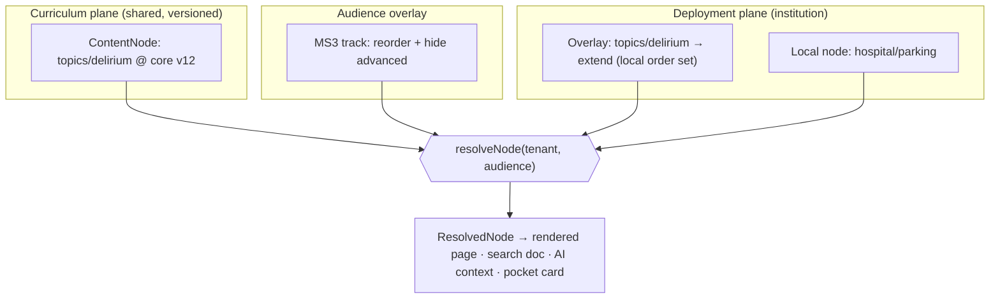
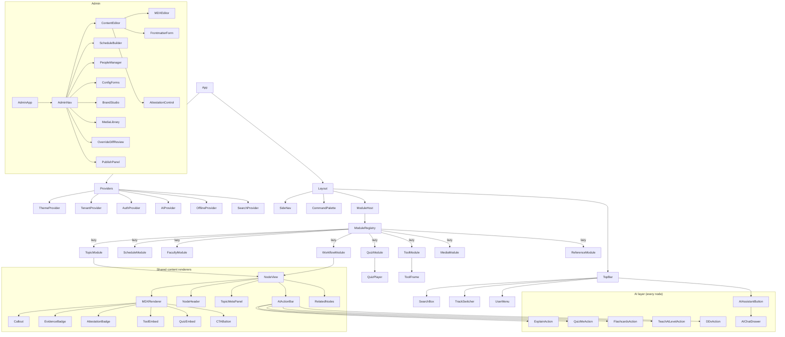
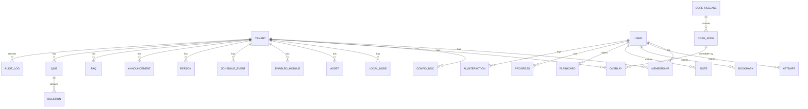
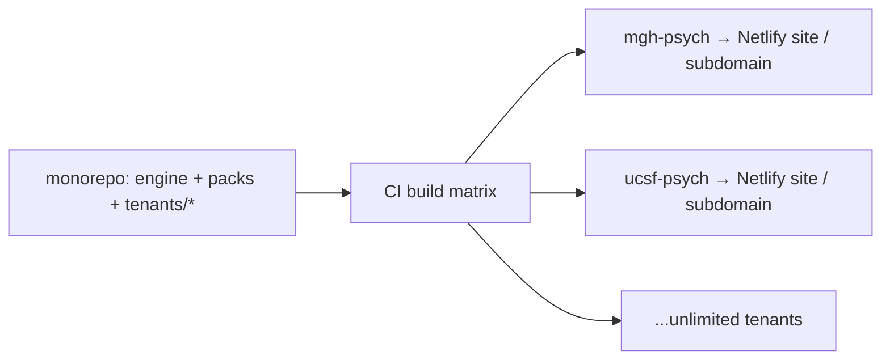
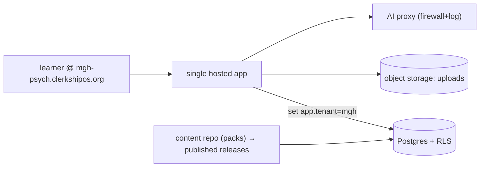
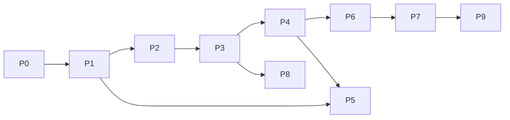

# ClerkshipOS — Platform Architecture & Product Blueprint
**The configurable platform for medical clerkships. Shared evidence-based curriculum, fully local customization, no code.**

Joshua Moss, MD | Psychiatrist · Architecture spec v1.0 · 2026-06-30

> **Working name:** *ClerkshipOS* (engine) — placeholder; branding alternatives in §12. Specialty-agnostic by design (§15); psychiatry is the first *curriculum pack*, not the product.

---

## How to read this document

This is the full architecture package — all 15 requested deliverables — grounded in an inventory of your existing Psychiatry Clerkship Library. The crown jewel is **§3 (the universal↔local data model and override-resolution engine)**; everything else serves it. If you read three sections, read §1 (vision), §3 (data model), and §14 (roadmap).

### Table of contents
0. [North Star & operating assumptions](#0-north-star--operating-assumptions)
1. [Product vision](#1-product-vision)
2. [Information architecture](#2-information-architecture)
3. [Data model — universal ↔ local](#3-data-model--how-universal-and-local-content-interact)
4. [Component hierarchy](#4-component-hierarchy)
5. [Database schema](#5-database-schema)
6. [Folder architecture](#6-folder-architecture)
7. [Admin dashboard design](#7-admin-dashboard-design)
8. [Configuration system](#8-configuration-system)
9. [Plugin / module architecture](#9-plugin--module-architecture)
10. [Technology stack](#10-technology-stack)
11. [Multi-institution deployment](#11-multi-institution-deployment-strategy)
12. [Branding & theming](#12-branding--theming-strategy)
13. [Migration plan](#13-migration-plan-your-site--the-platform)
14. [Phased roadmap](#14-phased-implementation-roadmap)
15. [Beyond psychiatry](#15-beyond-psychiatry--specialty-agnostic-expansion)
16. [Risk register](#16-risk-register)
17. [Open decisions & immediate next steps](#17-open-decisions--immediate-next-steps)

---

## 0. North Star & operating assumptions

**North Star:** *One evidence-based curriculum, maintained once, deployed to unlimited clerkships — each of which feels like it was built for that hospital, edited entirely by faculty who can't code.*

### What the inventory tells us (grounding, not theory)
Your current site is a **static file-based "card catalog"**: a numbered `00–14` taxonomy of ~924 assets (503 PDFs, 209 markdown READMEs, 24 single-file HTML tools, 50 podcast `.m4a`, decks), a hand-maintained `index.html` shell, and a `topic_meta.json` structured-metadata layer rendered by an SPA. Three patterns you already invented map *directly* onto the platform's core mechanics:

| You already built… | Which becomes the platform's… |
|---|---|
| `topic_meta.json` (`tldr`, `points[]`, `cant`, `ruleOut[]`, `quiz{}`, `cta{}`) | **Universal content-node schema** (§3, §8) |
| `14_Tracks/<audience>/` — "links only, no forked content" | **Overlay/override model** — generalized from *audience* to *institution* (§3) |
| APA cards "linked, not copied," with explicit `License:` field | **Reference-not-copy licensing model** (§3, §16) |
| `_note`: "AI-drafted… pending faculty attestation… no PHI" | **Review/attestation workflow + PHI firewall** (§7, §9-AI) |
| 24 single-file HTML tools (React 18 UMD, "Clinical Warm") | **First-class `Tool` content type / module** (§9) |

The platform is therefore not a rewrite of your thinking — it's a **generalization of patterns you've already validated**, given a config layer, an admin UI, and multi-tenancy.

### Assumptions (stated so you can correct them)
1. **Adoption profile:** clerkship directors with little/no technical skill; one or two technical maintainers (you, initially) for the shared core. Admin must be *no-code*.
2. **Two overlay dimensions, not one.** Content varies by **institution** *and* by **audience track** (MS3, Sub-I, resident, nursing, SW, family). The engine treats both as overlays composed over a single canonical core (§3). This is the single most important architectural decision and it falls straight out of your existing `14_Tracks` model.
3. **Phased hosting.** Phase 1 ships as **git-based static multi-tenant** (matches your current Netlify static deploy, near-zero ops). Phase 2 introduces a **hosted DB-backed control plane** (Supabase) once ≥2 external institutions and per-user features (progress, SSO) are needed. The data model is designed so the *same content contracts* survive that transition — you don't re-model, you add a persistence backend.
4. **Content stays reference-first.** Copyrighted third-party assets (APA PDFs, textbooks, paywalled videos) are **linked with license metadata, never redistributed** — exactly your current discipline. The platform stores *pointers + license*, not bytes, for those.
5. **AI is a curriculum tool, not a charting tool.** AI features operate over **de-identified curriculum content only**. A hard PHI firewall (§9-AI, §16) is a product requirement, not a setting.
6. **Effort estimates** assume **one developer + AI pair-programming** (your working mode), not a team. They're compressed accordingly and flagged as ranges.

---

## 1. Product vision

### 1.1 One-paragraph pitch
ClerkshipOS is the "Squarespace for clerkships." A shared, faculty-attested, evidence-based core curriculum (interviewing, DSM disorders, psychopharmacology, emergencies, landmark papers, board review) is maintained centrally and inherited by every deployment. Each institution overlays its own identity, people, schedules, workflows, and local resources through a no-code admin console — without ever forking or editing the core. AI teaching actions ("explain this," "quiz me," "teach at intern vs. attending level") are available on every content node. The whole thing deploys to Netlify/Vercel in minutes and works offline on the wards.

### 1.2 Who it's for (and the job each hires it to do)
| Persona | Primary job-to-be-done | Key surfaces |
|---|---|---|
| **MS3 / learner** | "Tell me what to do on the unit today and help me pass the shelf." | Pocket guide, daily schedule, topic pages, quizzes, AI tutor |
| **Clerkship director** | "Stand up a great rotation site for *my* hospital without IT." | Admin console, config, branding, schedule builder |
| **Faculty / attending** | "Surface my resources; attest content is accurate." | Faculty module, attestation workflow, upload |
| **Resident / chief** | "Run teaching and onboard students fast." | Teaching scripts, call module, tracks |
| **Core curriculum maintainer (you)** | "Improve the shared body once; everyone benefits." | Content repo, editorial board, versioned releases |
| **Coordinator** | "Keep schedules, contacts, FAQs current." | Lightweight admin (schedules, announcements, FAQ) |

### 1.3 Product principles
1. **Inherit, don't fork.** Local customization is *overlay*, never a copy. Core upgrades flow downstream automatically unless explicitly overridden.
2. **No-code by default; pro-code by escape hatch.** 95% editable in the admin UI; power users can still drop in a single-file HTML tool or raw MDX.
3. **Content is data, not pages.** Every teaching unit is a typed node with frontmatter, tags, objectives, and AI context — renderable in many surfaces (topic page, pocket card, quiz seed, AI context).
4. **Config over code.** Institutions differ only by data (config + content + assets). The codebase is identical across all deployments.
5. **Evidence-anchored & attested.** Clinical claims cite sources; faculty attestation status is first-class metadata (you already track this).
6. **PHI-free, FERPA-aware.** Never a system of record for patient data; cautious with student data (§16).
7. **Offline-first on the wards.** Hospital Wi-Fi is hostile; the learner experience is a PWA that works without signal.
8. **Accessible (WCAG 2.1 AA).** Medical schools are Section 508 / ADA environments; accessibility is a gate, not a polish step.

### 1.4 What success looks like (measurable)
- A second institution stands up a branded, populated deployment in **< 1 day** with no developer involvement.
- A core-curriculum update (e.g., revised suicide-screening guidance) propagates to **all** deployments on next publish, with institutions able to see a diff and re-attest.
- Learner: **zero dead links**, full content reachable offline, AI tutor on every node.
- Maintainer effort to add a *new specialty* is "author a curriculum pack," not "fork the app" (§15).

---

## 2. Information architecture

### 2.1 The two-plane model
Everything in the system belongs to one of two planes, which compose at render time:

- **Curriculum plane (universal):** specialty knowledge, shared across all deployments, versioned centrally. Your `00_START_HERE`, `02–09`, `11`, `12` largely live here.
- **Deployment plane (local):** institution identity, people, schedules, workflows, local resources. Your `13_Faculty_Resources` + the local half of `00`/`10` live here.
- **Overlays** (audience tracks, §3.4) sit *on top of* the curriculum plane and are themselves shareable or local.

### 2.2 Canonical navigation taxonomy
A specialty-agnostic top level (psychiatry labels in parentheses show the mapping from your current folders):

```
ClerkshipOS deployment
├── Start Here                 [plane: mixed]   (00_START_HERE)
│   ├── Orientation & "A Day on the Unit"
│   ├── Syllabus / objectives (core + local)
│   └── Week-0 checklist, badging, EMR access      ← local
├── Curriculum                 [plane: universal](01_Six_Week_Curriculum)
│   ├── Schedule of weeks/blocks (core arc; local dates)
│   └── Per-week: objectives · readings · skills · cases · reflection
├── Clinical Skills            [universal]       (02_Clinical_Skills)
│   ├── Interviewing · MSE · Formulation · Documentation
│   ├── Oral Presentation · Differential · Reflection/PIF
├── Core Topics                [universal]       (03_Core_Topics)
│   └── Mood · Psychosis · Anxiety · SUD · Personality · Geri · Perinatal · Neurodev
├── Acute & Safety             [universal]       (04_Acute_and_Safety)
│   └── Suicide · Violence · Agitation/Restraint · Capacity · Delirium · Catatonia
├── Pharmacology               [universal]       (05_Psychopharmacology)
├── Family & Relational        [universal]       (06_Family_and_Relational)
├── Evidence & Reading         [universal]       (07_Evidence_and_Reading)
│   └── Landmark library · Journal club · Guidelines · Book summaries
├── Cases & Simulation         [universal]       (08_Cases_and_Simulation)
├── Exam Prep                  [universal]       (09_Exam_Prep)
│   └── Shelf high-yield · OSCE stations
├── Patient & Family Education [universal]       (10) ← references, license-tagged
├── Hospital & Rotation        [plane: LOCAL]    (subsumes local 00 + 13)
│   ├── Faculty · Residents · Treatment team
│   ├── Daily schedule · Call · Rounds
│   ├── Workflows: Admit · Round · Family mtg · Discharge · Consult · Cross-cover
│   ├── EMR/Epic tips · SmartPhrases · Haiku · pagers · phone numbers
│   ├── Policies · Security · After-hours
│   └── Survival guide: maps · parking · dining · housing · transit · coffee
├── Media                      [universal+local] (12_Media)
│   └── Videos · Podcasts · Audiobooks   (local lectures = local)
├── AI & Prompts               [universal]       (11_AI_and_Prompts)
├── Assessment                 [universal+local] (quizzes, flashcards, practice exams)
├── Reference                  [universal]       (quick guides · drug cards · labs · scales)
└── Faculty (admin-gated)      [LOCAL]           (13_Faculty_Resources)
```

### 2.3 Three cross-cutting access patterns
Navigation isn't only the tree. Three orthogonal entry points (you already have all three in embryo):

1. **By track/audience** — `Tracks` overlay reorders/filters the tree for MS3 vs. resident vs. nursing (your `14_Tracks`).
2. **By time** — "Today on the unit" / Week N view assembles the relevant slice (schedule × topics × tasks).
3. **By search & tags** — full-text + tag facets (`hy` high-yield, body-system, week, skill, audience, attestation-status).

### 2.4 URL & routing scheme
```
/                                  Home (track-aware dashboard)
/start                             Orientation
/curriculum/week-3                 Time view
/topics/delirium                   Content node (universal, locally overlayable)
/skills/mse                        Content node + embedded Tool
/hospital/workflows/admission      Local content node
/hospital/faculty                  Local directory
/reference/drug-cards/clozapine    Reference node
/assess/quizzes/landmark-trials    Assessment
/admin/...                         Admin console (auth-gated)
```
Tenancy is resolved *before* routing (subdomain or build-time), so URLs are tenant-relative and identical across deployments — important for shareable deep links and for the offline cache.

---

## 3. Data model — how universal and local content interact

This is the heart of the platform. The model has three ideas: **content nodes**, **layered sources**, and a **resolution engine**.

### 3.1 The content node (universal unit)
Every teaching unit — a topic, skill, reading, drug card, quiz, tool, workflow — is a **ContentNode**: structured frontmatter + body (MDX) + typed metadata. Your `topic_meta.json` entry for `delirium.md` is already 80% of this schema.

```ts
// The universal contract every renderer, search index, and AI action speaks.
interface ContentNode {
  id: string;                    // stable slug, e.g. "topics/delirium"
  type: NodeType;                // 'topic'|'skill'|'reading'|'drugCard'|'quiz'|'tool'|'workflow'|'page'|'media'
  title: string;
  plane: 'universal' | 'local';  // where it's authored/owned
  taxonomy: string[];            // path(s) in the tree, e.g. ["acute-safety/delirium"]
  tags: string[];                // facets: 'high-yield','week-5','mood','osce'...
  audiences: AudienceId[];       // which tracks this is relevant to (empty = all)
  objectives?: LearningObjective[]; // mapped to competencies (ACGME/EPA/Shelf)
  evidence?: Citation[];         // anchored claims (your evidence discipline)
  attestation: {                 // first-class, from your `_note` pattern
    status: 'unreviewed'|'ai-drafted'|'faculty-attested'|'needs-review';
    reviewer?: string; date?: string;
  };
  body: MDXSource;               // prose; may embed <Tool/>, <Quiz/>, <Callout/>
  meta: TopicMeta | DrugMeta | QuizMeta | ToolMeta; // type-specific (your topic_meta shape)
  license?: LicenseRef;          // for reference-not-copy assets
  source: SourceRef;             // file path or DB row + content version
}
```

`TopicMeta` is **your existing schema, typed**:
```ts
interface TopicMeta {
  readMinutes: number;           // your `read`
  highYield: boolean;            // your `hy`
  tldr: string;
  points: string[];
  cantMiss: string;              // your `cant`
  ruleOut: string[];
  firstMove: string;
  quiz?: InlineQuiz;             // your `quiz{q,o[],why}`
  cta?: { label: string; href: string };
}
```

### 3.2 Layered sources (base + overlays)
The model borrows from **Kustomize/CSS-cascade/Docker-overlay** thinking. A rendered node is the composition of ordered layers:

```
RESOLVED NODE  =  CORE (universal base)
               ⊕  CORE-AUDIENCE overlay      (e.g., resident emphasis)   [optional]
               ⊕  INSTITUTION overlay        (local override/extend)     [optional]
               ⊕  INSTITUTION-AUDIENCE overlay(rarely needed)             [optional]
```
Each overlay declares a **policy** per node (this is the generalization of "links only, no forked content"):

| Policy | Effect | Example |
|---|---|---|
| `inherit` (default) | Use the layer below unchanged | Most topics, untouched locally |
| `extend` | Append local blocks/sections to core | Add "MGH clozapine order set" under the core clozapine card |
| `override` | Replace specific fields, keep the rest inheriting | Swap the `cta.href` to a local protocol; keep core prose |
| `prepend` / `append` | Insert local content before/after core body | Local attending note above a topic |
| `hide` | Suppress a core node locally | Hospital doesn't teach ECT module |
| `pin` | Freeze to a core version (don't auto-upgrade) | Lock guidance pending local re-attestation |
| `local` | Node exists only in this deployment | Parking, badging, call schedule |

Crucially, `override`/`extend` are **field-level and block-level**, not file-level — so when core improves the prose of `delirium`, an institution that only overrode `cta.href` still gets the improved prose. This is what makes "inherit, don't fork" actually hold over time.

### 3.3 The resolution engine
A pure function, identical in static (build-time) and hosted (request-time) deployments:

```ts
function resolveNode(id: NodeId, ctx: { tenant: TenantId; audience: AudienceId }): ResolvedNode {
  const layers = [
    core.get(id, ctx.audience?.coreOverlay),     // universal (+ optional audience emphasis)
    tenant.overlay.get(id),                        // institution layer
    tenant.audienceOverlay.get(id, ctx.audience),  // institution × audience (rare)
  ].filter(Boolean);
  return layers.reduce(applyPolicy, EMPTY);        // fold overlays per their policy
}
```



**Why this matters operationally:** the core team ships `core v13` with new suicide-screening guidance. Every deployment that left that node on `inherit` shows v13 immediately. Deployments that had `override`/`pin` get a **diff + re-attest** prompt in admin (§7) — they see exactly what changed and choose to adopt or keep their override. No merges, no forks, no broken sites.

### 3.4 The audience-track overlay (your `14_Tracks`, generalized)
A track is an overlay that mostly carries **ordering, filtering, and objective-emphasis**, not new prose:
```ts
interface Track {
  id: AudienceId;                 // 'ms3'|'subi'|'resident'|'cap'|'nursing'|'sw'|'family'
  label: string;
  nav: NavOverride;               // reorder/curate the tree (your "ordered list of links")
  visibility: Record<NodeId, 'show'|'hide'>;
  objectives: LearningObjective[];// track-specific (ACGME milestones for residents, EPAs for MS3)
  emphasis?: Record<NodeId, 'primary'|'optional'>;
}
```
Tracks are **shareable** (the MS3 track ships in core) or **local** (a hospital's bespoke "night-float" track). Same overlay machinery, different scope.

### 3.5 Asset & license model (reference-not-copy)
Binary/third-party assets are nodes too, but store **pointers + license**, not bytes (your APA pattern):
```ts
interface AssetRef {
  id: string; kind: 'pdf'|'video'|'audio'|'slide'|'link';
  storage: 'object-store' | 'external-url';   // own uploads vs. licensed externals
  url: string; license: 'public'|'cc-by'|'institution-owned'|'licensed-link-only'|'fair-use-link';
  attribution?: string; sourceUrl?: string;    // your "APA source:" + "License:" fields
}
```
The engine refuses to bundle/redistribute anything not `public`/`cc-*`/`institution-owned` — it links instead. This keeps copyright clean across unlimited deployments (§16).

### 3.6 Per-user data (Phase 2)
Learner-generated data lives **only** in the deployment plane, keyed by tenant + user: `bookmarks`, `notes`, `flashcards` (SRS state), `quizAttempts`, `progress`, `aiInteractions` (audit). None of it ever touches the curriculum plane, and none of it is PHI by policy. In Phase 1 these are `localStorage`/IndexedDB only (no backend); Phase 2 syncs them to Postgres with row-level security (§5, §11).

---

## 4. Component hierarchy

### 4.1 Layered architecture (concentric, not just a tree)
```
┌─ App Shell ─────────────────────────────────────────────┐
│  ThemeProvider · TenantProvider · AuthProvider · AIProvider│
│  Router · OfflineProvider(PWA) · SearchProvider           │
│  ┌─ Layout ──────────────────────────────────────────┐   │
│  │  TopBar(logo,search,track-switch,AI) · SideNav     │   │
│  │  ┌─ Route Outlet ──────────────────────────────┐  │   │
│  │  │  <ModuleHost> renders the active module      │  │   │
│  │  └──────────────────────────────────────────────┘  │   │
│  └────────────────────────────────────────────────────┘   │
└──────────────────────────────────────────────────────────┘
```

### 4.2 React component tree


### 4.3 Component design rules
- **Three reuse tiers:** `primitives/` (Button, Card, Tabs — themable via tokens) → `content/` (NodeView, MDXRenderer, EvidenceBadge — speak the ContentNode contract) → `modules/` (feature bundles, lazy-loaded, registered via the plugin API §9).
- **`NodeView` is the universal renderer.** Topic, skill, workflow, reference all render through one component driven by `ResolvedNode`. New node *types* add a `meta` panel + MDX components, not a new page.
- **`ToolFrame`** wraps your existing single-file HTML tools (sandboxed `<iframe>` or, where ported, a mounted React UMD component). Your 24 tools become content, not exceptions (§9.4).
- **`AIActionBar`** is rendered by `NodeView` for *every* node and receives that node's resolved context — so "Explain / Quiz me / Flashcards / Teach at level" exist everywhere by construction.
- **Everything themable** reads CSS variables (§12); no hard-coded colors in components.

---

## 5. Database schema

Two physical realizations of one logical model. **Phase 1 = files** (schema-as-frontmatter, no DB). **Phase 2 = Postgres/Supabase** with row-level security. The logical model is identical, so migration is additive.

### 5.1 Logical ERD (Phase 2)


### 5.2 Key tables (abridged DDL)
```sql
-- ── Control plane ──────────────────────────────────────────
create table tenant (
  id uuid primary key default gen_random_uuid(),
  slug text unique not null,              -- 'mgh-psych'  → mgh-psych.clerkshipos.org
  display_name text not null,
  curriculum_pack text not null,          -- 'psychiatry-core'  (→ §15 multi-specialty)
  core_channel text not null default 'stable', -- pin to a release channel
  theme jsonb not null default '{}',      -- brand tokens (§12)
  config jsonb not null default '{}',     -- institution config (§8)
  status text not null default 'active'
);

create table app_user (
  id uuid primary key default gen_random_uuid(),
  email citext unique not null,
  name text, sso_subject text             -- institutional SSO (OIDC/SAML)
);

create table membership (                 -- user ↔ tenant ↔ role
  tenant_id uuid references tenant(id),
  user_id uuid references app_user(id),
  role text not null,                     -- 'learner'|'faculty'|'coordinator'|'admin'|'owner'
  track text,                             -- default audience overlay for this user
  primary key (tenant_id, user_id)
);

-- ── Curriculum plane (read-mostly; mirrors the content repo) ─
create table core_release (
  id text primary key,                    -- 'psychiatry-core@13.2.0'
  pack text not null, semver text not null, channel text, published_at timestamptz
);
create table core_node (
  release_id text references core_release(id),
  node_id text not null,                  -- 'topics/delirium'
  type text not null, title text, taxonomy text[], tags text[],
  frontmatter jsonb not null,             -- TopicMeta etc.
  body_mdx text not null,
  attestation jsonb, evidence jsonb,
  primary key (release_id, node_id)
);

-- ── Deployment plane (per-tenant overlays & local content) ──
create table overlay (
  tenant_id uuid references tenant(id),
  node_id text not null,                  -- targets a core_node
  policy text not null,                   -- inherit|extend|override|hide|pin|prepend|append
  patch jsonb,                            -- field/block-level changes
  pinned_release text,                    -- for policy='pin'
  attestation jsonb,
  primary key (tenant_id, node_id)
);
create table local_node (                 -- institution-only content (parking, call, etc.)
  tenant_id uuid references tenant(id),
  node_id text not null, type text, title text, taxonomy text[], tags text[],
  frontmatter jsonb, body_mdx text, attestation jsonb,
  primary key (tenant_id, node_id)
);
create table asset (
  id uuid primary key, tenant_id uuid references tenant(id),
  kind text, storage text, url text, license text, attribution text, source_url text
);
create table enabled_module (
  tenant_id uuid references tenant(id), module_id text, config jsonb,
  primary key (tenant_id, module_id)
);

-- ── Structured local domains (could be modules over local_node, but
--    first-class tables make admin CRUD + validation easier) ──
create table person (tenant_id uuid, id uuid, role text, name text, title text,
  contact jsonb, photo_url text, bio text, primary key (tenant_id,id)); -- faculty/residents/team
create table schedule_event (tenant_id uuid, id uuid, kind text, title text,
  starts_at timestamptz, ends_at timestamptz, rrule text, location text, audience text[]);
create table announcement (tenant_id uuid, id uuid, body_md text, starts_at timestamptz, ends_at timestamptz);
create table faq (tenant_id uuid, id uuid, q text, a_md text, tags text[], order_idx int);
create table quiz (tenant_id uuid, id uuid, scope text, title text, node_id text); -- scope: core|local
create table question (quiz_id uuid, id uuid, stem text, options jsonb, answer int, rationale text, objective text);

-- ── Per-user learning data (Phase 2; localStorage in Phase 1) ─
create table attempt (tenant_id uuid, user_id uuid, quiz_id uuid, score numeric, detail jsonb, at timestamptz);
create table bookmark (tenant_id uuid, user_id uuid, node_id text, at timestamptz);
create table note (tenant_id uuid, user_id uuid, node_id text, body_md text, updated_at timestamptz);
create table flashcard (tenant_id uuid, user_id uuid, node_id text, front text, back text, srs jsonb); -- SM-2 state
create table progress (tenant_id uuid, user_id uuid, node_id text, status text, pct numeric, updated_at timestamptz);
create table ai_interaction (tenant_id uuid, user_id uuid, node_id text, action text, prompt_hash text, at timestamptz); -- audit, no PHI
create table audit_log (tenant_id uuid, actor uuid, action text, target text, diff jsonb, at timestamptz);
```

### 5.3 Tenant isolation (security)
Every tenant-scoped table carries `tenant_id`, and **Postgres row-level security** enforces it: `using (tenant_id = current_setting('app.tenant')::uuid)`. The app sets `app.tenant` from the resolved subdomain per request. The curriculum plane (`core_*`) is global-read, write-restricted to the editorial pipeline. This gives hard multi-tenant isolation without per-tenant databases (§11).

### 5.4 Phase-1 file equivalent
The same logical entities as files in the content/config repo (no DB):
```
core_node      → /packs/psychiatry-core/content/**/*.mdx (+ frontmatter)
overlay        → /tenants/<slug>/overlays/<node_id>.yml   (policy + patch)
local_node     → /tenants/<slug>/local/**/*.mdx
config_doc     → /tenants/<slug>/config/*.json            (§8)
person/...     → /tenants/<slug>/data/{faculty,schedule,faq}.json
assets         → object storage / external URLs (refs in front matter)
per-user data  → browser IndexedDB only
```
Search index, AI context, and rendering all consume the *resolved* node regardless of backend — so swapping files→Postgres changes the loader, not the app.

---

## 6. Folder architecture

A **monorepo** cleanly separates the engine (shared code), curriculum packs (shared content), and tenants (local data). This mirrors the universal/local split physically.

```
clerkshipos/
├── apps/
│   ├── web/                     # the learner SPA/PWA (Vite + React + TS)
│   │   ├── src/{app,layout,providers,routes}
│   │   └── vite.config.ts  pwa.config.ts
│   └── admin/                   # no-code admin console (can be routes in web/ early on)
├── packages/
│   ├── core-engine/            # resolveNode(), policy folding, tenancy, types
│   ├── content-kit/            # MDX components, NodeView, EvidenceBadge, AttestationBadge
│   ├── ui/                     # themable primitives (Button, Card, Tabs) — token-driven
│   ├── module-sdk/             # plugin contracts: defineModule(), slots, registry (§9)
│   ├── ai-actions/             # Explain/QuizMe/Flashcards/TeachAtLevel + PHI firewall
│   ├── schema/                 # Zod schemas → JSON Schema (config + frontmatter) (§8)
│   ├── search/                 # Pagefind (static) / Postgres-FTS adapter
│   └── config/                 # tenant config loader + validation
├── modules/                    # first-party feature modules (each self-contained, §9)
│   ├── topic/  schedule/  faculty/  quiz/  flashcards/  tool/
│   ├── workflow/  media/  podcast/  reference/  journal-club/
│   ├── glossary/  faq/  survival-guide/  board-review/  progress/
├── packs/                      # CURRICULUM PLANE (shared, versioned, PR-reviewed)
│   ├── psychiatry-core/
│   │   ├── pack.json           # id, semver, channel, taxonomy, modules, objectives map
│   │   ├── content/{topics,skills,acute,pharm,evidence,exam,...}/*.mdx
│   │   ├── tracks/{ms3,subi,resident,cap,nursing,sw,family}.yml
│   │   ├── assessment/*.json   # your quizzes.json, LM_master_index.json
│   │   └── tools/*.html        # ported single-file tools (content, not app code)
│   └── _template-pack/         # scaffold for a new specialty (§15)
├── tenants/                    # DEPLOYMENT PLANE (one folder per institution)
│   ├── _template-tenant/       # scaffold a new clerkship in minutes
│   └── mgh-psych/
│       ├── config/{institution,rotation,workflows}.json   (§8)
│       ├── theme/tokens.json + logo.svg + favicon         (§12)
│       ├── overlays/*.yml      # policy + patches over core nodes
│       ├── local/**/*.mdx      # parking, call, EMR tips, local lectures
│       └── data/{faculty,schedule,faq,announcements}.json
├── content-tooling/            # validators, link-checker, migration scripts (§13)
├── netlify.toml / vercel.json  # per-tenant build matrix (§11)
└── turbo.json / pnpm-workspace.yaml
```

**Why this shape:** a clerkship director only ever touches **one `tenants/<slug>/` folder** (and in Phase 2, never sees files at all — the admin writes here for them). Core maintainers only touch `packs/`. Engine devs only touch `packages/` + `modules/`. The three concerns never collide — which is exactly the Cowork↔Claude-Code worktree discipline in your CLAUDE.md, applied at repo scale.

---

## 7. Admin dashboard design

**Design goal:** a clerkship director or coordinator edits everything important in a forms-and-preview UI; they never see MDX, JSON, or git. The admin is generated *from schemas* (§8), so new config/modules get admin UI for free.

### 7.1 Admin IA
```
/admin
├── Dashboard          health: broken links, stale content, unattested nodes, pending core diffs
├── Brand Studio       logo, colors, font, density → live preview + WCAG contrast check (§12)
├── Setup              Institution · Rotation · Workflows config (form-driven, §8)
├── People             Faculty · Residents · Treatment team (CRUD, photos, contacts)
├── Schedule           Daily · Call · Rounds builder (calendar UI, recurrence)
├── Content
│   ├── Local pages    MDX-lite editor (rich text) for parking/EMR/workflows
│   ├── Overrides      browse core nodes → Inherit/Extend/Override/Hide + diff
│   └── Core updates   review incoming core changes → adopt or keep override (§3.3)
├── Media Library      upload PDFs/PPT/video/audio OR link external + license tag
├── Assessment         quizzes, question bank, flashcard decks
├── Announcements      time-boxed banners
├── FAQ                Q/A list with tags
├── Modules            enable/disable modules; per-module settings (§9)
├── Users & Roles      invite faculty/coordinators; set permissions
└── Publish            validate → preview → publish (build & deploy or DB commit)
```

### 7.2 Signature admin interactions
- **Override with diff.** Director opens a core topic, clicks *Customize* → chooses Extend (add a local block) or Override (edit a field). A side-by-side shows core vs. local. On the next core release, *Core updates* shows what changed beneath their override and offers one-click adopt/keep. This is the feature that makes "inherit, don't fork" usable by non-engineers.
- **Schedule builder.** Drag blocks onto a week grid; set recurrence (call every 4th night); assign to tracks. Writes `schedule_event` rows / `schedule.json`.
- **Media intake with license gate.** Upload prompts for a license; `licensed-link-only` forces "link, don't host," enforcing §3.5 in the UI so directors can't accidentally redistribute copyrighted PDFs.
- **Attestation queue.** Every AI-drafted or edited node lands in a "needs faculty attestation" list; an attending clicks *Attest* (records reviewer + date), flipping the `AttestationBadge` learners see. Directly productizes your `topic_meta` `_note`.
- **One-button publish.** Phase 1: triggers a Netlify build of that tenant. Phase 2: writes to Postgres, live immediately. Either way the director sees "Preview" before "Publish."

### 7.3 Roles & permissions
| Role | Can |
|---|---|
| **Owner** (clerkship director) | everything incl. branding, modules, users, publish |
| **Admin** (co-director) | content, schedule, people, publish |
| **Faculty** | attest content, upload own resources, add local notes |
| **Coordinator** | schedule, announcements, FAQ, people |
| **Learner** | read; own bookmarks/notes/flashcards/progress |
| **Core editor** (cross-tenant) | edit curriculum packs via the editorial pipeline only |

---

## 8. Configuration system

Config is **typed, validated, and self-describing**: one Zod schema per config domain is the single source of truth that (a) validates the data, (b) generates the admin form, and (c) types the app. No hand-written admin forms; no drift between schema and UI.

### 8.1 The three config documents (your requested shape, typed)
```ts
// tenants/<slug>/config/institution.json
const InstitutionConfig = z.object({
  name: z.string(),
  shortName: z.string().optional(),
  logo: assetRef, favicon: assetRef.optional(),
  theme: ThemeTokens,                       // §12
  description: z.string(),
  programDirector: personRef, clerkshipDirector: personRef,
  coordinator: personRef.optional(),
  rotationLengthWeeks: z.number().int(),
  emr: z.enum(['epic','cerner','meditech','other']).optional(),
  callExpectations: z.string().optional(),
  emergencyNumbers: z.array(z.object({ label:z.string(), number:z.string() })),
  domains: z.object({ subdomain: z.string(), customDomain: z.string().optional() }),
});

// tenants/<slug>/config/rotation.json  — per-week curriculum config
const RotationConfig = z.object({
  weeks: z.array(z.object({
    n: z.number(), title: z.string(), dates: dateRange.optional(),
    objectives: z.array(objectiveRef),
    readings: z.array(nodeRef), videos: z.array(nodeRef), podcasts: z.array(nodeRef),
    quizzes: z.array(nodeRef), assignments: z.array(z.string()),
  })),
  tracksEnabled: z.array(audienceId),
  defaultTrack: audienceId.default('ms3'),
});

// tenants/<slug>/config/workflows.json — local clinical workflows
const WorkflowConfig = z.object({
  admissions: workflowDoc, rounds: workflowDoc, familyMeetings: workflowDoc,
  discharges: workflowDoc, consults: workflowDoc, crossCover: workflowDoc,
  weekend: workflowDoc, afterHours: workflowDoc,
}); // workflowDoc = { summary, steps[], contacts[], smartPhrases[], localPdfs[] }
```

### 8.2 Schema → admin form (one mechanism)
```ts
const jsonSchema = zodToJsonSchema(InstitutionConfig);
// → <AutoForm schema={jsonSchema}/> renders labeled inputs, validation, help text.
```
A new field added to a Zod schema appears in the admin automatically. This is how the platform stays no-code *as it grows*: features ship schemas, admin UI is generated.

### 8.3 Resolution & precedence
At load: `defaults (pack) → institution config → rotation config → runtime (track, user prefs)`. Missing values fall back to pack defaults, so a half-configured tenant still renders a complete site (graceful degradation — important for fast onboarding).

### 8.4 Frontmatter is config too
Content frontmatter uses the same Zod→validate pipeline (`TopicMeta`, `DrugMeta`…), so authoring errors are caught at build/commit (`content-tooling/validate`), exactly like your current QA reports but enforced.

---

## 9. Plugin / module architecture

Everything that adds a feature is a **module** — a typed, self-contained package (think VS Code extension or WordPress plugin, but schema-validated). Core ships first-party modules; institutions enable/disable them; future authors (you, or third parties) add new ones without touching the engine.

### 9.1 The module contract
```ts
interface ClerkshipModule {
  id: string;                       // 'schedule', 'flashcards', 'journal-club'
  version: string;
  title: string; icon: IconRef;
  // Capabilities the module declares (engine validates & wires these):
  routes?: RouteDef[];              // pages it adds
  nav?: NavEntry[];                 // sidebar/menu entries (slot-based, §9.3)
  nodeTypes?: NodeTypeDef[];        // new ContentNode types + their meta schema + renderer
  configSchema?: ZodSchema;         // its settings → admin form auto-generated (§8.2)
  adminPanels?: AdminPanelDef[];    // custom admin UI if forms aren't enough
  aiActions?: AIActionDef[];        // register node-level AI actions (§9.5)
  slots?: SlotContribution[];       // inject into dashboard cards, node action bars, search
  search?: SearchProvider;          // contribute documents to global search
  permissions?: PermissionDef[];    // roles/capabilities it introduces
  migrations?: Migration[];         // DB/content migrations (Phase 2)
  dependsOn?: string[];             // other module ids
}
export function defineModule(m: ClerkshipModule): ClerkshipModule { return m; }
```

### 9.2 Registration & lifecycle
```ts
// modules are discovered, validated against the contract, topologically sorted by dependsOn,
// then lazy-mounted. Tenants toggle them via enabled_module / config.
const registry = createRegistry([topicModule, scheduleModule, quizModule, toolModule, /*…*/]);
registry.validate();                 // schema + dependency check at build
<ModuleHost registry={registry} enabled={tenant.modules} />
```
Modules are **lazy-loaded** by route, so disabling a module (or simply not enabling it) removes its weight from the bundle for that tenant.

### 9.3 Extension via slots (open/closed principle)
The shell exposes named **slots**; modules contribute without the shell knowing about them:
- `slot:home.cards` — dashboard widgets (e.g., "Today on the unit," "Due flashcards")
- `slot:node.actions` — buttons on every NodeView (AI actions register here)
- `slot:nav.primary` / `slot:nav.utility` — navigation entries
- `slot:search.providers` — search sources
- `slot:admin.sections` — admin console sections

Adding a feature = shipping a module that fills slots. The engine never changes.

### 9.4 Your single-file HTML tools as a module
Your 24 "Clinical Warm" tools (MSE builder, CIWA/COWS, C-SSRS, capacity, violence risk…) become **content of type `tool`**, served by the first-party `tool` module:
```ts
// pack frontmatter for a tool node
{ type:'tool', id:'tools/mse-builder', title:'MSE Builder',
  meta:{ embed:'iframe', src:'tools/mse-builder.html', height:'auto',
         theme:'inherit'/* receive token CSS vars */, aiContext:'mental status exam' } }
```
- Zero rewrite to ship: `ToolFrame` sandboxes the existing HTML in an `<iframe>`, passes theme tokens via CSS custom properties, and exposes a tiny `postMessage` bridge so a tool can request an AI action or report completion to `progress`.
- Optional later: port a tool to a React UMD component for tighter theming/state — but it's never required. This respects your global preference (single-file HTML, React 18 UMD, no Babel) by making it a *first-class content path*, not a workaround.

### 9.5 AI as a module-extensible capability (with PHI firewall)
AI actions are **registered capabilities**, not hard-coded buttons. Each receives the **resolved node context** + a teaching level:
```ts
interface AIActionDef {
  id: 'explain'|'summarize'|'quiz'|'flashcards'|'ddx'|'practice-case'|'teach-at-level';
  label: string;
  appliesTo: (n: ResolvedNode) => boolean;     // e.g., ddx only on topic/skill nodes
  buildPrompt: (n: ResolvedNode, opts: { level: 'student'|'intern'|'attending'|'shelf' }) => Prompt;
}
```
- **Context source = resolved curriculum content for this tenant** (RAG over the deployment's own resolved nodes), so "Explain this diagnosis" reflects *that hospital's* overlays.
- **PHI firewall (product requirement, from your CLAUDE.md gate):** AI inputs are curriculum nodes and user-typed questions; the UI carries a persistent "Don't paste patient information" guardrail, client-side PII pattern detection warns before send, and `ai_interaction` logs **hashes/metadata only — never raw content or PHI**. The platform is never a system of record for patient data.
- **Provenance:** AI output is labeled "AI-generated — not yet faculty-attested," routing to the attestation queue (§7.2) if an editor promotes it into content. Evidence-anchored answers cite the node's `evidence[]`.
- **Pluggable provider:** an `AIProvider` abstraction (Anthropic by default) so institutions can bring their own key/endpoint or disable AI entirely for policy reasons.

### 9.6 Module catalog (v1 first-party)
`topic` · `schedule` · `faculty/people` · `workflow` · `quiz` · `flashcards` · `tool` · `media` · `podcast` · `reference/drug-cards` · `journal-club` · `glossary` · `faq` · `survival-guide` · `board-review` · `progress` · `bookmarks` · `notes` · `search` · `ai-tutor`. Each maps to a node type and/or a local-data domain you already have content for.

---

## 10. Technology stack

Chosen for: non-expert maintainability, static-first → SaaS continuity, offline, accessibility, and cheap deploys. **The platform is a proper Vite/TS build**; your single-file HTML tools remain a supported *content* path (§9.4) — the two coexist.

| Layer | Choice | Why (vs. alternatives) |
|---|---|---|
| **Language** | TypeScript (strict) | Types are the contract between core/local/modules; catches authoring + config errors |
| **UI** | React 18 | Your existing skill; huge ecosystem; UMD tools embed cleanly |
| **Build/dev** | Vite | Fast, simple, first-class PWA + MDX plugins (vs. Next.js: avoid SSR server cost in Phase 1; can adopt later for SEO) |
| **Routing** | React Router (data routers) | SPA + nested layouts; static-export friendly |
| **Styling** | Tailwind + CSS custom properties | Tokens drive theming per tenant (§12); utility speed; small CSS |
| **Content** | MDX + frontmatter | Prose + embedded `<Tool/>`, `<Quiz/>`, `<Callout/>`; git-reviewable; matches your markdown corpus |
| **Validation** | Zod → JSON Schema | One schema = validation + admin form + types (§8) |
| **Server state** | TanStack Query | Caching, offline, background refresh (Phase 2 APIs) |
| **Client state** | Zustand | Light; track switch, UI prefs |
| **Search** | Pagefind (static, Phase 1) → Postgres FTS / Typesense (Phase 2) | Pagefind indexes at build, runs fully client-side & offline — perfect for static multi-tenant |
| **Offline/PWA** | vite-plugin-pwa + Workbox; IndexedDB (Dexie) | Ward Wi-Fi is hostile; precache resolved content + assets; user data offline |
| **Backend (Phase 2)** | Supabase (Postgres + Auth + Storage + RLS) | Multi-tenant via RLS without per-tenant DBs; auth incl. SSO; storage for uploads; minimal ops |
| **Auth** | Supabase Auth → SAML/OIDC (institutional SSO) | Phase 1 can be public or password; SSO when institutions require it |
| **AI** | Anthropic API via server proxy (`ai-actions`) | Keys server-side; provider-pluggable; firewall + logging in one place |
| **Editor (admin)** | TipTap/MDX-lite + AutoForm (rjsf) | Rich-text for non-coders; schema-driven forms |
| **Hosting** | Netlify (primary) / Vercel | Your current host; per-tenant builds; instant rollbacks; preview deploys |
| **CI/content QA** | GitHub Actions: validate frontmatter, link-check, a11y (axe), Lighthouse, build matrix | Automates your existing manual QA/dedupe reports |
| **Monorepo** | pnpm workspaces + Turborepo | Engine/packs/tenants separation (§6); cached builds |

**Deliberately deferred:** Next.js/SSR (add only if public SEO matters), a heavyweight CMS (the schema-driven admin replaces it), native mobile (PWA covers ward use; wrap later with Capacitor if needed).

---

## 11. Multi-institution deployment strategy

Three maturity stages. The data contracts (§3, §8) are identical across all three, so moving up a stage is additive, never a rewrite.

### 11.1 Stage A — Static multi-tenant (Phase 1, ship first)
One repo; each tenant is a folder; a **build matrix** produces one static site per tenant.

- **Tenant = subdomain** (`mgh-psych.clerkshipos.org`) or a fully custom domain (`psychclerkship.mgh.edu`) via CNAME.
- **Resolution at build time:** each build injects its `tenant` + resolves nodes → static HTML + Pagefind index + PWA cache. No server, no per-request tenant logic, near-zero cost, trivially scalable, offline by default.
- **Updates:** push to `packs/` → CI rebuilds all tenants (or only changed ones via Turbo). A tenant editing `tenants/<slug>/` rebuilds just that site. Git-based admin (Decap/TinaCMS) lets non-coders edit via a UI that commits for them.
- **Limit:** no per-user accounts/SSO/cross-device sync (user data is local-only). Fine for an open teaching site; insufficient when institutions want rosters, progress, or gated content → Stage B.

### 11.2 Stage B — Hosted control plane (Phase 2)
One deployed app (Vercel/Netlify functions or a small Node service) + Supabase. **Tenant resolved at request time** from the subdomain; RLS isolates data.

- **Onboarding becomes self-serve:** create tenant row → pick curriculum pack → brand → invite faculty. No build needed; live immediately.
- **Adds:** accounts, institutional SSO, progress/flashcards sync, gated content, analytics, in-app override-diff review against new core releases.
- **Core content** still authored as packs in git, *published* as immutable `core_release` rows; tenants subscribe to a channel (`stable`/`beta`) and adopt releases on their schedule (§3.3).

### 11.3 Stage C — Self-serve SaaS (later)
Marketing site + signup + billing + tenant provisioning automation + status page. Same app; adds a thin provisioning/billing layer. Only pursue if you productize externally (§15, §17).

### 11.4 Release & versioning model
- **Curriculum packs are semver'd** (`psychiatry-core@13.2.0`) on channels (`stable`/`beta`). Tenants pin a channel; breaking taxonomy changes are major versions with a migration note.
- **Engine** is versioned independently; modules declare a compatible engine range.
- **Tenants** never pin engine; they always run latest engine + their chosen pack channel. This separation means you can improve the app for everyone without touching content, and improve content without redeploying the app (Stage B).

---

## 12. Branding & theming strategy

**Goal:** each hospital looks like itself with zero code — and can't produce an inaccessible result.

### 12.1 Design tokens over CSS variables
All visual decisions are **tokens** exposed as CSS custom properties on `:root`, consumed by Tailwind and every component. A tenant ships a `theme/tokens.json`; the `ThemeProvider` injects them at runtime (Stage B) or at build (Stage A).
```jsonc
// tenants/mgh-psych/theme/tokens.json
{
  "brand":   { "primary": "#1a3a6b", "accent": "#c8102e" },
  "neutral": "slate",                       // ramp preset → generates 50–950
  "logo": "logo.svg", "favicon": "favicon.svg", "wordmark": "MGH Psychiatry",
  "font":   { "sans": "Inter", "display": "Inter" },
  "radius": "md", "density": "comfortable", // 'compact' for data-dense
  "mode":   "system"                        // light | dark | system (your dark-mode.css generalizes here)
}
```
```css
:root{
  --color-primary: #1a3a6b; --color-accent:#c8102e;
  --color-bg: #fff; --color-fg:#0f172a; --radius:.5rem; /* …derived ramp… */
}
/* tailwind.config: colors.primary = 'var(--color-primary)' etc. */
```
Your existing **"Clinical Warm"** palette ships as the **default pack theme**, so an unconfigured tenant already looks like your current site.

### 12.2 Brand Studio (no-code, in admin §7)
- Pick primary/accent (or paste hex / brand guide), choose a neutral ramp, font, density, radius, logo upload, favicon, optional custom domain.
- **Live preview** of real pages as you edit.
- **WCAG contrast gate:** the picker computes contrast and **blocks** save (or warns + auto-suggests an accessible shade) if text/background fails AA — accessibility enforced at the source, not audited later. (This is your `design:accessibility-review` discipline, productized.)
- **Theme presets** (e.g., "Academic Navy," "Warm Clinical," "High-Contrast") for one-click starts.

### 12.3 What's themable vs. fixed
Themable: colors, logo/wordmark, fonts, radius, density, light/dark, hero copy, nav labels. **Not** themable: layout structure, component behavior, accessibility floors (focus rings, min target size, motion-reduction). This keeps every deployment usable and on-brand without letting a non-expert break UX.

### 12.4 Brandable product names (pick later, §17)
Working name *ClerkshipOS*. Alternatives that stay specialty-agnostic for §15: **Rotation**, **Preceptor**, **Clerk**, **Rounds**, **Lumen Clerkship**, **WardLink**. (Keep "RSS/ReConnect" internal-only per your external-naming convention.)

---

## 13. Migration plan: your site → the platform

Your library is unusually migration-ready because it's already a structured card-catalog with a metadata layer, an overlay (tracks) pattern, and reference-not-copy licensing. The migration is mostly **classification + frontmatter normalization**, not rewriting. Your site becomes **the first tenant** (`tenants/mosshealth-psych/`) over **the first pack** (`packs/psychiatry-core/`), which proves the model before any second institution.

### 13.1 Step 0 — Classify every asset (universal vs. local)
Run a classification pass over the 924 assets. Rubric:

| Signal → | **Universal (→ pack)** | **Local (→ tenant)** |
|---|---|---|
| Folder | `02–09`, `11`, `12` (shared), `00` orientation theory | `13_Faculty_Resources`, local half of `00` (badging, EMR, parking), local lectures in `12` |
| Nature | DSM, pharmacology, landmark papers, OSCE, skills | people, schedules, call, workflows, policies, maps |
| Reusability | true at any hospital | true only here |
| Licensing | author-owned or `cc` | n/a |

Deliverable: a `migration/classification.csv` (your `_FILL_MANIFEST.csv` is the seed) with `path, proposed_node_id, type, plane, policy, license, attestation` — reviewable in a spreadsheet before anything moves. **This is the one step worth doing carefully**; everything downstream is mechanical.

### 13.2 Step 1 — Stand up the skeleton
Scaffold the monorepo (§6), `core-engine`, `content-kit`, `topic` + `tool` + `schedule` + `faculty` modules, and the `_template-pack` / `_template-tenant`. Ship the "Clinical Warm" default theme. Wire Pagefind + PWA. Outcome: an empty but deployable shell.

### 13.3 Step 2 — Port universal content → `psychiatry-core`
- **Markdown topics → MDX nodes.** Your 209 `.md` READMEs/topics get normalized frontmatter. `topic_meta.json` is **mechanically transformed** into per-node frontmatter (`read→readMinutes`, `hy→highYield`, `cant→cantMiss`, `quiz→meta.quiz`, `cta→meta.cta`). A script does this in one pass — the schema already matches (§3.1).
- **Tools → `tool` nodes.** The 24 HTML tools copy into `packs/psychiatry-core/tools/`; each gets a one-line `tool` frontmatter node (§9.4). No rewrite.
- **Assessment JSON** (`quizzes.json`, `LM_master_index.json`, landmark trials) → `quiz`/`reading` nodes via adapters.
- **Tracks → `tracks/*.yml`.** Your `14_Tracks` link-lists convert to Track overlays (§3.4) — MS3 default, others as emphasis/visibility overlays.
- **Licensed references** (APA cards) → `AssetRef` with `license:'licensed-link-only'` + `sourceUrl` — preserving "linked, not copied" exactly.

### 13.4 Step 3 — Build the first tenant
- Extract local content (badging, EMR/Epic tips, parking, call, faculty, workflows) into `tenants/mosshealth-psych/` config + local nodes.
- Author `institution.json`, `rotation.json` (your six-week arc), `workflows.json`.
- Apply your real branding tokens.

### 13.5 Step 4 — Validate, attest, deploy
- Run `content-tooling`: frontmatter validation, link-checker (kills your dead-link risk), a11y + Lighthouse in CI. This automates your manual `_QA_REPORT.md` / `_DEDUPE_REPORT.md`.
- Faculty attestation pass on AI-drafted nodes (flips badges).
- Deploy the first tenant to Netlify. **Now your existing site is running on the platform** with no feature loss.

### 13.6 Step 5 — Prove reusability (the real test)
Stand up a **second, synthetic tenant** (`tenants/_demo-university/`) from the same pack: new brand, fake faculty/schedule, a couple of overrides and a `hide`. If it takes < 1 day and touches no engine code, the platform thesis is proven. Then onboard a real pilot partner.

### 13.7 Migration risks & mitigations
| Risk | Mitigation |
|---|---|
| Mis-classification (local content leaks into core) | Spreadsheet review gate (13.1); `plane` is explicit per node; CI lint flags local-only terms in pack |
| Frontmatter drift across 200+ files | Zod validation in CI fails the build on bad frontmatter |
| Tool theming/iframe quirks | Ship `ToolFrame` token bridge in Step 1; tools stay functional even un-themed |
| Licensed PDFs accidentally bundled | License gate refuses to host non-owned assets (§3.5, §7.2) |
| Scope creep (rebuild everything) | Migration = port + classify; *no* content rewriting in this phase |

---

## 14. Phased implementation roadmap

Effort assumes **one developer + AI pair-programming** (your mode), in **build-weeks** (focused effort, not calendar). Treat as ranges; the dependencies matter more than the absolute numbers.

| Phase | Milestone (exit criteria) | Key work | Depends on | Effort |
|---|---|---|---|---|
| **0 · Foundations** | Monorepo builds; types + Zod schemas compile; CI green | pnpm/Turbo, `schema`, `core-engine` (`resolveNode`), CI skeleton | — | 1–2 wk |
| **1 · Render core** | A core topic renders via `NodeView` from MDX+frontmatter; theme tokens live | `content-kit`, `ui` primitives, `topic` module, ThemeProvider, MDX pipeline | 0 | 2–3 wk |
| **2 · Tools + tracks** | 24 tools embedded; MS3 track switches nav | `tool` module + ToolFrame bridge; Track overlay engine | 1 | 1–2 wk |
| **3 · Migrate your site** | Your library runs as tenant #1, no feature loss; dead-link-free | classification (13.1), `topic_meta`→frontmatter script, local extraction, Pagefind, PWA | 1,2 | 2–3 wk |
| **4 · No-code admin (git-based)** | Director edits content/schedule/people/brand via UI; publish = build | Decap/Tina or AutoForm admin, Brand Studio + WCAG gate, override-diff UI | 3 | 3–4 wk |
| **5 · AI layer** | Explain/Quiz/Flashcards/Teach-at-level on every node; PHI firewall + attestation routing | `ai-actions`, AI proxy, RAG over resolved nodes, guardrails | 1 (3 for content) | 2–3 wk |
| **6 · Prove reusability** | 2nd synthetic tenant stood up < 1 day; pilot partner onboarded | `_template-tenant`, onboarding checklist, docs | 3,4 | 1–2 wk |
| **7 · Hosted control plane** | Accounts, SSO, progress sync, in-app core-update review | Supabase + RLS, Auth/SSO, TanStack Query sync, migrate file→DB loader | 4,6 | 4–6 wk |
| **8 · 2nd specialty pack** | A non-psych pack renders on the same engine (§15) | `_template-pack`, specialty node types, editorial governance | 3 | 3–5 wk/pack |
| **9 · SaaS (optional)** | Self-serve signup + billing + provisioning | marketing site, billing, provisioning automation | 7 | 4–6 wk |

**Critical path to value:** Phases 0→1→2→3 deliver *your site, better, on the platform* (~6–10 build-weeks). Phases 4–5 make it **adoptable by non-coders with AI** — the actual product. Phase 7 is the gate to true SaaS; don't start it until a real second institution wants accounts.

**Dependency graph (compressed):**


**Suggested first three issues (do this week):** (1) scaffold monorepo + `core-engine.resolveNode` with unit tests for every overlay policy; (2) write the `topic_meta.json → frontmatter` transformer against your real file; (3) render `delirium` end-to-end through `NodeView`. Each is a self-contained, demoable win.

---

## 15. Beyond psychiatry — specialty-agnostic expansion

The architecture is **already specialty-agnostic**; psychiatry is just the first pack. Going multi-specialty requires *no engine changes* — it requires **separating the engine from curriculum packs** (done in §6) and standing up per-specialty content + governance.

### 15.1 What's shared vs. specialty-specific
| Universally shared (engine + cross-specialty modules) | Per-specialty (a pack) |
|---|---|
| Resolution engine, overlays, tracks, admin, branding, AI layer, PWA, search | The curriculum content nodes |
| `schedule`, `faculty`, `workflow`, `survival-guide`, `faq`, `media`, `announcements` modules (every clerkship has these) | Specialty taxonomy + objectives map (Shelf/EPA/ACGME) |
| Node types: `topic`, `skill`, `reading`, `quiz`, `tool`, `drugCard` | Specialty node-type *extensions* (e.g., `procedure` for Surgery, `OMM` for FM, `ECG` for IM/EM) |

**Insight:** the entire **Hospital & Rotation** plane (schedules, people, workflows, survival guide, EMR tips) is *identical across specialties* — a surgery clerkship needs parking and Epic tips just like psychiatry. That whole plane is built once and reused, so each new specialty only authors its *Curriculum plane*.

### 15.2 The curriculum pack as the unit of expansion
```
packs/
├── psychiatry-core/      (shipped)
├── internal-medicine-core/
├── family-medicine-core/
├── pediatrics-core/
├── surgery-core/         (+ adds 'procedure' node type via a pack module)
└── emergency-medicine-core/
```
A pack declares its taxonomy, objective framework, tracks, modules, and node-type extensions in `pack.json`. A tenant selects a pack (`tenant.curriculum_pack`) — or **multiple**, for combined clerkships or a med-school-wide deployment hosting every rotation under one brand.

### 15.3 Specialization without forking the engine
New specialty needs a new node type? Ship it **as a pack-scoped module** (§9): `surgery-core` includes a `procedure` module that registers the `procedure` node type, its meta schema (indications, steps, complications, CPT), its renderer, and its AI actions ("quiz me on the steps"). The engine stays untouched; the capability travels with the pack.

### 15.4 Governance (the real bottleneck, not the tech)
The hard part of multi-specialty isn't code — it's **medical accuracy at scale**. Recommendation: a per-specialty **editorial board** owning its pack's `stable` channel, with the attestation workflow (§7.2) as the quality gate, and a shared cross-specialty board owning the engine + shared modules. This is the same "edit source once; everyone inherits" discipline, applied to clinical governance.

### 15.5 Positioning
This is the platform play: **"the operating system for clinical clerkships."** Psychiatry proves it; Hospital & Rotation reuse makes each new specialty cheap; governance (not engineering) sets the pace. Per your external-naming convention, market it as clerkship infrastructure — specialty packs are the catalog.

---

## 16. Risk register

| # | Risk | Likelihood × Impact | Mitigation |
|---|---|---|---|
| R1 | **Students paste PHI into AI / notes** | Med × High | Hard PHI firewall (§9.5): persistent guardrail copy, client PII detection + block, log hashes only, no patient system-of-record; reinforce your CLAUDE.md gate in product |
| R2 | **Copyright on third-party media** (APA, textbooks, paywalled video) | High × High | Reference-not-copy enforced in schema + admin license gate (§3.5, §7.2); never bundle non-owned assets |
| R3 | **Medical-accuracy liability across institutions** | Med × High | Attestation status first-class + per-tenant; "educational, not clinical guidance" disclaimer; per-specialty editorial boards (§15.4); evidence anchoring |
| R4 | **Core update breaks/contradicts a local override** | High × Med | Field/block-level overrides (not file forks) + diff-and-re-attest flow (§3.3, §7.2); `pin` policy for safety-critical content |
| R5 | **FERPA / student-data privacy** (Phase 2 accounts) | Med × Med | Minimize stored student data; RLS isolation; SSO; data-retention policy; keep Phase 1 account-free where possible |
| R6 | **Accessibility/Section 508 non-compliance** (legal exposure for schools) | Med × High | WCAG AA gate in Brand Studio + axe/Lighthouse in CI (§12.2); accessibility floors non-themable |
| R7 | **Multi-tenant data leakage** | Low × High | Postgres RLS on every tenant table; tenant resolved server-side; isolation tests in CI |
| R8 | **Maintainer bus-factor / sustainability** (solo author) | High × High | Schema-driven admin reduces ongoing dev; editorial boards spread content load; open-core licensing could invite contributors (§17) |
| R9 | **Over-engineering / never shipping** | Med × High | Critical path P0–P3 ships your site first; defer Supabase/SaaS until a real 2nd institution needs it |
| R10 | **Adoption friction** (directors won't self-serve) | Med × Med | `_template-tenant` + onboarding checklist; presets; "looks complete when half-configured" (§8.3); white-glove the first 2 partners |
| R11 | **AI hallucination in teaching content** | Med × Med | Output labeled AI-generated → attestation queue before it becomes content; cite `evidence[]`; level-appropriate prompts |

---

## 17. Open decisions & immediate next steps

### 17.1 Decisions that change scope (your call — defaults proposed)
1. **Hosting ambition:** internal/regional teaching tool, or commercial SaaS? *Default:* build Phases 0–6 (git-based, your site + a pilot) before committing to Phase 7+. Decide at the Phase 6 gate.
2. **Content licensing of the core:** keep psychiatry-core private, or open-source it (CC-BY) to invite contribution and adoption? *Default:* private through pilot; revisit as a growth lever (mitigates R8).
3. **SSO timing:** needed only when an institution demands rosters/gated content. *Default:* defer to Phase 7.
4. **AI on by default?** Some programs may want it off for policy reasons. *Default:* on, provider-pluggable, per-tenant toggle.

> Per your follow-up rule, the single highest-leverage question if you want to narrow my next deliverable: **"Should I scaffold the actual Phase 0–1 codebase now (monorepo + `resolveNode` + render `delirium` end-to-end), or produce the editorial/governance spec for `psychiatry-core` first?"** Either is a clean next step; I've assumed you want this architecture doc first and can do either on your word.

### 17.2 Recommended next steps (proactive)
1. **Approve the universal/local classification rubric (§13.1)** and let me generate `migration/classification.csv` from your `_FILL_MANIFEST.csv` — the one high-judgment input.
2. **Greenlight the monorepo scaffold (Phase 0)** — I can stand up `core-engine.resolveNode` with full overlay-policy unit tests and the `topic_meta → frontmatter` transformer against your real `delirium.md`, rendering it end-to-end. That's a concrete, demoable proof in days.
3. **Lock a working name + default theme** (§12.4) so branding tokens are real from day one.
4. **Decide the Phase-6 gate metric** ("2nd tenant < 1 day, zero engine edits") as the go/no-go for SaaS investment.

### 17.3 What I can produce on request (reusable artifacts, ready to generate)
- The monorepo scaffold + `resolveNode` engine with tests.
- The `topic_meta.json → MDX frontmatter` migration script.
- `migration/classification.csv` from your existing manifest.
- A `pack.json` + `_template-pack` and `_template-tenant` scaffold.
- The Zod schema package (`InstitutionConfig`/`RotationConfig`/`WorkflowConfig`/`TopicMeta`) as real code.
- An onboarding runbook for a new clerkship director (no-code, step-by-step).

---

### Appendix A — Glossary
**Pack** = a shared, versioned curriculum (the universal plane for a specialty). **Tenant/Deployment** = one institution's instance (the local plane). **Overlay** = policy-driven local modification of a core node. **Track** = an audience overlay (MS3/resident/nursing…). **Node** = one typed content unit. **Resolution** = folding core + overlays into the rendered node. **Module** = a feature plugin. **Attestation** = faculty sign-off status on a node.

### Appendix B — Mapping your folders to the platform
`00→Start Here (mixed)` · `01→Curriculum (universal)` · `02–09,11,12→universal modules` · `10→universal, license-tagged` · `13→Hospital&Rotation/Faculty (local)` · `14_Tracks→Track overlays` · `99_Archive→pack version history`. `topic_meta.json→node frontmatter` · `index.html→generated home` · 24 HTML tools→`tool` nodes.

*End of architecture spec v1.0.*
