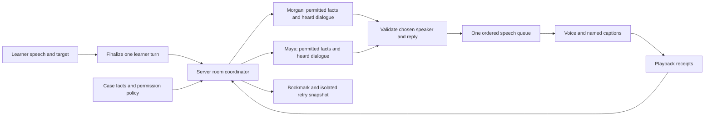

# Family Visit — spoken simulation plan and system design

Status: the first local Morgan/Maya runtime is implemented on September 5, 2026, as an unshipped draft pending faculty review. See [Family Visit setup and implementation limits](../../../_prototypes/sp-interview/FAMILY_VISIT.md). The design below includes later ideas as well as the implemented target selection, two ordered voices, private check-ins, interruption, and exact-moment retry. Spontaneous requests for the floor, persistent usage accounting, and “Same sentence, two perspectives” are not implemented. An actual microphone audition and faculty review remain separate from automated checks.

Builds on the current single-patient Interview Room. The first visit is an inpatient meeting with a patient and one family/support person, focused on a short practice segment rather than a full family therapy course. It is capped by ten learner turns, not a verified 8–10 minute duration.

## The experience

The learner enters a room with two people who care about the same situation but understand it differently. Each has a distinct voice, point of view, and limits. The learner sets a shared agenda, hears both perspectives, manages a difficult exchange, and closes with one realistic next step. Agreement is possible but never required for a successful practice encounter.

Start with **Morgan and Maya: “What happens after discharge?”** Morgan's new alcohol-use MI case supplies the patient baseline and identifies Maya only as Morgan's adult daughter and Sunday-breakfast connection. Maya's perspective, observations, consent, and private facts must be authored and reviewed separately; her being named in Morgan's case establishes none of them. Morgan lives alone, so the family scene must not imply that Maya shares Morgan's home, monitors Morgan there, or has witnessed a prior cycle.

The meeting is voluntary and occurs after medical stabilization. It does not simulate active intoxication, acute withdrawal, emergency capacity assessment, or a home detox plan. If the learner brings up a concern outside the scripted context, the scene can pause for a supervising-team discussion rather than inventing medical clearance.

Proposed tensions:

| Participant | What they want | What they fear | What must remain possible |
|---|---|---|---|
| Morgan | A say in what changes; less conflict; room to discuss alcohol without a label | Being shamed, overruled, or handed an all-or-nothing plan | Disagreeing, asking for privacy, considering a modest next step, or remaining uncertain |
| Maya | A chance to describe her own priorities once they are separately authored | Being assigned responsibility for monitoring another adult | Setting a limit, expressing care and concern together, and declining an unrealistic support role |
| Learner | Understand both perspectives and facilitate a useful conversation | Pressure to fix everything or side with one person | Slowing down, repairing a misstep, seeking supervision, and closing with unresolved issues honestly named |

These are authoring intentions, not observed clinical facts or psychological assessments. The final family case packet must specify actual events, consent boundaries, knowledge, and unknowns before live use.

## Visit flow

1. **Prepare.** A short case card identifies the people, reason for meeting, current clinical context, known permission limits, and learner role. A brief private check-in lets the patient confirm the agreed discussion scope. It is a separate channel, never part of the family's automatically shared transcript.
2. **Join and agree on an agenda.** The learner introduces their role and asks what each person wants from the time. Every finalized learner turn carries an explicit `targetRoleId` or `both`; the server validates it against the active room. Recognizing a name may suggest a target in the interface, but text alone never authoritatively routes a turn. An “Ask Morgan / Ask Maya / Ask both” control resolves ambiguity before submission.
3. **Explore the difference.** The actors respond to what was actually said. One person may disagree or ask to speak, but the system does not manufacture a fight every few turns or force reconciliation after a reflection.
4. **Find one workable next step.** The learner checks whose idea it is, what each person can realistically offer, and what still needs the treating team. Neither actor promises another person's cooperation, discharge, sobriety, treatment outcome, or confidentiality exception.
5. **Close and reflect.** Each person may give a brief summary. The learner names one useful moment and one moment to revisit. Feedback quotes actual dialogue and distinguishes observation from a possible interpretation. No grade, readiness rating, fluency score, or family-blame label.

Keep the current **4.5-second pause**, extra thinking time, **Space = done**, explicit interrupt, captions, repair, bookmark, and End controls. Thinking time belongs to the learner; silence is not scored. Avoid adding a permanently talking observer or putting coaching between every patient response.

## Recommended architecture

Use **one server conversation coordinator, with separate actor contexts and a single audio queue**. Reuse the existing case-grounded actor and speech pipeline. Avoid two continuously running voice agents: they would compete for the microphone, generate unheard material, and multiply costs during pauses.

The arrows describe alternatives, not an instruction to call both actors every turn. Usually only one actor is invoked. A response from the second person is a bounded continuation after the first speaker's delivery is known.

### Case and session contracts

| Record | Required information | Authority |
|---|---|---|
| `familyCase` | Version/hash, draft/review status, shared scenario facts, roles, learner goal, information limits, allowed scene phases, teaching links | Authored case; the model cannot edit it |
| `participant` | Stable role ID, display name, pronouns, voice profile, known facts, reported beliefs, private concerns, disclosure policy | Explicit inventory per person; no copying another person's private packet |
| `consentScope` | Who is present, what may be discussed, what is private, whether a private break was requested, and the scripted scope of the exercise | Server-owned scene state; not a blanket legal rule or a model inference of capacity |
| `roomState` | Phase, chosen addressee, pending request to speak, learner-turn counter, operation counter, segment counter, and active response-group reservation | Server coordinator |
| `roomEvent` | Immutable event ID, channel (`public`, `morgan-private`, or `maya-private`), audience role IDs, speaker, exact text or state transition, and delivery status | Server coordinator; append-only |
| `replySegment` | Encounter/branch ID, learner-turn ID, response-group ID, segment ID, role ID, exact text, audio status | Immutable once issued; ordered and validated |
| `deliveryReceipt` | Sentence segment completed, interrupted, failed, or uncertain; completed-segment count | Audio player plus server validation |
| `retrySnapshot` | Case version, role-partitioned permitted knowledge, consent-scope event history, completed heard segments, room state, target, and active budget policy at that moment | Isolated branch; original remains unchanged |

Maintain separate append-only event views for public dialogue, Morgan-private dialogue, and Maya-private dialogue. Each event names its audience. Private facts never enter the other actor's prompt or the shared caption stream merely because the case author knows them. A statement becomes shared only through a permitted, actually delivered public event. Consent changes are immutable server events with an effective position in the history, so a later permission cannot expose earlier private dialogue or alter a retry taken before that permission.

The first pilot uses the current sentence-segment receipt boundary: only a completed sentence segment is established as heard. An interrupted or uncertain sentence is omitted; playback duration is never used to estimate words. Word-level heard prefixes, `began` receipts, and alignment-based recovery remain outside this pilot until a trusted mechanism exists.

The coordinator routes turns and enforces limits; it does **not** diagnose family dynamics, infer consent from warmth, or convert a learner's wording into a clinical decision. In this first scene, permissions are deliberately simple and authored. Jurisdiction, institutional policy, safety exceptions, and substance-use record protections require separate review for any clinical workflow.

### Turn taking and natural interaction

- Require an explicit target on submission. Keep the current target visible and persistent; Space submits to that target without an extra click. Name recognition may suggest a change, while keyboard shortcuts or the target control let the learner choose Morgan, Maya, or both. The server validates the submitted role field, not a name guessed from transcript text. Include the target in request identity, duplicate detection, and retry state so “What did Maya say?” cannot be mistaken for a question addressed to Maya.
- Default to one respondent. “I'd like to hear from both of you” creates a queue of at most two, with a pause and interruption opportunity between speakers.
- A family member can request the floor without immediately taking it. Show “Maya would like to respond”; the learner can invite her, finish with Morgan, or pause the room.
- An explicitly invited second response uses the first person's **heard** words. Do not generate an argument against text that was cancelled or never played.
- Esc/Stop interrupts the current voice and clears all queued continuations. The next learner utterance determines where to go; no stale second speaker starts later.
- A speaker who is quiet stays present. Do not invent a rule that every participant speaks every other turn. A voluntary post-encounter prompt can ask whether the learner wanted to invite that perspective.
- Character reactions should be plausible but variable. Reflections may improve understanding without producing agreement; blunt questions need not automatically trigger anger.

### Latency and cost

Reuse the refined first-sentence delivery and streamed Marin/Cedar audio. Keep Morgan on Marin and audition Maya with Cedar; voice choice alone must not imply personality or clinical status. Pre-record only fixed openings. Live replies retain case grounding and context.

Use one actor request for most learner turns. Deterministic routing handles the submitted target; no routing model call is needed in the first pilot. Do not use speculative paid actor or speech requests while the learner is still thinking. After the learner finishes, prepare the next validated sentence while the preceding sentence plays, using the current interruption controls.

Measure `space/turn-finalized → actor first usable sentence → first audio bytes → first audible playback`. Record p50/p95 from the same synthetic scripts and machine, compare with today's single-patient baseline, and separate cached openings from live responses. An initial engineering target is first audible speech within roughly three seconds on the test network; it is an aspiration to measure, not a verified capability or a clinical timing standard.

Retain a 10-learner-turn audition limit. Keep learner turns, actor operations, and speech segments as separate counters. Before a `both` turn starts, atomically reserve the complete response group, including both actor calls and their bounded speech segments. If the allowance cannot cover the group, reject it before either actor runs; release unused reservations after a verified cancellation. Bind the target and response-group ID into the idempotency fingerprint so a duplicate submission cannot spend twice or create a second speaker queue. Add a request ledger with model, request identity, token/audio usage when returned, cancellations and uncertain completion. Keep content out of that ledger. Estimate session cost from a dated rate card and reconcile separately with provider billing; do not label estimates as exact account debits. End closes both actors, queued audio, retry branches, and reservations.

## Build packages and acceptance checks

| Step | Concrete deliverable | Must pass before moving on |
|---|---|---|
| 1. Author the room | Local draft Morgan/Maya packet and role-specific fixtures; check against the single-patient Morgan baseline | No implied cohabitation, invented observations or prior cycle, contradictory shared events, copied instrument, hidden mandatory “correct” ending, or fabricated review status |
| 2. Test the coordinator offline | New `family-visit-state.mjs` and deterministic fake actors; separate from the current single-patient controller | Explicit target validation, target-bound idempotency, “both” ordering and atomic reservation, insufficient-budget rejection before the first actor, cancellation between speakers, requested floor, private break transitions, finish, and unknown-role rejection |
| 3. Add the room interface | Local `family-visit.html` with two named speaker cards, shared captions, target controls, existing pause/Space/End affordances | Keyboard and screen-reader use; slow and interrupted speech; names not distinguished only by color or voice |
| 4. Connect case-grounded voices | Server endpoint/session adapter with immutable role-to-voice mapping and per-role fact projection | No role switching, cross-role fact leakage, duplicate billed reply, late audio, or simultaneous playback |
| 5. Add room-wide retry | Bookmark a learner turn and retry with both role-partitioned perspectives reconstructed at the same point | Original dialogue and notes unchanged; same facts, target, event audiences, and permission state; later consent not applied retroactively; incomplete sentences excluded; one bounded alternative |
| 6. Review the experience | At least three scripted encounters and an actual microphone audition | Cooperative visit, disagreement/repair, and privacy-boundary visit all remain coherent; report observed defects and measured latency rather than a blanket quality score |

Useful regression probes: ask Maya about something told privately to Morgan; refer to Maya by name while targeting Morgan; interrupt Morgan before a sentence completes; invite both and interrupt the first; submit a `both` turn with insufficient allowance; duplicate a target-bound request; tell one actor to become the other; refer to an unspecified event; pause mid-negation; decline alcohol change but accept follow-up; have Maya decline a monitoring role; ask for an unsupported discharge promise; change consent scope then resume; end while the second voice is queued; retry before a private disclosure and before a later permission change.

### Private check-in lifecycle

The server, not either actor, owns entry to and exit from a private check-in. The initial case card states who is present; the learner may request a private check-in only through an explicit room action, and the patient may accept or decline according to the authored scene. Before changing channels, stop recognition, cancel current and queued speech, settle or release reservations, and append the consent transition. Start the private microphone only after the public room is inactive. During Morgan's check-in, Maya receives no prompt, audio, caption, or transcript event. Rejoining requires a second explicit transition and a fresh public-listening start; refresh, timeout, cancellation, or setup failure remains fail-closed in the current channel and never copies private text into the public log.

Offline acceptance checks cover: unauthorized entry, declined entry, exit and re-entry, refresh during transition, cancellation during speech, stale callbacks, captions and screen-reader announcements, and retry on each side of a consent transition.

### Proposed six-exchange authoring fixture

This sample is fictional proposed dialogue for testing the future family packet. It does not add facts, observations, or beliefs to Morgan's current single-patient case, and Maya's lines require separate authoring and faculty review.

1. **Learner → both:** “Morgan, Maya, what would each of you most like us to understand today?”
2. **Morgan:** “I want a say in what happens next. The fall scared me, but I do not want every conversation to start with forever.”
3. **Maya:** “I want to support you, and I need us to be clear that I cannot be the person checking on you every night.”
4. **Learner → Morgan:** “You want to prevent another fall while keeping the decision yours. What feels possible to consider?”
5. **Learner → Maya:** “You care about Morgan and also need a limit on the role you take. What support could you realistically offer?”
6. **Learner → both:** “I hear a possible next step of talking with the treating team about options, with Morgan choosing and Maya not becoming a monitor. You may still disagree about other parts. Did I capture that fairly?”

The fixture deliberately ends with a check, not automatic agreement. Actor fixtures should include an equally valid response in which either person corrects the summary or remains uncertain.

Files to reuse: `sp-interview.turns.js` for learner turn control, `dana-live-context.mjs` grounding patterns, `dana-openai-provider.mjs` validated speech generation, `sp-interview.live.js` session lifecycle, `sp-interview.bookmarks.js` selection and notes, and `sp-interview.retry.js` exact-prefix isolation. Add family-specific contracts behind a separate local flag instead of making single-patient functions guess whether a conversation contains several actors. The reviewed canonical pack and governed production endpoints remain separate until an explicit integration change.

## Further idea: “Same sentence, two perspectives”

After the learner bookmarks a moment, show the actual words and two clearly labeled **possible interpretations**: what Morgan may have understood and what Maya may have understood. The learner can try one revision aimed at acknowledging both. Re-run the room from the same snapshot and compare the actual resulting replies.

This is an exercise in perspective-taking, not mind reading or a claim that the simulation predicts a real family's response. Keep the interpretation view out of the live visit by default. The patient's autonomy and the family member's limits can both survive the retry; a more agreeable ending is not automatically a better one.

## Recommended next build

Implement Step 1 and the offline two-person coordinator first, then one live six-exchange scene: opening, each person's agenda, disagreement, repair, shared next step, close. Demonstrate interruption and one whole-room retry before adding a third relative, simulated overlap, or a longer visit. That is the smallest version that tests the distinctive value of a family visit rather than simply adding another voice.

## Design basis and limits

- Existing local teaching: `06_Family_and_Relational/family_meeting_playbook_90min.md`, `collateral_micro_workflow.md`, and `family-systems-practice.html`. Reuse their preparation, agenda, attribution, consent, and realistic-role scaffolds. This plan does not adopt or restate their treatment-effect estimates.
- [SAMHSA TIP 35, Chapter 3](https://www.ncbi.nlm.nih.gov/books/NBK571068/) supports the MI design emphasis on normal ambivalence, reflective listening, collaboration, and autonomy. It does not validate this simulator or its educational effectiveness.
- [SAMHSA TIP 39, Chapter 2](https://www.ncbi.nlm.nih.gov/sites/books/NBK571087/) describes varied effects of substance misuse across families; it informs the choice to give the support person a perspective and needs of their own. Maya's proposed perspective and every family-scene detail beyond Morgan's existing baseline are fictional design decisions.
- [HHS family communication guidance](https://www.hhs.gov/hipaa/for-professionals/faq/2087/does-hipaa-allow-a-health-care-provider-to-communicate-with-a-patients-family-friends-or-other-persons-who-are-involved-in-the-patient-care.html) informs the separation between permission to discuss and presence in the room. The prototype is an educational exercise, not a legal decision engine; local policy and applicable protections remain outside its authority.

Sources checked September 5, 2026. No claim of faculty approval, deployment, educational efficacy, independent clinical use, or learner readiness is made by this design.
