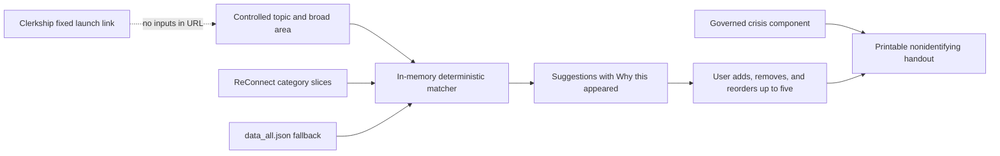

# Supervised Resource Builder — Design

**Status:** Proposed for review; no implementation is authorized by this document.

**Date:** 2026-09-27

**Owners:** ReConnect data and clinical owners for resource governance; Psychiatry Clerkship faculty for the trainee launch surface.

**Audience:** Trainees preparing a nonidentifying patient handout with a supervisor.

## Summary

Create a ReConnect-owned **Supervised Resource Builder** that lets a trainee choose a controlled topic or support need and a broad location, review transparent suggestions, and assemble a printable handout of up to five resources.

The tool is a handout builder, not a clinical recommender. Matching is deterministic and inspectable. Every suggested card must display a plain-language **Why this appeared** badge, such as:

- `Matched: bipolar education + Portland`
- `Matched: peer support + Portland area`
- `Matched: bipolar education + statewide`
- `Matched: bipolar education + telehealth`

The same explanation remains visible on the printed handout. It lists only facts the matching code actually used; it may not imply suitability, endorsement, availability, or clinical judgment.

The Clerkship Library will not copy or curate ReConnect's resource database. After the ReConnect tool is separately reviewed, released, and has a stable canonical URL, a later Clerkship PR may add one fixed launch link from Patient care resources / Quick Share. No topic, location, or patient context is placed in that URL.

## Problem and boundary

Trainees currently can share one canonical Clerkship resource quickly or assemble a small fixed handout from the Clerkship Care collection. They cannot yet start with a broad prompt such as “bipolar education” and “Portland,” see governed ReConnect resources, and visually build a printable page.

The proposed tool should reduce search and formatting work while keeping the trainee and supervisor in control. It must not:

- diagnose, recommend treatment, or claim a resource is appropriate for an individual patient;
- rank people by need, acuity, prognosis, or predicted benefit;
- accept patient names, dates of birth, street addresses, initials, free-text notes, symptoms, medications, disposition details, or insurance member IDs;
- claim that a service is currently available when the source does not establish that fact;
- create a referral, write to an EHR, persist a patient-specific plan, or transmit search inputs to a server;
- use generative AI or an unexplained numerical suitability score.

“Diagnosis” is therefore presented in the interface as **Topic or support need**. A governed vocabulary may include education topics such as bipolar disorder, but selecting one is a content filter—not a diagnostic conclusion.

## Architecture decision

Build a separate, public, supervised-trainee tool in ReConnect and share pure data, provenance, and handoff components with the clinician-support planner where those components have passed review.

Do not expose the clinician-only planner through a query parameter or bypass its role check. Do not reproduce ReConnect datasets in the Clerkship repository.



### Alternatives considered

1. **Build the whole feature in the Clerkship Library.** This is initially convenient but duplicates data ownership, creates cross-repository freshness problems, and risks divergent crisis and provenance rules.
2. **Add a trainee query-string mode to the clinician-support planner.** This blurs an intentional authentication boundary and makes it too easy for a later change to expose clinician-only behavior.
3. **Recommended: a separate ReConnect public tool sharing reviewed modules.** This preserves one resource authority and one crisis/provenance model while giving trainees a clearly bounded workflow.

The current clinician-support planner work is useful architectural evidence, not release authority for this tool. Any shared module must be reviewed and landed before this design depends on it in production.

## User experience

### Start

The page opens with a brief boundary statement:

> Build a nonidentifying resource page to review with your supervisor. Suggestions are based only on the topic, broad area, and resource types you choose. They are not clinical recommendations and may not reflect current availability.

Inputs:

1. **Topic or support need** — an accessible autocomplete backed by controlled, governed tokens. Typed text filters the list, but only a selected token participates in matching.
2. **General area** — an accessible city/town, county, or ZIP autocomplete. The tool never requests a street address or device location.
3. **Resource types** — optional chips for Education, Local services, Peer/recovery support, and Books/listening.

No result is produced from arbitrary free text. Unsupported text prompts the user to choose a listed topic or area rather than silently guessing.

### Suggestions

Suggestions are grouped to make their role legible:

- **Learn** — up to two education resources;
- **Local support** — up to two local, peer, or recovery resources;
- **Next practical step** — up to one additional service or take-home resource.

These are display groups, not clinical priorities. The trainee chooses what enters the handout.

Each card includes:

- public resource title and description;
- public phone and exact canonical website when present;
- served area;
- source and source/review date;
- verification or freshness state;
- a required **Why this appeared** badge;
- Add or Remove control.

Missing status or date renders as **Unknown** or **Unavailable**, never as “verified,” “current,” or “available.” A record without a website may still show a governed public phone and “Source link unavailable.” The tool never invents or repairs a URL.

### Why this appeared

The badge is part of the matching contract, not decorative copy.

For every suggestion, the matcher returns a structured reason beside the resource:

```text
topic: bipolar education
locationMatch: Portland
locationMode: local
label: Matched: bipolar education + Portland
```

Allowed location modes are:

- `local` — an exact governed city, ZIP, county, or region match;
- `statewide` — a state-level fallback when no local record is used;
- `telehealth` — a record explicitly governed as remotely accessible;
- `none` — for resources such as books whose inclusion does not use location.

For `none`, the badge states only the actual topic and type match, for example `Matched: bipolar education + book`. It must not mention Portland merely because the user entered Portland.

The renderer builds the badge from the structured match facts. Resource prose, inferred diagnoses, popularity, and hidden scores may not be used. Tests assert that every visible card has a reason, every phrase maps to a recorded match fact, and the print view repeats the same label.

### Handout builder

The trainee may add, remove, and keyboard-reorder up to five resources. A persistent-on-page preview shows the exact print order.

The handout contains:

- a neutral title such as “Resources to explore”;
- the selected public resource details and provenance;
- the same Why this appeared badge on each selected resource;
- a single governed crisis block that cannot be removed;
- a footer explaining that details and availability can change and should be confirmed with the listed organization.

Before Print or Copy, the trainee checks a transient **Reviewed with supervisor** acknowledgement. It is an immediate workflow reminder, not a stored attestation or competency claim. It clears on reload and is not printed as proof.

Print and Copy remain disabled if the governed crisis component cannot load. Crisis contact literals are not duplicated in this tool.

## Data and matching contract

### Source of truth

The tool reads ReConnect's public, generated `/data/categories/<category>.json` slices. A validated `data_all.json` fallback may be used only under the existing ReConnect adapter contract when a slice is unavailable. The interface identifies fallback use and its source date.

Initial resource families should be explicitly allowlisted from relevant governed categories, for example:

- `psychoeducation`;
- `community_services`;
- `peer_support`;
- `recovery_meetings`;
- `aftercare`;
- `telehealth_providers`;
- `books` and `podcasts` where exact public links exist.

The allowlist and token-to-category mappings are reviewed data, not free-form UI strings.

### Deterministic rules

1. Require one controlled topic/support token.
2. Filter to allowlisted resource families and explicit topic/category tags.
3. For location-sensitive records, prefer exact governed city/ZIP/county/region matches.
4. If the selected family permits it, show explicit statewide or telehealth fallbacks and label that fallback in the reason.
5. Use a stable, reviewed source order as the final tie-breaker.
6. Return structured match facts with every record.

There is no learned model, semantic guess, personalization, popularity signal, or hidden weighted score. If a record cannot produce an honest reason label, it is not shown.

### State and privacy

All inputs, suggestions, selections, acknowledgements, and print state live in memory only. Start over or reload clears them.

The tool must not store or transmit them through:

- `localStorage` or `sessionStorage`;
- cookies or IndexedDB;
- URL paths, query strings, or fragments;
- analytics events, request logs, or error payloads;
- a server-side account or database.

Analytics, if enabled for the page at all, may count only an allowlisted page open or generic tool step. It may not include topic, location, result, selection, or print contents.

## Failure behavior

| Condition | Required behavior |
|---|---|
| A category slice fails | Name the unavailable resource family; keep successfully loaded families; do not report “0 results.” |
| Fallback is used | Show fallback source and date in the page and handout provenance. |
| Topic or area is unrecognized | Ask the user to choose a controlled option; do not guess. |
| Status is missing | Display “Status unknown”; do not imply availability. |
| Review/source date is missing | Display “Date unavailable.” |
| Exact public link is missing | Omit the link and say “Source link unavailable”; never synthesize one. |
| Governed crisis component fails | Fail closed: Print and Copy are disabled with an actionable explanation. |
| Some suggestions have no reason | Suppress those cards and surface a nonclinical data-quality warning. |
| All relevant sources fail | Show that results are unavailable, not that none exist. |

## Accessibility and responsive behavior

- Use native controls wherever possible.
- Implement topic and area selection with the WAI-ARIA combobox pattern, including announced result counts and selection state.
- Announce load failures, add/remove actions, the five-resource limit, and reorder results to screen readers.
- Support the full workflow without a pointer, including card selection, removal, and reordering.
- Maintain at least 44-by-44 CSS-pixel touch targets.
- Work at 320 CSS pixels wide and at 200% zoom without horizontal page scrolling.
- Preserve a meaningful reading and tab order in the print-preview builder.
- Respect reduced-motion preferences.
- Ensure print output remains legible in color and grayscale and does not rely on color alone for status.

## Governance

- ReConnect data owners govern resource records, controlled topic/location vocabularies, mappings, source dates, and verification states.
- The governed crisis owner supplies the non-removable crisis component; this feature does not create a second crisis registry.
- Clerkship faculty approve the trainee framing, supervisor boundary, and eventual fixed launch link.
- Human reviewers approve resource-family inclusion and stable ordering. Passing tests does not establish clinical approval, learner readiness, merge, deployment, or served-state correctness.
- Resource matches are suggestions for review. The UI must never label them “recommended for this patient.”

## Verification and acceptance criteria

### Matcher and provenance

- Fixture tests cover local, statewide, telehealth, and location-independent matches.
- Every returned card has structured match facts and the expected plain-language reason.
- Negative fixtures prove that an unmatched location/topic never appears in the badge.
- Ordering is deterministic across repeated runs.
- Partial loads cannot collapse into a false “no results” state.
- Missing status/date fields render unknown/unavailable.

### Privacy and security

- Static tests prohibit storage APIs and topic/location URL serialization.
- Network tests prove search and selection cause no outbound request beyond fixed same-origin resource data loads.
- Logs and analytics tests prove no topic, location, result, or handout contents are emitted.
- Crisis literals are absent from the new tool source; the governed component is required.

### Interaction and output

- Screen-reader and keyboard tests cover both comboboxes, suggestion cards, selection, removal, reordering, the five-item limit, acknowledgement, and print.
- Mobile tests cover 320 CSS pixels and touch targets.
- Print tests confirm selected order, source/status fields, reason badges, governed crisis block, and no trainee inputs beyond the broad matched labels.
- Reload tests prove all workflow state is cleared.

### Cross-repository release evidence

1. ReConnect tests and review pass for the exact revision.
2. The ReConnect public tool is deployed and its canonical served URL is verified.
3. A separate Clerkship change adds only that exact fixed URL.
4. Clerkship gates pass at its exact revision.

No earlier step is evidence for a later one.

## Delivery sequence

1. In ReConnect, define governed topic/location vocabulary fixtures and a pure match-and-reason adapter.
2. Build the separate public supervised builder using reviewed provenance, plan, and print components.
3. Obtain database-steward, clinical/faculty, accessibility, and crisis-governance review of labels, mappings, ordering, reasons, and failure states.
4. Verify and release the ReConnect tool, then record its exact canonical URL and served revision.
5. In a separate Clerkship PR, add the fixed launch link from Patient care resources / Quick Share and rerun Clerkship gates.

This sequencing avoids shared-file collisions with the active Quick Share work and prevents a Clerkship link from landing before its destination is governed and stable.

## Decisions requested

The proposal uses these recommended defaults unless review changes them:

1. **Name:** “Supervised Resource Builder,” with the task label “Build a patient resource page.”
2. **Supervisor boundary:** require a transient Reviewed with supervisor checkbox before Print or Copy.
3. **Transparency:** keep Why this appeared visible both on cards and on the printed handout.
4. **Ownership:** host the tool and data in ReConnect; add only a fixed launch link to the Clerkship Library after release.
